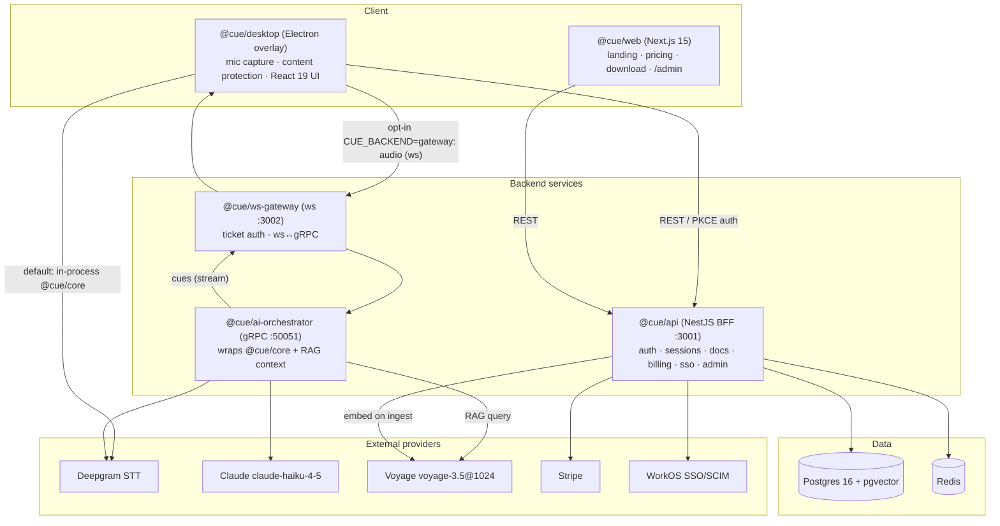

# 00 — Overview (As-Built)

> For future AI: this is the plain-language "what is this repo" file. It states what AssistMe is, what has actually been built (5 phases on `dev`), the surfaces a user touches, and the high-level shape. Deeper detail lives in the sibling files — this one stays at altitude. Read [`../AGENTS.md`](../AGENTS.md) first.

## What AssistMe is

**AssistMe** (a provisional working title, formerly Cue — every brand reference is a placeholder) is a cross-platform **macOS + Windows** real-time **AI meeting/interview copilot**. It runs as a private, always-on-top, transparent teleprompter **overlay** on the user's own screen that is **excluded from screen capture and screen-share pickers** using OS content-protection APIs (`setContentProtection(true)` → macOS `NSWindowSharingType=none`, Windows `WDA_EXCLUDEFROMCAPTURE`).

The core loop: capture conversation audio → transcribe with **Deepgram** streaming STT → stream **Claude `claude-haiku-4-5`** cues → render into the overlay, visible only to the user, grounded by **RAG** over the user's own documents. Target latency is **< 1.2s end-to-end p95** (a plan goal — see [caveats](#honest-current-state)).

Positioning (from [`../RULES.md`](../RULES.md) and the plan): interview **prep and confidence**, sales/support copiloting, note-taking, and accessibility — **not** deception.

## Honest current state

- **All 5 phases (0–4) are built and merged to the `dev` branch.** `main` is intentionally **held** at the v0.4.0 plan-docs baseline (PR #5); `dev` is ~26 commits ahead. See [`03-build-journal.md`](03-build-journal.md).
- **The Phase 0 local desktop pipeline is the default.** Everything after it (backend gateway, RAG, billing, SSO, observability, infra) is **additive and env-gated** — with the relevant env vars unset, each feature degrades cleanly to the prior phase's behavior.
- **System loopback capture (the other party's audio) is a stub.** `NotImplementedLoopbackCapture` in `@cue/core`. Only **microphone** capture is real today; real loopback needs platform native bindings and is gated behind the descoped consent work. See [`07-todos-and-gaps.md`](07-todos-and-gaps.md).
- **Legal / consent is descoped.** The dedicated legal docs were removed (PR #2). The residual recording-consent + GDPR risk is real and unresolved and must be formalized before any production audio capture.
- **Latency/uptime targets are plan goals, not measured commitments.** Treat `< 1.2s p95`, `< 300ms` STT, `99.9%` uptime as targets pending validation.

## Product surfaces

| Surface | Workspace | What the user sees |
|---------|-----------|--------------------|
| **Desktop overlay** | [`@cue/desktop`](reference/apps.md) | The capture-excluded Electron overlay: Start/Stop a listening session, live transcript + streaming cues, `Cmd/Ctrl+\` to toggle. This is the product. |
| **Marketing / download web** | [`@cue/web`](reference/apps.md) | Next.js 15 site: landing (Three.js hero), pricing → Stripe Checkout, download, device `/activate`, `/api/latest-release` signed feed. |
| **Admin console** | [`@cue/web`](reference/apps.md) `/admin` | Role-gated org management: members/roles/invites, WorkOS SSO connections, settings, Team seat billing. |
| **Backend API** | [`@cue/api`](reference/services.md) | The BFF the apps call: auth, sessions, documents/RAG, billing, entitlements, usage, SSO/SCIM, RBAC, admin, health. |

## High-level shape

> The **default** desktop path runs `@cue/core` in-process (no backend needed). The backend gateway path is opt-in via `CUE_BACKEND=gateway`. The authoritative wiring, hop-by-hop, is in [`01-architecture-as-built.md`](01-architecture-as-built.md).

## The monorepo in one breath

**pnpm workspaces + Turborepo**, TypeScript strict, Node 22, package scope `@cue/*`. **12 workspaces**: 7 packages (`config`, `types`, `core`, `db`, `proto`, `sdk`, `observability`), 3 services (`api`, `ai-orchestrator`, `ws-gateway`), 2 apps (`desktop`, `web`), plus `infra/` (Terraform) and `.github/workflows/` (CI/CD). The full map is [`02-monorepo-map.md`](02-monorepo-map.md).

## Where to go next

- Runtime detail → [`01-architecture-as-built.md`](01-architecture-as-built.md)
- Code layout → [`02-monorepo-map.md`](02-monorepo-map.md) and `reference/`
- History → [`03-build-journal.md`](03-build-journal.md)
- What's not real yet → [`07-todos-and-gaps.md`](07-todos-and-gaps.md)
