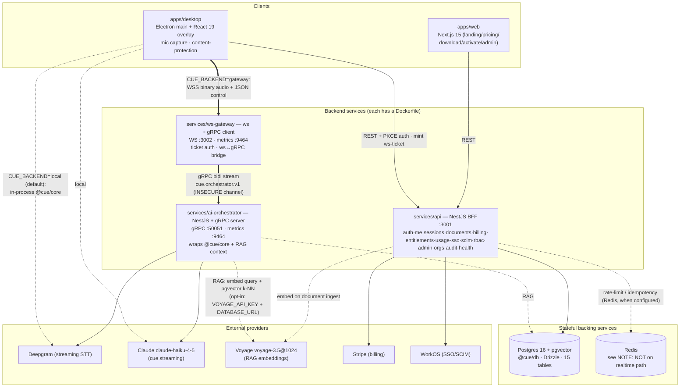
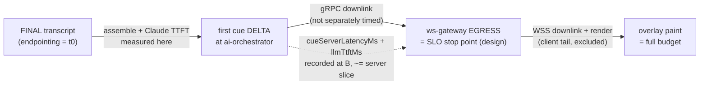

# 01 — Architecture (As-Built)

> For future AI: this is the **runtime** truth — how a live cue actually travels from a spoken word to the overlay, which hops exist, which ports they bind, and where the built system quietly differs from the design in [`../docs/02-system-architecture.md`](../docs/02-system-architecture.md). Read [`00-overview.md`](00-overview.md) first for the "what", then this for the "how". Where code and this doc disagree, re-read the code — the load-bearing files are named in every section.

## The one thing to understand first: two pipelines, one interface

Cue has **two** audio→cue pipelines that implement the **same** `CuePipeline` interface (`@cue/core`, `packages/core/src/types.ts`). The desktop app picks one at startup from the `CUE_BACKEND` env var (`apps/desktop/src/main/pipeline-runner.ts`):

| Backend | `CUE_BACKEND` | What runs | When |
|---------|---------------|-----------|------|
| **`local`** (default) | unset / anything but `gateway` | `@cue/core` `CueOrchestrator` **in the Electron main process** — talks straight to Deepgram + Claude. No backend services needed. | Phase 0 baseline; the default everywhere. |
| **`gateway`** (opt-in) | `CUE_BACKEND=gateway` | Audio streams over WSS to `ws-gateway`, which bridges to `ai-orchestrator` over gRPC; the orchestrator runs the *same* `@cue/core` pipeline server-side. | Phase 1+ backend path; requires api + ws-gateway + ai-orchestrator running. |

Because both satisfy one interface, the desktop coordinator is backend-agnostic and **the local path is never regressed** by backend work. This is the single most important as-built fact: everything below the desktop is *additive and env-gated*.

---

## Container view (C4 L2, as-built)

Only the parts that exist on disk are drawn. Dashed = opt-in / env-gated. Note the callouts where reality differs from [`../docs/02`](../docs/02-system-architecture.md).



### Reality vs [`docs/02`](../docs/02-system-architecture.md) — the honest deltas

| Design doc says | As built | Where |
|---|---|---|
| `ai-orchestrator` calls **`entitlements`** on the hot path to check the live-minute budget | **No entitlement call on the realtime path.** The orchestrator uses an **in-process `AdmissionControlService`** (a local counter), not a call to the `entitlements` module. | `services/ai-orchestrator/src/admission/admission-control.service.ts` |
| **Redis** holds realtime control state (admission token-bucket, sessions, WS resume offsets) | **Redis is NOT wired into ws-gateway or ai-orchestrator at all.** The replay guard, resume/offset store, and admission budget are all **in-memory, per-task**. Multi-task resume and shared admission are TODO. | `ws-gateway/src/auth/replay-store.ts`, `ws-gateway/src/resume/offset-store.ts`, `admission-control.service.ts` |
| gRPC bidi over **HTTP/2 (mTLS in prod)** | gRPC bidi is real, but the channel is **insecure** (`grpc.ServerCredentials.createInsecure()`); TLS/mTLS is an explicit `TODO(prod)`. | `ai-orchestrator/src/grpc/grpc-server.service.ts` |
| STT failover **Deepgram → AssemblyAI** | **Single provider (Deepgram).** There is no AssemblyAI client in `packages/core/src/stt/`. The resilient wrapper does circuit-breaker + backoff around the *one* provider — not a second-provider failover. | `packages/core/src/stt/`, `.../reliability/resilient-stt-client.ts` |
| Model routing haiku / sonnet / **opus** | Wire `Model` enum is only `HAIKU_4_5` \| `SONNET_5`; live cues run **claude-haiku-4-5**. Opus is not on the realtime wire. | `packages/proto/src/orchestrator.proto` |
| `billing-webhooks` a "logical service" | Built as a **NestJS module inside `services/api`** (`modules/billing-webhooks`), as the plan's v1 said it would be. `entitlements` is likewise an api module, not a standalone service. | `services/api/src/modules/` |

Everything else in `docs/02`'s L2 (BFF shape, WSS edge, gRPC internal hop, pgvector RAG) matches what's built.

---

## Ports & bind addresses (as-built, from config code)

| Service | Env var | Default | Notes |
|---------|---------|---------|-------|
| `api` HTTP | `API_PORT` | `3001` | NestJS; `rawBody:true` for Stripe webhook sig verify. `services/api/src/config/app-config.ts`. |
| `ws-gateway` WS/HTTP | `WS_PORT` | `3002` | `GET /healthz` on the same listener; WS `Upgrade` else `426`. `ws-gateway/src/config.ts`. |
| `ws-gateway` metrics | `METRICS_PORT` | `9464` | `/metrics` + `/readyz` + `/livez`. |
| `ai-orchestrator` gRPC | `ORCHESTRATOR_GRPC_ADDR` | `0.0.0.0:50051` | gateway dials `ORCHESTRATOR_GRPC_ADDR` (its own default `localhost:50051`). `ai-orchestrator/src/config/env.ts`. |
| `ai-orchestrator` metrics | `METRICS_PORT` | `9464` | Same standalone health/metrics server pattern. |
| `web` | (Next.js) | `3000` | Dev/prod Next server. |

---

## The live-cue data flow (gateway path, as-built)

This is the flow when `CUE_BACKEND=gateway`. It is the path that matches the plan's "two-budget latency" model. Every hop below is backed by a named file.

```mermaid
sequenceDiagram
    autonumber
    participant D as desktop (main proc)
    participant API as api (BFF :3001)
    participant G as ws-gateway (:3002)
    participant O as ai-orchestrator (gRPC :50051)
    participant P as @cue/core pipeline
    participant S as Deepgram STT
    participant C as Claude (haiku-4-5)

    Note over D,API: Session setup (HTTPS/REST, before any audio)
    D->>API: POST /v1/sessions (create)
    D->>API: POST /v1/sessions/:id/ws-ticket
    API-->>D: { ticket (ES256 JWT, single-use), wsUrl, protocol:"cue.v1", expiresAt }

    Note over D,G: WS handshake — subprotocol "cue.v1"
    D->>G: WS connect (Sec-WebSocket-Protocol: cue.v1)
    D->>G: hello { protocol, ticket, codec:pcm16, sampleRate, resumeFrom? }
    Note over G: verify ES256 ticket (aud=ws-gateway) +<br/>one-time-use replay guard (in-memory)
    G->>O: open gRPC Stream() → ClientEnvelope{ start: StartSession }
    Note over O: AdmissionControlService.acquire()<br/>(local counter; 'live' or 'transcript-only')
    O->>P: createOrchestrator({ deepgram, anthropic, rag? }).start()
    P->>S: open streaming STT
    G-->>D: ready { sessionId, heartbeatSec:15, resumedFrom? }

    loop live audio
        D->>G: binary audio frame (4-byte LE header + PCM16/Opus)
        G->>O: ClientEnvelope{ audio: AudioChunk }
        O->>P: pushAudio(chunk)
        P->>S: stream audio
        S-->>P: PARTIAL transcript(s)
        P-->>O: TranscriptEvent(partial) → onTranscript
        O-->>G: ServerEnvelope{ transcript: PARTIAL }
        G-->>D: transcript.partial (JSON)
        S-->>P: FINAL (endpointed) transcript
        Note over O: FINAL = t0 for the SLO<br/>(StreamSession.lastFinalAt)
    end

    Note over P: on FINAL → state THINKING; assemble context:<br/>rolling transcript window + one-shot RAG block (opt-in)
    P->>C: stream cue (claude-haiku-4-5)
    C-->>P: token deltas
    P-->>O: CueEvent(delta) → first delta records<br/>llmTtftMs + cueServerLatencyMs (t0→first token)
    O-->>G: ServerEnvelope{ cue: DELTA }
    G-->>D: cue.delta (JSON)  ← ws-gateway EGRESS
    Note over D: overlay paints token (user-only)
    C-->>P: end → CueEvent(done)
    O-->>G: ServerEnvelope{ cue: DONE, seq }
    G-->>D: cue.final (recorded for resume replay)
```

### Local path (default) — same pipeline, no network

When `CUE_BACKEND` is unset, hops 1–8 and the gRPC/WS bridging vanish. `apps/desktop/src/main/pipeline-runner.ts` calls `createOrchestrator()` directly; the `CueOrchestrator` in `packages/core/src/orchestrator/cue-orchestrator.ts` runs Deepgram + Claude straight from the main process and emits `onState`/`onTranscript`/`onCue` to the renderer over the typed IPC bridge. RAG is off unless the same `VOYAGE_API_KEY` + `DATABASE_URL` are present. This is the product's actual default.

---

## The wire contracts (two, not one)

The realtime path crosses **two distinct protocols**. Do not confuse them.

### 1. Client ↔ ws-gateway — the `cue.v1` WS protocol

Defined by `@cue/types` and (de)serialized in `ws-gateway/src/protocol/frames.ts`. **One socket, two channels:**

- **Binary frames = audio uplink** (client→server). Layout: a **4-byte little-endian header** (`type`, `channel`, `sequence` u16) + payload (`WS_AUDIO_FRAME` constant, shared verbatim with desktop). Channels: `0x01` mic, `0x02` loopback.
- **Text frames = JSON control** (both ways): `ClientMsg` (`hello`, `heartbeat`, `mute`, `mode`, `ask`, `end`) and `ServerMsg` (`ready`, `transcript.partial/final`, `cue.delta/final`, `state`, `heartbeat`, `backpressure`, `error`).

Auth is a **single-use ES256 JWT ticket** (`aud=ws-gateway`) minted by `api` (`POST /v1/sessions/:id/ws-ticket`), presented either in the first `hello` message **or** as a `ticket.<jwt>` token in `Sec-WebSocket-Protocol` — **never** in a query string. A `ReplayGuard` (in-memory SETNX-equivalent) burns the `jti` exactly once. Auth deadline is 5s; heartbeat 15s, 2 misses → close `1001`. WS close codes live in `ws-gateway/src/constants.ts` (`4400` bad/late auth, `4401` ticket invalid, `1013` backpressure/capacity, etc.).

> Gaps you will hit: `mode` and `ask` control messages are accepted but **no-op** — the simplified 3-message proto has no slot for mid-session disclosure toggles or manual prompt injection (`TODO(orchestrator)` in `connection.ts`). Resume replay (`resumeFrom` seq) works but is **in-memory per task** (`ResumeStore`, 512-final buffer, 60s grace) — it does not survive task rotation.

### 2. ws-gateway ↔ ai-orchestrator — gRPC `cue.orchestrator.v1`

Defined in `packages/proto/src/orchestrator.proto`, one bidi RPC:

```
rpc Stream(stream ClientEnvelope) returns (stream ServerEnvelope);
```

- **Up (`ClientEnvelope` oneof):** `StartSession` (must be first) → `AudioChunk` (n) → `StopSession` (half-close). `StartSession` carries `sessionId`, `orgId`, `userId`, `dataRegion`, `mode`, `format`, `documentIds` (RAG scope), `disclosed`, `language`, `resumeFromSeq`.
- **Down (`ServerEnvelope` oneof):** `Transcript` (PARTIAL/FINAL + speaker + confidence), `Cue` (DELTA/DONE/NONE/CUE_ERROR + model), `State` (IDLE/LISTENING/THINKING/CUE/ERROR).

`@cue/proto` ships the `.proto`, the proto-loader options (camelCase fields, string enums, number longs, virtual oneof discriminators), TS mirrors, and `createOrchestratorClient` / `addOrchestratorService` helpers so neither service hand-writes gRPC plumbing. Channel is **insecure** today (same-VPC assumption; `TODO(prod)` mTLS). Redis is deliberately off this per-frame path — and, as noted above, off the realtime path entirely in the as-built.

---

## The two-budget latency model — where it's actually measured

The plan ([`docs/02` §4.1](../docs/02-system-architecture.md), [`docs/21`](../docs/21-ai-pipeline.md)) defines **two budgets from one start point**:

- **Start point (t0):** end-of-utterance **endpointing** — the Deepgram FINAL transcript. In code: `StreamSession.lastFinalAt = Date.now()` set on `event.kind === 'final'` (`ai-orchestrator/src/orchestrator/stream-session.ts`).
- **Server-controllable SLO:** `< ~900 ms` p95, endpointing → first cue token at **ws-gateway egress**. Error-budgeted.
- **Full user-perceived:** `< 1.2 s` p95, endpointing → token painted in the overlay. Reported-only; the client-network tail is measured separately and excluded from the SLO.

**What is actually instrumented (as-built):** `StreamSession.recordCueSli()` records, on the **first `delta` of each cue**:
- `llmTtftMs{model}` — endpointing → first cue token, and
- `cueServerLatencyMs{region,model,tier}` — the same span, labelled as the server-controllable slice.



> Honesty note: the built `cueServerLatencyMs` is timed at the **orchestrator** (first delta), i.e. it stops one gRPC hop *before* the design's ws-gateway-egress split point. That internal hop is single-digit-ms by design, so the measured value is a close proxy for the server-controllable budget, but it is **not** literally stamped at egress, and there is **no end-to-end distributed trace** joining desktop → gateway → orchestrator yet (OTel is initialised per service via `instrumentation.ts`, but the cross-hop trace-context propagation the plan describes is not wired). Treat `< 900 ms` / `< 1.2 s` as **plan targets**, not measured commitments — see [`07-todos-and-gaps.md`](07-todos-and-gaps.md). Model routing is also simplified: the SLI labels the model generically as `claude`, and the live path is fixed to `claude-haiku-4-5` (no runtime tier routing).

### Backpressure & overload (real)

- **Ingress:** if `>256` audio frames stay un-drained on the gRPC uplink, the socket closes `1013` (`INGRESS_INFLIGHT_LIMIT`, `connection.ts`).
- **Egress:** when `ws.bufferedAmount > 1 MB`, the gateway emits `{t:'backpressure', level:'shed'}` then `ok` when it recovers (`EGRESS_BUFFER_SHED_BYTES`).
- **Regional overload:** `AdmissionControlService` never evicts an in-flight session; a *new* session past the per-region ceiling is admitted in **`transcript-only`** mode (STT lease still granted, cues deferred). Ceiling = `min(STT_CONCURRENCY, CLAUDE_RPM_LIMIT / 4)`; `0` disables (dev fail-open).
- **Connection cap:** `WS_MAX_CONNECTIONS` (default 5000) per task; over it new sockets get `1013`. SIGTERM drains up to `SHUTDOWN_DRAIN_MS` (default 30s) before force-close `1001` (`server.ts`).

---

## RAG injection (opt-in, one-shot per session)

RAG activates **only when both `VOYAGE_API_KEY` and `DATABASE_URL` are set** on the orchestrator; otherwise `RagService.providerFor()` returns `undefined` and the pipeline runs the unchanged no-RAG path (`services/ai-orchestrator/src/rag/rag.service.ts`).

- One process-shared `Retriever` = `VoyageEmbeddingsClient` (voyage-3.5) + `PgVectorSearch` (Drizzle/pgvector), default **k=6**.
- Per session, `OrchestratorService.ragConfig()` binds a tenant-scoped provider: retrieval spans the **org's shared team KB**, plus the session **user's personal docs** when `userId` is set, narrowed to `documentIds` when the session scopes them.
- Inside `CueOrchestrator`, retrieval is attempted **exactly once per session** on the first real query (`ragPrimed`), with a hard budget (`DEFAULT_RAG_BUDGET_MS = 400`), then the serialized block is frozen and reused (a session-stable prefix, matching [`docs/23`](../docs/23-prompt-context-spec.md)).

---

## Cross-links

- What Cue is, product surfaces → [`00-overview.md`](00-overview.md)
- The 12 workspaces + dependency graph → [`02-monorepo-map.md`](02-monorepo-map.md)
- Per-service internals (modules, endpoints, gRPC) → [`reference/services.md`](reference/services.md)
- The `@cue/core` pipeline, reliability wrappers, RAG internals → [`reference/packages.md`](reference/packages.md)
- Desktop capture, IPC, content-protection → [`reference/apps.md`](reference/apps.md)
- What's stubbed / not measured / descoped → [`07-todos-and-gaps.md`](07-todos-and-gaps.md)
- Design intent (compare against this) → [`../docs/02-system-architecture.md`](../docs/02-system-architecture.md), [`../docs/22-api-contracts.md`](../docs/22-api-contracts.md)
