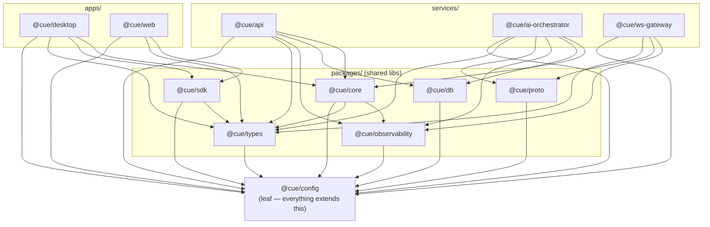

# 02 — Monorepo Map (As-Built)

> For future AI: this is the "where does the code live and what depends on what" file. It is the map you consult before editing anything, so you touch the right workspace and don't create an illegal dependency edge. Names, paths, and edges below were read from the actual `package.json` files — not the plan. Deeper per-workspace detail lives in [`reference/packages.md`](reference/packages.md), [`reference/services.md`](reference/services.md), and [`reference/apps.md`](reference/apps.md).

## The shape in one breath

**pnpm workspaces + Turborepo**, TypeScript strict, Node 22, package scope `@cue/*`. `pnpm-workspace.yaml` globs three roots: `packages/*`, `services/*`, `apps/*`. That's **12 workspace projects** — 7 packages, 3 services, 2 apps — plus two non-workspace directories that ship with the repo but aren't `@cue/*` packages: `infra/` (Terraform) and `.github/workflows/` (CI/CD).

```
repo root
├── packages/     7 shared libraries  (@cue/config, types, core, db, proto, sdk, observability)
├── services/     3 deployable backends (@cue/api, ai-orchestrator, ws-gateway) — each with a Dockerfile
├── apps/         2 user-facing apps   (@cue/desktop, web)
├── infra/        Terraform (network/data/compute/edge/secrets/storage · dev/staging/prod · us-east-1 + eu-west-1)
├── .github/      workflows: ci · deploy · release-desktop
└── docs/         the PLAN (design intent) — NOT the as-built; see ../docs/
```

## Workspace inventory (project → path → depends-on → purpose)

`depends-on` lists **only `@cue/*` workspace edges** (external npm deps omitted). Verified from each `package.json`.

| Project | Path | Depends on (`@cue/*`) | Purpose |
|---------|------|----------------------|---------|
| `@cue/config` | `packages/config` | — (leaf) | Shared **tsconfig base** + eslint/prettier config. The root every other workspace extends. |
| `@cue/types` | `packages/types` | `config` | Shared DTOs / IPC / api / billing / documents / sso / admin contracts + the `cue.v1` WS message types + `WS_AUDIO_FRAME` binary header constant. |
| `@cue/observability` | `packages/observability` | `config` | OTel + pino + Prometheus + Sentry wiring, circuit-breaker/backoff primitives, and a Nest module (`@cue/observability/nest`). |
| `@cue/proto` | `packages/proto` | `config` | The `cue.orchestrator.v1` gRPC contract: ships `orchestrator.proto`, loader options, TS mirrors, `createOrchestratorClient` / `addOrchestratorService`. |
| `@cue/db` | `packages/db` | `config` | Drizzle schema (15 tables) + pgvector + migrations `0000`/`0001`/`0002`; `createDb()` returns `{ db, pool }`. |
| `@cue/sdk` | `packages/sdk` | `types`, `config` | `CueApiClient` — the typed REST client both apps use to talk to `api` (auth, sessions, documents, billing, sso, admin resources). |
| `@cue/core` | `packages/core` | `observability`, `types`, `config` | **The AI pipeline.** Deepgram STT + Claude cue streaming + `CueOrchestrator` + RAG (Voyage embeddings, chunker, retriever, context-provider) + reliability wrappers + loopback **stub**. |
| `@cue/api` | `services/api` | `core`, `db`, `observability`, `types`, `config` | **NestJS BFF (:3001).** auth[PKCE+JWT ES256]·me·sessions·documents[RAG]·billing·billing-webhooks·entitlements[guard]·usage·sso·scim·rbac·admin·orgs·audit·health. |
| `@cue/ai-orchestrator` | `services/ai-orchestrator` | `core`, `db`, `observability`, `proto`, `types`, `config` | **gRPC server (:50051).** Wraps `@cue/core` per stream, adds RAG context + regional admission control. |
| `@cue/ws-gateway` | `services/ws-gateway` | `observability`, `proto`, `types`, `config` | **WS↔gRPC bridge (:3002).** Ticket auth, backpressure, resume — transport only, no AI logic. Note: does **not** depend on `@cue/core` or `@cue/db`. |
| `@cue/desktop` | `apps/desktop` | `core`, `sdk`, `types`, `config` | **Electron overlay.** Content-protection, typed contextBridge IPC, mic capture, React 19 UI, PKCE auth, opt-in ws-gateway client, signed auto-update. Runs `@cue/core` in-process by default. |
| `@cue/web` | `apps/web` | `sdk`, `types`, `config` | **Next.js 15.** landing/pricing/download/activate + Three.js hero + `/api/latest-release` + `/admin` console. |

### Two things worth internalising from the edges

1. **`@cue/config` is the universal leaf.** Every other workspace depends on it and it depends on nothing. Changing it rebuilds everything.
2. **`ws-gateway` is deliberately thin.** It depends only on `proto` + `types` + `observability` + `config` — **not** `core` and **not** `db`. That's the architecture enforcing "transport only, no AI logic, no DB" at the dependency level. If you find yourself wanting to import `@cue/core` into `ws-gateway`, you're solving the problem in the wrong service (it belongs in `ai-orchestrator`).

## Dependency graph (Mermaid)

Edges point **from dependent → dependency**. Layers are drawn top (consumers) to bottom (foundation).



## Layering rules the code obeys

Read bottom-up; nothing lower may import anything higher.

| Layer | Members | May import | Rationale |
|-------|---------|-----------|-----------|
| **L0 — base** | `config` | nothing | Toolchain root. |
| **L1 — contracts & platform** | `types`, `proto`, `db`, `observability` | `config` only | Pure contracts / platform primitives; no domain logic, no cross-imports between them. |
| **L2 — domain libs** | `core` (→ `observability`,`types`), `sdk` (→ `types`) | L1 + `config` | `core` is the AI pipeline; `sdk` is the typed API client. They do not import each other. |
| **L3 — deployables** | `api`, `ai-orchestrator`, `ws-gateway`, `desktop`, `web` | L2 + L1 + `config` | Composition roots. Never imported by anything else. |

The single realtime contract that couples two L3 services is **`@cue/proto`** (gateway ↔ orchestrator gRPC). The single REST contract that couples apps to `api` is **`@cue/sdk`** + **`@cue/types`**. Keep new cross-service coupling inside those two packages.

## Build orchestration

- **Turborepo** (`turbo.json`) drives the task graph; because `config` is the leaf and services sit at L3, the topological order falls out of the dependency edges above. Turbo's cache keys off inputs so unaffected workspaces are skipped.
- **`.github/workflows/ci`** runs typecheck / lint / test + supply-chain gates across the graph; **`deploy`** ships the three services to ECR/ECS via OIDC; **`release-desktop`** builds + signs the Electron app. History and per-phase mapping in [`03-build-journal.md`](03-build-journal.md).

## Non-workspace directories (ship with the repo, not `@cue/*`)

| Dir | What | Owning as-built doc |
|-----|------|---------------------|
| `infra/` | Terraform: `modules/` (network·data·compute·edge·secrets·storage), `envs/` (dev·staging·prod), primary `us-east-1` + secondary `eu-west-1`. | [`reference/services.md`](reference/services.md) (infra section) / [`../docs/60-devops-infrastructure.md`](../docs/60-devops-infrastructure.md) |
| `.github/workflows/` | `ci`, `deploy`, `release-desktop`. | [`03-build-journal.md`](03-build-journal.md) (Phase 4) |
| `docs/` | The **plan** (design intent), 00–81 + CHANGELOG + audits. Distinct from `ai-context/` (as-built). | [`04-plan-mapping.md`](04-plan-mapping.md) |

## Cross-links

- How these projects wire at runtime → [`01-architecture-as-built.md`](01-architecture-as-built.md)
- Per-package exports & real-vs-stub → [`reference/packages.md`](reference/packages.md)
- Per-service modules, endpoints, ports → [`reference/services.md`](reference/services.md)
- Per-app surfaces (desktop/web) → [`reference/apps.md`](reference/apps.md)
- Code-splitting / <700 LOC / layering conventions → [`06-conventions.md`](06-conventions.md)
- Repo layout as the plan intended it → [`../docs/03-repository-structure.md`](../docs/03-repository-structure.md)
