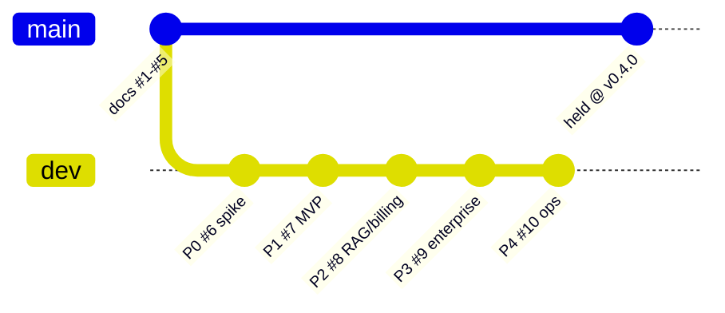

# 03 — Build Journal (Phases 0→4, As-Built)

> For future AI: this is the **history** of how AssistMe got built, reconstructed from `git log --oneline` and the actual commits — not the plan. Each phase maps to one PR and 2–3 feature commits on the `dev` branch. Where a phase shipped a stub, this file names it and points at [`07-todos-and-gaps.md`](07-todos-and-gaps.md). Start at [`../AGENTS.md`](../AGENTS.md), then [`00-overview.md`](00-overview.md).

## The one thing to know first

**All five phases (0–4) are merged to `dev`.** `main` is intentionally **held** at the v0.4.0 plan-docs baseline (the docs merges, PRs #1–#5) pending a local build/validation pass. So `dev` is the as-built code; `main` is still just the plan. Do not "catch main up" without an explicit instruction — see [`../AGENTS.md`](../AGENTS.md) and [`../RULES.md`](../RULES.md).

## PR → phase map

| PR | Branch | Phase | Merge commit | Theme |
|----|--------|-------|--------------|-------|
| #1 | `docs/master-architecture-plan` | — | `14db013` | Initial plan docs + RULES.md |
| #2 | `docs/audit-remediation` | — | `7e138b7` | Non-legal audit remediations; **legal/consent descoped** |
| #3 | `dev` | — | `b8fe481` | Promote dev → main (docs) |
| #4 | `docs/plan-deepening` | — | `fb3be6c` | API contracts, prompt/context spec, threat model, test plan, Phase 0 spike plan |
| #5 | `dev` | — | `8d9e781` | Promote dev → main (docs) — **this is where `main` was frozen** |
| #6 | `feat/phase-0-spike` | **0** | `c8c21aa` | Monorepo foundation + `@cue/{config,types,core}` + desktop content-protection spike |
| #7 | `feat/phase-1-mvp` | **1** | `169c426` | Data + contracts, backend services, web MVP, desktop backend wiring |
| #8 | `feat/phase-2` | **2** | `9b16fb4` | RAG, Stripe billing, signed auto-update, Three.js hero |
| #9 | `feat/phase-3` | **3** | `cd0a07a` | Enterprise SSO/SCIM, RBAC, admin console, shared team KB |
| #10 | `feat/phase-4` | **4** | `d2f6652` | Observability, reliability, Terraform infra, CI/CD |

> PRs #1–#5 are **documentation only** (the `docs/` plan set). Code begins at PR #6. The as-built story below is Phases 0–4.

---

## Phase 0 — Spike (PR #6, `feat/phase-0-spike`)

**Commits:** `32a6a19` (monorepo foundation + `@cue/{config,types,core}`), `f76a4c4` (`@cue/desktop` content-protection overlay spike).

**Goal:** prove the two riskiest things end-to-end — (1) the overlay is invisible to screen capture, and (2) the audio→STT→Claude→cue thread works — with the minimum scaffolding.

**What it added (real):**
- The **pnpm + Turborepo monorepo** skeleton: `pnpm-workspace.yaml`, root `turbo.json`, `.nvmrc` (Node 22), `packages/config` (shared `tsconfig.base.json` + eslint/prettier).
- **`@cue/types`** — shared DTOs, IPC contract, `AudioChunk`, WS protocol envelope seeds.
- **`@cue/core`** — the AI pipeline building blocks: Deepgram streaming STT client, Claude `claude-haiku-4-5` streaming cue generation, the `CueOrchestrator` that stitches them.
- **`@cue/desktop`** — Electron overlay spike: `setContentProtection(true)` (macOS `NSWindowSharingType=none`, Windows `WDA_EXCLUDEFROMCAPTURE`), typed `contextBridge` IPC, a renderer that captures the **microphone** via `getUserMedia` → `AudioWorklet` → `window.cue.sendAudioChunk`, and a React overlay UI rendering streamed cues.

**What it stubbed:**
- **System-audio loopback** (the *other* party's audio) — `NotImplementedLoopbackCapture` in [`packages/core/src/audio/loopback.ts`](../packages/core/src/audio/loopback.ts). `isSupported = false`; `start()` throws by design so accidental use is loud. Real capture needs native ScreenCaptureKit (macOS) / WASAPI (Windows) bindings and is gated behind the descoped consent work. **Microphone capture is the only working audio source, and it stays that way through Phase 4.**

**Key decision:** ship mic-only. It is enough to prove the end-to-end thread; loopback is deferred with consent.

---

## Phase 1 — MVP (PR #7, `feat/phase-1-mvp`)

**Commits:** `bed5da1` (data + contracts), `50f9560` (backend services), `a241c03` (web), `7da3dea` (desktop backend wiring), `99eac07` (docs).

**Goal:** stand up the backend spine (auth, sessions, the gateway hot path) and the web download/activate flow, while keeping the Phase 0 local desktop path working untouched.

**What it added (real):**
- **`@cue/db`** — Drizzle schema (15 tables), Postgres 16 + **pgvector**, migration `0000_init.sql` (creates the `vector` + `pgcrypto` extensions and a `uuidv7()` SQL shim). Tables: `orgs, users, orgMembers, devices, sessions, transcripts, transcriptSegments, documents, documentChunks, subscriptions, entitlements, usageEvents, auditLogs` (+ `ssoConnections, invitations` land in Phase 3).
- **`@cue/proto`** — the `cue.orchestrator.v1` gRPC contract + typed loader. Simplified **3+3 oneof**: `start | audio | stop` up, `transcript | cue | state` down (not the richer message set in `docs/22`).
- **`@cue/sdk`** — `CueApiClient`, the typed API client the web + desktop code against.
- **`services/api`** (NestJS 11 BFF, `:3001`) — device-code **PKCE** auth (`/v1/auth/pkce/start|exchange`, `/v1/auth/refresh`, `GET /v1/me`), sessions, `jose` ES256 JWTs, Drizzle via `@cue/db`. Zod schemas are the DTO source of truth; types are derived into `@cue/types`.
- **`services/ai-orchestrator`** (NestJS lean bootstrap + `@grpc/grpc-js` server, `:50051`) — wraps `@cue/core`.
- **`services/ws-gateway`** (Node `ws`, `:3002`) — ws↔gRPC bridge, JWT **ticket** auth, binary audio up + JSON control.
- **`apps/web`** (Next.js 15) — landing / pricing / download, `/api/latest-release` route, device `/activate` page.
- **`apps/desktop` backend wiring** — PKCE auth + a ws-gateway client behind the **`CUE_BACKEND`** toggle (`local` default preserves the Phase 0 in-process path; `gateway` streams through the backend). See the toggle detail in [`05-setup-and-run.md`](05-setup-and-run.md#the-cue_backend-toggle).

**What it stubbed / carried forward (all tracked in [`07-todos-and-gaps.md`](07-todos-and-gaps.md)):**
- **Auth is a dev MVP.** `/activate` **auto-approves a shared dev user** — no real IdP. `TODO(real IdP: Clerk/WorkOS)` in [`services/api/src/modules/auth/auth.service.ts`](../services/api/src/modules/auth/auth.service.ts) and [`apps/desktop/src/main/auth.ts`](../apps/desktop/src/main/auth.ts).
- **In-memory stores.** The device-code store ([`auth/device-code.store.ts`](../services/api/src/modules/auth/device-code.store.ts)) and the gateway replay/offset stores ([`ws-gateway/src/auth/replay-store.ts`](../services/ws-gateway/src/auth/replay-store.ts), [`resume/offset-store.ts`](../services/ws-gateway/src/resume/offset-store.ts)) are in-process — `TODO(prod: Redis)`. Single-instance only.
- **JWT signing is local.** ES256 keypair from `.env`, or an **ephemeral** keypair generated at boot if unset (tokens die on restart). `TODO(prod: KMS asymmetric signing)` in [`auth/jwt.service.ts`](../services/api/src/modules/auth/jwt.service.ts).

**Key decision:** additive, env-gated. With `CUE_BACKEND=local` none of the backend services are required — the MVP never regresses the Phase 0 experience.

---

## Phase 2 — RAG, billing, signed auto-update, hero (PR #8, `feat/phase-2`)

**Commits:** `7283ca7` (RAG contracts + Voyage), `7a5b74d` (api documents/RAG + Stripe + entitlements + usage), `e962759` (web Three.js hero + pricing→Stripe), `a938c53` (desktop signed auto-update + packaging), `0f9bc52` (docs).

**What it added (real):**
- **RAG in `@cue/core`** — `VoyageEmbeddingsClient` (`voyage-3.5` @ **1024 dims**, `document` + `query` input types), a text chunker, a retriever, a context-provider, and the `VectorSearchPort` interface.
- **`@cue/api` DocumentsModule** — `POST/GET /v1/documents`: inline text → chunk → embed (`input_type: document`) → persist `documents` + `document_chunks` (`vector(1024)`). `PgVectorSearchService` implements `VectorSearchPort` with cosine `1 - (embedding <=> $q)` and an **org filter before the ANN scan**.
- **`@cue/ai-orchestrator` `rag/`** — the same port on the session hot path: embeds the query (`input_type: query`), retrieves top-k `RagChunkMatch`es, injects them into the Claude prompt per `docs/23`.
- **Stripe billing** — `BillingModule` (`/v1/billing/checkout`, `/portal`, `/usage`), `BillingWebhooksModule` (`NestFactory({ rawBody: true })` → verify `stripe-signature` → dedupe `event.id` → reconcile `subscriptions` + `entitlements` → fast-ack). Prices from `stripe.catalog.ts`: Pro $20, Team $30/seat, metered overage **$0.13/min**. `UsageModule` meters live minutes into `usage_events`.
- **Entitlements gate** — `EntitlementsModule`, the `entitlements` table as source of truth, `@RequireEntitlement(key)` + `RequireEntitlementGuard`.
- **`@cue/web` hero** — Three.js hero rendered `dynamic` / SSR-off with a poster fallback; pricing → Stripe Checkout.
- **`apps/desktop` signed auto-update** — `electron-updater` with **independent update-manifest signature verification** (a minisign public key pinned in the app, distinct from the R2/S3 artifact host) checked *before* sha512 + OS code-signature; mac/win packaging + entitlements.

**What it stubbed:**
- **`billing-webhooks` is a module inside `services/api`, not a standalone service** — this is the canonical A02 decision, built as decided (see [`04-plan-mapping.md`](04-plan-mapping.md#decision-record)).
- **Webhook dedupe is in-memory** — [`billing-webhooks/webhook-dedupe.store.ts`](../services/api/src/modules/billing-webhooks/webhook-dedupe.store.ts), `TODO(durable): processed_webhook_events table`.
- **Large-document / presigned upload flow** — inline text only; `documents.storageKey` presigned flow is `TODO(phase-2+)`.
- **The pinned update public key is a placeholder** — [`apps/desktop/src/main/updater.ts`](../apps/desktop/src/main/updater.ts) `TODO(devops)`: inject the real `UPDATE_MANIFEST_PUBLIC_KEY`.

---

## Phase 3 — Team / Enterprise (PR #9, `feat/phase-3`)

**Commits:** `b6484da` (enterprise contracts + `@cue/db` `0001`), `4c94626` (api SSO/SCIM/RBAC/admin/shared-KB), `facb75f` (web admin console + SSO sign-in), `24921a0` (docs).

**What it added (real):**
- **`@cue/db` migration `0001_enterprise.sql`** — `sso_connections` + `invitations` tables. (`0002_team_kb.sql` adds the document `visibility` column for the shared KB.)
- **SSO/SCIM via WorkOS** (`@workos-inc/node`) — `SsoModule`: `GET /v1/sso/authorize` (org/domain → WorkOS AuthKit/SAML URL), `GET /v1/sso/callback` (code → profile → find/create user + membership → issue AssistMe ES256 JWT), connection CRUD, and `POST /v1/scim/webhook` (raw-body-verified directory sync → upsert/deactivate `orgMembers`). The **consumer PKCE path is untouched**.
- **RBAC** — `@RequireRole('owner'|'admin'|'member')` + `RequireRoleGuard` resolving `orgMembers.role` against the route's `:orgId`; `@Audit(...)` + `AuditInterceptor` writing to `audit_logs`.
- **Orgs / invites / members** — `OrgsModule` (create/list invites, list/update/remove members, accept invite).
- **Admin** — `AdminModule` (org overview, settings, audit-log query, seats).
- **Shared team KB** — `DocumentsModule` gains `visibility` (`org` | `personal`); retrieval filters `visibility = 'org' OR user_id = :userId` before the cosine scan, so members retrieve the shared KB plus their own docs.
- **`apps/web` admin console** (`/admin`) — role-gated members/roles/invites, SSO connections, settings, Team seat billing; plus an SSO sign-in surface.

**What it stubbed:**
- **WorkOS is wired but not connected to a live IdP** — connections show `not yet connected` until a real WorkOS org is configured; `TODO(prod)` in [`sso/workos.service.ts`](../services/api/src/modules/sso/workos.service.ts): pin webhook `tolerance`, add per-connection state signing.
- **Some org settings aren't persisted** — `allowDomainJoin` / `defaultMemberRole` have no column yet; [`admin/admin.service.ts`](../services/api/src/modules/admin/admin.service.ts) persists `name`/`slug` and logs the rest `TODO(needs DB migration)`.
- **Invite email delivery is a stub** — the raw accept token is logged, not emailed (`TODO(phase-3)` in [`orgs/invites.service.ts`](../services/api/src/modules/orgs/invites.service.ts)).
- **Web session storage** — a JS-readable refresh token; `SECURITY TODO(phase-3-hardening)` in [`apps/web/lib/auth/client-session.ts`](../apps/web/lib/auth/client-session.ts).

---

## Phase 4 — Scale & Ops (PR #10, `feat/phase-4`)

**Commits:** `9a98569` (`@cue/observability` + core reliability), `87ef19e` (wire observability + graceful shutdown + rate-limit/ws-caps + Dockerfiles), `4c19e92` (Terraform infra), `50341ca` (CI/CD), `f97fd24` (web analytics + ops docs).

**What it added (real):**
- **`@cue/observability`** — OTel traces + pino logs (PII redaction) + prom-client metrics + Sentry (`beforeSend` scrubbing), plus a **circuit-breaker + backoff** reliability toolkit and a NestJS `ObservabilityModule`. Wired into all three services: `/metrics` `/livez` `/readyz` (`api` on `:3001`; ws-gateway + ai-orchestrator on `METRICS_PORT` `:9464`).
- **Core reliability wrapping** — `@cue/core/reliability` degradation ladder; provider calls (Deepgram/Claude) go through circuit breakers. **No `retry()` on the live-cue path** (latency budget) — it degrades instead.
- **Graceful shutdown** — `HealthRegistry.beginDraining()` on SIGTERM → `/readyz` returns 503 while in-flight work drains (`SHUTDOWN_DRAIN_MS`).
- **Rate-limit + caps** — `@cue/api` `RateLimitModule` (Redis sliding window per user, **fails open** if `REDIS_URL` unset); `ws-gateway` `WS_MAX_CONNECTIONS` hard cap (over-cap ⇒ `1013`) + ingress/egress backpressure watermarks; `ai-orchestrator` `admission-control.service.ts` meters against **per-region** `CLAUDE_RPM_LIMIT` / `STT_CONCURRENCY`.
- **Dockerfiles** — repo-root-context, multi-stage (Node 22, pnpm via corepack, `turbo build` → pruned `pnpm deploy --prod`).
- **Terraform infra** (`infra/`) — modules `network/data/compute/edge/secrets/storage`, envs `dev/staging/prod`, two regions `us-east-1` + `eu-west-1`.
- **CI/CD** (`.github/workflows/`) — `ci.yml` (typecheck/lint/test/build + supply-chain gates: `pnpm audit`, gitleaks, CycloneDX SBOM, build-provenance attestation), `deploy.yml` (ECR/ECS via OIDC, blue-green, prod approval gate), `release-desktop.yml` (mac notarize + win sign, independent minisign manifest signing, tamper-rejection gate).
- **Web analytics** — Sentry + PostHog (autocapture OFF, typed non-PII event allowlist).

**What it stubbed / left as skeleton (see [`07-todos-and-gaps.md`](07-todos-and-gaps.md)):**
- **Terraform is a validated skeleton, not applied.** Known caveats before a first prod apply (from [`infra/README.md`](../infra/README.md) §9): gRPC-over-internal-ALB needs TLS; images must be ARM64/Graviton; S3 cross-region replication rule left to wire; PgBouncer not provisioned. `backend.tf` state backend is a placeholder.
- **No integration/e2e test** yet exercises desktop → ws-gateway → ai-orchestrator → back; the two-budget latency **release gate** is specified in `docs/14` but not implemented in CI.
- **KMS JWT signing, envelope encryption, Redis-backed stores** remain the carried-forward production TODOs from Phases 1–3.

---

## Milestone: desktop packaging verified end-to-end (local, unsigned)

**2026-07-30.** The Electron app now **compiles and packages into a real macOS artifact** on a dev machine — proving the toolchain, not just the source:

- `electron-vite build` → `out/{main,preload,renderer}` (main 681 kB, renderer 568 kB, 194 modules).
- `electron-builder --mac dir|dmg --arm64` → `release/mac-arm64/AssistMe.app` (341 MB) and `release/AssistMe-0.0.0-arm64.dmg` (106 MB) + `.blockmap` + `latest-mac.yml` (update feed manifest).
- `Info.plist` verified: `CFBundleName=AssistMe`, `LSUIElement=true` (accessory app / no Dock icon — matches the always-on-top overlay), mic + camera `NS*UsageDescription` strings present.
- **Enablement fixes** (committed): moved `electron` → `devDependencies` (electron-builder rejects it in `dependencies`); added `author`; added a **zero-dependency icon generator** `build/make-icon.py` → `build/icon.png` (indigo→violet brand gradient + cue-bubble glyph) from which electron-builder derives `.icns`/`.ico`.

Unsigned / arm64 / single-arch is the **local dev/QA** build. The **signed + notarized + universal** build is CI-only (`release-desktop.yml`) and needs the Apple/Windows cert env vars documented in [`05-setup-and-run.md`](05-setup-and-run.md). Runtime still needs API keys (Phase 0) and, for gateway mode, the backend spine — the app launches and shows the protected overlay without them, but live cues require them. Artifacts live under `apps/desktop/release/` (gitignored).

## Cross-cutting: what never got built (and why)

- **Legal / consent / recording-disclosure.** Explicitly **descoped** in PR #2 (`cc85267` removed `90-legal-compliance.md` and the legal audit). The residual recording-consent + GDPR risk is real and unresolved — preserved in git history, and the reason the loopback capture stub is deliberately gated. Do **not** re-introduce legal docs; document it as descoped. See [`07-todos-and-gaps.md`](07-todos-and-gaps.md#descoped-legal--consent) and [`04-plan-mapping.md`](04-plan-mapping.md#the-legal-descope).

## See also

- [`04-plan-mapping.md`](04-plan-mapping.md) — how these built artifacts map to the `docs/` plan, the decision record, and the remediation plan.
- [`05-setup-and-run.md`](05-setup-and-run.md) — running each phase locally.
- [`07-todos-and-gaps.md`](07-todos-and-gaps.md) — the consolidated stub/TODO inventory.
- [`06-conventions.md`](06-conventions.md) — the git/branch flow the phases followed.
</content>
</invoke>
