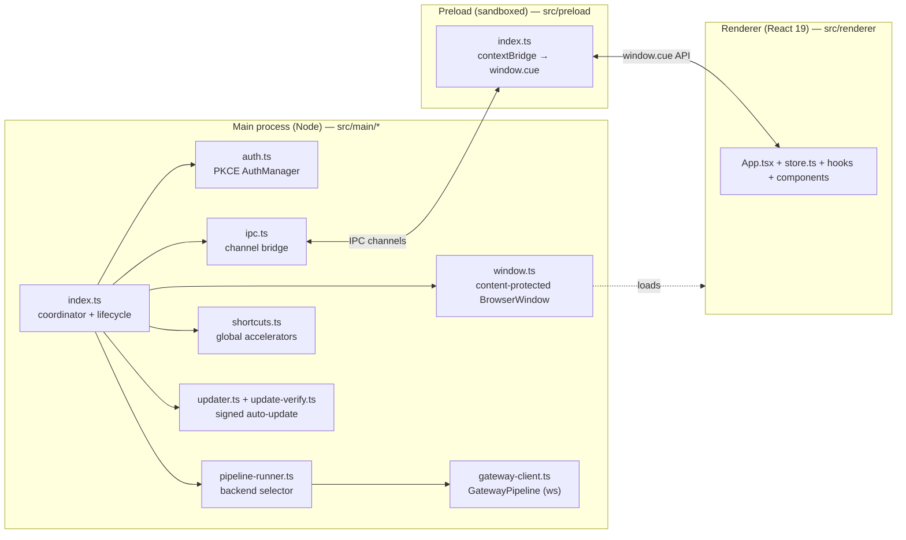
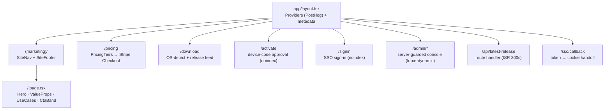

# Reference — Apps (`desktop`, `web`)

> For future AI: this documents the two end-user apps **as they exist on disk** under `apps/`, read from real source. `apps/desktop` is the Electron overlay (the product); `apps/web` is the Next.js marketing/download/admin site. Everything below cites concrete paths + symbol names — when this doc and the source disagree, **re-read the source**. Cross-refs: [`packages.md`](packages.md) (`@cue/core`, `@cue/sdk`, `@cue/types`), [`services.md`](services.md) (`api`, `ws-gateway`), [`../01-architecture-as-built.md`](../01-architecture-as-built.md) (the audio→cue hot path), [`../07-todos-and-gaps.md`](../07-todos-and-gaps.md) (the full stub inventory).

---

## 1. `apps/desktop` — `@cue/desktop`

An Electron app that renders a **content-protected overlay HUD** (invisible to screen shares/recordings) and streams microphone audio into the `@cue/core` cue pipeline. Built across Phase 0 (spike: overlay + local pipeline) and Phase 1 (auth + gateway backend), with Phase 2 adding signed auto-update + packaging.

- **Package:** `@cue/desktop` (private, `apps/desktop/package.json`)
- **Toolchain:** [electron-vite](https://electron-vite.org) (main/preload/renderer bundles), Electron `^33`, React `^19`, Zustand `^5`, `ws` `^8`, `electron-updater` `^6`, `electron-builder` `^25`.
- **Build config:** `apps/desktop/electron.vite.config.ts` (three-target build), `apps/desktop/electron-builder.yml` (packaging), `apps/desktop/build/` (entitlements + notarize hook).

### 1.1 Process model

electron-vite emits three bundles into `out/`: `out/main/index.js`, `out/preload/index.js`, `out/renderer/`. `package.json#main` points at the main bundle.



The main-process coordinator (`src/main/index.ts`, `bootstrap()`) is deliberately thin. Its ordered wiring is:

`createOverlayWindow` → `new AuthManager()` + `auth.init()` → `resolveBackend()` + `createPipeline()` → `registerIpc()` → `registerGlobalShortcuts()` → `startAutoUpdate()` (packaged only).

Lifecycle details in `index.ts`:
- **Single-instance lock** via `app.requestSingleInstanceLock()`; a second launch focuses the existing overlay (`second-instance` handler).
- **Accessory-app behavior:** `window-all-closed` does **not** quit on macOS (menu-bar/agent convention); quits elsewhere.
- **Teardown** (`before-quit`): `unregisterAll()` + `stopAutoUpdate()` + `pipeline.stop()`.
- Secrets read from env with loud warnings (never crash): `readKey('ANTHROPIC_API_KEY' | 'DEEPGRAM_API_KEY')`.

### 1.2 The content-protection window — `src/main/window.ts`

`createOverlayWindow(preloadPath)` builds a transparent, frameless, always-on-top strip (`width = min(760, workWidth-40)`, `height = 220`) centered near the top of the primary display's work area.

Key `webPreferences`: `sandbox: true`, `contextIsolation: true`, `nodeIntegration: false` — the renderer only ever touches `window.cue` (the preload bridge).

**Content protection** is `win.setContentProtection(true)`:
- macOS → sets `NSWindowSharingType = none`
- Windows → `SetWindowDisplayAffinity(WDA_EXCLUDEFROMCAPTURE)`

Plus `setAlwaysOnTop(true, 'screen-saver')`, `setVisibleOnAllWorkspaces(true, { visibleOnFullScreen: true })`, and `app.dock?.hide()` on macOS.

> **Honesty pass — what content protection is NOT.** The code comment is explicit: this excludes the **window** from capture/recording/share only. It does **not** hide the process from the OS, Activity Monitor / Task Manager, or any EDR / monitoring agent — Cue remains fully visible to the operating system.

The renderer loads from `ELECTRON_RENDERER_URL` (dev server) or `loadFile(../renderer/index.html)` (production). Shown via `showInactive()` on `ready-to-show` so it never steals focus.

**Renderer CSP** (`src/renderer/index.html`) is strict: `default-src 'self'; script-src 'self'; style-src 'self' 'unsafe-inline'; img-src 'self' data:; connect-src 'self'`. This CSP is why mic capture uses a `ScriptProcessorNode` rather than an `AudioWorklet` (see §1.5).

### 1.3 The typed IPC contract

The single source of truth for channel names is the `CHANNEL` map in `src/main/ipc.ts`. The renderer never sees these strings — it uses the typed `IpcApi` surface (from `@cue/types`) exposed on `window.cue` by `src/preload/index.ts` (`contextBridge.exposeInMainWorld('cue', api)`).

| `window.cue` method (preload) | Channel | IPC kind | Main handler (`ipc.ts`) |
|---|---|---|---|
| `startSession()` | `cue:start` | `invoke`/`handle` | `pipeline.start()` |
| `stopSession()` | `cue:stop` | `invoke`/`handle` | `pipeline.stop()` |
| `toggleOverlay()` | `cue:toggle` | `invoke`/`handle` | show/hide the window |
| `sendAudioChunk(chunk)` | `cue:audio` | `send`/`on` (fire-and-forget) | `pipeline.pushAudio(chunk)` |
| `login()` | `cue:auth:login` | `invoke`/`handle` | `auth.login()` |
| `logout()` | `cue:auth:logout` | `invoke`/`handle` | `auth.logout()` |
| `getAuthState()` | `cue:auth:state` | `invoke`/`handle` | `auth.getState()` |
| `onState(cb)` | `cue:state` | push (`webContents.send`) | `pipeline.onState` |
| `onTranscript(cb)` | `cue:transcript` | push | `pipeline.onTranscript` |
| `onCue(cb)` | `cue:cue` | push | `pipeline.onCue` |
| `onAuthState(cb)` | `cue:auth-state` | push | `auth.onState` |

Push subscribers return an unsubscribe fn (preload `subscribe<T>` wraps `ipcRenderer.on`/`removeListener`). Main's `send()` guards against a torn-down window (`win.isDestroyed()`) because shortcuts/quit can race the pipeline.

### 1.4 Global shortcuts — `src/main/shortcuts.ts`

`registerGlobalShortcuts(actions)` registers three accelerators (failures are logged, not thrown):

| Accelerator | Action |
|---|---|
| `CommandOrControl+\` | toggle overlay visibility (`toggleOverlay`) |
| `CommandOrControl+Shift+E` | end session (`endSession` → `pipeline.stop()`) |
| `Escape` | end session |

> **Honesty pass — TODO.** Registering `Escape` as a **global** shortcut swallows Escape in every app while Cue runs. The code carries a `TODO(phase-1)` to move it to a window-local binding. Still global as built.

### 1.5 Microphone capture — `src/renderer/hooks/use-audio-capture.ts`

The **working** Phase 0 audio path. `useAudioCapture()`:
1. `getUserMedia({ audio: { channelCount: 1, echoCancellation, noiseSuppression } })`
2. Builds a WebAudio graph at `TARGET_SAMPLE_RATE = 16_000` (Chromium resamples the device feed).
3. Uses a `ScriptProcessorNode` (`BUFFER_SIZE = 4096` ≈ 256 ms/frame) — **not** an `AudioWorklet`, because the worklet module must load from a URL, which the overlay's `script-src 'self'` CSP blocks. `TODO(phase-1)` in the code: ship a bundled worklet + relax CSP.
4. Each frame: `downsampleTo16k()` then `floatToPcm16()` (both pure, in `src/renderer/utils.ts`) → `window.cue.sendAudioChunk({ data, sampleRate: 16000, channels: 1, ts })`.

> **Doc drift:** `apps/desktop/README.md` says capture uses "AudioWorklet". The **actual** implementation uses `ScriptProcessorNode` (deprecated but dependency-free and CSP-compatible). Trust the code.

> **System/loopback audio is NOT captured.** Only the local mic works. System loopback (the far side of a call) is a stubbed native TODO — `NotImplementedLoopbackCapture` in `@cue/core` (see [`packages.md`](packages.md) and [`../07-todos-and-gaps.md`](../07-todos-and-gaps.md)).

### 1.6 The renderer (React 19) — `src/renderer/*`

Logic-light, code-split per the house standards:

| File | Role |
|---|---|
| `main.tsx` | React root mount |
| `App.tsx` | orchestrator: wires store↔streams, owns the Start/Stop toggle, coordinates mic capture with `startSession()`/`stopSession()` |
| `store.ts` | Zustand `useCueStore` — reduces `onState`/`onTranscript`/`onCue` into UI state; `MAX_CUES = 20` cap; pure `reduceCue()` |
| `hooks/use-cue-stream.ts` | mounts once, subscribes the three push streams into the store, tears down on unmount |
| `hooks/use-audio-capture.ts` | mic capture (§1.5) |
| `hooks/use-auth.ts` | mirrors main-process `AuthState`, exposes `login`/`logout` proxies |
| `components/Overlay.tsx` | pure presentational root (drag region + `no-drag` controls) |
| `components/CueCard.tsx`, `StatusIndicator.tsx`, `AuthChip.tsx` | focused view components |
| `types.ts`, `utils.ts` | renderer-local view-model types + pure audio/format helpers |

Session state machine (from `@cue/types` `SessionState`): `idle → listening → thinking → cue → listening` (`error` on failure). `StatusIndicator` renders a colored dot + label + a `mic` badge while capturing.

### 1.7 Pipeline runner — local vs gateway

`src/main/pipeline-runner.ts` selects one of two implementations of the same `CuePipeline` contract (`start`/`stop`/`pushAudio`/`onState`/`onTranscript`/`onCue`), so the coordinator stays backend-agnostic:

| Backend | Constructed by | What it does |
|---|---|---|
| `local` (**default**) | `createOrchestrator()` from `@cue/core` | Runs the Deepgram STT + Claude cue pipeline **in-process** (Phase 0 path). |
| `gateway` (opt-in) | `new GatewayPipeline()` (`src/main/gateway-client.ts`) | Streams through the `ws-gateway` service instead of running `@cue/core` locally (Phase 1). |

`resolveBackend(env)` returns `gateway` **only** when `CUE_BACKEND=gateway`; otherwise `local` — keeping Phase 0 as the never-regressed default. Gateway mode requires a signed-in `AuthManager` client (see §1.8) and reads `CUE_SESSION_KIND`, `CUE_DISCLOSED`, `CUE_WS_URL`, `CUE_LANGUAGE` from env.

**`GatewayPipeline` (as built):**
- Wire protocol `cue.v1` (`PROTOCOL` const), mirrored in `@cue/types`.
- `connect()`: `api.sessions.create({ kind, disclosed?, language? })` → `api.sessions.wsTicket(sessionId)` → open `WebSocket(url, ['cue.v1'])`.
- **Auth is in the first `hello` message's ticket, never a query arg**; tickets are single-use, minted per (re)connect.
- Audio uplink = binary PCM16 frames with a 4-byte header (`encodeAudioFrame`): `[type(1) | channel(1) | seq(uint16 LE) | payload]` using `WS_AUDIO_FRAME` constants from `@cue/types`.
- Server JSON envelopes (`ServerMsg`) map back to Phase 0 events in `handleServerMsg()`: `transcript.partial/final`, `cue.delta/final`, `session.finalizing → thinking`, `quota.exceeded/error → error`. `ready`/`heartbeat`/`backpressure`/`entitlements.updated` have no UI mapping.
- Resilience: `READY_TIMEOUT_MS = 10_000`; heartbeat interval from the server's `ready.heartbeatSec`; reconnect with exponential backoff (`min(5000, 500·2^(n-1))`) up to `maxReconnects` (default 3), resuming from `lastSeq`.

See [`services.md`](services.md) for the `ws-gateway` server side and [`../01-architecture-as-built.md`](../01-architecture-as-built.md) for the full transport picture.

### 1.8 Auth — PKCE device-code — `src/main/auth.ts`

`AuthManager` owns the OAuth2 PKCE (device-code MVP variant) flow entirely in the main process; the renderer only ever sees a redacted `AuthState`.

1. `createPkcePair()` → verifier + S256 challenge (base64url, `node:crypto`).
2. `POST /v1/auth/pkce/start` (via `CueApiClient.auth.pkceStart`) → `{ device_code, verification_uri, interval, expires_in }`.
3. `shell.openExternal(verification_uri)` — opens the system browser (the web app's `/activate` page, §2.6).
4. Poll `POST /v1/auth/pkce/exchange` at the server cadence until tokens issue or the device code expires (`pollExchange`; a 4xx = "pending approval", keep polling).
5. Persist tokens **encrypted at rest** via Electron `safeStorage` to `<userData>/cue-auth.enc` (`persistTokens`/`loadTokens`). If `safeStorage.isEncryptionAvailable()` is false (dev), it keeps tokens in memory only — never writes plaintext.

Tokens live inside the wrapped `CueApiClient` (auto-refresh on 401); that same client is **shared with the `GatewayPipeline`** (`auth.getClient()`), so the gateway stream carries live tokens. `init()` rehydrates on launch and background-hydrates the profile via `GET /v1/me`.

> **Honesty pass — TODO.** The MVP `verification_uri` may auto-approve a dev user server-side. Code carries `TODO(real IdP: Clerk/WorkOS)`: swap for a real hosted sign-in before shipping.

### 1.9 Signed auto-update — `src/main/updater.ts` + `update-verify.ts`

Uses `electron-updater` but with `autoDownload = false` — **no update is fetched or applied until an independent manifest signature check passes**. This is the security control from `docs/05-remediation-plan`.

Flow (`startAutoUpdate`, wired only when `app.isPackaged`):
1. `checkForUpdates()` (launch + every 6h default) → electron-updater emits `update-available`.
2. `verifyRemoteManifest()` independently fetches `latest*.yml` + its detached `.minisig` and verifies against a **pinned minisign public key** (env `UPDATE_MANIFEST_PUBLIC_KEY` or the bundled `BUNDLED_UPDATE_MANIFEST_PUBLIC_KEY` constant).
3. Only on success → `downloadUpdate()`, after which electron-updater does its own sha512 + OS code-signature checks.
4. Any failure = **TAMPER-REJECT**, fail closed (never downloaded). No feed URL (`RELEASES_URL`) or no pinned key ⇒ auto-update disabled.

The signature math lives in the **pure, Electron-free** `src/main/update-verify.ts` (`verifyManifestSignature()`), so it's unit-testable in plain Node — see `src/main/update-verify.test.ts` (`pnpm --filter @cue/desktop test:update-verify`). It implements minisign-compatible Ed25519 verification (legacy `Ed` raw + prehashed `ED` BLAKE2b-512), enforces a key-id match against the pinned key, and optionally checks the trusted-comment global signature. Platform manifest name via `manifestFileName()` (`latest-mac.yml` / `latest.yml` / `latest-linux.yml`).

> **Honesty pass — stub.** `BUNDLED_UPDATE_MANIFEST_PUBLIC_KEY = ''` (empty). The verification *code path* is real and tested, but there is **no real pinned key bundled** — a `TODO(devops)` says the release pipeline must inject it at build time. As built, packaged auto-update stays disabled until a key + `RELEASES_URL` are supplied.

### 1.10 Packaging — `electron-builder.yml` + `build/`

| Target | As built |
|---|---|
| **macOS** | Universal `dmg`, Hardened Runtime, `LSUIElement: true` (accessory app), entitlements `build/entitlements.mac.plist`. Notarization via the `afterSign` hook `build/notarize.cjs` (electron-builder's own `notarize: false` to avoid double submission). |
| **Windows** | NSIS installer (`x64`), `publisherName: "Cue Technologies Inc."`, `verifyUpdateCodeSignature: true`, non-one-click installer. |
| **Update feed** | `provider: generic`, `url: ${env.RELEASES_URL}`, `channel: latest`. |

Entitlements (`build/entitlements.mac.plist`) are intentionally minimal: `device.audio-input`, `device.camera` (reserved for future video awareness), `cs.allow-jit`, `cs.allow-unsigned-executable-memory`. Library validation is deliberately left **on**. TCC usage strings (`NSMicrophoneUsageDescription`, `NSCameraUsageDescription`) are injected via `extendInfo`.

`build/notarize.cjs` reads Apple creds from env only (`APPLE_ID`, `APPLE_APP_SPECIFIC_PASSWORD`, `APPLE_TEAM_ID`); if any are missing it **skips** notarization with a warning rather than failing the build. Windows signing is env-driven (`WIN_CSC_LINK` / `WIN_CSC_KEY_PASSWORD`).

> **Honesty pass.** Packaging *config* exists and is complete, but signing/notarization require CI-provided certs/creds that are not in the repo. Phase 0 README lists packaging & signing as out of scope for the spike; the config was added in Phase 2. No signed artifact is produced by code alone.

### 1.11 Run the desktop app

```bash
# From repo root. Secrets in a root .env: ANTHROPIC_API_KEY, DEEPGRAM_API_KEY.
pnpm --filter @cue/desktop dev          # electron-vite dev (hot reload)
pnpm --filter @cue/desktop build        # bundle to out/
pnpm --filter @cue/desktop package:mac   # dmg (no publish)
pnpm --filter @cue/desktop package:win   # nsis (no publish)
pnpm --filter @cue/desktop test          # tsx --test src/**/*.test.ts
```

Key env vars: `CUE_BACKEND` (`local`|`gateway`), `CUE_API_BASE_URL` (default `http://localhost:3001`), and for gateway mode `CUE_SESSION_KIND`, `CUE_WS_URL`, `CUE_DISCLOSED`, `CUE_LANGUAGE`. Packaged-only: `RELEASES_URL`, `UPDATE_MANIFEST_PUBLIC_KEY`. Full matrix in [`../05-setup-and-run.md`](../05-setup-and-run.md).

---

## 2. `apps/web` — `@cue/web`

Next.js 15 (App Router, RSC-first) marketing + download + activation + **enterprise admin console**. Built in Phase 1 (landing/pricing/download/activate + release feed), Phase 2 (Three.js hero + Stripe Checkout), Phase 3 (SSO sign-in + admin console), Phase 4 (Sentry + PostHog analytics).

- **Package:** `@cue/web` (private, `type: module`)
- **Stack:** Next `^15`, React `^19`, Tailwind v4 (`@tailwindcss/postcss`), `@react-three/fiber` `^9` + `@react-three/drei` `^10` + `three` `^0.171` (hero), `posthog-js`, `@sentry/nextjs`.
- **Consumes** `@cue/sdk` (`CueApiClient`) + `@cue/types` — the same typed contracts the desktop app and services use.

### 2.1 Route map



| Route | File | Type | Notes |
|---|---|---|---|
| `/` | `app/(marketing)/page.tsx` | RSC | Composes `features/marketing/*` sections |
| `/pricing` | `app/pricing/page.tsx` | RSC + client CTA | `buildMetadata`, `PricingTiers` |
| `/download` | `app/download/page.tsx` | RSC + client islands | `DownloadCta` + `DownloadGrid` |
| `/activate` | `app/activate/page.tsx` | client (Suspense) | `robots: noindex`; desktop PKCE approval |
| `/signin` | `app/signin/page.tsx` | client (Suspense) | `robots: noindex`; enterprise SSO |
| `/admin`, `/admin/{members,sso,settings,billing}` | `app/admin/*` | RSC guard + client panels | `dynamic = 'force-dynamic'` |
| `GET /api/latest-release` | `app/api/latest-release/route.ts` | Route Handler | `revalidate = 300` |
| `GET /sso/callback` | `app/sso/callback/route.ts` | Route Handler | token→cookie seam, `force-dynamic` |

**Layout & providers:** `app/layout.tsx` sets `metadataBase`, title template, dark `themeColor`, and wraps children in `Providers` (client PostHog init). `app/(marketing)/layout.tsx` adds shared `SiteNav`/`SiteFooter` chrome. Site constants (name, tagline, `siteUrl()`, `apiBaseUrl()`) live in `lib/config/site.ts`.

### 2.2 Landing + marketing — `features/marketing/*`

`page.tsx` is orchestration only; each section is a focused RSC in `features/marketing/`: `hero.tsx`, `value-props.tsx`, `use-cases.tsx`, `cta-band.tsx`, plus `site-nav.tsx`, `site-footer.tsx`, `wordmark.tsx`, `overlay-mock.tsx`, and copy in `content.ts`. The crawlable H1/value-prop copy lives in the Server Component `Hero`; only the decorative visual is client-side.

### 2.3 The Three.js hero — `components/hero/*`

The WebGL hero is aggressively code-split and gated so it never hurts the initial route:

- `components/hero/Hero3D.tsx` (client): loads `./scene` via `next/dynamic(..., { ssr: false })`. Mounts the scene **only** when WebGL is available (`detectWebGl()`) **and** motion is allowed (`useReducedMotion`) **and** the hero is near-viewport with the tab focused (`useInView`, `rootMargin: '200px'`). Otherwise renders the static `HeroPoster`.
- `components/hero/scene.tsx` is the **only** file importing `three` / `@react-three/*` — a procedural glassy overlay card floating over a blurred "meeting" plane. No HDR/`.glb` assets (works offline). Power discipline: `frameloop="demand"` + a `Ticker` that only `invalidate()`s while un-paused, so a scrolled-away/backgrounded hero idles the GPU (`Scene({ paused })`).
- `next.config.ts` uses `experimental.optimizePackageImports: ['@react-three/drei']` to tree-shake the drei barrel.

This keeps the ~600KB `three` bundle in a separate async chunk, out of the RSC/SSR payload and initial route JS (per `docs/11-web-landing.md §4`).

### 2.4 Pricing → Stripe Checkout — `features/pricing/*`

Tiers defined in `features/pricing/plans.ts`; rendered by `pricing-tiers.tsx` / `tier-card.tsx`. The CTA (`checkout-button.tsx`) uses `hooks/use-checkout.ts`:
- Builds a `CueApiClient` against `apiBaseUrl()`, calls `client.billing.createCheckout({ tier, interval, successUrl, cancelUrl })`, then `window.location.assign(url)` to Stripe's hosted page.
- The marketing site is unauthenticated, so a `401/403` is surfaced gracefully as "Please sign in from the Cue app to upgrade" rather than a hard error. `successUrl` → `/download?checkout=success`, `cancelUrl` → `/pricing?checkout=cancelled`.

Only self-serve tiers (Pro/Team) can start Checkout; Free/Enterprise cannot (`CheckoutTier` = `CheckoutSessionRequest['tier']`). Billing server side is in `services/api` (see [`services.md`](services.md)).

### 2.5 Download + the release feed — `/api/latest-release` + `lib/release/*` + `features/download/*`

**Route handler** `app/api/latest-release/route.ts` (`revalidate = 300`, ISR) returns a normalized `ReleaseManifest` via `fetchManifest('stable')` with a CDN `Cache-Control` of `max-age=60, s-maxage=300, stale-while-revalidate=86400`. **Only URLs are served — never binaries.**

`lib/release/fetch-manifest.ts`:
- Reads the canonical feed from `RELEASES_URL`; `normalize()`s the body; `attachSignature()` fetches the sibling `<RELEASES_URL>.minisig` (the independent minisign signature, key distinct from the artifact host).
- **Falls back to `STATIC_FALLBACK_MANIFEST`** (`lib/release/static-fallback.ts`) when `RELEASES_URL` is unset (local dev) or the fetch fails, so the download surface never 500s.

**Client side** (`features/download/*`): `use-os-detect.ts` (prefers `navigator.userAgentData`, falls back to UA parsing in `utils/os.ts`), `use-latest-release.ts` (fetch-once over `/api/latest-release`), `download-cta.tsx` (one-click for the detected OS), `download-grid.tsx` (all platforms). Asset selection in `utils/asset.ts`.

> **Honesty pass — placeholder feed.** `static-fallback.ts` points at placeholder `cdn.usecue.app` URLs with **empty `sha512`/`signature`**. `TODO(devops)`: replace with real signed R2/CloudFront artifacts. As built, local/CI serves this placeholder; there is no real release feed yet.

### 2.6 Device activation — `/activate` — `features/activate/*`

The web side of the desktop PKCE flow (§1.8). `ActivateScreen` reads `device_code` from `useSearchParams` (hence the Suspense boundary) and `hooks/use-activate.ts` `POST`s it to `${apiBaseUrl()}/v1/auth/pkce/approve`. This is a plain typed `fetch` (the approve endpoint is outside the SDK's 4-method surface) but parses problem+json errors with the SDK's `isProblemDetails` guard. Page is `robots: noindex`.

### 2.7 Enterprise SSO sign-in — `/signin` — `features/sso-signin/*`

`SsoSigninForm` + `hooks/use-sso-signin.ts`: takes a work email, derives the domain (`utils/domain.ts`), calls `client.sso.authorize({ domain, state })` (WorkOS authorization URL), and full-page-redirects to the IdP. `state` carries a safe post-login return path. Page is `robots: noindex`.

**SSO token handoff** `app/sso/callback/route.ts`: the `api`'s server-only `GET /v1/sso/callback` exchanges the WorkOS code, mints first-party JWTs, and 302s the browser here with tokens in the URL for a single hop. This same-origin handler writes them into the `cue_session` cookie (`encodeTokens`, `SESSION_COOKIE`) and redirects to the intended `return` path (validated by `safeReturn` against open-redirects).

> **Honesty pass — TODOs.** (1) The cookie is intentionally **not `httpOnly`** (the client SDK reads it) — a hardening TODO in `lib/auth/client-session.ts`. (2) Tokens transit the URL for one hop; a `TODO(api SsoModule)` notes hardening to a one-time server-side code exchange. The web route is real; it depends on the api SSO contract existing.

### 2.8 Admin console — `/admin/*` — `features/admin/*`

Server-guarded org-management console (Phase 3).

**Guard** (`app/admin/layout.tsx`, `dynamic = 'force-dynamic'`): `resolveAdminAuth()` (`lib/auth/session.ts`) reads the `cue_session` cookie, hydrates a server-side `CueApiClient`, calls `GET /v1/me`, and checks for a privileged role (`owner`/`admin`, `hasAdminAccess`). Unauthenticated → redirect to `/signin?return=/admin`; signed-in non-admin → `ForbiddenScreen`; otherwise renders `AdminShell` seeded with an `AdminBootstrap` (user/org/role). `next/headers` makes `session.ts` **server-only**; client hooks use `lib/auth/client-session.ts`.

**Sub-pages** — each `page.tsx` is a one-line render of a feature panel:

| Route | Panel | Covers |
|---|---|---|
| `/admin` | `OverviewPanel` | org snapshot + quick links |
| `/admin/members` | `MembersPanel` | invite, roles, removal, pending invitations |
| `/admin/sso` | `SsoPanel` | WorkOS SSO connection setup |
| `/admin/settings` | `SettingsPanel` | org identity, SSO domains, provisioning defaults |
| `/admin/billing` | `BillingPanel` | seat accounting + Stripe Customer Portal link |

**Client architecture:** `context.tsx` (`AdminContextProvider`/`useAdminContext`) seeds server-resolved identity/org/role so panels read `orgId` + `role` without re-fetching `/me`. Data hooks in `features/admin/hooks/` each wrap a `client.admin.*` / `client.sso.*` SDK call: `use-members.ts` (cursor pagination + role/remove mutations, `PAGE_SIZE = 25`), `use-invites.ts`, `use-seats.ts`, `use-entitlements.ts`, `use-sso-connections.ts`, `use-org-settings.ts`, `use-cue-client.ts` (builds the browser SDK client). Presentational components (`stat-card`, `seat-meter`, `role-badge`, `member-row`, etc.) are pure. The server side (RBAC guard, invites, WorkOS/SCIM) is in `services/api` — see [`services.md`](services.md).

### 2.9 Analytics + observability — Phase 4

**PostHog** (`lib/analytics/posthog.ts` + `app/providers.tsx`): browser product analytics, **PII-safe by design** — `autocapture: false`, `disable_session_recording: true`, `mask_all_text: true`, `mask_all_element_attributes: true`, `ip: false`. Inert unless `NEXT_PUBLIC_POSTHOG_KEY` is set (`analyticsEnabled`), in which case `Providers` is a transparent pass-through. Only a typed event allowlist (`ANALYTICS_EVENTS`: `download_clicked`, `pricing_viewed`, `signin_started`) and typed feature flags (`FEATURE_FLAGS`: `web-hero-3d`, `web-pricing-annual-toggle`, read via `lib/analytics/use-feature-flag.ts`) are used.

**Sentry** (`instrumentation.ts` + `sentry.{client,server,edge}.config.ts` + `withSentryConfig` in `next.config.ts`): `register()` loads the runtime-matching config; `onRequestError = Sentry.captureRequestError`. All no-ops without a DSN. Build plugin uploads source maps only when `SENTRY_*` build env is present; browser telemetry tunneled through `/monitoring` to survive ad-blockers.

**Security headers** (`next.config.ts`): `X-Content-Type-Options: nosniff`, `Referrer-Policy`, `Permissions-Policy: camera=(), microphone=(), geolocation=()`, and HSTS `max-age=63072000; includeSubDomains; preload`. `poweredByHeader: false`.

### 2.10 Run the web app

```bash
pnpm --filter @cue/web dev        # next dev --port 3000
pnpm --filter @cue/web build      # next build
pnpm --filter @cue/web start      # next start --port 3000
pnpm --filter @cue/web typecheck  # tsc --noEmit
pnpm --filter @cue/web lint
```

Key env vars (all optional in dev — the app degrades gracefully): `NEXT_PUBLIC_SITE_URL` (default `http://localhost:3000`), `NEXT_PUBLIC_API_BASE_URL` (default `http://localhost:3001`), `RELEASES_URL` (else static fallback), `NEXT_PUBLIC_POSTHOG_KEY`/`_HOST`, `SENTRY_*`. The admin console + SSO + Checkout paths require a running `services/api` (see [`services.md`](services.md), [`../05-setup-and-run.md`](../05-setup-and-run.md)).

---

## 3. Real-vs-stub summary (both apps)

| Area | Status |
|---|---|
| Desktop content-protection overlay + IPC + mic capture + local pipeline | **Real, working** (Phase 0) |
| Desktop system/loopback audio capture | **Stubbed** (`NotImplementedLoopbackCapture` in `@cue/core`) |
| Desktop mic capture via AudioWorklet | **Not implemented** — uses `ScriptProcessorNode` (CSP constraint); README is stale |
| Desktop `Escape` shortcut scoping | **Global as built**; window-local is a TODO |
| Desktop PKCE auth + encrypted token storage | **Real**; but MVP IdP may auto-approve (`TODO` real IdP) |
| Desktop gateway backend (`GatewayPipeline`) | **Real, opt-in** via `CUE_BACKEND=gateway`; needs signed-in client + running `ws-gateway` |
| Desktop signed auto-update verification code | **Real + unit-tested**, but no real pinned key bundled (`BUNDLED_..._KEY = ''`) → disabled until keyed |
| Desktop packaging/signing/notarization | **Config complete**, requires CI certs/creds not in repo |
| Web landing/pricing/download/activate/signin | **Real** |
| Web Three.js hero | **Real**, gated + code-split |
| Web release feed | **Real handler**, but points at **placeholder** CDN URLs (empty hashes/sig) |
| Web Stripe Checkout / admin console / SSO | **Real client**, depend on `services/api` contracts |
| Web analytics (PostHog) + Sentry | **Real**, inert without keys/DSN |

See [`../07-todos-and-gaps.md`](../07-todos-and-gaps.md) for the consolidated gap inventory and the descoped legal/consent note.
