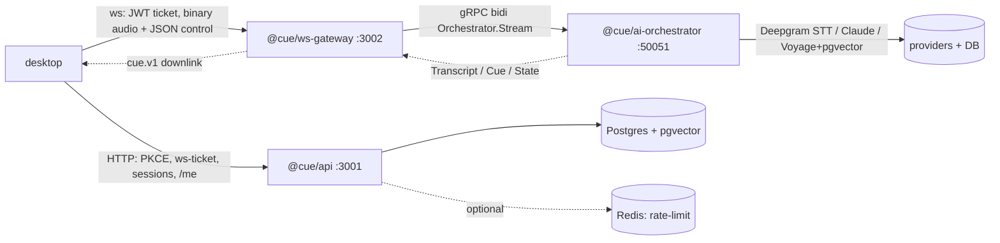

# Services reference — `api`, `ai-orchestrator`, `ws-gateway`

> **For future AI:** this documents the three backend services **as built on `dev`**, read from `services/{api,ai-orchestrator,ws-gateway}/src`, their `package.json`, and `Dockerfile`. Endpoint tables, ports, env vars, and TODOs below are copied from real code — when prose and source disagree, re-read the source (controllers move faster than docs). Sibling refs: [`packages.md`](packages.md) (the `@cue/*` libraries these consume) and [`apps.md`](apps.md) (the clients that call them). Architecture context: [`../01-architecture-as-built.md`](../01-architecture-as-built.md); setup/run: [`../05-setup-and-run.md`](../05-setup-and-run.md); open gaps: [`../07-todos-and-gaps.md`](../07-todos-and-gaps.md).

## At a glance

| Service | Package | Bind port(s) | Stack | Speaks | Role |
|---|---|---|---|---|---|
| API (BFF) | `@cue/api` | `3001` (HTTP) | NestJS 11, Zod contracts, `jose` ES256, Drizzle (`@cue/db`), Stripe, WorkOS | HTTP/JSON | Control plane: auth, sessions, docs/RAG ingest, billing, entitlements, org admin, SSO/SCIM |
| WS gateway | `@cue/ws-gateway` | `3002` (ws) + `9464` (metrics) | Node `ws`, `@grpc/grpc-js` client via `@cue/proto`, `jose` | WS ↔ gRPC | Realtime edge: JWT-ticket auth, binary audio + JSON control, resume/heartbeat/backpressure |
| AI orchestrator | `@cue/ai-orchestrator` | `50051` (gRPC) + `9464` (metrics) | NestJS 11 context + `@grpc/grpc-js` server, `@cue/core`, `@cue/db` | gRPC bidi | Hot path: STT → Claude cue pipeline + RAG grounding + regional admission |

The per-frame audio path is **gRPC bidi** between `ws-gateway` (client) and `ai-orchestrator` (server); Redis is deliberately kept **off** this path. `@cue/api` is a separate HTTP control plane. Request flow (from [`../../services/README.md`](../../services/README.md)):



Every service also exposes an operational surface — `GET /metrics` `/livez` `/readyz` — from `@cue/observability`; `api` serves those on `API_PORT`, the two non-Nest services on `METRICS_PORT` (`9464`). See [`packages.md`](packages.md#cueobservability) for the shared health/metrics primitives.

---

## `@cue/api` — control-plane BFF

**Path:** [`../../services/api`](../../services/api) · **Package:** `@cue/api` · **Entry:** `src/main.ts` → `AppModule`

### Responsibility

NestJS 11 backend-for-frontend. Owns everything that is **not** the realtime audio path: OAuth2 device-code PKCE + ES256 JWTs, session records + WS ticket minting, RAG document ingest, Stripe billing/webhooks/usage, entitlement gates, org admin + RBAC + audit, and enterprise SSO/SCIM via WorkOS. **Zod schemas in `src/contracts/` are the contract source of truth** (mirrored into `@cue/types`; do not hand-edit the mirror).

### Bootstrap (`src/main.ts`)

- `NestFactory.create(AppModule, { rawBody: true })` — preserves exact request bytes on `req.rawBody` so the Stripe webhook route can verify its HMAC signature; all other routes get normally-parsed JSON.
- Global `AllExceptionsFilter` (RFC-7807 problem-details, `src/common/`), CORS locked to `WEB_BASE_URL`, `enableShutdownHooks()`.
- **Deep readiness:** registers a `postgres` readiness check (`DbService.ping()`) so `/readyz` drains the task at the ALB when the DB is unreachable rather than serving 5xx.
- SIGTERM/SIGINT → `health.beginDraining()` first (ALB stops routing) before Nest drains in-flight work.

### Modules (`AppModule`, `src/app.module.ts`)

`ConfigModule`, `ObservabilityModule.forRoot({ serviceName: 'api' })`, `RateLimitModule`, `DbModule`, `HealthModule`, `AuthModule`, `MeModule`, `SessionsModule`, `DocumentsModule`, `EntitlementsModule`, `BillingModule`, `BillingWebhooksModule`, `UsageModule`, `OrgsModule`, `AdminModule`, `SsoModule`.

Cross-cutting guards/decorators (stacked in this order where applied): `JwtAuthGuard` → `RequireRoleGuard` (`@RequireRole`, `src/modules/rbac/`) / `RequireEntitlementGuard` (`@RequireEntitlement`, `src/modules/entitlements/`); `RateLimitGuard` (Redis sliding window, `@SkipRateLimit` opts out); `@Audit(...)` + `AuditInterceptor` write to the `audit_logs` table.

### HTTP endpoints

All paths are `v1`-prefixed. **Auth column:** *public* = no guard; *JWT* = `JwtAuthGuard`; *role* = `+ RequireRoleGuard @RequireRole(...)`; *signed* = HMAC over raw body (no user).

| Method + path | Controller | Auth | Purpose |
|---|---|---|---|
| `POST /v1/auth/pkce/start` | `AuthController` | public | Register device-code + PKCE challenge → `verification_uri` (`/activate?code=…`) |
| `POST /v1/auth/pkce/exchange` | `AuthController` | public | Verify PKCE, **auto-approve dev identity** (TODO real IdP), mint `AuthTokens` |
| `POST /v1/auth/refresh` | `AuthController` | public | Rotate refresh → new `AuthTokens` |
| `GET /v1/me` | `MeController` | JWT | Current user profile |
| `POST /v1/sessions` | `SessionsController` | JWT | Create a session record (`201`) |
| `GET /v1/sessions` | `SessionsController` | JWT | Paginated `Paginated<Session>` |
| `GET /v1/sessions/:id` | `SessionsController` | JWT | Single `Session` (org-scoped) |
| `POST /v1/sessions/:id/ws-ticket` | `SessionsController` | JWT | Mint single-use ES256 `WsTicket` (aud `ws-gateway`) for the gateway hop |
| `POST /v1/documents` | `DocumentsController` | JWT | Upload inline text → chunk → embed (`voyage-3.5`) → persist `documents` + `document_chunks` (`201`); optional `visibility` (`personal` default \| `org`) |
| `GET /v1/documents` | `DocumentsController` | JWT | Org-scoped `Paginated<Document>` |
| `GET /v1/documents/:id` | `DocumentsController` | JWT | Single `Document` |
| `GET /v1/me/entitlements` | `EntitlementsController` | JWT | Resolved feature-gate snapshot; `version` matches WS `entitlements.updated` bump |
| `POST /v1/billing/checkout` | `BillingController` | JWT | Stripe hosted-Checkout URL for `pro`/`team` |
| `POST /v1/billing/portal` | `BillingController` | JWT | Stripe Customer Portal link |
| `GET /v1/billing/usage` | `UsageController` | JWT | Current-period live-minute ledger + enforcement + overage economics |
| `POST /v1/billing/webhook` | `BillingWebhooksController` | **Stripe-signed** (`@SkipRateLimit`) | Verify `stripe-signature` over raw body → dedupe `event.id` → reconcile `subscriptions`+`entitlements` → `200`; bad sig ⇒ hard `400` |
| `POST /v1/orgs/:orgId/invites` | `OrgsController` | role owner/admin | Create email+role invite; audited `member.invite` (`201`) |
| `GET /v1/orgs/:orgId/invites` | `OrgsController` | role owner/admin | List invites |
| `GET /v1/orgs/:orgId/members` | `OrgsController` | role owner/admin | `Paginated<AdminMemberView>` |
| `PATCH /v1/orgs/:orgId/members/:userId` | `OrgsController` | role owner/admin | Change role; audited `member.role.update` |
| `DELETE /v1/orgs/:orgId/members/:userId` | `OrgsController` | role owner/admin | Remove member; audited `member.remove` (`204`) |
| `POST /v1/invites/accept` | `InvitesController` | JWT | Accept an invite token → become an `orgMembers` row |
| `GET /v1/orgs/:orgId` | `AdminController` | role owner/admin | Org overview (members, seats, entitlement snapshot) |
| `GET /v1/orgs/:orgId/settings` | `AdminController` | role owner/admin | `OrgSettings` |
| `PATCH /v1/orgs/:orgId/settings` | `AdminController` | role owner/admin | Update settings; audited `org.settings.update` |
| `GET /v1/orgs/:orgId/audit-logs` | `AdminController` | role owner/admin | Query `audit_logs` → `Paginated<AuditLogEntry>` |
| `GET /v1/orgs/:orgId/documents` | `TeamKbController` | JWT (any member) | List shared team KB (`visibility='org'`) |
| `DELETE /v1/orgs/:orgId/documents/:documentId` | `TeamKbController` | JWT (owner/admin) | Remove a team-KB doc (`204`) |
| `GET /v1/sso/authorize` | `SsoController` | public | `org`/`domain` → org's WorkOS connection → authorization URL |
| `GET /v1/sso/callback` | `SsoController` | WorkOS redirect | Exchange `code` → profile → upsert `users`+`orgMembers` → mint AssistMe JWT |
| `GET /v1/orgs/:orgId/sso/connections` | `SsoConnectionsController` | role owner/admin | List SSO connections |
| `POST /v1/orgs/:orgId/sso/connections` | `SsoConnectionsController` | role owner/admin | Create SSO connection (`201`) |
| `DELETE /v1/orgs/:orgId/sso/connections/:connectionId` | `SsoConnectionsController` | role owner/admin | Delete SSO connection (`204`) |
| `POST /v1/scim/webhook` | `ScimController` | **WorkOS-signed** | Directory-sync: verify `WORKOS_WEBHOOK_SECRET` → `dsync.*` → upsert/deactivate `orgMembers` |
| `GET /healthz` | `HealthController` | public (`@SkipRateLimit`) | Shallow liveness (does **not** touch Postgres) |
| `GET /metrics` `/livez` `/readyz` | `ObservabilityController` (`@cue/observability/nest`) | public | Prometheus scrape + liveness + deep readiness (Postgres) on `API_PORT` |

**Auth is the device-code PKCE surface only** (`start`/`exchange`/`refresh` + `/me`) — not the fuller `/auth/token` surface in `docs/22`/`docs/40`. `pkceExchange` currently **auto-approves a single shared dev identity** — `TODO(real IdP: Clerk/WorkOS)` in `src/modules/auth/auth.service.ts`.

### Ports & env vars

Bind: **`API_PORT`** (default `3001`) — serves app routes + `/healthz` + `/metrics` `/livez` `/readyz`. Env validated once at boot via Zod (`src/config/app-config.ts`); an invalid env fails fast with a readable message.

| Env var | Required? | Notes |
|---|---|---|
| `DATABASE_URL` | **yes** | Postgres + pgvector, consumed by `@cue/db` |
| `NODE_ENV` | no (`development`) | `development`\|`test`\|`production` |
| `API_PORT` | no (`3001`) | HTTP bind |
| `WEB_BASE_URL` | no (`http://localhost:3000`) | CORS origin + `/activate` verification page |
| `WS_PUBLIC_URL` | no (`ws://localhost:3002`) | Public gateway URL handed to clients in a ws-ticket |
| `JWT_PRIVATE_KEY` / `JWT_PUBLIC_KEY` | dev optional / **prod required** | ES256 PKCS#8 / SPKI PEM (`\n`-escaped or base64 ok). Absent in dev ⇒ ephemeral keypair (tokens die on restart). `TODO(prod): KMS asymmetric signing` |
| `ACCESS_TOKEN_TTL` `REFRESH_TOKEN_TTL` `DEVICE_CODE_TTL` `DEVICE_CODE_INTERVAL` `WS_TICKET_TTL` | no | Lifetimes in seconds (`600`/`2592000`/`600`/`2`/`60`) |
| `VOYAGE_API_KEY` | no | `voyage-3.5` embeddings for doc ingest; upload fails loud when unset |
| `REDIS_URL` | no | Rate-limit counters; **unset ⇒ limiter fails open** (never fail-closed on admission) |
| `RATE_LIMIT_WINDOW` / `RATE_LIMIT_MAX` | no (`60` / `120`) | Fixed window seconds / max requests |
| `STRIPE_SECRET_KEY` `STRIPE_WEBHOOK_SECRET` `STRIPE_PRICE_PRO` `STRIPE_PRICE_TEAM` `STRIPE_PRICE_OVERAGE` `STRIPE_PORTAL_CONFIG_ID` | no | All optional; billing modules throw a clear error at call time when a needed key is absent |
| `WORKOS_API_KEY` `WORKOS_CLIENT_ID` `WORKOS_WEBHOOK_SECRET` `WORKOS_REDIRECT_URI` | no | Enterprise SSO/SCIM; `SsoModule` fails loud at call time when absent |
| `AWS_REGION` | no (`us-east-1`) | Informational tag for `api` |

### Dockerfile

Multi-stage, Node 22, pnpm via corepack (`pnpm@9.12.3`). `build` stage: `pnpm install --frozen-lockfile` → `pnpm turbo run build --filter=@cue/api...` → `pnpm --filter=@cue/api deploy --prod --legacy /app` (pruned, prod-only, built `dist` only). `runtime` stage: `NODE_ENV=production`, non-root `node` user, `EXPOSE 3001`, `CMD node --enable-source-maps dist/main.js`. **Build from the repo root:** `docker build -f services/api/Dockerfile -t cue-api .`. No container `HEALTHCHECK` — the slim image has no curl/wget; the ALB target group probes `GET /healthz`/`/readyz`.

### Run locally

```bash
pnpm --filter @cue/db db:migrate      # 0000 core + 0001 enterprise + 0002 team-kb
pnpm --filter @cue/api dev            # tsx watch → http://localhost:3001
```

---

## `@cue/ai-orchestrator` — gRPC hot-path server

**Path:** [`../../services/ai-orchestrator`](../../services/ai-orchestrator) · **Package:** `@cue/ai-orchestrator` · **Entry:** `src/main.ts`

### Responsibility

The realtime cue pipeline. A **gRPC-only** server (no HTTP for app traffic) wrapping `@cue/core` (Deepgram STT → Claude `claude-haiku-4-5` streaming), with optional RAG grounding (Voyage `voyage-3.5` + pgvector) and per-region admission control. One long-lived bidi stream per live session, delegated to a `StreamSession`.

### Bootstrap (`src/main.ts`)

`NestFactory.createApplicationContext(AppModule)` — a Nest **context** (not an HTTP app); `GrpcServerService` starts the gRPC server `onModuleInit`. A standalone `/metrics` `/readyz` `/livez` listener runs alongside via `startObservabilityServer({ port: METRICS_PORT })`. `enableShutdownHooks()` wires SIGTERM/SIGINT → `onModuleDestroy` (gRPC `tryShutdown`, then `forceShutdown` on failure) so live meetings drain mid-stream; readiness flips to draining and telemetry flushes.

### gRPC surface (`@cue/proto`, `cue.orchestrator.v1`)

Single service, single RPC — `packages/proto/src/orchestrator.proto`:

```proto
service Orchestrator {
  rpc Stream(stream ClientEnvelope) returns (stream ServerEnvelope);
}
```

- **Uplink `ClientEnvelope`** — `oneof { StartSession start=1 | AudioChunk audio=2 | StopSession stop=3 }`. `StartSession` **must** be first: carries `session_id`, `org_id`, `user_id`, `data_region` (`us`\|`eu`), `mode`, `format` (codec/sample_rate/channels), `document_ids` (RAG scope), `disclosed`, `language`, `resume_from_seq`.
- **Downlink `ServerEnvelope`** — `oneof { Transcript=1 | Cue=2 | State=3 }`. `Transcript.kind` PARTIAL\|FINAL (seq on FINAL = resume offset); `Cue.kind` DELTA\|DONE\|NONE\|ERROR; `State.state` IDLE\|LISTENING\|THINKING\|CUE\|ERROR.
- **Simplified 3+3 oneof** — this is the spec's simplified shape, not `docs/22 §6`'s richer message set. Both services code against `@cue/proto` (see [`packages.md`](packages.md#cueproto)).
- **Channel:** `grpc.ServerCredentials.createInsecure()` — internal same-VPC hop. `TODO(prod): terminate TLS via ECS Service Connect / mTLS` (`grpc-server.service.ts`).

`GrpcServerService.handlers().Stream` wires each `call` to a `StreamSession`, relaying `data`/`end`/`error`/`cancelled`. Readiness `grpc-server` reflects whether the server is bound.

### Admission control (`src/admission/admission-control.service.ts`)

Per-region metering, honest about scope: production budget is a **control-Redis token bucket**; this is the **in-process fail-open local budget** (§2.6 fallback) used standalone until Redis is wired. `acquire()` **always grants a lease** (in-flight sessions are never evicted); at the ceiling a *new* session is downgraded to `transcript-only` (cues deferred) rather than rejected. Effective ceiling = `min(STT_CONCURRENCY, CLAUDE_RPM_LIMIT / 4)` (`CUES_PER_MIN = 4`); `0` on a dimension = unlimited; `0` overall disables the gate (dev fail-open).

### RAG (`src/rag/rag.service.ts`, `pgvector-search.ts`)

Entirely opt-in: activates only when **both** `VOYAGE_API_KEY` **and** `DATABASE_URL` are set; otherwise `providerFor()` returns `undefined` and the pipeline runs the unchanged no-RAG path. Process-shared retriever (one embeddings client + one pg pool); per-session scoping (`orgId` + `documentIds`, plus the user's personal docs) is applied per query, so tenant isolation holds. `defaultTopK = 6` (`docs/23 §3.4`). `PgVectorSearch` implements `@cue/core`'s `VectorSearchPort`.

### Ports & env vars

Bind: **`ORCHESTRATOR_GRPC_ADDR`** (default `0.0.0.0:50051`) + **`METRICS_PORT`** (default `9464`). Env validated in `src/config/env.ts` — throws a clear error naming any missing required secret.

| Env var | Required? | Notes |
|---|---|---|
| `ANTHROPIC_API_KEY` | **yes** | Claude cue streaming via `@cue/core` |
| `DEEPGRAM_API_KEY` | **yes** | Live STT via `@cue/core` |
| `ORCHESTRATOR_GRPC_ADDR` | no (`0.0.0.0:50051`) | gRPC bind |
| `METRICS_PORT` | no (`9464`) | Standalone `/metrics` `/readyz` `/livez` |
| `VOYAGE_API_KEY` | no | RAG query embeddings; unset ⇒ RAG off |
| `DATABASE_URL` | no | pgvector retrieval; unset ⇒ RAG off |
| `AWS_REGION` | no | Region tag on metrics/logs + admission scope |
| `CLAUDE_RPM_LIMIT` / `STT_CONCURRENCY` | no (`0` = disabled) | **Per-region** admission budgets (never a shared global pool) |

### Dockerfile

Same multi-stage pattern as `api` (Node 22, pnpm, turbo build → `pnpm deploy --prod`). `EXPOSE 50051 9464`. `CMD node dist/main.js`. Comment notes ECS `stopTimeout` is set high (120s) so a live meeting finishes mid-stream. Build from repo root: `docker build -f services/ai-orchestrator/Dockerfile -t cue-ai-orchestrator .`.

### Run locally

```bash
pnpm --filter @cue/ai-orchestrator dev   # tsc build + node → gRPC on localhost:50051
```

---

## `@cue/ws-gateway` — realtime WS edge

**Path:** [`../../services/ws-gateway`](../../services/ws-gateway) · **Package:** `@cue/ws-gateway` · **Entry:** `src/main.ts`

### Responsibility

The client-facing realtime edge. Transport **only** — no AI logic, no DB, Redis off the per-frame path. Terminates client WebSockets, authenticates each with a single-use JWT ticket, and bridges **binary audio + JSON control** to one `Orchestrator.Stream` gRPC call per socket. Handles heartbeat, backpressure, and resume-via-seq-offset replay.

### Bootstrap (`src/main.ts` → `GatewayServer`, `src/server.ts`)

`loadConfig()` → `createMetrics` + `HealthRegistry` → `startObservabilityServer({ port: METRICS_PORT })` → `GatewayServer.create(config, obs)` (imports the ES256 ticket public key, dials **one shared** gRPC channel to the orchestrator) → `server.listen()`. SIGTERM/SIGINT: `health.beginDraining()` first, then drain WS/gRPC, flush telemetry, close scrape server. `GatewayServer` owns the `http.Server` (health), the `ws.WebSocketServer`, the process-wide `ReplayGuard` + `ResumeStore`, and the live-socket set for the connection cap + drain.

### WS surface

Not REST — one WebSocket endpoint plus a health route on the same `http.Server`:

| Route / channel | Direction | Notes |
|---|---|---|
| `GET /healthz` | — | `200 {status:'ok',service:'ws-gateway'}`; any other HTTP path → `426 Upgrade Required` |
| WebSocket upgrade | client ↔ server | Subprotocol negotiation: only `cue.v1` is accepted (`SUBPROTOCOL`); a `ticket.<jwt>` token may ride in `Sec-WebSocket-Protocol` (§5.2 alternative) and is stripped, never echoed |
| `GET /metrics` `/livez` `/readyz` | — | On `METRICS_PORT` (`9464`) via standalone listener; readiness reflects the orchestrator channel's gRPC connectivity |

**Auth = first-message ticket.** The client's first application frame must be a `hello` control message (`protocol:'cue.v1'`, `codec`, `sampleRate`, optional `resumeFrom`, optional `ticket`). The ticket is verified with `jose` (ES256, `aud='ws-gateway'`, signature + expiry) by `TicketVerifier`, then consumed **once** via `ReplayGuard` (one-time-use, SETNX-equivalent). Auth deadline is `5s` (`AUTH_DEADLINE_MS`); the private key never lives in this service. Verified claims (`sub`/`sid`/`did`/`jti`/`exp` + optional `ext`) build the gRPC `StartSession`.

**Control frames** (JSON text, `ClientMsg`/`ServerMsg` from `@cue/types`): client → `hello`, `heartbeat`, `mute`, `mode`, `ask`, `end`; server → `ready`, `heartbeat`, `transcript.*`, `cue.*`, `state`, `backpressure`, `error`, `session.finalizing`. **`mode` and `ask` are MVP no-ops** — the simplified 3+3 proto has no slot for mid-stream disclosure toggle or manual prompt injection (`TODO(orchestrator)` in `connection.ts`).

**Binary frames** = audio uplink: a 4-byte LE header (`WS_AUDIO_FRAME` from `@cue/types`) — `type`, `channel` (0x01 mic / 0x02 loopback), `sequence` (u16 LE) — + payload, decoded in `protocol/frames.ts` and mapped to a proto `AudioChunk`. Muted channels are dropped.

**Resilience:** heartbeat every `15s` (`HEARTBEAT_SEC`), close after 2 misses; egress shed watermark `1_000_000` bytes; ingress in-flight cap `256` frames → close `1013`; resume buffer `512` finals per session with a `60_000ms` grace window; WS close codes pinned in `constants.ts` (`4400` bad/late auth, `4401` ticket invalid, `4402` quota, `4403` forbidden, `4429` rate-limited, `1013` backpressure/at-capacity). `WS_MAX_CONNECTIONS` hard cap → over-cap sockets rejected `1013`.

### Ports & env vars

Bind: **`WS_PORT`** (default `3002`, WS + `/healthz`) + **`METRICS_PORT`** (default `9464`). Config in `src/config.ts` — fails fast with an actionable message on a missing required var.

| Env var | Required? | Notes |
|---|---|---|
| `JWT_PUBLIC_KEY` | **yes** | ES256 SPKI PEM to verify tickets (real PEM, `\n`-escaped, or base64 blob) |
| `WS_PORT` | no (`3002`) | WS + health bind |
| `ORCHESTRATOR_GRPC_ADDR` | no (`localhost:50051`) | gRPC upstream to dial |
| `METRICS_PORT` | no (`9464`) | Standalone `/metrics` `/readyz` `/livez` |
| `AWS_REGION` | no | Region tag on logs/metrics |
| `WS_MAX_CONNECTIONS` | no (`5000`) | Hard per-task ceiling; `0` disables (dev). Autoscale targets ~60% |
| `SHUTDOWN_DRAIN_MS` | no (`30000`) | Max wall-clock to drain in-flight sockets on SIGTERM before force-close |

The ticket **audience is locked** to `ws-gateway` in code (`TICKET_AUDIENCE`), matching what `@cue/api` stamps.

### Dockerfile

Same multi-stage pattern (Node 22, pnpm, turbo build → `pnpm deploy --prod`). `EXPOSE 3002 9464`. `CMD node dist/main.js`. Comment notes ws-gateway holds long-lived connections; ECS gives a long `stopTimeout` so SIGTERM drains streams. Build from repo root: `docker build -f services/ws-gateway/Dockerfile -t cue-ws-gateway .`.

### Run locally

```bash
pnpm --filter @cue/ws-gateway dev   # tsx watch → ws://localhost:3002
```

---

## Shared operational surface

All three embed `@cue/observability` (OTel traces + pino logs + prom-client metrics + Sentry). **Transcripts/PII are never logged** (pino `PII_DENYLIST` redaction + Sentry `beforeSend` scrubbing). Endpoints:

| Service | `/metrics` `/livez` `/readyz` served on | Deep readiness check |
|---|---|---|
| `@cue/api` | `API_PORT` (`3001`) via `ObservabilityModule` (Nest controller) | `postgres` (`DbService.ping()`) |
| `@cue/ws-gateway` | `METRICS_PORT` (`9464`), standalone listener | `orchestrator-channel` (gRPC connectivity) |
| `@cue/ai-orchestrator` | `METRICS_PORT` (`9464`), standalone listener | `grpc-server` (bound) |

`/readyz` returns `503` while draining or when its dependency is down (see `ObservabilityController.guard` in [`packages.md`](packages.md#cueobservability)); `/livez` is shallow. The ALB probes readiness rather than a container `HEALTHCHECK`.

---

## TODOs & known gaps (per service)

Read [`../07-todos-and-gaps.md`](../07-todos-and-gaps.md) for the full inventory; the service-specific ones:

| Area | Where | Gap |
|---|---|---|
| **Real IdP** | `api` `auth.service.ts` | `pkceExchange` auto-approves one shared dev identity; `/activate` auto-approves. Swap for Clerk/WorkOS. `TODO(real IdP)` |
| **KMS JWT signing** | `api` `jwt.service.ts` | Prod must sign via KMS asymmetric (ECC_NIST_P256), not the local/ephemeral ES256 keypair. `TODO(prod: KMS)` per `docs/40` |
| **Redis-backed stores** | `api` device-code store; `ws-gateway` `ReplayGuard` + `ResumeStore` | Both **in-memory**; must move to Redis for multi-instance deploys. Rate-limit already uses Redis when `REDIS_URL` is set (fails open otherwise) |
| **Postgres provisioning** | `api`, `ai-orchestrator` | Dev uses the `pgvector/pgvector:pg16` Docker image; provision managed PG16 + pgvector (prefer `pg_uuidv7` over the `uuidv7()` SQL shim in migration `0000`) |
| **gRPC TLS** | `ai-orchestrator` `grpc-server.service.ts` | Insecure channel (same-VPC). `TODO(prod): TLS via ECS Service Connect / mTLS` |
| **Admission via control-Redis** | `ai-orchestrator` `admission-control.service.ts` | In-process local budget only; the production per-region token bucket is not yet wired |
| **WS protocol slots** | `ws-gateway` `connection.ts` | `mode` (mid-stream disclosure) + `ask` (manual prompt) are no-ops — no proto slot in the 3+3 oneof; no `WS_UPSTREAM` error code to distinguish upstream gRPC failures (surfaced as close `1011`) |
| **Envelope encryption** | `api`, DB | Content columns (`transcript_segments.content`, `transcripts.summary`, `document_chunks.content`) store plaintext in MVP; KMS envelope encryption is a documented follow-up |
| **E2E integration test** | all three | No test yet exercises desktop → ws-gateway → ai-orchestrator → back. Add before relying on the gateway path |

---

*Sources read: `services/{api,ai-orchestrator,ws-gateway}/src/**`, each `package.json` + `Dockerfile`, `packages/proto/src/orchestrator.proto`, `packages/observability/src/nest/observability.controller.ts`, `services/README.md`, and the repo-root `README.md`. Cross-links: [`packages.md`](packages.md) · [`apps.md`](apps.md) · [`../01-architecture-as-built.md`](../01-architecture-as-built.md) · [`../05-setup-and-run.md`](../05-setup-and-run.md) · [`../07-todos-and-gaps.md`](../07-todos-and-gaps.md).*
