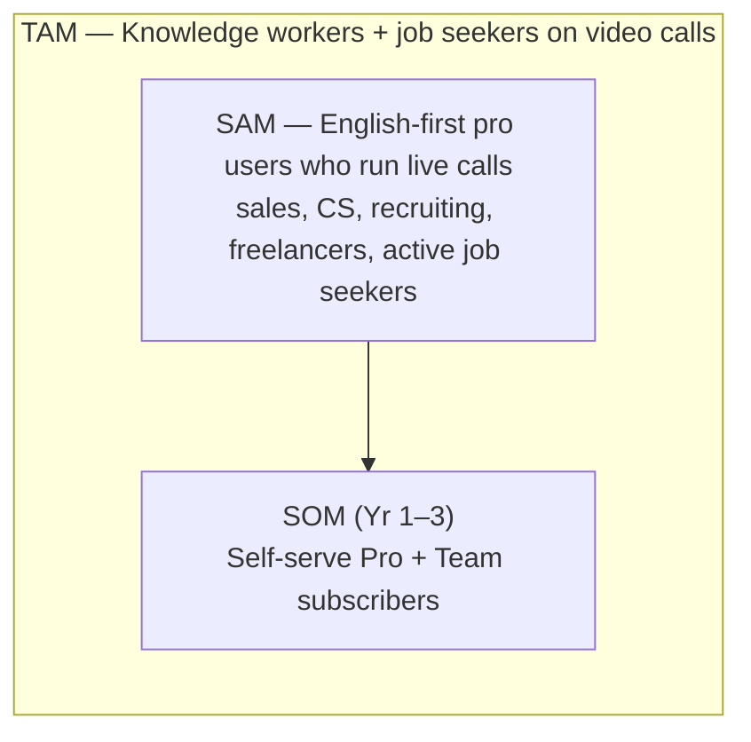
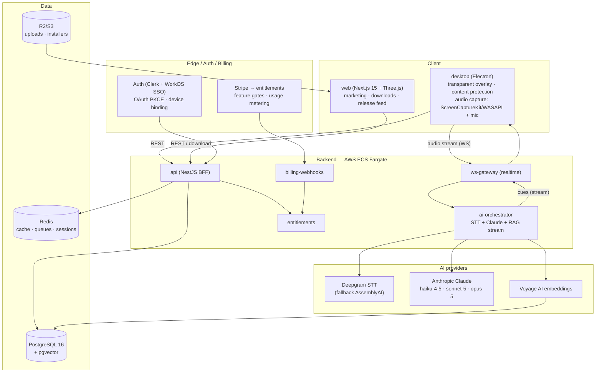

# Cue — Executive Summary

> Status: Draft · Owner: Founder / Principal Architect · Last updated: 2026-07-29 · Related: [Product Vision](01-product-vision.md) · [System Architecture](02-system-architecture.md) · [AI Pipeline](21-ai-pipeline.md) · [Unit Economics](71-unit-economics.md) · [Subscriptions & Entitlements](50-subscriptions-entitlements.md) · [Roadmap](80-roadmap.md)

> **Cue** is a provisional working title. All brand references in this plan are placeholders.

---

## 1. The one-paragraph pitch

**Cue is a cross-platform (macOS + Windows) real-time AI meeting and interview copilot.** It runs as a private, always-on-top, transparent teleprompter overlay on the user's own screen. Cue captures both sides of a live conversation (system/loopback audio + the user's microphone), transcribes it in under 300ms, and streams AI-generated cues, suggested talking points, and live notes into the overlay — visible **only to the user**. The overlay is excluded from screen capture and screen sharing (Zoom, Google Meet, Microsoft Teams, Webex) using the same OS-level content-protection APIs that password managers and banking apps rely on, so the user gets private, in-the-moment support without disrupting the call. Cue is built for interview **preparation and confidence**, sales and support copiloting, meeting note-taking, and accessibility (users with anxiety, ADHD, hearing difficulty, or non-native speakers).

---

## 2. The problem

Live conversations are high-stakes and unforgiving. People forget names, statistics, and product details under pressure; non-native speakers lose fluency in real time; neurodivergent and anxious users freeze; sales reps miss discovery cues; support agents scramble through knowledge bases while a customer waits on the line. Post-call note-takers (Otter, Fireflies, Gong) solve the *retrospective* problem — they tell you what happened *after* it happened. **Nobody helps you in the 800 milliseconds that actually matter: while you are still speaking.**

The three structural gaps:

| Gap | Status quo | Cost to the user |
|-----|-----------|------------------|
| **Latency** | Note-takers summarize post-hoc; browser copilots lag 3–5s | Advice arrives after the moment has passed |
| **Privacy** | Copilot windows appear on shared screens and in screen-share pickers | User can't use assistance on a shared call without exposing it |
| **Personalization** | Generic LLM answers with no grounding | Cues ignore the user's resume, deal context, or product docs |

Cue closes all three: **< 1.2s end-to-end p95**, hardware-level capture exclusion, and **RAG-grounded** cues built from the user's own documents.

---

## 3. Target market & TAM sketch

Cue sits at the intersection of two fast-growing categories: **AI meeting assistants** and **interview/career preparation**.

- **TAM (order-of-magnitude sketch).** ~1B+ knowledge workers globally spend meaningful time on video calls; ~250M+ job seekers cycle through interviews annually. A conservative addressable slice — English-first professionals who run recurring live calls plus active job seekers willing to pay for live assistance — is on the order of **80–120M individuals**. At a blended ~$180/yr realized ARPU that frames a **multi-billion-dollar TAM**.
- **SAM.** Sales reps, customer-success/support agents, recruiters, consultants, freelancers, and active interviewees on macOS/Windows — the wedge segments where live assistance has the clearest, immediate ROI.
- **SOM (Years 1–3).** Bottom-up self-serve conversion from the marketing site plus Team seats. The [Roadmap](80-roadmap.md) and [Unit Economics](71-unit-economics.md) carry the detailed bottom-up model; this doc states the framing only.

**Category name:** *AI meeting/interview copilots* — a real-time evolution of the AI-note-taker category, distinguished by in-the-moment guidance rather than retrospective summaries.

---

## 4. Competitive landscape

| Player | Category | Real-time cues? | Capture-excluded overlay? | RAG on user docs? | Native desktop |
|--------|----------|:---------------:|:-------------------------:|:-----------------:|:--------------:|
| **Cue** | Live copilot | **Yes (<1.2s p95)** | **Yes (OS-level)** | **Yes** | **Electron, mac+win** |
| Otter.ai / Fireflies / Fathom | Post-call notes | No | N/A | Partial | Web/bots |
| Gong / Chorus | Revenue intelligence | No (post-call coaching) | N/A | Deal data | Web |
| Read AI / tl;dv | Meeting summaries | Limited | No | No | Web/bots |
| "Interview cheat" browser tools | Interview assist | Some | No (visible on share) | Weak | Browser tabs |
| Generic LLM chat (Claude/ChatGPT app) | General | Manual copy-paste | No | Manual | Desktop apps |

**Where competitors are weak and Cue wins:** true sub-second real-time guidance, a genuinely private overlay that is invisible on shared screens *and* absent from screen-share source pickers, and cues grounded in the user's own resume / deal / knowledge base. Post-call note-takers are complements, not direct substitutes — Cue also produces summaries, but its differentiated value is *during* the call.

Detailed feature-by-feature differentiation lives in [Product Vision §5](01-product-vision.md).

---

## 5. Business model at a glance

**Freemium + usage-metered subscription.** A free tier drives top-of-funnel adoption; paid tiers unlock better models, RAG uploads, history, and team features; AI minutes beyond plan are metered as overage.

| Tier | Price | Live minutes | Models | RAG uploads | Key extras |
|------|-------|-------------|--------|:-----------:|-----------|
| **Free** | $0 | 60 min/mo | Haiku only | No | Basic overlay, note-taking |
| **Pro** | **$20/mo** | Generous | + Sonnet | Yes | History, deep-prep (Opus), 14-day trial |
| **Team** | **$30/user/mo** | Generous pooled | + Sonnet | Yes | Shared knowledge base, admin, SSO-lite |
| **Enterprise** | Custom | Custom | All | Yes | SSO/SAML/SCIM, SLA, DPA, on-prem STT option |

Annual billing = **2 months free**. Metered overage applies to minutes beyond plan. Stripe is the billing engine; a dedicated **entitlements** service is the single source of truth for feature gates. Full mechanics in [Subscriptions & Entitlements](50-subscriptions-entitlements.md) and [Payments / Stripe](51-payments-stripe.md).

---

## 6. The moat

Four reinforcing advantages, hardest-to-copy first:

1. **Latency engineering.** A purpose-built realtime pipeline — streaming STT with VAD, a `ws-gateway` for the audio→AI stream, Claude Haiku for ultra-low-latency cues, Anthropic prompt caching on the stable system prompt + user context — hits **< 1.2s p95 end-to-end**. This is a systems problem, not a feature; competitors bolting realtime onto web bots cannot easily match it. See [AI Pipeline](21-ai-pipeline.md).
2. **Content-protection UX.** A native Electron overlay that is invisible to screen capture (`setContentProtection(true)`, macOS `NSWindowSharingType=none`, Windows `WDA_EXCLUDEFROMCAPTURE`) *and* engineered to stay out of OS window-enumeration surfaces that screen-share pickers read. Getting this right across both OSes and across Zoom/Meet/Teams/Webex is a hard, ongoing engineering investment. See [Desktop App](10-desktop-app.md).
3. **RAG personalization.** Cues grounded in the user's resume, job description, deal notes, and product/knowledge base via pgvector + Voyage AI embeddings. The value compounds with every document and session a user adds — a personal-data flywheel and switching cost. See [Data Model](30-data-model.md).
4. **Distribution & product loop.** A high-craft Next.js + Three.js marketing site → signed installers → in-app auto-update feed, plus a freemium funnel and Team/Enterprise expansion. See [Web Landing](11-web-landing.md).

---

## 7. One-screen architecture overview

The authoritative version, with C4 views, sequence diagrams, and ADRs, lives in [System Architecture](02-system-architecture.md).

---

## 8. Key metrics & targets

**Non-functional (canonical):**

| Metric | Target |
|--------|--------|
| Live cue end-to-end latency (audio → visible cue) | **< 1.2s p95** |
| STT partial results | **< 300ms** |
| Backend API latency (excl. LLM) | **p99 < 200ms** |
| Uptime | **99.9%** |
| Overlay capture-invisibility | 100% across Zoom/Meet/Teams/Webex + full-screen recording, both OSes |

**Business / product (North-Star + guardrails):**

- **North Star:** weekly *assisted live minutes* per active user.
- Funnel: site → download → activation (first live session within 24h) → paid conversion → Pro→Team expansion.
- Guardrails: gross margin per paid user (see [Unit Economics](71-unit-economics.md)), free→paid conversion, logo & net-revenue retention, cost-per-assisted-minute (STT + LLM COGS).

---

## 9. Funding & team ask (sketch)

Indicative **seed raise** to reach a repeatable self-serve funnel and a defensible realtime pipeline:

| Area | Focus |
|------|-------|
| **Engineering** | Desktop (Electron/native capture) · realtime/AI pipeline · backend/infra · web · design |
| **AI/ML** | Latency + cost optimization, prompt/RAG quality, model routing |
| **GTM** | Self-serve growth, content, Team/Enterprise motion |
| **Ops/Legal** | SOC 2 Type II roadmap, DPA/consent tooling, compliance |

Use of funds: (1) hit and hold the latency + capture-exclusion targets across both OSes, (2) build the freemium→Team funnel, (3) SOC 2 Type II and enterprise readiness. Detailed hiring plan and milestones in [Roadmap](80-roadmap.md).

---

## 10. Risk snapshot

| Risk | Category | Mitigation | Owner doc |
|------|----------|-----------|-----------|
| **Platform capture-exclusion breaks** (OS update changes screen-share behavior) | Technical | Continuous cross-OS/app test matrix; graceful degradation + user warning | [Desktop App](10-desktop-app.md) |
| **Misuse for deceptive interviewing** | Ethical / brand | Acceptable-use policy, consent/"disclosed mode", positioning around prep & accessibility | [Product Vision](01-product-vision.md), legal/compliance audit |
| **Recording-consent law exposure** (two-party consent, GDPR) | Legal | Consent model, jurisdiction awareness, disclosed mode, data-retention controls | Legal/compliance audit, [Authentication](40-authentication.md) |
| **AI COGS erode margin** (LLM/STT minutes) | Financial | Model routing (Haiku default), prompt caching, usage metering + overage | [Unit Economics](71-unit-economics.md), [AI Pipeline](21-ai-pipeline.md) |
| **Latency target missed** | Technical | Purpose-built ws-gateway, VAD, streaming, regional deploys | [AI Pipeline](21-ai-pipeline.md), [Scalability](70-scalability.md) |
| **Incumbent adds realtime** | Market | Depth of latency + content-protection + RAG moat; move faster | [Roadmap](80-roadmap.md) |
| **Reliance on 3rd-party AI vendors** | Vendor | STT fallback (AssemblyAI), abstracted model routing | [AI Pipeline](21-ai-pipeline.md) |

---

## Open questions & risks

- **Brand.** "Cue" is provisional; trademark clearance and domain acquisition pending.
- **TAM precision.** Numbers here are order-of-magnitude framing, not a validated bottom-up model — the defensible version lives in [Unit Economics](71-unit-economics.md) and must be reconciled before any external fundraising deck cites them.
- **Regulatory trajectory.** Recording-consent and AI-disclosure law is evolving; the disclosed-mode default and jurisdiction handling may need to tighten. Owned by the legal/compliance audit.
- **Positioning tension.** The product must be marketed around preparation, confidence, and accessibility — *not* deception. This constrains some growth tactics; see [Product Vision](01-product-vision.md).
- **Platform dependency.** OS content-protection APIs and screen-share picker behavior can change without notice; a single OS update could regress the core privacy promise.
