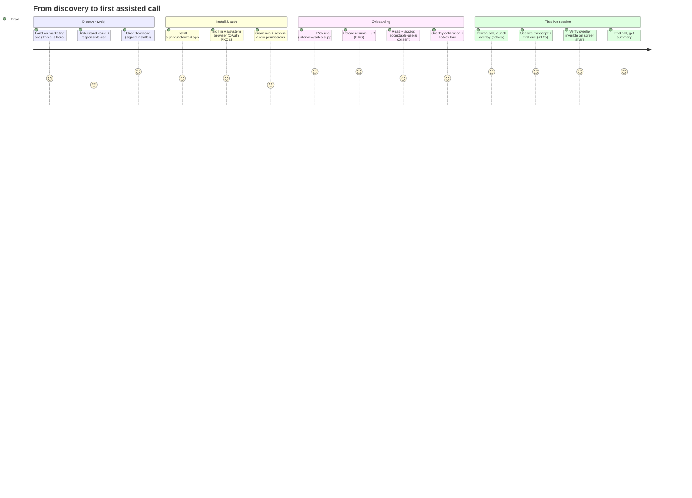

# AssistMe — Product Vision

> Status: Draft · Owner: Head of Product / Principal Architect · Last updated: 2026-07-29 · Related: [Executive Summary](00-executive-summary.md) · [System Architecture](02-system-architecture.md) · [Desktop App](10-desktop-app.md) · [AI Pipeline](21-ai-pipeline.md) · [Design System](12-design-system.md) · [Authentication & Consent](40-authentication.md) · [Subscriptions & Entitlements](50-subscriptions-entitlements.md)

> **AssistMe** (formerly Cue) is a provisional working title.

---

## 1. Vision

**AssistMe makes anyone more capable in the moments that matter — live.** It is a private AI copilot that listens to your conversation and quietly puts the right words, facts, and reminders in front of *you* — never the other party — with sub-second latency, grounded in what you actually know and care about.

Where the AI-note-taker category tells you what happened *after* a call, AssistMe helps you *during* it. Its guiding principle: **augment the person, don't replace them.** AssistMe is a teleprompter and a confidence rail, not a puppeteer. The product is designed, marketed, and governed around legitimate use — preparation, confidence, copiloting, note-taking, and accessibility — and explicitly *not* around deceiving another party.

---

## 2. Personas

### 2.1 Priya — the Job Seeker

- **Context:** Mid-career software engineer, actively interviewing, 3–4 video interviews/week. Non-native English speaker; strong skills but freezes on behavioral questions.
- **Goals:** Prepare thoroughly; recall her own STAR stories under pressure; stop blanking on "tell me about a time…"; sound articulate and calm.
- **Frustrations:** Generic prep guides don't reflect *her* resume or the specific JD; live nerves erase preparation.
- **How AssistMe helps:** Pre-interview **deep-prep** (Opus) generates likely questions from the JD + her resume; during the call, Haiku surfaces concise reminder cues ("You mentioned the migration project — quantify the impact: 40% latency drop") drawn from her uploaded stories. Post-call summary + self-review.
- **Responsible-use note:** AssistMe frames this as preparation and confidence support, and encourages disclosed mode where appropriate. It is a rail, not a script.

### 2.2 Marcus — the Sales Rep

- **Context:** AE running 6–8 discovery/demo calls a day on Zoom and Meet.
- **Goals:** Never miss a buying signal; recall pricing, competitor comparisons, and objection-handling on the fly; keep eye contact instead of digging through a wiki.
- **Frustrations:** Post-call tools (Gong) coach him *after* he lost the deal; alt-tabbing to a doc during a demo is obvious and breaks rapport.
- **How AssistMe helps:** RAG over the product knowledge base, battlecards, and pricing; live cues on objection handling and next-best-question; overlay invisible when he screen-shares the demo. Team plan shares the knowledge base across the sales org.

### 2.3 Aisha — the Support Agent

- **Context:** Tier-2 customer-support agent on live video/voice with enterprise customers.
- **Goals:** Resolve faster; surface the right KB article without dead air; stay consistent with policy.
- **Frustrations:** Searching the KB mid-call creates awkward silences; new agents don't yet know the product deeply.
- **How AssistMe helps:** Live transcript + RAG over the support KB surfaces the relevant procedure the instant the customer describes a symptom; suggested phrasing keeps tone consistent. Team knowledge base keeps the whole queue aligned.

### 2.4 Sam — the Accessibility User

- **Context:** Knowledge worker with ADHD and social anxiety; also represents non-native speakers and users with hearing difficulty.
- **Goals:** Follow fast-moving meetings; not lose the thread when attention drifts; have a live captioning + gentle prompting layer; reduce the cognitive load of "what do I say next."
- **Frustrations:** Meetings move faster than they can process; anxiety spikes when put on the spot; existing captioning is retrospective or clunky.
- **How AssistMe helps:** Live transcript as always-on captions; gentle, low-density cues that reduce panic; note-taking so they don't have to split attention. This persona is a **first-class design constraint** — see [Design System](12-design-system.md) for the accessibility-driven overlay UX (low-density, dyslexia-friendly type, adjustable opacity, reduced-motion).

---

## 3. Jobs to be done

| # | When I'm… | I want to… | So I can… | Primary persona |
|---|-----------|-----------|-----------|-----------------|
| J1 | About to interview | prep with questions tailored to the JD + my resume | walk in confident | Priya |
| J2 | Live in a hard conversation | get a concise, well-timed cue | respond well without freezing | All |
| J3 | On a sales call | recall pricing/objection answers instantly | keep momentum & rapport | Marcus |
| J4 | Supporting a customer | find the right procedure without dead air | resolve faster & consistently | Aisha |
| J5 | In a fast meeting | keep up and capture what matters | not lose the thread | Sam |
| J6 | After any call | get an accurate summary + action items | follow up reliably | All |
| J7 | On a shared screen | keep my assistance private | not disrupt or expose the call | Marcus, Priya |

---

## 4. Use cases (prioritized)

Prioritization = *value to wedge users × technical readiness × differentiation*.

| Priority | Use case | JTBD | Notes |
|----------|----------|------|-------|
| **P0** | Live cue overlay during a call | J2, J3, J4 | The core loop; hits the <1.2s p95 latency target — [AI Pipeline](21-ai-pipeline.md) |
| **P0** | Capture-excluded private overlay | J7 | Core moat; [Desktop App](10-desktop-app.md) |
| **P0** | Live transcript / captions | J5 | Foundation for cues + accessibility |
| **P1** | RAG over user docs (resume, JD, KB) | J1, J3, J4 | pgvector + Voyage; [Data Model](30-data-model.md) |
| **P1** | Deep-prep mode (pre-call, Opus) | J1 | Async, quality over latency |
| **P1** | Post-call summary + action items | J6 | Complements note-taker category |
| **P2** | Team shared knowledge base | J3, J4 | Team tier; expansion revenue |
| **P2** | Session history & self-review | J1, J6 | Retention driver (Pro+) |
| **P3** | Enterprise SSO/SCIM, on-prem STT | — | Enterprise tier; [Authentication](40-authentication.md) |

---

## 5. Differentiation

Against the *AI meeting/interview copilot* landscape (full table in [Executive Summary §4](00-executive-summary.md)):

| Dimension | AssistMe | Post-call note-takers | Browser interview tools | Generic LLM app |
|-----------|-----|----------------------|------------------------|-----------------|
| **Timing** | Real-time, <1.2s p95 | After the call | Laggy (3–5s) | Manual copy-paste |
| **Privacy on shared screen** | OS-level capture exclusion + absent from screen-share pickers | N/A (bots join) | Visible on share | Visible |
| **Personalization** | RAG on your resume/deal/KB | Partial | Weak | Manual context |
| **Native experience** | Electron overlay, mac + win, global shortcuts | Web/bot | Browser tab | Chat window |
| **Model quality/routing** | Claude Haiku→Sonnet→Opus routing + prompt caching | Varies | Varies | Single model |
| **Note-taking** | Yes (complementary) | Yes (their core) | No | No |

**One-line summary:** AssistMe is the only copilot that is *fast enough to help mid-sentence, private enough to use on a shared screen, and personal enough to know your material.*

---

## 6. In scope / out of scope

### In scope (v1)

- macOS + Windows desktop app (Electron) with transparent, always-on-top, content-protected overlay.
- System/loopback + mic audio capture; live streaming STT.
- Real-time cues (Haiku), balanced answers (Sonnet), deep-prep (Opus).
- RAG over user-uploaded documents.
- Post-call summaries and action items.
- Freemium + Pro/Team/Enterprise tiers; Stripe billing + usage metering.
- Consumer auth + enterprise SSO; desktop OAuth PKCE; OS-keychain token storage.
- Marketing website with signed-installer downloads + auto-update.
- Acceptable-use policy, consent model, and **disclosed mode**.

### Out of scope (v1)

- Mobile (iOS/Android) native apps — *later; see [Roadmap](80-roadmap.md).*
- Meeting-bot join model (AssistMe is client-side capture, not a bot in the room).
- Autonomous "agent" that speaks or acts on the user's behalf — AssistMe *suggests*, the human *decides*.
- Real-time voice cloning / avatar / deepfake features — deliberately excluded on ethical grounds.
- Full CRM/helpdesk replacement — AssistMe integrates with and complements these.
- Covert-by-design marketing or features that optimize for deceiving another party — **explicitly out of scope as a matter of principle.**

---

## 7. User journey — website → download → onboarding → first live session

**Flow notes:**

1. **Discover.** The Next.js + Three.js site ([Web Landing](11-web-landing.md)) communicates value and responsible use up front, then serves the correct signed installer (macOS `.dmg` / Windows `.exe`) from the latest release feed.
2. **Install & auth.** Installers are code-signed (Apple Developer ID + notarization; Windows OV/EV or Azure Trusted Signing). Auth uses OAuth 2.0 Authorization Code + PKCE via the system browser with a loopback/deep-link redirect; tokens land in the OS keychain with device binding ([Authentication](40-authentication.md)).
3. **Permissions.** The app requests microphone and system-audio capture with clear, honest explanations of what is captured and why.
4. **Onboarding.** Use-case selection tailors defaults; RAG uploads seed personalization; the user reads and accepts the acceptable-use policy and consent model (including the **disclosed-mode** choice) before first use. A short overlay + global-shortcut tour follows.
5. **First live session (activation moment).** The user starts a real call, triggers the overlay via global shortcut, sees a live transcript and their first grounded cue within the latency budget, and confirms the overlay is invisible when they share their screen. **Activation = first successful live session within 24h of install.**

---

## 8. Responsible use

AssistMe is built for legitimate assistance — interview **preparation** and confidence, sales/support copiloting, note-taking, and **accessibility** — and is deliberately *not* engineered or marketed to deceive another party. Screen-capture exclusion is a standard, legitimate OS capability (used by password managers, banking, and DRM apps) that we treat as a **privacy feature protecting the user's private notes**, not a tool for concealment from a conversation partner. Every deployment ships with an acceptable-use policy, a jurisdiction-aware consent/compliance model (recording-consent laws vary — two-party-consent states, GDPR, and similar regimes), a **disclosed mode** that supports transparency with the other party where appropriate or required, opt-out of model training, and data-retention/deletion controls. The full, authoritative treatment — acceptable-use policy text, consent UX, jurisdiction handling, and disclosed-mode mechanics — lives in the **legal/compliance audit** ([docs/audits/](audits/)) and the consent model in [Authentication & Consent](40-authentication.md); this section is a summary and defers to those documents.

---

## Open questions & risks

- **Disclosed-mode adoption.** How prominently should disclosed mode be defaulted or nudged? Balancing user autonomy against the ethical and legal case for transparency is unresolved — owned jointly with the legal/compliance audit.
- **Permissions friction.** macOS system-audio capture (ScreenCaptureKit / Core Audio taps) and screen/mic permissions add onboarding friction that could hurt activation; UX and fallbacks TBD with [Desktop App](10-desktop-app.md).
- **Cue density & trust.** Too many cues overwhelm (especially the accessibility persona); too few feel useless. The right default density and timing need live user research — see [Design System](12-design-system.md).
- **Persona focus for the wedge.** Which persona is the initial go-to-market wedge (job seekers vs. sales) is a strategic call carried by the [Roadmap](80-roadmap.md); the product must serve all four but launch narrative should lead with one.
- **Positioning discipline.** Sustained tension between growth incentives and the honest, prep/accessibility-first framing; requires explicit guardrails on marketing and feature choices.
