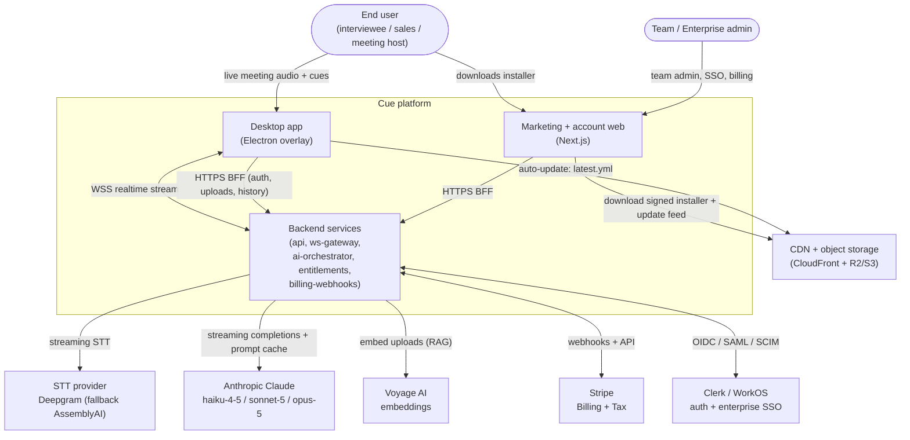
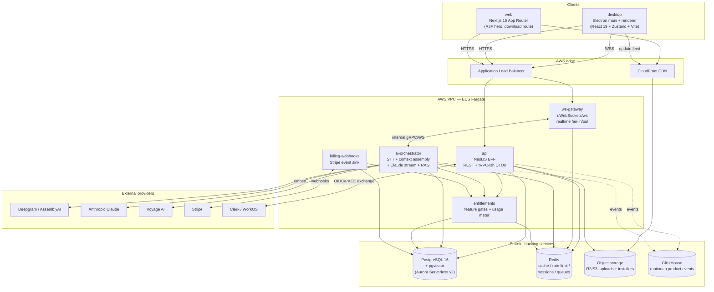
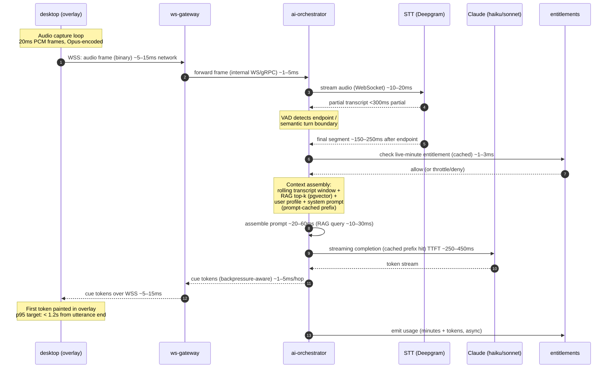

# System Architecture

> Status: Draft · Owner: Principal Architect (Platform) · Last updated: 2026-07-29 · Related: [Product vision](01-product-vision.md) · [Repository structure](03-repository-structure.md) · [Desktop app](10-desktop-app.md) · [Backend services](20-backend-services.md) · [AI pipeline](21-ai-pipeline.md) · [Data model](30-data-model.md) · [Authentication](40-authentication.md) · [Entitlements](50-subscriptions-entitlements.md) · [Observability](61-observability.md) · [Scalability](70-scalability.md)

This is the authoritative high-level architecture for **Cue** (provisional brand), a cross-platform real-time AI meeting & interview copilot. It defines the system boundaries, the services and their contracts, the critical real-time data flow with its latency budget, the cross-cutting concerns every service inherits, and the load-bearing architecture decisions (ADRs). Each subsystem links to the doc that owns its detail — this doc does not duplicate them.

---

## 1. Architectural principles

1. **Latency is the product.** The end-to-end path from spoken audio to a visible cue in the overlay is the primary SLO (< 1.2s p95). Every architectural choice — transport, service placement, model routing, streaming — is judged first by its latency cost. See the budget in §5.
2. **Privacy by construction.** The overlay is invisible to screen capture at the OS level, audio is processed in-flight and retained only per the user's data-retention policy, and model-training opt-out is the default. Owned by [Legal/Compliance](01-product-vision.md#responsible-use) and [Data model](30-data-model.md#data-lifecycle).
3. **Stateless edges, stateful core.** `api`, `ws-gateway`, and `ai-orchestrator` are horizontally scalable and hold no durable state; all durable state lives in Postgres, Redis, and object storage.
4. **BFF, not a monolith gateway.** `api` (NestJS) is a Backend-for-Frontend that both desktop and web talk to for CRUD, auth exchange, uploads, and entitlement checks. The realtime path deliberately bypasses it (see ADR-003).
5. **Entitlements are the single source of truth for what a user may do.** Stripe → `billing-webhooks` → `entitlements` → cached gate. No service reads Stripe directly. See [Entitlements](50-subscriptions-entitlements.md).
6. **Contracts before code.** All inter-service and client DTOs live in `packages/types`; the typed client lives in `packages/sdk`. See [Repository structure](03-repository-structure.md).

---

## 2. System context (C4 L1)

**Trust boundaries.** The desktop app and web app are untrusted clients; every request crosses an authenticated boundary into the backend VPC. STT, Claude, Voyage, Stripe, and the IdP are external third parties reached over TLS with credentials held in AWS Secrets Manager. The overlay's content-protection is a client-side OS capability and is described in [Desktop app](10-desktop-app.md#content-protection).

---

## 3. Container / component view (C4 L2)

### 3.1 Service responsibilities & ownership

| Service | Responsibility | Stateful deps | Owning doc |
|---|---|---|---|
| `desktop` | Overlay UI, audio capture (system loopback + mic), global shortcuts, content protection, auto-update, keychain token storage | OS keychain | [10-desktop-app.md](10-desktop-app.md) |
| `web` | Marketing site, 3D hero, download flow, account/billing portal launch | — | [11-web-landing.md](11-web-landing.md) |
| `api` (NestJS BFF) | Auth exchange, CRUD (profile, sessions, history, uploads presign), entitlement reads, RAG doc ingestion trigger | Postgres, Redis, R2/S3 | [20-backend-services.md](20-backend-services.md) |
| `ws-gateway` | Terminate client WebSocket, authenticate stream, backpressure, fan audio frames to `ai-orchestrator`, fan cues back | Redis (session, presence) | [20-backend-services.md](20-backend-services.md#ws-gateway) |
| `ai-orchestrator` | STT streaming, VAD, context assembly (transcript + RAG + profile), Claude model routing + streaming, prompt caching, usage emission | Postgres/pgvector, Redis | [21-ai-pipeline.md](21-ai-pipeline.md) |
| `entitlements` | Source of truth for feature gates & usage limits, minute/token metering | Postgres, Redis | [50-subscriptions-entitlements.md](50-subscriptions-entitlements.md) |
| `billing-webhooks` | Ingest Stripe events idempotently, drive entitlement state transitions | Postgres | [51-payments-stripe.md](51-payments-stripe.md) |

> Deployment topology, autoscaling, and multi-region placement (us-east-1 + eu-west-1 for residency) are owned by [DevOps/Infrastructure](60-devops-infrastructure.md) and [Scalability](70-scalability.md). This doc defines the logical containers only.

---

## 4. Critical real-time data flow (the < 1.2s p95 path)

This is the flow that defines the product. Audio frames leave the desktop, are transcribed, assembled into a context-rich prompt, sent to Claude, and streamed back as cue tokens into the overlay — all within a p95 budget of 1.2 seconds from utterance-end to first visible cue token.

### 4.1 Latency budget per hop (p95)

| Hop | Component | Target | Notes |
|---|---|---|---|
| Audio uplink | desktop → ws-gateway (WSS) | 5–15 ms | Opus frames, regional edge |
| Internal forward | ws-gateway → ai-orchestrator | 1–5 ms | Same VPC/AZ affinity |
| STT partial | Deepgram streaming | < 300 ms | Partial results, not final |
| STT final segment | endpointing after utterance | 150–250 ms | VAD + Deepgram endpointing |
| Entitlement check | cached in Redis | 1–3 ms | Cache miss → Postgres ~10ms |
| Context assembly | RAG (pgvector) + profile + window | 20–60 ms | Prompt-cached stable prefix |
| Claude TTFT | haiku-4-5 (live) / sonnet-5 | 250–450 ms | Cache hit lowers input cost + TTFT |
| Cue downlink | ai-orchestrator → gateway → desktop | 6–20 ms | Streamed token-by-token |
| **End-to-end p95** | **utterance end → first visible cue token** | **< 1.2 s** | Detailed budgeting owned by [AI pipeline](21-ai-pipeline.md#latency-budget) |

**Design consequences of the budget.**
- Model routing defaults to **claude-haiku-4-5** for live cues (lowest TTFT); `sonnet-5` is used for higher-quality suggested answers where the user tolerates slightly more latency, and `opus-5` is reserved for asynchronous deep-prep/analysis. See ADR-005 and [AI pipeline](21-ai-pipeline.md#model-routing).
- The **stable system prompt + user profile is prompt-cached** so cache-hit requests both cut input cost and reduce time-to-first-token.
- `ws-gateway` and `ai-orchestrator` are co-located in the same region/AZ group as the user's session to keep internal hops single-digit-millisecond.
- Entitlement checks on the hot path **must** be Redis-cache reads; a Postgres round-trip is a fallback, never the norm.

---

## 5. Cross-cutting concerns

Every service inherits these. They are defined once here and referenced (not re-specified) by subsystem docs.

### 5.1 Authentication & authorization
- Consumer auth via **Clerk** (or Auth.js), enterprise SSO/SAML/SCIM via **WorkOS**. Desktop uses **OAuth 2.0 Authorization Code + PKCE** through the system browser with a loopback/deep-link redirect; tokens (access + refresh) are stored in the **OS keychain** via Electron `safeStorage`/`keytar`. Device binding ties refresh tokens to a device fingerprint.
- `api` performs the token exchange; `ws-gateway` authenticates the WebSocket handshake with a short-lived signed ticket minted by `api` (never the raw refresh token). RBAC with an org/team model; optional TOTP 2FA. Full spec: [Authentication](40-authentication.md).

### 5.2 Configuration & secrets
- Twelve-factor: config via env vars, validated at boot with a zod schema in each service (`packages/config` provides shared schemas). Secrets in **AWS Secrets Manager**, injected as env at task start; no secrets in images or repo. Envs: `dev` / `staging` / `prod`. See [DevOps](60-devops-infrastructure.md#config--secrets).

### 5.3 Error handling & resilience
- Structured error taxonomy in `packages/core` (`AppError` with `code`, `httpStatus`, `retryable`, `cause`). API returns RFC 7807 problem+json. Realtime errors are pushed as typed `cue.error` frames so the overlay degrades gracefully (e.g. shows "reconnecting" rather than freezing).
- **Provider failover:** STT falls over Deepgram → AssemblyAI on stream error/timeout; Claude requests retry with jittered backoff and, on sustained failure, downgrade model tier before failing the cue. Circuit breakers per external dependency.
- Timeouts + budgets: any hop exceeding its latency budget by 3x is cancelled and surfaces a degraded cue rather than blocking the stream.

### 5.4 Idempotency
- All mutating `api` endpoints accept an `Idempotency-Key` header; keys are stored in Redis with the response for a 24h window.
- `billing-webhooks` dedupes on Stripe `event.id` (unique constraint in Postgres) — a replayed webhook is a no-op. See [Payments](51-payments-stripe.md#idempotency).
- Usage emission from `ai-orchestrator` is idempotent per `(sessionId, meterWindow)`.

### 5.5 Observability
- OpenTelemetry trace context propagates from the desktop client through `ws-gateway` → `ai-orchestrator` → external providers, so a single cue is one distributed trace. Sentry for errors (desktop/web/backend), PostHog for product analytics + feature flags, Prometheus/Grafana for infra, pino structured logs → CloudWatch/Loki. SLOs (latency, uptime 99.9%) defined in [Observability](61-observability.md).

### 5.6 Data protection & compliance
- TLS everywhere, encryption at rest, PII minimization, GDPR/CCPA, data-retention + deletion, model-training opt-out by default. Recording-consent model and "disclosed mode" are owned by the compliance layer summarized in [Product vision](01-product-vision.md#responsible-use). Data lifecycle DDL in [Data model](30-data-model.md).

---

## 6. Architecture Decision Records

### ADR-001 — Monorepo: pnpm workspaces + Turborepo
- **Decision:** Single monorepo managed with pnpm workspaces and Turborepo, TypeScript everywhere, Node 22 LTS.
- **Context:** Desktop, web, five backend services, and five shared packages share DTOs, the API client, design tokens, and domain logic. Cross-cutting contract changes must land atomically.
- **Alternatives considered:** Polyrepo per service (independent deploys, but painful contract versioning + duplicated tooling); Nx (heavier, more opinionated generators); Bazel (overkill, steep ramp).
- **Trade-offs:** Monorepo gives atomic contract changes and one CI graph, at the cost of needing remote caching and careful task pipelining to keep CI fast. Turborepo's remote cache mitigates this.
- **Consequence:** `packages/types` is the shared contract; Turbo pipeline enforces build/test ordering. Layout in [Repository structure](03-repository-structure.md).

### ADR-002 — NestJS for the BFF, not raw Fastify
- **Decision:** `api` is built on NestJS (which runs a Fastify adapter under the hood).
- **Context:** The BFF needs modular boundaries (auth, uploads, sessions, entitlement reads), DI for testability, guards/interceptors for cross-cutting auth + idempotency, and a large team-friendly structure.
- **Alternatives considered:** Bare Fastify (lowest overhead, but we'd rebuild DI, module boundaries, and guards by hand); Express (slower, less typed); tRPC-only (great DX but weaker for file uploads, webhooks, and enterprise REST needs).
- **Trade-offs:** NestJS adds a thin abstraction cost and some startup overhead; we accept it because the BFF is *not* on the sub-1.2s hot path (that path is `ws-gateway` + `ai-orchestrator`, which are lean). Where raw throughput matters we use the Fastify adapter and keep handlers thin.
- **Consequence:** `api` favors clarity/structure; latency-critical realtime services stay minimal (ADR-003).

### ADR-003 — Realtime transport: WebSocket, not WebRTC datachannel (v1)
- **Decision:** The live audio→cue stream uses a **WebSocket** (WSS) connection to `ws-gateway`, carrying Opus-encoded audio frames up and cue tokens down. WebRTC datachannel is deferred.
- **Context:** We need a low-latency bidirectional stream from an Electron client to our backend. Two viable transports: raw WebSocket vs WebRTC (SCTP datachannel + optionally Opus over media tracks).
- **Alternatives considered:** WebRTC datachannel (sub-100ms, NAT traversal, congestion control — but requires STUN/TURN infra, SFU or peer setup, and far more operational complexity for a client→server topology); gRPC streaming (great server-to-server, awkward from a browser/Electron renderer, needs grpc-web proxying); plain HTTP chunked/SSE (SSE is one-directional, unsuitable for continuous audio upload).
- **Trade-offs:** WebSocket adds a few ms vs WebRTC and lacks built-in congestion control, but our path is client→server (no peer mesh), so WebRTC's strengths are largely wasted while its operational cost (TURN, ICE) is fully paid. WebSocket comfortably fits the latency budget in §4.1.
- **Consequence:** `ws-gateway` runs on uWebSockets/ws for high connection density; audio is Opus-encoded to cut uplink bytes. WebRTC is revisited only if we later need peer-to-peer or in-browser capture without an app. Detail in [Backend services](20-backend-services.md#ws-gateway).

### ADR-004 — STT provider: Deepgram primary, AssemblyAI fallback
- **Decision:** Streaming STT via **Deepgram** with automatic failover to **AssemblyAI**.
- **Context:** The transcript is on the hot path; partial results must land < 300ms and endpointing must be fast and accurate across accents and non-native speakers (a core persona).
- **Alternatives considered:** Whisper self-hosted (no per-minute vendor cost and full control, but we'd own GPU capacity, autoscaling, and streaming endpointing — high ops burden, worse cold-start latency); AssemblyAI as primary (strong accuracy, chosen instead as the resilience fallback); cloud-native STT (AWS Transcribe / Google) — good but weaker streaming latency/endpointing tuning for our use.
- **Trade-offs:** Managed STT is a per-minute COGS line (modeled in [Unit economics](71-unit-economics.md)) but removes GPU ops and delivers the streaming latency we need on day one. Dual-provider adds an abstraction layer in `ai-orchestrator`.
- **Consequence:** `ai-orchestrator` has a provider-agnostic STT interface with health-based failover; an on-prem/self-hosted STT option is offered to Enterprise (see [Product vision](01-product-vision.md)).

### ADR-005 — Claude model routing by task class
- **Decision:** Route by task: **claude-haiku-4-5** for ultra-low-latency live cues, **claude-sonnet-5** for balanced-quality real-time suggested answers, **claude-opus-5** for asynchronous deep prep/analysis and hard reasoning. Default the live overlay to Haiku.
- **Context:** Latency, quality, and cost trade off directly. The live cue path is TTFT-bound; deep prep is quality-bound and off the hot path.
- **Alternatives considered:** Single model for everything (either too slow/expensive with Opus everywhere, or under-powered with Haiku everywhere); a self-hosted small model for cues (loses quality and adds GPU ops).
- **Trade-offs:** Multi-model routing adds a routing layer and per-tier prompt tuning, but is the only way to hit both the latency budget and the margin targets. Prices (per 1M in/out): Haiku $1/$5, Sonnet $3/$15 (intro $2/$10 through 2026-08-31), Opus $5/$25.
- **Consequence:** Routing logic + prompt caching live in `ai-orchestrator`; entitlement tier gates which models a plan may use (Free = Haiku only). See [AI pipeline](21-ai-pipeline.md#model-routing) and [Entitlements](50-subscriptions-entitlements.md).

### ADR-006 — Desktop shell: Electron, not native per-OS
- **Decision:** Build the desktop app on **Electron** (electron-builder + electron-updater), renderer in React 19 + Vite + Zustand.
- **Context:** We need macOS + Windows parity fast, a rich overlay UI, auto-update, and access to OS content-protection + system-audio capture APIs.
- **Alternatives considered:** Fully native (Swift/AppKit + WinUI) — best performance and smallest footprint, but doubles the UI codebase and slows iteration; Tauri (smaller binaries, Rust core) — attractive, but weaker mature ecosystem for our specific system-audio + content-protection needs and a Rust skills dependency; Flutter desktop (immature for these OS integrations).
- **Trade-offs:** Electron carries memory/binary overhead and requires native modules for content protection and audio capture (`setContentProtection`, `NSWindowSharingType=none`, `SetWindowDisplayAffinity`, ScreenCaptureKit/WASAPI). We accept the footprint for one shared TypeScript UI, fast iteration, and mature signing/updater tooling.
- **Consequence:** OS-specific behavior is isolated in native modules behind a TS interface; the renderer stays cross-platform. Full detail in [Desktop app](10-desktop-app.md).

---

## 7. Environments & release topology (summary)

Three environments (`dev` / `staging` / `prod`), AWS primary in `us-east-1` with `eu-west-1` for EU data residency. Services run on ECS Fargate behind an ALB; CloudFront fronts static + installer artifacts; blue-green/canary deploys. The desktop release pipeline (electron-builder → code signing/notarization → publish `latest.yml`/`latest-mac.yml` to R2/S3 + CDN → electron-updater) is owned by [DevOps/Infrastructure](60-devops-infrastructure.md#release-pipeline). This section is a pointer, not the spec.

---

## Open questions & risks

- **Regional session affinity vs. global roaming.** Co-locating `ws-gateway` + `ai-orchestrator` with the user is required for the latency budget, but a user traveling between regions mid-session complicates routing. Proposal: pin a session to its origin region; revisit if churn shows measurable pain.
- **STT dual-provider drift.** Deepgram and AssemblyAI differ in endpointing/word-timing semantics; the abstraction must normalize both without leaking provider quirks into cue timing. Needs a conformance test suite (owned by [AI pipeline](21-ai-pipeline.md)).
- **WebSocket congestion control.** WebSocket lacks WebRTC's built-in congestion control; on poor networks we must implement app-level backpressure and adaptive audio bitrate in `ws-gateway`. Validate against real-world lossy links before GA.
- **Prompt-cache invalidation.** When a user updates their profile/RAG docs mid-session, the cached prompt prefix must invalidate cleanly without a latency spike. Cache-key strategy owned by [AI pipeline](21-ai-pipeline.md).
- **Entitlement cache staleness on the hot path.** A downgrade/cancel must revoke access quickly, but the hot path reads a Redis cache. Define max acceptable staleness (proposal: ≤ 60s TTL + explicit invalidation on webhook) with [Entitlements](50-subscriptions-entitlements.md).
- **Electron footprint on low-end machines.** Memory/CPU during live capture on older laptops could compete with the meeting app itself; needs profiling and a low-resource mode ([Desktop app](10-desktop-app.md)).
