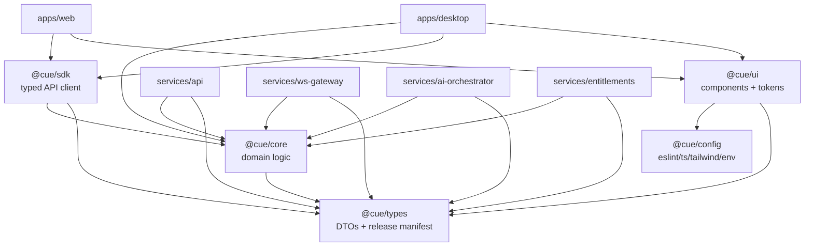

# Repository Structure

> Status: Draft · Owner: Principal Architect (Platform) · Last updated: 2026-07-29 · Related: [System architecture](02-system-architecture.md) · [Desktop app](10-desktop-app.md) · [Web landing](11-web-landing.md) · [Design system](12-design-system.md) · [Engineering standards](13-engineering-standards.md) · [Backend services](20-backend-services.md) · [DevOps](60-devops-infrastructure.md)

This doc defines the **Cue** monorepo layout, its pnpm + Turborepo tooling, package-boundary rules, the shared TypeScript config, and — critically — how the house code-splitting standard (`types.ts` / `utils.ts` / `hooks/use-*.ts` / focused components, files under 700 LOC, pages orchestrate) maps concretely onto each app. It complements [Engineering standards](13-engineering-standards.md) (which owns testing, review, branching, CI gates) — this doc owns *where code lives and why*.

---

## 1. Top-level layout

```text
cue/
├── apps/
│   ├── desktop/                 # Electron app (main + renderer)
│   └── web/                     # Next.js 15 marketing + account site
├── services/
│   ├── api/                     # NestJS BFF
│   ├── ws-gateway/              # realtime WebSocket gateway (uWebSockets/ws)
│   ├── ai-orchestrator/         # STT + context assembly + Claude stream + RAG
│   └── entitlements/            # feature gates + usage metering
│       # (billing-webhooks lives as a module inside `api` in v1 — see §6)
├── packages/
│   ├── ui/                      # shared React components + design tokens
│   ├── types/                   # shared DTOs + release-manifest contract
│   ├── config/                  # eslint / ts / tailwind / zod env schemas
│   ├── sdk/                     # typed API client (wraps `types`)
│   └── core/                    # shared domain logic (errors, entitlements calc, prompt utils)
├── infra/
│   ├── terraform/               # AWS IaC (ecs, alb, aurora, redis, r2/s3, route53, cdn)
│   ├── docker/                  # base images + compose for local dev
│   └── github/                  # reusable GitHub Actions workflow fragments
├── docs/                        # this architecture + business plan
├── .github/workflows/           # CI/CD entrypoints
├── turbo.json                   # Turborepo pipeline
├── pnpm-workspace.yaml          # workspace globs
├── package.json                 # root scripts + devDependencies
├── tsconfig.base.json           # shared TS compiler options
└── .npmrc                       # pnpm settings (strict peer deps, etc.)
```

**Layering rule (enforced, see §4):** dependencies point *inward* — `apps/*` and `services/*` may depend on `packages/*`, but never on each other; `packages/*` may depend on other `packages/*` only along the allowed graph (`ui`, `sdk`, `core` → `types`, `config`).

---

## 2. Workspace & pipeline config

### 2.1 `pnpm-workspace.yaml`

```yaml
packages:
  - "apps/*"
  - "services/*"
  - "packages/*"
```

### 2.2 `turbo.json`

```json
{
  "$schema": "https://turbo.build/schema.json",
  "globalDependencies": ["tsconfig.base.json", ".npmrc"],
  "globalEnv": ["NODE_ENV"],
  "tasks": {
    "build": {
      "dependsOn": ["^build"],
      "outputs": ["dist/**", ".next/**", "!.next/cache/**", "out/**"]
    },
    "typecheck": {
      "dependsOn": ["^build"],
      "outputs": []
    },
    "lint": {
      "outputs": []
    },
    "test": {
      "dependsOn": ["^build"],
      "outputs": ["coverage/**"]
    },
    "dev": {
      "cache": false,
      "persistent": true
    },
    "desktop#package": {
      "dependsOn": ["^build", "build"],
      "outputs": ["release/**"],
      "env": ["APPLE_ID", "APPLE_TEAM_ID", "CSC_LINK", "WIN_CSC_LINK"]
    }
  }
}
```

- `^build` means "build my dependencies first" — this is how `packages/types` builds before anything that imports it.
- `desktop#package` is the electron-builder + signing task; its secrets are declared in `env` so Turbo cache keys account for them. The release pipeline itself is owned by [DevOps](60-devops-infrastructure.md#release-pipeline).
- Remote caching (Turbo) is enabled in CI so unchanged packages are never rebuilt. CI gate detail: [Engineering standards](13-engineering-standards.md#ci-gates).

### 2.3 Root `package.json` (excerpt)

```json
{
  "name": "cue",
  "private": true,
  "packageManager": "pnpm@9",
  "engines": { "node": ">=22 <23" },
  "scripts": {
    "build": "turbo run build",
    "dev": "turbo run dev",
    "lint": "turbo run lint",
    "typecheck": "turbo run typecheck",
    "test": "turbo run test"
  },
  "devDependencies": {
    "turbo": "^2",
    "typescript": "^5.6",
    "@cue/config": "workspace:*"
  }
}
```

Internal packages are referenced with the `workspace:*` protocol, e.g. `"@cue/types": "workspace:*"`.

---

## 3. Shared TypeScript config

### 3.1 `tsconfig.base.json`

```json
{
  "compilerOptions": {
    "target": "ES2023",
    "module": "ESNext",
    "moduleResolution": "Bundler",
    "lib": ["ES2023", "DOM", "DOM.Iterable"],
    "strict": true,
    "noUncheckedIndexedAccess": true,
    "exactOptionalPropertyTypes": true,
    "noImplicitOverride": true,
    "verbatimModuleSyntax": true,
    "isolatedModules": true,
    "skipLibCheck": true,
    "declaration": true,
    "composite": true,
    "resolveJsonModule": true,
    "esModuleInterop": true
  }
}
```

`strict` + `noUncheckedIndexedAccess` + `exactOptionalPropertyTypes` enforce the house rule of strong types / avoiding `any`. Each package/app has a thin `tsconfig.json` that extends this and sets `rootDir`/`outDir`. Node services add `"lib": ["ES2023"]` only (drop DOM). ESLint config in `packages/config` bans `any` (`@typescript-eslint/no-explicit-any`) and enforces the file-size and boundary rules (§4).

---

## 4. Package boundaries & dependency rules



| Package | Purpose | May depend on | Must NOT |
|---|---|---|---|
| `@cue/types` | Pure TS types: API DTOs, WS frame contracts, release manifest (`latest.yml` shape) | (nothing — leaf) | import runtime code |
| `@cue/config` | Shared eslint/tsconfig/tailwind presets + zod env schemas | — | contain feature logic |
| `@cue/core` | Framework-agnostic domain logic: error taxonomy, entitlement math, prompt/context helpers | `types` | import React, Nest, or Electron |
| `@cue/sdk` | Typed HTTP/WS client used by both clients | `types`, `core` | import UI |
| `@cue/ui` | Shared React 19 components + design tokens | `types`, `config` | import server/Node-only code |
| `apps/*`, `services/*` | Deployables | any `packages/*` | import another app/service |

**Enforcement:** an ESLint boundary rule (`eslint-plugin-boundaries` / import-restriction rules in `@cue/config`) fails CI on any illegal edge. The rule set encodes the table above. See [Engineering standards](13-engineering-standards.md).

---

## 5. Code-splitting standard mapped onto each app

The house rule: **no file over 700 LOC; split into `types.ts` / `utils.ts` / `hooks/use-*.ts` / focused components; the page/entry orchestrates while logic lives in hooks and utils.** Here is how that maps concretely.

### 5.1 Desktop overlay feature (React renderer)

A feature is a self-contained folder. Example: the **live cue overlay** feature.

```text
apps/desktop/src/renderer/features/live-cue/
├── index.ts                     # public surface of the feature (barrel)
├── types.ts                     # LiveCueState, CueFrame, OverlayConfig (imports @cue/types)
├── utils.ts                     # pure helpers: formatCue(), groupTokens(), estimateReadTime()
├── constants.ts                 # shortcut keys, opacity presets, poll intervals
├── hooks/
│   ├── use-cue-stream.ts        # subscribe to WS cue frames via @cue/sdk, expose tokens
│   ├── use-overlay-visibility.ts# global-shortcut show/hide + content-protection toggle
│   ├── use-audio-capture.ts     # bridge to main-process audio capture over IPC
│   └── use-autoscroll.ts        # teleprompter scroll behavior
├── store.ts                     # Zustand slice for this feature (transient UI state only)
├── components/
│   ├── CueOverlay.tsx           # orchestrator: composes the pieces, no business logic
│   ├── CueStream.tsx            # renders streamed tokens
│   ├── CueToolbar.tsx           # opacity / mode / disclosed-mode controls
│   └── ConnectionBadge.tsx      # reconnecting / degraded indicators
└── live-cue.test.ts             # unit tests for utils + hooks
```

- `CueOverlay.tsx` is the **page-equivalent orchestrator**: it wires hooks to components and holds no domain logic.
- All STT/Claude/entitlement logic is server-side (`ai-orchestrator`); the renderer only consumes cue frames via `@cue/sdk` — keeping renderer files small and the hot path lean (see [System architecture](02-system-architecture.md#critical-real-time-data-flow)).
- Main-process concerns (content protection, native audio modules, updater, keychain) live under `apps/desktop/src/main/` with a mirrored structure and a typed IPC contract in `@cue/types`. Detail: [Desktop app](10-desktop-app.md).

```text
apps/desktop/src/main/
├── windows/overlay-window.ts    # BrowserWindow + setContentProtection(true)
├── audio/                       # native capture bridge (ScreenCaptureKit / WASAPI)
│   ├── index.ts
│   ├── types.ts
│   └── mac.native.ts / win.native.ts
├── ipc/                         # typed IPC handlers (contract from @cue/types)
├── updater/                     # electron-updater wiring (consumes latest.yml)
└── security/keychain.ts         # safeStorage/keytar token vault
```

### 5.2 Web feature (Next.js App Router)

Example: the **download** feature (marketing → signed installer + release feed).

```text
apps/web/src/features/download/
├── types.ts                     # DownloadTarget, ReleaseManifest (re-exports @cue/types)
├── utils.ts                     # detectOS(), pickInstaller(), formatVersion()
├── hooks/
│   └── use-latest-release.ts    # client hook: fetch latest signed release via @cue/sdk
├── components/
│   ├── DownloadHero.tsx         # presentational
│   ├── OsPicker.tsx             # mac / windows selector
│   └── DownloadButton.tsx
└── download.test.ts

apps/web/src/app/
├── (marketing)/page.tsx         # orchestrates: composes DownloadHero + 3D hero, no logic
├── download/page.tsx            # orchestrates download feature
└── api/releases/latest/route.ts # reads latest signed release manifest from R2/S3
```

- The 3D hero (`@react-three/fiber` + `drei`) is imported **client-only** via `next/dynamic({ ssr: false })` from a `components/` file; the `page.tsx` only orchestrates. Detail: [Web landing](11-web-landing.md).
- Shared visual components (buttons, cards, tokens) come from `@cue/ui`; the design language is owned by [Design system](12-design-system.md).

### 5.3 Backend service feature (NestJS module)

NestJS modules already enforce a page-orchestrates-style split; we align file naming with the house rule.

```text
services/api/src/modules/sessions/
├── sessions.module.ts           # wiring (the "orchestrator")
├── sessions.controller.ts       # thin: validation + delegation
├── sessions.service.ts          # business logic
├── sessions.repository.ts       # Drizzle queries only
├── dto/                         # request/response DTOs (extend @cue/types)
├── sessions.types.ts            # internal types
├── sessions.utils.ts            # pure helpers
└── sessions.service.spec.ts
```

`ws-gateway` and `ai-orchestrator` are leaner (latency-critical): a `src/` with `handlers/`, `pipeline/` (STT → context-assembly → Claude), `providers/` (Deepgram/AssemblyAI/Claude/Voyage adapters), `types.ts`, and `utils.ts`. Service internals owned by [Backend services](20-backend-services.md) and [AI pipeline](21-ai-pipeline.md).

---

## 6. Conventions

- **Naming:** internal packages are `@cue/<name>`; deployables are unscoped folder names. Files use kebab-case except React components (PascalCase `.tsx`).
- **Barrels:** each feature folder exposes a single `index.ts`; deep imports across features are lint-blocked.
- **`billing-webhooks`:** in v1 it ships as a dedicated NestJS module inside `services/api` (its own route + Stripe signature verification), extractable into a standalone service if webhook volume warrants. Canonical service name is preserved in [System architecture](02-system-architecture.md) and [Payments](51-payments-stripe.md).
- **Tests co-located** with source (`*.test.ts` / `*.spec.ts`); coverage gates in [Engineering standards](13-engineering-standards.md).
- **Env validation:** every deployable validates `process.env` against a zod schema from `@cue/config` at boot; missing/invalid config fails fast.
- **Migrations:** Drizzle Kit migrations live under `services/api/drizzle/` (single owner of schema); other services read via `@cue/core` repositories. Schema owned by [Data model](30-data-model.md).

---

## Open questions & risks

- **billing-webhooks split timing.** Keeping it inside `api` simplifies v1 but couples webhook availability to BFF deploys; define the volume/latency threshold that triggers extraction to a standalone `services/billing-webhooks`.
- **Shared `@cue/core` bloat.** "Domain logic" can become a dumping ground. Needs a periodic boundary audit (owned by [Engineering standards](13-engineering-standards.md)) to keep it framework-agnostic and cohesive.
- **Native module builds in CI.** Desktop native audio/content-protection modules must build for macOS + Windows runners; cross-compilation and signing secrets complicate the Turbo cache. Validate cache correctness for `desktop#package`.
- **700-LOC rule vs. generated code.** Drizzle/OpenAPI-generated files can exceed 700 LOC; the lint rule must exempt generated dirs without becoming a loophole.
- **Single schema owner.** Routing all migrations through `services/api/drizzle` keeps one source of truth but can bottleneck teams; revisit if service teams need independent schema ownership.
