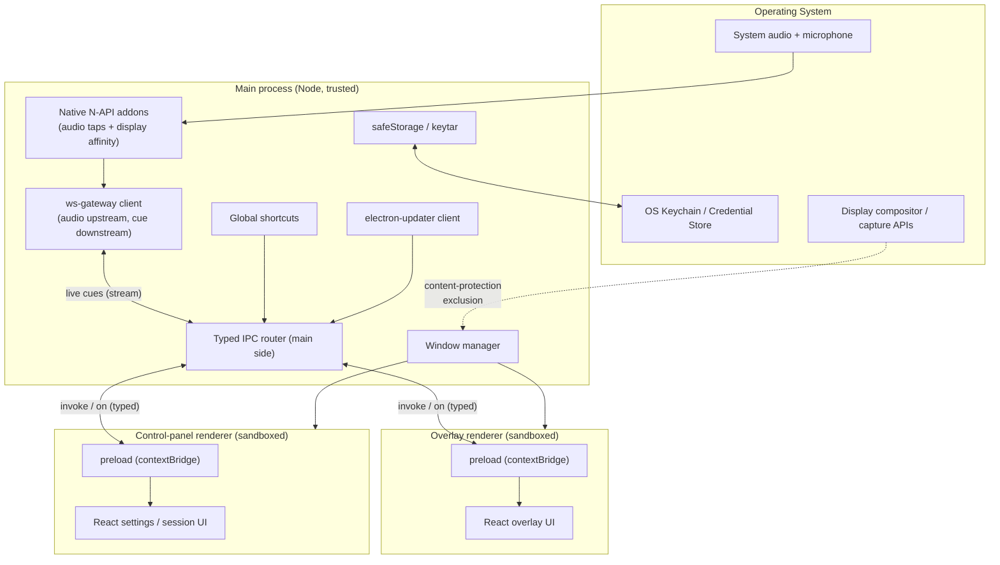
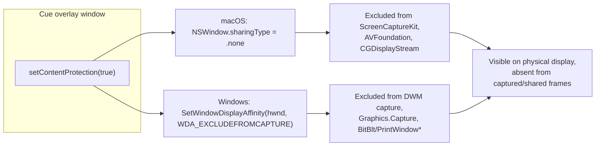
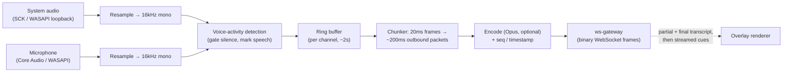
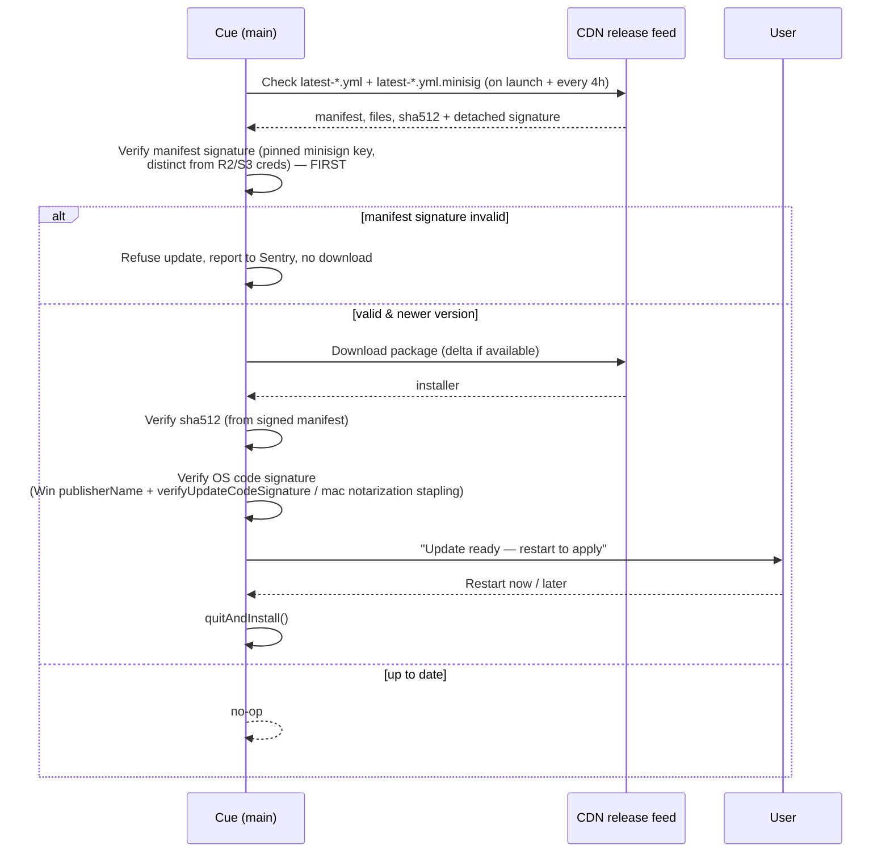
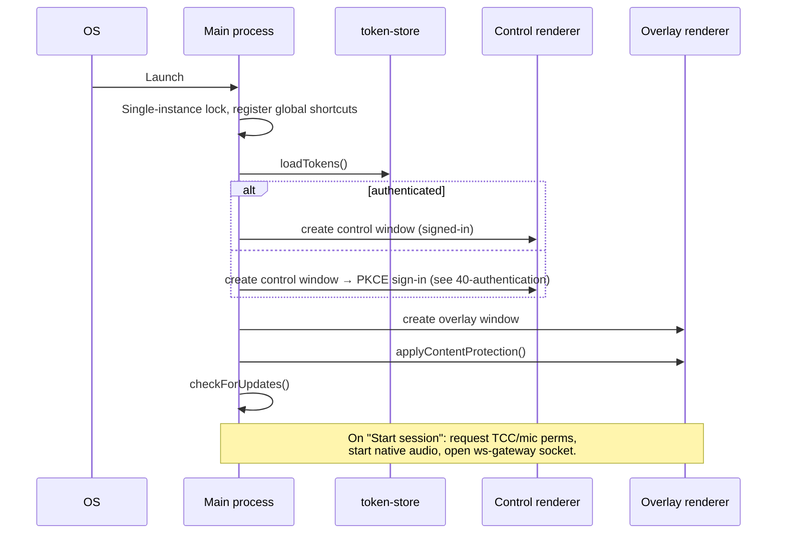

# Desktop App Architecture (Electron)

> Status: Draft · Owner: Desktop/Client Architecture · Last updated: 2026-07-29 · Related: [System architecture](02-system-architecture.md) · [Repository structure](03-repository-structure.md) · [Design system](12-design-system.md) · [Backend services](20-backend-services.md) · [AI pipeline](21-ai-pipeline.md) · [Authentication](40-authentication.md) · [DevOps & release pipeline](60-devops-infrastructure.md) · [Engineering standards](13-engineering-standards.md) · [Decision record](04-decision-record.md) · [Remediation plan](05-remediation-plan.md)

The `desktop` app is the primary surface of Cue: a cross-platform (macOS + Windows) Electron client that renders a private, always-on-top, transparent teleprompter-style overlay, captures meeting audio, and streams it to the [`ws-gateway`](20-backend-services.md) for live transcription and AI cues. This document specifies the process model, the overlay window, content protection (with honest limitations), audio capture, IPC, global shortcuts, secure token storage, and auto-update.

---

## 1. Scope & responsibilities

| In scope | Out of scope (owned elsewhere) |
| --- | --- |
| Electron process model, window management, overlay rendering | STT/LLM/RAG orchestration → [AI pipeline](21-ai-pipeline.md) |
| Content protection & screen-capture exclusion | Realtime protocol & backpressure → [Backend services](20-backend-services.md) |
| Native audio capture (system loopback + mic) & chunking | Auth server, token issuance → [Authentication](40-authentication.md) |
| Typed IPC, global shortcuts, secure token storage | Overlay visual design, tokens, motion → [Design system](12-design-system.md) |
| `electron-updater` client against the release feed | Release build/sign/publish pipeline → [DevOps](60-devops-infrastructure.md) |

**Runtime targets (canonical):** live cue end-to-end (mic/loopback → visible cue) **< 1.2s p95**; overlay must remain **invisible in Zoom/Meet/Teams/Webex screen share and full-screen OS recording on both OSes**.

---

## 2. Technology & versions

| Concern | Choice |
| --- | --- |
| Runtime | Electron 32 (Chromium 128 / Node 20 embedded), targeting Node 22 LTS toolchain |
| Renderer | React 19 + Vite 6 + Zustand 5 |
| Build/package | `electron-builder` 25 |
| Auto-update | `electron-updater` 6 (feed: `latest-mac.yml` / `latest.yml` on R2/S3 + CDN) |
| Native audio (macOS) | ScreenCaptureKit + Core Audio taps via a Swift/Obj-C++ N-API addon |
| Native audio (Windows) | WASAPI loopback + mic via a C++ N-API addon |
| Native window flags | `SetWindowDisplayAffinity` (Win), `NSWindowSharingType` (mac) via addon |
| Secure storage | Electron `safeStorage` (primary) + `keytar` fallback |
| IPC | `contextBridge` + typed channel contracts from [`packages/types`](03-repository-structure.md) |

**ADR-10.1 — Electron over Tauri.**
- **Decision:** Ship on Electron.
- **Context:** We need mature content-protection APIs, deep native-addon access for audio taps, a battle-tested auto-updater with code-signing integration, and identical Chromium rendering on both OSes.
- **Alternatives:** Tauri (smaller binary, Rust core) — but weaker/rougher content-protection surface, less mature notarization/update tooling, and a WebView2/WKWebView rendering split we'd have to test twice.
- **Trade-offs:** Larger installer (~90–120MB), higher baseline RAM.
- **Consequence:** Electron; we invest in native addons for the parts Electron doesn't cover (audio taps, display-affinity edge cases).

---

## 3. Process model

Cue runs a hardened multi-process model: a single **main** process, one **preload** bridge per window, and sandboxed **renderer** processes. `nodeIntegration` is off everywhere; renderers reach privileged capability only through a narrow, typed `contextBridge` surface.



### 3.1 Responsibilities per process

| Process | Trust | Owns |
| --- | --- | --- |
| **Main** | Full Node | Window lifecycle, native addons, `ws-gateway` socket, global shortcuts, updater, keychain, all OS-privileged calls. The only process with Node/native access. |
| **Preload** | Bridge | Defines `window.cue` via `contextBridge.exposeInMainWorld`. No app logic — pure typed marshaling between renderer and `ipcRenderer`. |
| **Overlay renderer** | Sandboxed | Renders live cues/notes. `sandbox: true`, `contextIsolation: true`, `nodeIntegration: false`. |
| **Control renderer** | Sandboxed | Sign-in, session controls, RAG uploads, settings, history. Same isolation flags. |

Two renderers (overlay + control panel) keep the always-on-top overlay minimal and independently reloadable while heavier settings/history UI lives in a normal window. Both are code-split per house standards — see [Repository structure](03-repository-structure.md) and §7.4.

---

## 4. The overlay window

The overlay is a transparent, frameless, always-on-top `BrowserWindow` that shows only to the local user and is excluded from capture.

```ts
// apps/desktop/src/main/windows/overlay.ts
import { BrowserWindow, screen } from 'electron';
import path from 'node:path';
import { applyContentProtection } from '../native/content-protection';

export function createOverlayWindow(): BrowserWindow {
  const { workArea } = screen.getPrimaryDisplay();

  const win = new BrowserWindow({
    width: 480,
    height: 320,
    x: workArea.x + workArea.width - 480 - 24,
    y: workArea.y + 24,
    frame: false,
    transparent: true,
    hasShadow: false,
    resizable: true,
    movable: true,
    minimizable: false,
    maximizable: false,
    fullscreenable: false,
    skipTaskbar: true,          // hide from Windows taskbar
    alwaysOnTop: true,
    focusable: true,            // toggled off for click-through mode
    acceptFirstMouse: true,
    roundedCorners: true,
    backgroundColor: '#00000000',
    webPreferences: {
      preload: path.join(__dirname, '../preload/overlay.js'),
      sandbox: true,
      contextIsolation: true,
      nodeIntegration: false,
      nodeIntegrationInWorker: false,
      webSecurity: true,
      spellcheck: false,
      devTools: process.env.NODE_ENV !== 'production',
    },
  });

  // Float above full-screen apps and OS UI where allowed.
  win.setAlwaysOnTop(true, 'screen-saver');
  win.setVisibleOnAllWorkspaces(true, { visibleOnFullScreen: true });

  // macOS: keep out of Mission Control / app switcher window lists.
  if (process.platform === 'darwin') {
    win.setHiddenInMissionControl(true);
  }

  applyContentProtection(win); // see §5

  return win;
}
```

**Click-through mode.** When the user wants the overlay purely as a read-only heads-up display, we toggle `win.setIgnoreMouseEvents(true, { forward: true })` and `focusable: false` so clicks pass through to the meeting app underneath. A global shortcut re-enables interaction.

**Dock/taskbar posture.**
- **Windows:** `skipTaskbar: true` keeps the overlay out of the taskbar; the control panel keeps a normal taskbar entry.
- **macOS:** we run as an **accessory app** (`app.dock.hide()` / `LSUIElement`) with a menu-bar item, so the overlay does not add a Dock icon.

The overlay's visual language, typography, opacity ramps, and reduced-motion behavior are owned by the [Design system](12-design-system.md); this doc only defines the window mechanics.

---

## 5. Content protection (in depth)

Content protection makes the overlay a **local-only surface**: it renders on the user's physical display but is excluded from the frame buffers that screen-capture and screen-share pipelines read. This is the same OS capability password managers, banking, and DRM apps use.

### 5.1 The three mechanisms



Electron's `win.setContentProtection(true)` is the cross-platform entry point. Under the hood it maps to:

| OS | Native call | Effect |
| --- | --- | --- |
| macOS | `NSWindow.sharingType = NSWindowSharingType.none` | Window is omitted from ScreenCaptureKit / AVFoundation / `CGDisplayStream` captures. |
| Windows 10 2004+ | `SetWindowDisplayAffinity(hwnd, WDA_EXCLUDEFROMCAPTURE)` | Window renders black / is omitted in DWM-based capture (Windows.Graphics.Capture, most modern share paths). |
| Windows (pre-2004) | `WDA_MONITOR` (fallback) | Window shows as black in capture; weaker guarantee. |

We call `setContentProtection(true)` at window creation and **re-assert it** on `show`, on display changes (`screen` `display-added`/`display-metrics-changed`), and after any window recreation, because affinity can be lost on reparenting.

```ts
// apps/desktop/src/main/native/content-protection.ts
import { BrowserWindow, screen } from 'electron';
import { setDisplayAffinityExcludeFromCapture } from '@cue/native-window'; // N-API addon

export function applyContentProtection(win: BrowserWindow): void {
  const assert = () => {
    win.setContentProtection(true);
    if (process.platform === 'win32') {
      // Belt-and-suspenders: call SetWindowDisplayAffinity directly with
      // WDA_EXCLUDEFROMCAPTURE (0x11) in case the Electron mapping regresses.
      const hwnd = win.getNativeWindowHandle();
      setDisplayAffinityExcludeFromCapture(hwnd);
    }
  };
  assert();
  win.on('show', assert);
  win.on('restore', assert);
  screen.on('display-metrics-changed', assert);
  screen.on('display-added', assert);
}
```

**ADR-10.2 — Belt-and-suspenders native affinity call on Windows.**
- **Decision:** In addition to `setContentProtection(true)`, call `SetWindowDisplayAffinity(hwnd, WDA_EXCLUDEFROMCAPTURE)` directly via a native addon.
- **Context:** Electron's mapping has historically had version-specific gaps; the guarantee is our core promise.
- **Alternatives:** Trust Electron only.
- **Trade-offs:** One more native call to maintain and test per Electron upgrade.
- **Consequence:** Redundant assertion + a CI test matrix (§5.3) that fails the build if any target capture path sees the overlay.

### 5.2 Known limitations (honest)

Content protection is strong but **not absolute**. We document these so we never over-promise:

| Limitation | Detail | Mitigation |
| --- | --- | --- |
| **Older OS versions** | `WDA_EXCLUDEFROMCAPTURE` requires Windows 10 2004+. Older builds only get `WDA_MONITOR` (black rectangle) or nothing. | Detect OS build at startup; if unsupported, show an in-app warning banner and degrade to a documented "not capture-safe" state. |
| **Hardware / external capture** | A capture card, a second camera pointed at the screen, HDMI splitters, or a phone photo bypass all OS APIs entirely. | Cannot be prevented in software; disclosed in acceptable-use docs. |
| **Certain legacy capture paths** | Some `BitBlt`/`PrintWindow` or GDI-based screenshot tools on Windows, and a few remote-desktop stacks, may not honor affinity. | Enumerated in the test matrix; flagged as unsupported/risky. |
| **Accessibility / screen readers** | The overlay is still readable by the local user's assistive tech (by design). | Intended behavior. |
| **Remote control / RMM tools** | Screen-sharing that operates below the compositor (some enterprise RMM) may capture regardless. | Documented; enterprise admins are informed. |
| **OS process visibility** | The overlay is hidden from screen capture, taskbar/Dock, and screen-share window pickers — **but the `Cue` process remains fully visible in Task Manager / Activity Monitor / `ps` and to antivirus/EDR.** | **We do not and will not hide the process.** See §5.4. |

### 5.3 Verification: the invisibility test matrix

Invisibility is a release gate, not a hope. CI + a manual QA lab verify every capture surface each release. An automated harness starts a screen recording via each target's API, shows the overlay with a known sentinel pattern, captures a frame, and asserts the sentinel is **absent**.

| Target | macOS | Windows | Method |
| --- | --- | --- | --- |
| Zoom screen share (full screen) | ✅ gate | ✅ gate | Automated frame-diff + manual |
| Zoom share (specific window / app) | ✅ | ✅ | Manual |
| Google Meet (Chrome tab + full screen) | ✅ | ✅ | Manual |
| Microsoft Teams (desktop + web) | ✅ | ✅ | Manual |
| Cisco Webex | ✅ | ✅ | Manual |
| OS full-screen recorder | ScreenCaptureKit / `screencapture` | Win+G / Xbox Game Bar, Snipping Tool | Automated |
| Third-party recorders | QuickTime, OBS (SCK source) | OBS (Graphics.Capture + Display Capture), ShareX | Automated + manual |
| Legacy capture (risk) | — | `PrintWindow`, GDI `BitBlt` | Documented as unsupported |
| Multi-monitor + display hotplug | ✅ | ✅ | Re-assert affinity, re-test |

```ts
// apps/desktop/e2e/content-protection.spec.ts (illustrative)
test('overlay sentinel is absent from OBS Graphics.Capture frame', async () => {
  await showOverlayWithSentinel(SENTINEL_QR);
  const frame = await captureViaGraphicsCapture();          // native harness
  const found = await detectSentinel(frame, SENTINEL_QR);
  expect(found).toBe(false);                                 // must NOT appear
});
```

A failure on any **gate** row blocks the release. Non-gate rows are tracked and surfaced in the compatibility docs.

### 5.4 Responsible-use boundary (engineering + ethics)

There is a hard line between two very different things:

- **What we do (legitimate & standard):** exclude the overlay from *screen capture / screen share*, hide it from the *taskbar/Dock* and from *screen-share window pickers* (which read the OS window-enumeration list). These are supported OS features used by mainstream security apps.
- **What we deliberately do NOT do:** hide the `Cue` process from the OS process list, spoof its name, evade antivirus/EDR, defeat MDM inventory, or otherwise make the software undetectable on the machine. That is malware behavior, it would jeopardize signing/notarization, and it is out of scope by design.

This boundary is a product commitment, not just an implementation detail. (Acceptable-use / disclosed-mode policy is out of scope for the current planning pass.)

---

## 6. Audio capture

Cue captures two streams — **system/loopback audio** (the other participants) and the **user's microphone** — and forwards PCM chunks to the [`ws-gateway`](20-backend-services.md), which fans out to the [AI pipeline](21-ai-pipeline.md).

### 6.1 Platform capture backends

| OS | System / loopback | Microphone | Notes |
| --- | --- | --- | --- |
| macOS 13+ | ScreenCaptureKit `SCStream` audio (or Core Audio process taps on 14.4+) | `AVCaptureDevice` / Core Audio | Requires **Screen Recording** TCC permission for system audio; **Microphone** TCC for mic. |
| Windows 10 2004+ | WASAPI **loopback** capture (`AUDCLNT_STREAMFLAGS_LOOPBACK`) | WASAPI capture on default comms device | No special permission for loopback; mic needs the Microphone privacy setting. |

Both backends are native N-API addons under `apps/desktop/src/native/audio/` exposing a common TS interface so the main process stays platform-agnostic.

```ts
// packages/types/src/audio.ts
export interface AudioSource {
  start(opts: AudioCaptureOptions): Promise<void>;
  stop(): Promise<void>;
  onChunk(cb: (chunk: AudioChunk) => void): Unsubscribe;
}

export interface AudioChunk {
  channel: 'system' | 'mic';
  seq: number;            // monotonic per channel
  timestampMs: number;    // capture clock
  sampleRate: 16000;      // resampled for STT
  pcm: Int16Array;        // mono, 16-bit
}

export interface AudioCaptureOptions {
  sampleRate: 16000;
  frameMs: 20;            // 20ms frames for VAD
  channels: ['system', 'mic'];
}
```

### 6.2 Capture pipeline flow



**Buffering & chunking.** Native addons deliver 20ms frames. A per-channel ring buffer (~2s) absorbs jitter and lets VAD look slightly ahead. We coalesce frames into ~**200ms outbound packets** — small enough for the < 300ms partial-STT target, large enough to keep WebSocket overhead low. Each packet carries `channel`, monotonic `seq`, and a capture timestamp so the backend can order and correlate the two streams. Backpressure and reconnection semantics live in [Backend services](20-backend-services.md).

**VAD.** A lightweight WebRTC-style VAD in the addon gates silence to cut STT cost and latency; the AI pipeline also runs server-side VAD as the source of truth.

### 6.3 Permissions (macOS TCC & Windows privacy)

```mermaid
sequenceDiagram
    participant U as User
    participant App as Cue (main)
    participant OS as OS permission (TCC / Privacy)

    U->>App: Start session
    App->>OS: Check Microphone permission
    alt not granted
        App->>OS: Request Microphone (system prompt)
        OS-->>U: Prompt
        U-->>OS: Allow / Deny
    end
    App->>OS: Check Screen Recording (macOS system audio)
    alt not granted
        App->>U: In-app explainer → open System Settings deep link
        Note over App,OS: macOS cannot re-prompt Screen Recording;<br/>user must toggle in Settings, then relaunch.
    end
    App-->>U: Session ready / blocked with guidance
```

- **macOS:** system-audio capture via ScreenCaptureKit requires the **Screen Recording** TCC grant; mic requires **Microphone**. We ship `NSMicrophoneUsageDescription` and the screen-capture entitlements, and use `systemPreferences.getMediaAccessStatus()` / `askForMediaAccess('microphone')`. Screen Recording cannot be re-prompted programmatically, so we deep-link to `System Settings > Privacy & Security > Screen Recording` and instruct a relaunch.
- **Windows:** mic capture obeys the Microphone privacy setting (`Settings > Privacy > Microphone`); packaged apps must not be blocked there. WASAPI loopback needs no special permission.

We request permissions **just-in-time** at first session start, never at install, with a plain-language rationale — an accessibility- and trust-first posture (see [Design system](12-design-system.md)).

---

## 7. IPC, security model, shortcuts, storage

### 7.1 Process-isolation security model

Every renderer is locked down; the main process is the only trusted boundary.

| Control | Setting | Why |
| --- | --- | --- |
| Context isolation | `contextIsolation: true` | Renderer JS can't touch Electron/Node internals. |
| Sandbox | `sandbox: true` | Renderer runs in an OS sandbox; no Node primitives. |
| Node integration | `nodeIntegration: false`, `nodeIntegrationInWorker: false` | No `require`/`process` in renderer. |
| Remote module | disabled (removed in modern Electron) | No synchronous main access. |
| Web security | `webSecurity: true`, CSP header | Blocks mixed content / arbitrary origins. |
| Navigation | `will-navigate` + `setWindowOpenHandler` deny by default | No drive-by navigation/popup escape. |
| Preload surface | Explicit `contextBridge` allowlist only | Least privilege; no ambient capability. |
| Permissions | `session.setPermissionRequestHandler` deny-all except mic (control panel) | Renderer can't grant itself device access. |

A strict CSP is set for renderer content (`default-src 'self'`; no remote script). The overlay renderer never loads remote origins.

### 7.2 Typed contextBridge API

The preload exposes a single namespaced, fully typed object. Channel names and payloads come from [`packages/types`](03-repository-structure.md) so main and renderer share one contract.

```ts
// apps/desktop/src/preload/overlay.ts
import { contextBridge, ipcRenderer } from 'electron';
import type { CueBridge, CueEvent } from '@cue/types';

const api: CueBridge = {
  session: {
    start: (opts) => ipcRenderer.invoke('session:start', opts),
    stop: () => ipcRenderer.invoke('session:stop'),
  },
  cues: {
    // Streamed cue tokens from ai-orchestrator via main.
    onToken: (cb) => subscribe('cues:token', cb),
    onDone: (cb) => subscribe('cues:done', cb),
  },
  overlay: {
    setClickThrough: (on) => ipcRenderer.invoke('overlay:click-through', on),
    scroll: (dir) => ipcRenderer.send('overlay:scroll', dir),
  },
  auth: { getStatus: () => ipcRenderer.invoke('auth:status') },
} as const;

function subscribe<K extends keyof CueEvent>(ch: K, cb: (p: CueEvent[K]) => void) {
  const handler = (_e: unknown, payload: CueEvent[K]) => cb(payload);
  ipcRenderer.on(ch, handler);
  return () => ipcRenderer.removeListener(ch, handler);
}

contextBridge.exposeInMainWorld('cue', Object.freeze(api));
```

Main-side handlers validate every payload (zod schemas from `@cue/core`) and reject unknown channels. There is **no** generic "invoke arbitrary" channel.

### 7.3 Global shortcuts

Registered in main via `globalShortcut`; defaults are user-remappable in settings and stored in `electron-store`.

| Action | Default (macOS / Windows) | Notes |
| --- | --- | --- |
| Show / hide overlay | `⌘⇧Space` / `Ctrl+Shift+Space` | Instant privacy toggle. |
| Toggle click-through | `⌘⇧C` / `Ctrl+Shift+C` | Interactive ↔ read-only HUD. |
| Scroll cue up / down | `⌘⇧↑` / `⌘⇧↓` (and Win equivalents) | Teleprompter-style navigation. |
| Panic hide (kill overlay + mute capture) | `⌘⇧H` / `Ctrl+Shift+H` | One-key "hide everything now." |

Registration failures (a shortcut already held by another app) surface a non-blocking toast prompting a rebind.

### 7.4 Renderer code organization (house standards)

Both renderers follow the code-splitting rules from the global standards — pages orchestrate, logic lives in hooks/utils, no file over 700 LOC:

```
apps/desktop/src/renderer/overlay/
├── OverlayApp.tsx            # orchestration only
├── types.ts                  # local view types (DTOs come from @cue/types)
├── utils.ts                  # pure helpers (formatting, throttling)
├── store.ts                  # Zustand store (cues, session, ui)
├── hooks/
│   ├── use-cue-stream.ts     # subscribes to window.cue.cues.*
│   ├── use-session.ts        # start/stop lifecycle
│   └── use-click-through.ts  # overlay interaction mode
└── components/
    ├── CueList.tsx
    ├── CueLine.tsx
    └── SessionStatus.tsx
```

Shared React components and design tokens are consumed from [`packages/ui`](12-design-system.md); shared DTOs and the release-manifest contract from [`packages/types`](03-repository-structure.md).

### 7.5 Secure token storage

Auth tokens (access + refresh, plus device-binding material) are **never** kept in renderer storage or plain files. The main process encrypts them and hands the renderer only high-level auth status.

```ts
// apps/desktop/src/main/security/token-store.ts
import { safeStorage } from 'electron';
import Store from 'electron-store';

const store = new Store<{ enc?: string }>({ name: 'auth' });

export function saveTokens(tokens: TokenBundle): void {
  if (!safeStorage.isEncryptionAvailable()) throw new Error('OS encryption unavailable');
  const enc = safeStorage.encryptString(JSON.stringify(tokens)); // Keychain/DPAPI-backed
  store.set('enc', enc.toString('base64'));
}

export function loadTokens(): TokenBundle | null {
  const b64 = store.get('enc');
  if (!b64) return null;
  return JSON.parse(safeStorage.decryptString(Buffer.from(b64, 'base64')));
}
```

`safeStorage` uses the OS keychain (macOS Keychain) / DPAPI-backed keyring (Windows) as the encryption root; `keytar` is a fallback where `safeStorage` is unavailable. The full OAuth 2.0 Authorization Code + PKCE (system browser, loopback/deep-link redirect) and device-binding flows are owned by [Authentication](40-authentication.md); this doc only covers at-rest handling on the client.

### 7.6 WebSocket auth-ticket presentation (off the query string)

The main-process `ws-gateway` client authenticates each connection with a short-lived, single-use signed **WS ticket** minted by `api` (issuance + TTL owned by [Authentication](40-authentication.md)). The ticket is **never** placed on the connection URL query string: query strings leak into proxy/access logs, browser and OS history, and referrer chains, and the ticket is bearer-equivalent for the session.

**Presentation:** the ticket is carried in the WebSocket handshake via a `Sec-WebSocket-Protocol` subprotocol value; a first-message auth frame is the fallback where a proxy strips custom subprotocol tokens. The socket stays **unauthenticated** until the ticket validates: `ws-gateway` accepts the upgrade, then admits no audio/cue frames until the first frame carries a valid ticket, and closes with a policy code on failure. The desktop client **never logs or persists** the ticket — it lives only in main-process memory for the duration of the handshake.

```ts
// apps/desktop/src/main/ws/connect.ts
import WebSocket from 'ws';

export function connectGateway(url: string, ticket: string): WebSocket {
  // Ticket rides the subprotocol header, NOT url?ticket=… (S-07).
  // `url` is the bare wss origin+path with no query string.
  return new WebSocket(url, [`cue.v1`, `ticket.${ticket}`], {
    // no ticket in headers we log; handshake-only, never retried with a stale ticket
    handshakeTimeout: 5_000,
  });
}
```

The subprotocol carrier keeps the ticket out of the URL while remaining a standards-compliant part of the RFC 6455 handshake; `ws-gateway` echoes only the `cue.v1` protocol token back, never the ticket. Reconnection re-mints a fresh ticket rather than reusing the old one. Frame protocol, backpressure, and reconnect/resume semantics remain owned by [Backend services](20-backend-services.md).

**ADR-10.3 — WS ticket via subprotocol / first-message frame, not the URL.**
- **Decision:** Present the signed WS ticket as a `Sec-WebSocket-Protocol` value (first-message frame fallback); never in the connection URL query string.
- **Context:** Query-string secrets leak into logs, proxies, and history; the ticket is bearer-equivalent until it expires.
- **Alternatives:** `?ticket=` query param (leaky); a custom header (stripped by some proxies, unavailable to browser WS clients we may add later).
- **Trade-offs:** Slightly more handshake plumbing on both ends; the socket is intentionally inert until the first frame validates.
- **Consequence:** No ticket on the wire URL, no ticket in any log; unauthenticated sockets admit no data.

_Addresses audit S-07 via [05-remediation-plan.md](05-remediation-plan.md); reconcile ticket issuance/TTL with [Authentication](40-authentication.md)._

---

## 8. Auto-update (electron-updater)

The desktop app updates itself from the same signed release feed the [web download flow](11-web-landing.md) serves, published by the [release pipeline](60-devops-infrastructure.md) to R2/S3 + CDN (`latest-mac.yml` / `latest.yml`). Auto-update is a high-value tamper target: a compromised feed pushes code to every install. The client therefore verifies an **independent manifest signature** (a key distinct from the R2/S3 credentials) *before* it trusts the SHA-512 or downloads anything, and `autoDownload` stays **off** until the software supply-chain program is live (see §8.4 and [DevOps §supply-chain](60-devops-infrastructure.md)).



```ts
// apps/desktop/src/main/updater.ts
import { autoUpdater } from 'electron-updater';
import type { NsisUpdater } from 'electron-updater';
import { verifyManifestSignature } from './security/manifest-signature'; // pinned minisign key
import { SUPPLY_CHAIN_PROGRAM_LIVE } from './config'; // gate flag — see §8.4

export function initUpdater() {
  // autoDownload stays OFF until the supply-chain program (60) is live:
  // frozen lockfile, advisory scanning, SBOM, provenance, secret scanning,
  // and an independently signed update manifest. Ungated auto-download of a
  // compromised feed would be an unbounded RCE vector.
  autoUpdater.autoDownload = SUPPLY_CHAIN_PROGRAM_LIVE;
  autoUpdater.autoInstallOnAppQuit = true;
  autoUpdater.channel = process.env.CUE_UPDATE_CHANNEL ?? 'latest'; // latest | beta

  if (process.platform === 'win32') {
    // Never rely on electron-updater defaults: require signature verification and
    // pin the expected publisher. publisherName is also pinned in electron-builder.yml.
    const nsis = autoUpdater as NsisUpdater;
    nsis.verifyUpdateCodeSignature = (publisherNames, path) =>
      verifyWindowsPublisher(publisherNames, path, EXPECTED_PUBLISHER_NAME);
  }

  autoUpdater.on('update-available', async (info) => {
    // Independent manifest-signature check BEFORE any download or sha512 trust.
    // Key is pinned in the client binary and is DISTINCT from R2/S3 credentials,
    // so an attacker with feed write access still cannot forge a valid manifest.
    const ok = await verifyManifestSignature(info); // fetches latest-*.yml.minisig
    if (!ok) {
      reportSentry(new Error('update manifest signature invalid — refusing update'));
      return; // hard stop: no download, no install
    }
    if (!autoUpdater.autoDownload) await autoUpdater.downloadUpdate();
  });

  autoUpdater.on('update-downloaded', (info) => notifyRenderer('update:ready', info));
  autoUpdater.on('error', (err) => reportSentry(err));

  autoUpdater.checkForUpdates();
  setInterval(() => autoUpdater.checkForUpdates(), 4 * 60 * 60 * 1000);
}
```

### 8.1 Layered integrity verification

The client applies an update only when **all** of these pass, checked in order — the first two gate the download, the second two gate the install:

| # | Check | What it defends | Key / source |
| --- | --- | --- | --- |
| 1 | **Independent manifest signature** (minisign / TUF-style detached sig over `latest-*.yml`) | A compromised R2/S3 origin serving a forged manifest — sha512 alone is insufficient because the manifest shares R2's origin | Public key **pinned in the client binary**, private key held **separately from R2/S3 credentials** (see 60) |
| 2 | **Version + channel** monotonic check | Downgrade / channel-swap attacks | Signed manifest fields |
| 3 | **SHA-512** of the downloaded installer vs the signed manifest | A swapped installer on the CDN | Hash from the now-trusted manifest |
| 4 | **OS code signature** | A mis-signed / unsigned binary | Windows `publisherName` + `verifyUpdateCodeSignature`; macOS Developer ID + **notarization stapling** verified client-side |

**ADR-10.4 — Independent manifest signing verified before sha512.**
- **Decision:** Sign the update manifest with a minisign (or TUF-style feed) key **distinct from the R2/S3 publishing credentials**, and verify it in the client **before** trusting the sha512 or downloading.
- **Context:** The default trust chain (sha512-in-the-yml + OS code signature) puts the yml on the same R2 origin as the artifacts, so one credential compromise (feed write) can serve a self-consistent malicious `{manifest, installer, sha512}`. A key not co-located with those credentials breaks that single point of failure.
- **Alternatives:** sha512 + code signature only (single-origin trust); CDN TLS alone (does not bind content).
- **Trade-offs:** A second key to provision, rotate, and pin; one more verify + sign step.
- **Consequence:** Feed-write compromise alone cannot ship code; the signing key is the crown-jewel secret managed in [DevOps](60-devops-infrastructure.md).

### 8.2 Windows publisher & signature pinning

On Windows we do **not** rely on `electron-updater` defaults. We explicitly set `verifyUpdateCodeSignature` and pin `publisherName` (in `electron-builder.yml` and re-asserted at runtime) so an installer signed by any other certificate — including a valid-but-different code-signing cert — is rejected. This is tested, not assumed (§8.3).

### 8.3 macOS notarization stapling

Beyond Developer ID signing, the client verifies that the downloaded artifact carries a **stapled** notarization ticket (so verification succeeds even offline / if the notary service is unreachable). Stapling is produced in the release pipeline ([DevOps](60-devops-infrastructure.md)); the client asserts its presence before install.

### 8.4 autoDownload gated on the supply-chain program

`autoUpdater.autoDownload` **must remain `false`** until the software supply-chain program is live in CI/release: `pnpm --frozen-lockfile` installs, dependency-advisory scanning as a merge gate, a CycloneDX SBOM per release, SLSA-style build provenance, secret scanning, hash-pinned native addons, and the independent manifest-signing step above. Enabling silent auto-download of a feed that is not yet provenance- and signature-guaranteed would turn any supply-chain compromise into fleet-wide code execution. The `SUPPLY_CHAIN_PROGRAM_LIVE` flag flips on only when [DevOps §supply-chain](60-devops-infrastructure.md) confirms the program (provisioning + keys) is in place; the merge-gate half lives in [Engineering standards §5.2](13-engineering-standards.md).

### 8.5 Tamper-rejection tests (release blocker)

A CI suite asserts the client **rejects** every tampered-update case; a failure blocks the release. It is re-run on every Electron bump alongside the content-protection matrix (§5.3), because native-addon and updater behavior are ABI-bound to the Electron version.

| Tamper case | Expected outcome |
| --- | --- |
| `latest-*.yml` with an **invalid / missing manifest signature** | Refused before download (check 1) |
| **Swapped installer** (manifest sha512 no longer matches) | Refused before install (check 3) |
| **Mis-signed binary** (valid cert, wrong `publisherName`) on Windows | Refused (check 4) |
| **Un-stapled / un-notarized** artifact on macOS | Refused (check 4) |
| **Downgrade** (older version than installed) | Refused (check 2) |

Each case runs against a local test feed (e.g. `serveFeed({ manifestSig: 'corrupt' })`) and asserts `result.applied === false` with a specific `reason`, verifying no download occurred for pre-download refusals.

- **Channels:** `latest` (stable) and `beta` support staged rollout.
- **UX:** updates download silently and apply on user-approved restart or next quit — never mid-session, so a live meeting is never interrupted.

_Addresses audit S-01 / S-04 via [05-remediation-plan.md](05-remediation-plan.md); supply-chain provisioning, key custody, and signing steps are owned by [DevOps](60-devops-infrastructure.md), and the merge gates by [Engineering standards](13-engineering-standards.md)._

---

## 9. Startup sequence (end to end)



---

## 10. Testing & QA

| Layer | Tooling | Focus |
| --- | --- | --- |
| Unit | Vitest | utils, hooks (via `@testing-library/react`), payload schemas |
| IPC contract | Vitest + typed mocks | every `contextBridge` channel against `@cue/types` |
| E2E / integration | Playwright for Electron | window creation, shortcuts, click-through, updater flow |
| Content protection | Custom native harness (§5.3) | invisibility matrix — **release gate** |
| Update tamper-rejection | Local signed/tampered test feed (§8.5) | bad manifest sig / swapped installer / mis-signed / un-stapled / downgrade — **release gate** |
| Native audio | Golden-file PCM tests | resample correctness, seq/timestamp continuity, VAD gating |
| Manual QA lab | Physical macOS + Windows machines | Zoom/Meet/Teams/Webex live shares, multi-monitor, OS versions |

CI gates and coverage thresholds are defined in [Engineering standards](13-engineering-standards.md).

---

## Open questions & risks

1. **Windows capture-path coverage.** `WDA_EXCLUDEFROMCAPTURE` covers modern DWM/Graphics.Capture paths, but some legacy `BitBlt`/`PrintWindow` tools and certain RMM/remote-desktop stacks may still capture. We must maintain and publish the supported-vs-risky matrix and degrade honestly on unsupported OS builds.
2. **macOS Screen Recording friction.** System-audio capture needs the Screen Recording grant, which cannot be re-prompted and requires a relaunch. This is a real onboarding drop-off risk; needs a polished explainer flow (coordinate with [Design system](12-design-system.md)).
3. **Core Audio taps vs ScreenCaptureKit for system audio on macOS.** Core Audio process taps (14.4+) avoid the Screen Recording grant for audio-only, but have a narrower OS-version floor. Decide the primary path vs fallback matrix; may reduce (2).
4. **Latency budget headroom.** Native capture + resample + VAD + chunk must leave enough of the 1.2s p95 budget for network + STT + LLM. Client-side budget allocation must be validated against the [AI pipeline](21-ai-pipeline.md) numbers on real hardware.
5. **Auto-update + native addons.** Native audio/window addons are ABI-bound to the Electron/Node version; every Electron bump requires rebuilding and re-running the full content-protection matrix before release.
6. **Overlay always-on-top vs full-screen meeting apps.** Some full-screen presentation modes on Windows can steal top-most z-order; verify `screen-saver` level holds across Teams/Zoom full-screen and document exceptions.
7. **Wayland/Linux.** Out of scope for v1 (macOS + Windows only), but content protection on Linux/Wayland is materially weaker — note before any future expansion.
8. **Manifest-signing key custody & rotation.** The independent update-manifest key (§8.1) is a crown-jewel secret and must live apart from R2/S3 credentials; its custody, rotation, and the client-pinning refresh path (a rotated key must reach clients before it is used) are owned by [DevOps](60-devops-infrastructure.md) and must be settled before `autoDownload` is enabled.
9. **Supply-chain program readiness gates the flag.** `SUPPLY_CHAIN_PROGRAM_LIVE` (§8.4) stays `false` until the full program is live; track the go/no-go against [DevOps §supply-chain](60-devops-infrastructure.md) and [Engineering standards §5.2](13-engineering-standards.md) so the flag flips deliberately, not by default.
