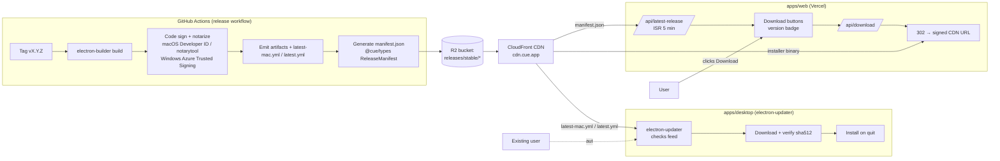

# Web Landing Site — Next.js 15 Marketing & Download

> Status: Draft · Owner: Web / Frontend Architect · Last updated: 2026-07-29 · Related: [Product vision](01-product-vision.md) · [System architecture](02-system-architecture.md) · [Repository structure](03-repository-structure.md) · [Desktop app](10-desktop-app.md) · [Design system](12-design-system.md) · [Engineering standards](13-engineering-standards.md) · [DevOps & release pipeline](60-devops-infrastructure.md) · [Observability](61-observability.md) · [Legal & compliance](../docs/README.md)

The marketing site (`apps/web`) is the public face of **AssistMe** (provisional brand; formerly Cue). It has three jobs: (1) explain and sell the product, (2) hand the right signed installer to the right OS, and (3) feed the same release manifest that powers in-app auto-update. It is a **Next.js 15 App Router** app on **Vercel**. It never hosts installer binaries itself — those live on R2/S3 behind CloudFront (see [DevOps](60-devops-infrastructure.md)).

This doc owns: App Router route map, the 3D hero (and its SSR gotcha), Tailwind v4 + Framer Motion usage, SEO/metadata/OG, the download flow (OS detection + `/api/latest-release` + per-OS buttons), the shared-release-feed pipeline, Vercel config, and a privacy-preserving analytics/consent banner. It does **not** own installer signing/publishing ([DevOps](60-devops-infrastructure.md)), the design tokens themselves ([Design system](12-design-system.md)), pricing entitlements logic ([Subscriptions](50-subscriptions-entitlements.md)), or auth flows ([Authentication](40-authentication.md)).

---

## 1. Goals & non-goals

| Goal | How |
| --- | --- |
| Sub-second perceived load, great Core Web Vitals | RSC-first, minimal client JS, `next/dynamic` for heavy 3D, aggressive image/font optimization |
| Correct installer for the visitor's OS, one click | Server-hinted + client-refined OS detection, `/api/latest-release` reads the signed feed |
| One source of truth for releases | Website download API and `electron-updater` read the **same** manifest object in R2 |
| Privacy-first analytics | PostHog EU, cookieless by default, consent banner gates any non-essential storage |
| SEO / shareability | Per-route `generateMetadata`, OG image generation, sitemap, structured data |

**Non-goals:** no installer hosting on Vercel (bandwidth + no long-term artifact story); no auth-gated app surfaces here (the app dashboard, if any, is a separate concern — this is the *marketing + download* surface); no server-side session state.

---

## 2. App Router structure

Feature-folder layout per the [engineering standards](13-engineering-standards.md): route segments stay thin (orchestration), logic lives in `features/*` (hooks + utils + focused components), shared UI comes from `@cue/ui` ([Design system](12-design-system.md)). No file over 700 LOC.

```text
apps/web/
├─ app/
│  ├─ layout.tsx                 # root: html/body, fonts, ThemeProvider, ConsentProvider, Analytics
│  ├─ page.tsx                   # home (hero + features + CTA); orchestrates only
│  ├─ globals.css                # Tailwind v4 entry (@import "tailwindcss"; @theme tokens)
│  ├─ opengraph-image.tsx        # default OG (ImageResponse, edge)
│  ├─ icon.tsx / apple-icon.tsx  # favicons via ImageResponse
│  ├─ sitemap.ts                 # generated sitemap
│  ├─ robots.ts                  # robots directives
│  ├─ (marketing)/               # route group — shares marketing chrome
│  │  ├─ layout.tsx              # marketing nav + footer + CTA bar
│  │  ├─ features/page.tsx
│  │  ├─ use-cases/
│  │  │  ├─ page.tsx
│  │  │  └─ [slug]/page.tsx      # interviews | sales | support | accessibility | notes (generateStaticParams)
│  │  ├─ pricing/page.tsx        # tiers table; links to Stripe Checkout via app, not here
│  │  ├─ security/page.tsx       # content-protection + privacy posture (links legal)
│  │  └─ changelog/page.tsx      # renders docs/CHANGELOG-derived MDX
│  ├─ download/
│  │  ├─ page.tsx                # OS-aware download hub
│  │  └─ opengraph-image.tsx
│  ├─ docs/                      # MDX-backed product docs (getting started, permissions, etc.)
│  │  ├─ layout.tsx              # docs shell (sidebar TOC)
│  │  └─ [[...slug]]/page.tsx
│  ├─ legal/                     # OWNED by legal doc for CONTENT; this renders MDX
│  │  ├─ privacy/page.tsx
│  │  ├─ terms/page.tsx
│  │  ├─ acceptable-use/page.tsx
│  │  ├─ dpa/page.tsx
│  │  └─ cookies/page.tsx
│  └─ api/
│     ├─ latest-release/route.ts # GET: normalized release manifest (ISR-cached)
│     └─ download/route.ts       # GET ?os=&arch= → 302 to signed CDN URL (+ analytics event)
├─ features/
│  ├─ hero-3d/                   # the R3F hero (see §4)
│  │  ├─ hero-3d.tsx             # client wrapper (dynamic target)
│  │  ├─ scene.tsx               # <Canvas> + lights + model
│  │  ├─ hooks/use-reduced-motion.ts
│  │  ├─ hooks/use-in-viewport.ts
│  │  ├─ poster.tsx              # static fallback image
│  │  └─ types.ts
│  ├─ download/                  # download flow (see §6)
│  │  ├─ download-cta.tsx        # primary OS-aware button (used on home + /download)
│  │  ├─ download-grid.tsx       # all platforms
│  │  ├─ hooks/use-os-detect.ts
│  │  ├─ hooks/use-latest-release.ts
│  │  ├─ utils/os.ts             # UA parsing, arch guess, platform maps
│  │  └─ types.ts
│  ├─ pricing/                   # tier cards, billing-cycle toggle
│  └─ consent/                   # consent banner + context (see §8)
├─ lib/
│  ├─ release/                   # server-side manifest fetch + normalize (shared by both API routes)
│  │  ├─ fetch-manifest.ts
│  │  ├─ normalize.ts
│  │  └─ types.ts                # re-exports @cue/types ReleaseManifest contract
│  ├─ seo/metadata.ts            # buildMetadata() helper
│  └─ analytics/posthog.ts
├─ public/                       # posters, static og art, logos (NO installers)
├─ next.config.ts
├─ vercel.json
└─ package.json
```

The `ReleaseManifest` DTO lives in `@cue/types` so the website, the `/api` route, and `electron-updater`'s consumer all agree on shape. See [Repository structure](03-repository-structure.md) and [Desktop app](10-desktop-app.md).

---

## 3. Rendering strategy

| Surface | Strategy | Why |
| --- | --- | --- |
| Home, features, use-cases, security | **Static (SSG)** + RSC | Content is stable; fastest TTFB; great CWV |
| `/pricing` | Static, tier data from `@cue/core` constants | Price display only; checkout happens in-app |
| `/docs`, `/changelog`, `/legal/*` | Static from MDX at build | Versioned with the repo |
| `/download` | Static shell + **client** OS detection + client fetch of `/api/latest-release` | Shell is cacheable; version data is fresh via ISR API |
| `/api/latest-release` | Route handler with **ISR revalidation (5 min)** | Fresh releases without rebuilds; cheap |
| `/api/download` | Dynamic 302 redirect (no cache) | Records intent, redirects to signed CDN URL |
| OG images | `ImageResponse` on the **edge** runtime | On-demand, cached by URL |

RSC-first keeps client JS tiny. The only heavy client bundles are the 3D hero and the download widget, both code-split.

---

## 4. The 3D hero (@react-three/fiber + drei)

The hero is a slowly rotating, glassy representation of the overlay floating over a blurred "meeting" plane — visually communicating "private layer only you see." It is **decorative**: the product story must be fully legible with the hero replaced by a static poster.

### 4.1 The SSR gotcha (mandatory)

`@react-three/fiber` and `three` touch `window`, `document`, and WebGL at import/eval time. Rendering them during Next.js server rendering throws (`ReferenceError: window is not defined`) or bloats the RSC payload. **The Canvas subtree must never run on the server.**

Rules:

1. **Dynamic import with `ssr: false`** for the entire R3F subtree. The dynamic call must live in a **Client Component** — in Next 15 App Router you cannot pass `ssr:false` to `next/dynamic` from a Server Component.
2. Ship a **poster fallback** as the `loading` state and as the permanent fallback for reduced-motion / low-power / WebGL-unavailable clients.
3. **Never** import `three`/`@react-three/*` from a Server Component or from `app/page.tsx` directly — only from inside the dynamically-imported client module. This guarantees the ~600KB+ three bundle is a separate async chunk.

```tsx
// features/hero-3d/hero-3d.tsx  — CLIENT component; this is the dynamic target
"use client";
import dynamic from "next/dynamic";
import { HeroPoster } from "./poster";
import { useReducedMotion } from "./hooks/use-reduced-motion";
import { useInViewport } from "./hooks/use-in-viewport";
import { useRef } from "react";

// three + r3f live ONLY inside ./scene → its own async chunk, never in RSC/SSR
const Scene = dynamic(() => import("./scene").then((m) => m.Scene), {
  ssr: false,
  loading: () => <HeroPoster reason="loading" />,
});

export function Hero3D() {
  const ref = useRef<HTMLDivElement>(null);
  const reducedMotion = useReducedMotion();
  const inView = useInViewport(ref, { rootMargin: "200px" });

  return (
    <div ref={ref} className="relative aspect-[16/10] w-full">
      {reducedMotion ? (
        <HeroPoster reason="reduced-motion" />
      ) : (
        // Only mount the Canvas once it is near the viewport
        inView ? <Scene paused={!inView} /> : <HeroPoster reason="offscreen" />
      )}
    </div>
  );
}
```

```tsx
// app/page.tsx — SERVER component; imports the client wrapper only
import { Hero3D } from "@/features/hero-3d/hero-3d";
// NOTE: no import of three / @react-three/* anywhere in this file
```

### 4.2 Pause-when-offscreen & power discipline

R3F's render loop keeps painting even when scrolled away, burning battery/GPU. Two mitigations, both applied:

- **`frameloop="demand"`** on `<Canvas>` so it only renders on `invalidate()` (driven by the animation controller), not continuously.
- **Pause on offscreen / tab-hidden**: an `IntersectionObserver` (`use-in-viewport.ts`) and `document.visibilitychange` gate the animation. When paused we stop calling `invalidate()`.

```tsx
// features/hero-3d/scene.tsx — CLIENT, code-split, imports three
"use client";
import { Canvas, useFrame, useThree } from "@react-three/fiber";
import { Float, Environment, useGLTF } from "@react-three/drei";

export function Scene({ paused }: { paused: boolean }) {
  return (
    <Canvas
      frameloop={paused ? "never" : "demand"}
      dpr={[1, 2]}                     // cap pixel ratio on hi-dpi
      gl={{ antialias: true, powerPreference: "high-performance" }}
      camera={{ position: [0, 0, 6], fov: 40 }}
    >
      <Environment preset="city" />
      <Float speed={paused ? 0 : 1.2} rotationIntensity={0.4}>
        <OverlayModel />
      </Float>
      <Ticker paused={paused} />
    </Canvas>
  );
}

// drives demand-mode renders; stops when paused so GPU idles
function Ticker({ paused }: { paused: boolean }) {
  const invalidate = useThree((s) => s.invalidate);
  useFrame(() => { if (!paused) invalidate(); });
  return null;
}

function OverlayModel() {
  const { scene } = useGLTF("/models/overlay.draco.glb"); // Draco-compressed, on CDN via public/
  return <primitive object={scene} />;
}
useGLTF.preload("/models/overlay.draco.glb");
```

### 4.3 `prefers-reduced-motion` & accessibility

- `use-reduced-motion.ts` reads `matchMedia("(prefers-reduced-motion: reduce)")` and subscribes to changes. When reduced, we render the poster only — no Canvas mounted, no three chunk fetched.
- The hero is `aria-hidden` (decorative); the real H1 and value prop are separate DOM, always present and crawlable.
- The poster (`poster.tsx`) is a `next/image` with `priority` so LCP is the poster, never a WebGL frame.

### 4.4 Bundle discipline

| Technique | Effect |
| --- | --- |
| `ssr:false` dynamic import of `scene.tsx` | three/r3f in a separate async chunk, excluded from initial + RSC payload |
| Draco-compressed `.glb` | model ~5–10× smaller; decoder loaded on demand |
| `dpr={[1,2]}` cap | avoids 3× render cost on phones |
| Mount only when `inView` | zero 3D cost above the fold on reduced-motion / until near viewport |
| `optimizePackageImports` for drei | tree-shakes drei helpers |

Budget target: initial route JS (excluding the 3D chunk) < 120KB gzip; 3D chunk lazy and never on the critical path.

---

## 5. Tailwind v4 + Framer Motion

**Tailwind v4** is CSS-first: configuration lives in `globals.css` via `@theme`, importing tokens from `@cue/ui` ([Design system](12-design-system.md)). No `tailwind.config.js` for theme values.

```css
/* app/globals.css */
@import "tailwindcss";
@import "@cue/ui/tokens.css";        /* design tokens: colors, radii, motion */

@theme {
  --font-sans: "Geist", ui-sans-serif, system-ui, sans-serif;
  --color-cue-500: oklch(0.62 0.19 275);
  --radius-xl: 1rem;
}

@media (prefers-reduced-motion: reduce) {
  *, *::before, *::after { animation-duration: 0.001ms !important; transition-duration: 0.001ms !important; }
}
```

**Framer Motion** (now `motion/react`) handles scroll reveals and CTA micro-interactions, always gated by reduced-motion:

```tsx
"use client";
import { motion, useReducedMotion } from "motion/react";

export function Reveal({ children }: { children: React.ReactNode }) {
  const reduce = useReducedMotion();
  return (
    <motion.div
      initial={reduce ? false : { opacity: 0, y: 16 }}
      whileInView={reduce ? undefined : { opacity: 1, y: 0 }}
      viewport={{ once: true, margin: "-10% 0px" }}
      transition={{ duration: 0.4, ease: "easeOut" }}
    >
      {children}
    </motion.div>
  );
}
```

All animation components are client leaves; the pages that use them stay server components that simply compose these leaves.

---

## 6. Download flow

Two collaborating pieces: **detect the OS/arch** client-side, and **resolve the current signed installer** from the release feed. The button then hits `/api/download` which 302-redirects to the CDN URL (so binaries stay off Vercel and we can log intent).

### 6.1 OS/arch detection — `hooks/use-os-detect.ts`

Prefer the modern **`navigator.userAgentData`** (with `getHighEntropyValues` for architecture), fall back to UA string parsing. Detection is client-only (it depends on the visitor); the page renders a neutral shell then refines.

```ts
// features/download/utils/os.ts
export type OS = "mac" | "windows" | "linux" | "unknown";
export type Arch = "arm64" | "x64" | "unknown";

export interface DetectedPlatform { os: OS; arch: Arch; label: string; }

export function osFromUAString(ua: string): OS {
  if (/mac os x|macintosh/i.test(ua)) return "mac";
  if (/windows nt/i.test(ua)) return "windows";
  if (/linux|x11/i.test(ua) && !/android/i.test(ua)) return "linux";
  return "unknown";
}

export function archFromUAString(ua: string): Arch {
  if (/arm64|aarch64/i.test(ua)) return "arm64";
  if (/x86_64|win64|x64|wow64/i.test(ua)) return "x64";
  return "unknown"; // Apple Silicon Safari lies (reports Intel) → resolved server-side by offering universal dmg
}
```

```ts
// features/download/hooks/use-os-detect.ts
"use client";
import { useEffect, useState } from "react";
import { archFromUAString, osFromUAString, type DetectedPlatform } from "../utils/os";

const LABELS: Record<string, string> = {
  mac: "macOS", windows: "Windows", linux: "Linux", unknown: "your platform",
};

export function useOsDetect(): DetectedPlatform | null {
  const [platform, setPlatform] = useState<DetectedPlatform | null>(null);

  useEffect(() => {
    let cancelled = false;
    async function detect(): Promise<DetectedPlatform> {
      const uaData = (navigator as Navigator & {
        userAgentData?: {
          platform: string;
          getHighEntropyValues: (h: string[]) => Promise<{ architecture?: string; bitness?: string }>;
        };
      }).userAgentData;

      if (uaData) {
        const p = uaData.platform.toLowerCase();
        const os = p.includes("mac") ? "mac" : p.includes("win") ? "windows" : p.includes("linux") ? "linux" : "unknown";
        let arch: "arm64" | "x64" | "unknown" = "unknown";
        try {
          const he = await uaData.getHighEntropyValues(["architecture", "bitness"]);
          if (he.architecture === "arm") arch = "arm64";
          else if (he.architecture === "x86" && he.bitness === "64") arch = "x64";
        } catch { /* ignore */ }
        return { os: os as DetectedPlatform["os"], arch, label: LABELS[os] };
      }
      const os = osFromUAString(navigator.userAgent);
      return { os, arch: archFromUAString(navigator.userAgent), label: LABELS[os] };
    }
    detect().then((p) => { if (!cancelled) setPlatform(p); });
    return () => { cancelled = true; };
  }, []);

  return platform; // null until detected → render neutral "Download" + all-platforms grid
}
```

The server can also send a **hint** via the `Sec-CH-UA-Platform` client hint (opt-in header) so the primary button label is correct on first paint for hint-supporting browsers; the client hook then confirms/refines. This avoids a layout flash without shipping user-specific HTML from the cache.

### 6.2 The release feed & `/api/latest-release`

`electron-builder` publishes, per channel, a set of artifacts plus its update descriptors (`latest-mac.yml`, `latest.yml`) and a JSON manifest to an R2 bucket fronted by CloudFront (see [DevOps](60-devops-infrastructure.md)). The website's route handler reads that manifest, normalizes it to the `@cue/types` `ReleaseManifest` contract, and serves it with ISR caching. Binaries are never proxied — only URLs.

```ts
// lib/release/types.ts  (mirrors @cue/types)
export interface ReleaseAsset {
  os: "mac" | "windows" | "linux";
  arch: "arm64" | "x64" | "universal";
  ext: "dmg" | "exe" | "AppImage" | "deb";
  url: string;        // signed CloudFront URL (long-lived, public)
  size: number;
  sha512: string;     // matches electron-updater descriptor
}
export interface ReleaseManifest {
  version: string;    // semver, e.g. 1.4.2
  channel: "stable" | "beta";
  releasedAt: string; // ISO
  notesUrl: string;
  assets: ReleaseAsset[];
}
```

```ts
// app/api/latest-release/route.ts
import { NextResponse } from "next/server";
import { fetchManifest } from "@/lib/release/fetch-manifest";

export const revalidate = 300; // ISR: cache the fetch for 5 minutes at the edge

export async function GET() {
  try {
    const manifest = await fetchManifest("stable"); // reads R2 manifest.json, normalizes
    return NextResponse.json(manifest, {
      headers: {
        // browser: short; CDN: 5 min with SWR so a new release appears fast but never blocks
        "Cache-Control": "public, max-age=60, s-maxage=300, stale-while-revalidate=86400",
      },
    });
  } catch {
    return NextResponse.json({ error: "release_unavailable" }, { status: 503 });
  }
}
```

```ts
// lib/release/fetch-manifest.ts
import { normalize } from "./normalize";
import type { ReleaseManifest } from "./types";

const MANIFEST_URL = process.env.RELEASE_MANIFEST_URL!; // https://cdn.cue.app/releases/stable/manifest.json

export async function fetchManifest(channel: "stable" | "beta"): Promise<ReleaseManifest> {
  const res = await fetch(MANIFEST_URL, { next: { revalidate: 300 } });
  if (!res.ok) throw new Error(`manifest ${res.status}`);
  return normalize(await res.json(), channel);
}
```

> Alternative considered: reading GitHub Releases directly via the GitHub API. Rejected as the *primary* path — rate limits, no SLA for a marketing-critical path, and it couples the public site to a source-control provider. We publish an immutable `manifest.json` to R2 as the canonical feed (ADR-1). GitHub Releases can remain a mirror for humans.

### 6.3 `/api/download` — logged redirect

```ts
// app/api/download/route.ts
import { NextRequest, NextResponse } from "next/server";
import { fetchManifest } from "@/lib/release/fetch-manifest";
import { pickAsset } from "@/lib/release/normalize";

export async function GET(req: NextRequest) {
  const os = req.nextUrl.searchParams.get("os");
  const arch = req.nextUrl.searchParams.get("arch") ?? "unknown";
  const manifest = await fetchManifest("stable");
  const asset = pickAsset(manifest, os, arch); // falls back: unknown arch → universal dmg / x64 exe
  if (!asset) return NextResponse.json({ error: "no_asset" }, { status: 404 });

  // fire-and-forget server-side analytics (no PII, respects consent flag in query if present)
  // await track("download_started", { os, arch, version: manifest.version });

  return NextResponse.redirect(asset.url, 302); // → CloudFront-signed CDN URL, binary never touches Vercel
}
```

### 6.4 UI: primary button + all-platforms grid

`download-cta.tsx` shows the detected-OS button ("Download for macOS (Apple Silicon)") plus a subtle "Other platforms" disclosure that expands `download-grid.tsx` (all os/arch/ext combos from the manifest). Until detection resolves, the primary button is a neutral "Download" and the grid is visible — no flash of wrong OS.

```tsx
// features/download/download-cta.tsx
"use client";
import { useOsDetect } from "./hooks/use-os-detect";
import { useLatestRelease } from "./hooks/use-latest-release";

export function DownloadCta() {
  const platform = useOsDetect();               // null until known
  const { data, isLoading } = useLatestRelease(); // GET /api/latest-release
  const os = platform?.os ?? "unknown";
  const label = platform ? `Download for ${platform.label}` : "Download";
  const href = `/api/download?os=${os}&arch=${platform?.arch ?? "unknown"}`;

  return (
    <div className="flex flex-col items-center gap-2">
      <a href={href} className="btn-primary" aria-busy={isLoading}>
        {label}
        {data && <span className="ml-2 text-sm opacity-70">v{data.version}</span>}
      </a>
      <a href="/download" className="text-sm underline opacity-80">Other platforms</a>
    </div>
  );
}
```

`use-latest-release.ts` is a tiny SWR-style hook over `/api/latest-release`; keep it in the feature folder, typed against `ReleaseManifest`, no `any`.

### 6.5 Shared release → website → auto-update pipeline

The single most important integration: the website and `electron-updater` consume the **same** feed. A release is cut once; both surfaces reflect it within minutes.



Key invariants:
- `sha512` in `manifest.json` assets **equals** the value in `latest*.yml` — same build, same hashes. ([Desktop app](10-desktop-app.md) verifies on the updater side.)
- Channels are directory-scoped in R2 (`releases/stable/`, `releases/beta/`); the website reads `stable`, opt-in beta users' apps read `beta`.
- Publishing is atomic-ish: upload assets first, write `manifest.json`/`latest*.yml` last so no surface ever points at a missing binary.

---

## 7. SEO, metadata & Open Graph

- **Per-route `generateMetadata`** via a `buildMetadata()` helper (`lib/seo/metadata.ts`) that sets title template, description, canonical, `openGraph`, `twitter`, and `alternates` (i18n-ready).
- **Dynamic OG images** with `ImageResponse` (`opengraph-image.tsx`) on the edge runtime — one default, plus per-download and per-use-case variants.
- **`app/sitemap.ts`** and **`app/robots.ts`** generated at build; `/api/*` and internal previews disallowed.
- **Structured data**: `SoftwareApplication` + `Organization` JSON-LD injected in the root layout; `FAQPage` on relevant marketing pages.
- **Fonts**: `next/font` (self-hosted Geist) → no layout shift, no third-party font requests (also a privacy win).

```ts
// lib/seo/metadata.ts
import type { Metadata } from "next";
const SITE = "https://cue.app";
export function buildMetadata(p: { title: string; description: string; path: string; image?: string }): Metadata {
  const url = `${SITE}${p.path}`;
  return {
    title: p.title,
    description: p.description,
    alternates: { canonical: url },
    openGraph: { title: p.title, description: p.description, url, siteName: "AssistMe",
      images: [{ url: p.image ?? `${SITE}/opengraph-image` }], type: "website" },
    twitter: { card: "summary_large_image", title: p.title, description: p.description },
  };
}
```

Marketing copy must stay consistent with [Product vision](01-product-vision.md) and the responsible-use posture — the site emphasizes preparation, accessibility, and disclosed-mode; it must not market deception. Content-protection is described as a standard privacy capability. Legal pages link to the compliance doc's canonical text.

---

## 8. Analytics & consent (privacy-preserving)

- **PostHog (EU cloud)** for product analytics + feature flags ([Observability](61-observability.md)). Configured **cookieless / `persistence: "memory"` by default**; no tracking cookies set before consent.
- **Consent banner** (`features/consent/`): a `ConsentProvider` context reads/writes a first-party, essential-only preference in `localStorage` (not a tracking cookie). Default is the **privacy-preserving** choice — non-essential analytics **off** until the user opts in. Reject-all is a one-click peer of accept-all (GDPR/ePrivacy compliant, no dark patterns).
- Analytics load is **gated**: the PostHog client only initializes (and switches to persistent identification) after explicit opt-in. Download events (`download_started`) are counted server-side as aggregate, non-PII counts regardless, for release health.
- `Do Not Track` / Global Privacy Control respected as an implicit reject.

```tsx
// features/consent/consent-provider.tsx (sketch) — client leaf, gates analytics init
"use client";
// stores {analytics:boolean} in localStorage key "cue.consent"; exposes useConsent()
// Analytics component in root layout calls posthog.init() ONLY when consent.analytics === true
```

Cross-link: cookie policy content is owned by the legal/compliance doc; this section owns the *technical* gating.

---

## 9. Vercel deploy config

```jsonc
// vercel.json
{
  "framework": "nextjs",
  "regions": ["iad1", "dub1"],           // us-east + eu-west to mirror backend residency
  "headers": [
    {
      "source": "/(.*)",
      "headers": [
        { "key": "Strict-Transport-Security", "value": "max-age=63072000; includeSubDomains; preload" },
        { "key": "X-Content-Type-Options", "value": "nosniff" },
        { "key": "Referrer-Policy", "value": "strict-origin-when-cross-origin" },
        { "key": "Permissions-Policy", "value": "camera=(), microphone=(), geolocation=()" }
      ]
    }
  ],
  "redirects": [
    { "source": "/download/mac", "destination": "/api/download?os=mac", "permanent": false },
    { "source": "/download/windows", "destination": "/api/download?os=windows", "permanent": false }
  ]
}
```

- **CSP** is set in `next.config.ts` headers (allowing self, PostHog EU, Sentry, and `cdn.cue.app`; `wasm-unsafe-eval` only if the Draco decoder needs it). No third-party ad/marketing scripts.
- **Env vars** (Vercel project): `RELEASE_MANIFEST_URL`, `NEXT_PUBLIC_POSTHOG_KEY`, `NEXT_PUBLIC_POSTHOG_HOST` (EU), `NEXT_PUBLIC_SITE_URL`, `SENTRY_DSN`. Secrets via Vercel encrypted env, mirrored from AWS Secrets Manager where shared.
- **Preview deployments** per PR with `robots: noindex` and a non-prod `RELEASE_MANIFEST_URL` (beta channel).
- `next.config.ts` sets `images.remotePatterns` for `cdn.cue.app`, `experimental.optimizePackageImports: ["@react-three/drei", "motion"]`, and `outputFileTracingExcludes` to keep the three chunk out of unrelated functions.
- Turborepo pipeline: `web#build` depends on `@cue/ui#build`, `@cue/types#build`, `@cue/core#build` ([Repository structure](03-repository-structure.md)).

---

## 10. ADRs

**ADR-1 — Canonical release feed is an R2 `manifest.json`, not GitHub Releases.**
*Context:* website download + `electron-updater` need one trustworthy source. *Alternatives:* GitHub Releases API; Vercel Blob. *Trade-offs:* R2 adds a publish step but gives SLA, no rate limits, CDN control, and channel dirs. *Consequence:* CI writes `manifest.json` + `latest*.yml` to `releases/<channel>/`; both surfaces read from CloudFront.

**ADR-2 — 3D hero is fully client-only + poster-first.**
*Context:* R3F breaks SSR and is heavy. *Alternatives:* SSR with a WebGL shim; static video hero. *Trade-offs:* client-only loses zero SEO (hero is decorative, `aria-hidden`) and the poster covers LCP. *Consequence:* `ssr:false` dynamic import, poster fallback, reduced-motion + offscreen gating, `frameloop="demand"`.

**ADR-3 — Installers never served by Vercel.**
*Context:* multi-hundred-MB signed binaries. *Alternatives:* Vercel static/Blob. *Trade-offs:* extra CDN but predictable cost and one artifact home shared with the updater. *Consequence:* `/api/download` 302-redirects to CloudFront; Vercel serves only HTML/JSON.

**ADR-4 — Consent-gated, cookieless-by-default analytics.**
*Context:* GDPR/ePrivacy + privacy-first brand. *Alternatives:* GA4; always-on analytics. *Trade-offs:* fewer signals pre-consent. *Consequence:* PostHog EU, memory persistence until opt-in, reject-all first-class, server-side aggregate download counts.

---

## Open questions & risks

- **Apple Silicon arch lie:** Safari on Apple Silicon reports Intel in the UA string; `userAgentData.getHighEntropyValues` isn't available in Safari. Mitigation: offer a **universal `.dmg`** so a wrong-arch detection still yields a working installer; revisit if we ship separate arm64/x64 dmgs for size.
- **Client-hint flash:** first-paint OS label depends on `Sec-CH-UA-Platform`; browsers that don't send it show neutral "Download" briefly. Acceptable, but confirm no CLS.
- **Manifest publish atomicity:** need a guaranteed ordering (assets before manifest) and ideally a checksum gate in CI; define exact steps with [DevOps](60-devops-infrastructure.md).
- **ISR staleness vs. urgency:** 5-min revalidate means a hotfix release is visible on the site within ~5 min but existing apps update on their own `electron-updater` cadence — align messaging so users aren't told "update available" before the site reflects it.
- **CSP vs. Draco/WASM:** if the Draco decoder requires `wasm-unsafe-eval`, scope it narrowly; verify no CSP regression breaks the hero.
- **Beta channel exposure:** ensure `/api/latest-release` can't be trivially switched to `beta` by query param in production without a flag, to avoid shipping beta installers to the public.
- **i18n:** metadata is i18n-ready but no locales are shipped yet; decide first non-English market with GTM ([Roadmap](80-roadmap.md)).
