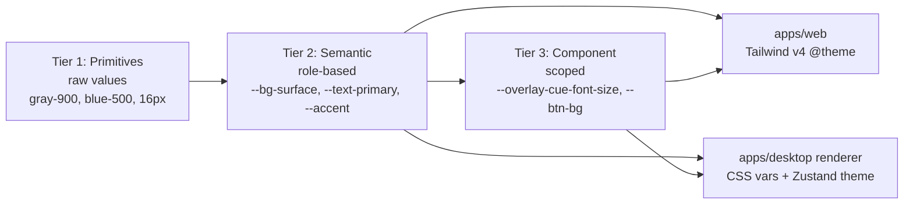
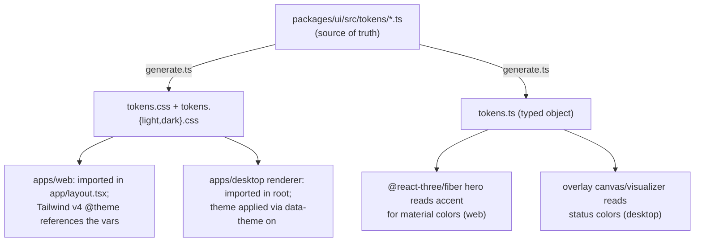
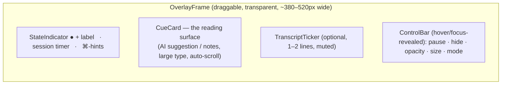
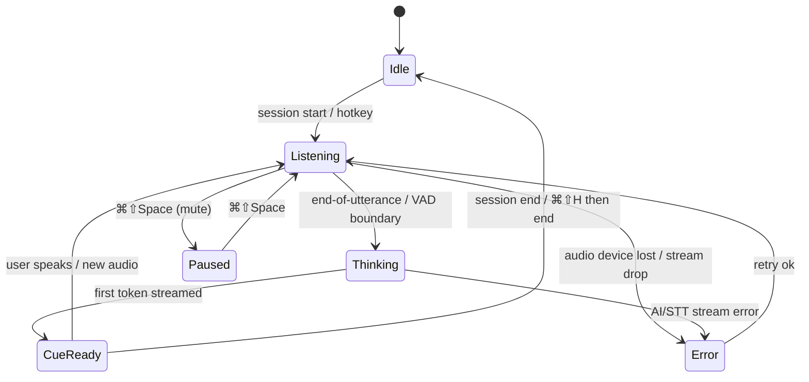

# Design System — AssistMe

> Status: Draft · Owner: Head of Design / Design Systems Lead · Last updated: 2026-07-29 · Related: [Product Vision](01-product-vision.md) · [Desktop App](10-desktop-app.md) · [Web Landing](11-web-landing.md) · [Engineering Standards](13-engineering-standards.md) · [Repository Structure](03-repository-structure.md)

This document defines the visual and interaction language for **AssistMe** (provisional brand name; formerly Cue), the single source of truth for design tokens, and the shared `packages/ui` component library consumed by both `apps/web` (Next.js) and `apps/desktop` (Electron renderer). It owns the **overlay UX** — the teleprompter surface that is the product's beating heart — and the **accessibility** posture across both surfaces.

It does **not** own the marketing site's 3D hero (see [Web Landing](11-web-landing.md)) or the Electron windowing/content-protection internals (see [Desktop App](10-desktop-app.md)). It defines the tokens and components those docs consume.

---

## 1. Design principles

AssistMe is a tool people use *while under pressure* — mid-interview, mid-sales-call, mid-standup. The design language is engineered for **peripheral cognition**: the user glances, absorbs, and returns their attention to the human on the call. Every decision below serves that.

1. **Glanceable over comprehensive.** The overlay is read in <500ms peripheral glances, not studied. Hierarchy, size, and contrast are tuned for recognition, not reading comprehension.
2. **Calm, never demanding.** No color that screams, no motion that grabs. AssistMe must never pull the user's gaze harder than the person they are talking to. Attention is the scarcest resource on a live call.
3. **Invisible by default.** The product's core promise is discretion. The visual language is restrained, dark-first, low-chroma. The overlay must look like nothing when idle.
4. **Confidence through legibility.** Type, spacing, and contrast are dialed for readability under stress and poor lighting (users on laptops, in cafes, in bad video-call lighting).
5. **One system, two surfaces.** Web (marketing/dashboard) and desktop (overlay/settings) share one token graph. Divergence is a bug.
6. **Accessible as a feature, not a checkbox.** Accessibility personas (anxiety, ADHD, hearing difficulty, non-native speakers) are a *primary* market — see [Product Vision](01-product-vision.md). WCAG 2.2 AA is the floor, AAA where cheap.

### ADR-001 — Dark-first, low-chroma palette as the default identity

- **Decision:** AssistMe's default and canonical theme is dark, with a deliberately low-saturation accent. Light theme is a first-class alternate but the brand is expressed in dark.
- **Context:** The overlay floats over video calls, screen shares, and IDEs, mostly on dark or mixed backgrounds. A bright/high-chroma identity would be visually loud, betray the "discreet" promise, and fatigue users over long sessions.
- **Alternatives considered:** (a) Bright SaaS-blue identity — rejected as attention-grabbing and generic; (b) pure grayscale — rejected as cold and undifferentiated; (c) neon "AI" aesthetic — rejected as gimmicky and low-legibility.
- **Trade-offs:** Dark-first requires extra rigor on light-theme contrast and on marketing pages that convention expects to be bright. We accept that cost.
- **Consequence:** All tokens are authored dark-first; light theme is a derived, hand-tuned override, not an afterthought.

---

## 2. Brand & voice

| Attribute | Expression |
|---|---|
| **Personality** | Composed, precise, quietly competent. A great executive assistant, not a hype-man. |
| **Logo/wordmark** | Lowercase `cue`, geometric sans, tight tracking. A single "cue dot" (●) glyph used as the app/tray icon and the overlay's idle indicator. |
| **Tone in UI copy** | Direct, short, second person. "Listening…", "Ready when you are.", "No audio detected — check your input device." Never coy, never anthropomorphized ("I think you should…"). |
| **Tone in overlay cues** | The AI's suggested content is visually and typographically distinct from AssistMe's own system chrome. Users must always know *what is the machine's suggestion* vs *what is AssistMe talking to them*. |
| **Motion feel** | Ease-out, short, damped. Things settle; nothing bounces. |

### Voice rules for cue content vs system chrome

A hard rule that drives component design: **AI-generated suggestion text** and **AssistMe's own interface text** are never styled the same. AssistMe chrome uses `--text-muted` at smaller sizes; AI cues use `--text-primary` at the reading size. This prevents the user from ever reading a system status as something to say aloud — a real failure mode for a teleprompter product.

---

## 3. Design tokens

### 3.1 Token architecture

Tokens live in `packages/ui` and are the contract between design and both apps. We use a **three-tier token model**:



- **Tier 1 primitives** are never used directly in components. They exist so semantic tokens have a palette to reference.
- **Tier 2 semantic tokens** are what components consume 95% of the time. They are theme-aware (light/dark) and the *only* layer that changes between themes.
- **Tier 3 component tokens** exist only where a component needs overridable knobs (the overlay's font size is user-adjustable at runtime, so it must be a token).

### ADR-002 — Tokens as CSS custom properties, generated from a TS source of truth

- **Decision:** Author tokens once in TypeScript (`packages/ui/src/tokens/`), generate (a) CSS custom-property stylesheets for both apps and (b) a typed `tokens` object for JS access. Tailwind v4 consumes the same variables via `@theme`.
- **Context:** Two runtimes (Next.js server+client, Electron renderer) must share identical values. Hard-coding twice guarantees drift. Runtime theme switching and the user-adjustable overlay require CSS variables (not build-time-inlined values).
- **Alternatives considered:** (a) Tailwind config as source of truth — rejected because the Electron renderer's overlay needs runtime-mutable variables and non-Tailwind consumers; (b) Style Dictionary — viable, but adds a toolchain; our needs are met by a ~120-line generator script; (c) CSS-in-JS runtime theming — rejected for overlay perf and SSR complexity.
- **Trade-offs:** A tiny custom generator to maintain vs a heavier off-the-shelf pipeline. We keep it under 700 LOC and typed.
- **Consequence:** `pnpm --filter @cue/ui build:tokens` emits `dist/tokens.css`, `dist/tokens.light.css`, `dist/tokens.dark.css`, and `dist/tokens.ts`. Both apps import the CSS; TS consumers import `tokens`.

**Token package layout** (respects the code-splitting standard — small, focused files):

```
packages/ui/src/tokens/
├── types.ts             # Token type definitions (ColorToken, SpaceScale, …)
├── primitives.ts        # Tier 1: raw palettes & scales
├── semantic.light.ts    # Tier 2: light theme role mapping
├── semantic.dark.ts     # Tier 2: dark theme role mapping
├── components.ts        # Tier 3: component-scoped tokens
├── index.ts             # Public export surface (typed `tokens`)
└── generate.ts          # Emits CSS + TS artifacts (build step)
```

### 3.2 Color — primitives

Neutral ramp is a slightly cool gray (a hint of blue) so dark surfaces read as "engineered" not muddy. Accent is a restrained cyan-teal — legible on dark, distinctive without being loud.

| Token | Hex | Token | Hex |
|---|---|---|---|
| `gray-0` | `#FFFFFF` | `gray-700` | `#2A2E37` |
| `gray-50` | `#F6F7F9` | `gray-800` | `#1C1F26` |
| `gray-100` | `#ECEEF2` | `gray-900` | `#12141A` |
| `gray-200` | `#DCE0E7` | `gray-950` | `#0A0B0F` |
| `gray-300` | `#C2C8D2` | `accent-400` | `#4DD8C8` |
| `gray-400` | `#9AA2B1` | `accent-500` | `#22C3B2` |
| `gray-500` | `#6B7382` | `accent-600` | `#16A497` |
| `gray-600` | `#454B57` | `accent-700` | `#0E7C73` |

Status primitives (used sparingly, never at full chroma in the overlay):

| Token | Hex | Meaning |
|---|---|---|
| `green-500` | `#3FB27F` | ok / listening-healthy |
| `amber-500` | `#E0A94A` | thinking / warning |
| `red-500` | `#E56A6A` | error (deliberately desaturated) |
| `blue-500` | `#5B8DEF` | info / links |

### 3.3 Color — semantic tokens (theme-aware)

The semantic layer is what components use. Below, the canonical dark values and the light overrides. All foreground/background pairs listed meet the noted WCAG ratio.

| Semantic token | Dark | Light | Role / min contrast |
|---|---|---|---|
| `--bg-base` | `gray-950` | `gray-0` | app/window background |
| `--bg-surface` | `gray-900` | `gray-50` | cards, panels |
| `--bg-surface-raised` | `gray-800` | `gray-0` | popovers, menus |
| `--bg-overlay` | `rgba(10,11,15,0.72)` | `rgba(10,11,15,0.72)` | overlay backplate (see §5) |
| `--text-primary` | `gray-50` | `gray-900` | AI cues, headings — ≥ 7:1 (AAA) |
| `--text-secondary` | `gray-300` | `gray-600` | body — ≥ 4.5:1 |
| `--text-muted` | `gray-400` | `gray-500` | AssistMe chrome/status — ≥ 4.5:1 |
| `--border-subtle` | `gray-700` | `gray-200` | dividers |
| `--border-strong` | `gray-600` | `gray-300` | inputs, focus base |
| `--accent` | `accent-400` | `accent-600` | primary actions, active states |
| `--accent-contrast` | `gray-950` | `gray-0` | text/icon on accent fill |
| `--focus-ring` | `accent-400` | `accent-600` | 2px ring + 2px offset |
| `--status-ok` | `green-500` | `green-500` | listening indicator |
| `--status-thinking` | `amber-500` | `amber-500` | thinking indicator |
| `--status-error` | `red-500` | `red-500` | error state |

> **Note on the overlay backplate:** `--bg-overlay` is intentionally identical in both themes. The overlay floats over unknown, arbitrary backgrounds (someone's screen share, a bright doc, a dark IDE), so its readability cannot depend on the app theme — it carries its own semi-opaque scrim. See §5.3.

### 3.4 Typography

Two families, both variable fonts, both self-hosted (no external CDN — matters for the Electron renderer's CSP and offline use):

- **Sans (UI + cues):** `Inter` variable. Excellent legibility at small sizes and on low-DPI external monitors; wide language coverage for non-native-speaker persona.
- **Mono (code cues, timestamps, metrics):** `JetBrains Mono` variable. Cues often contain code, commands, numbers — a mono fallback for those spans.

Type scale (1.20 minor-third on web; the overlay has its **own, larger, user-scalable** scale in §5.2):

| Token | Size / line-height | Weight | Usage |
|---|---|---|---|
| `--font-display` | 40 / 44 | 640 | marketing hero, dashboard page titles |
| `--font-h1` | 30 / 36 | 620 | section headings |
| `--font-h2` | 24 / 30 | 600 | subsections |
| `--font-h3` | 20 / 26 | 600 | card titles |
| `--font-body-lg` | 18 / 28 | 440 | lead paragraphs |
| `--font-body` | 16 / 24 | 440 | default body |
| `--font-body-sm` | 14 / 20 | 440 | secondary |
| `--font-caption` | 12 / 16 | 500 | labels, meta |
| `--font-mono` | 14 / 22 | 460 | code, timestamps |

Weights use the variable-font axis (`font-variation-settings: 'wght' …`) so we ship one file per family. `font-feature-settings: 'tnum' 1, 'cv05' 1` on numeric/UI contexts for tabular figures.

### 3.5 Spacing, radius, elevation, motion primitives

**Spacing** — 4px base, geometric-ish scale. Token `--space-{n}`:

| n | px | n | px |
|---|---|---|---|
| 0 | 0 | 4 | 16 |
| 1 | 4 | 5 | 20 |
| 2 | 8 | 6 | 24 |
| 3 | 12 | 8 | 32 |
| — | — | 10 | 40 |

Plus `--space-12: 48`, `--space-16: 64` for layout.

**Radius:** `--radius-sm: 6px`, `--radius-md: 10px`, `--radius-lg: 14px`, `--radius-full: 9999px`. The overlay uses `--radius-lg` for a soft, non-clinical feel.

**Elevation** — dark UIs get depth from *lighter surfaces + soft ambient shadow + subtle top hairline*, not heavy drop shadows:

| Token | Definition | Usage |
|---|---|---|
| `--elev-0` | none | base |
| `--elev-1` | `0 1px 2px rgba(0,0,0,.30), inset 0 1px 0 rgba(255,255,255,.03)` | cards |
| `--elev-2` | `0 6px 16px rgba(0,0,0,.35)` | popovers, menus |
| `--elev-overlay` | `0 12px 40px rgba(0,0,0,.55)` | the overlay window |

**Motion primitives** (see §7 for usage):

| Token | Value |
|---|---|
| `--dur-instant` | 80ms |
| `--dur-fast` | 140ms |
| `--dur-base` | 220ms |
| `--dur-slow` | 360ms |
| `--ease-out` | `cubic-bezier(0.16, 1, 0.3, 1)` |
| `--ease-in-out` | `cubic-bezier(0.65, 0, 0.35, 1)` |

### 3.6 How tokens reach each app



Theme is switched by setting `data-theme="light|dark"` (and `data-contrast="high"`, `data-motion="reduced"`) on the root element. Both apps default to `dark`. The desktop app persists theme in the Zustand store and honors the OS `prefers-color-scheme` on first run; the web app uses `next-themes` with `class`/`data-theme` strategy and no-flash SSR script.

```css
/* Excerpt of generated tokens.css (structure) */
:root[data-theme="dark"] {
  --bg-base: #0A0B0F;
  --text-primary: #F6F7F9;
  --accent: #4DD8C8;
  /* … */
}
:root[data-theme="light"] { /* light overrides */ }
:root[data-contrast="high"] { /* AAA overrides, see §6 */ }
@media (prefers-reduced-motion: reduce) { :root { /* durations → 0 */ } }
```

---

## 4. The `packages/ui` component library

### 4.1 Strategy

- **Headless-first.** Interactive primitives (Dialog, Popover, Menu, Tooltip, Switch, Tabs, Slider) wrap **Radix UI** for correct ARIA/focus/keyboard behavior; we own the styling via tokens. This buys us accessibility we would otherwise get wrong.
- **Styling engine.** Tailwind v4 utility classes bound to our CSS variables, composed with `cva` (class-variance-authority) for variants and `tailwind-merge` for safe overrides. No CSS-in-JS runtime.
- **Isomorphic.** Every component must render in the Next.js server component tree *and* the Electron renderer. Components that need browser APIs are marked `'use client'` and kept leaf-level. No component imports `electron` or `next/*` directly — platform concerns are injected via props/context.
- **Icons.** `lucide-react`, tree-shaken. A small custom set for AssistMe-specific glyphs (cue dot, waveform) as inline SVG React components.

### ADR-003 — Radix primitives + Tailwind v4 + cva, no component-level CSS-in-JS

- **Decision:** Build on Radix headless primitives, style with Tailwind v4 + cva, share tokens as CSS variables.
- **Context:** We need WCAG-correct interaction (focus traps, roving tabindex, ARIA) fast, plus SSR safety on web and low overhead in the overlay renderer.
- **Alternatives:** shadcn/ui (we adopt its *approach* — Radix+Tailwind+cva — but vendor components into `packages/ui` so both apps share them rather than per-app copies); MUI (too opinionated/heavy, hard to theme to a discreet identity); Panda/Stitches CSS-in-JS (runtime cost, SSR complexity).
- **Trade-offs:** Vendoring means we maintain component source; acceptable for control and cross-app sharing.
- **Consequence:** One `@cue/ui` package; both apps import the same compiled components and CSS.

### 4.2 Package layout (code-splitting compliant)

Every non-trivial component is a folder split into `types.ts`, `utils.ts`, `use-*.ts` hooks, and focused view files — no file over 700 LOC, view files orchestrate while logic lives in hooks/utils (per [Engineering Standards](13-engineering-standards.md)).

```
packages/ui/src/
├── tokens/                      # §3.1
├── primitives/                  # low-level styled Radix wrappers
│   ├── button/
│   │   ├── types.ts             # ButtonProps, variant unions
│   │   ├── button.variants.ts   # cva definition
│   │   ├── button.tsx           # view (orchestrates)
│   │   └── index.ts
│   ├── dialog/ · popover/ · tooltip/ · switch/ · tabs/ · slider/ · input/ · select/ …
├── components/                  # composed, product-level
│   ├── kbd/                     # keyboard-shortcut chip
│   ├── status-pill/             # listening/thinking/error pill
│   ├── waveform/                # mic/loopback level visualizer (canvas)
│   └── empty-state/
├── overlay/                     # SHARED overlay building blocks (see §5)
│   ├── cue-card/
│   │   ├── types.ts
│   │   ├── use-auto-scroll.ts   # auto-scroll logic (hook)
│   │   ├── use-glance-timer.ts  # dwell/opacity logic (hook)
│   │   ├── cue-card.tsx         # view
│   │   └── index.ts
│   ├── overlay-frame/
│   ├── state-indicator/
│   └── control-bar/
├── hooks/                       # cross-cutting: use-theme, use-media-query, use-reduced-motion, use-hotkeys
├── lib/                         # cn(), formatDuration(), a11y helpers
└── index.ts
```

> The overlay building blocks live in `packages/ui/overlay` (not in `apps/desktop`) so the marketing site can render a *pixel-accurate, non-functional* overlay preview in its 3D hero and feature sections — one implementation, zero drift. The desktop app wires them to real audio/AI streams; the web app feeds them scripted demo data.

### 4.3 Component inventory & variants

| Component | Variants / key props | Notes |
|---|---|---|
| `Button` | `variant`: primary · secondary · ghost · danger · quiet; `size`: sm · md · lg; `iconOnly` | `quiet` used in overlay to stay unobtrusive |
| `IconButton` | same as Button, square | 40px min target on web, 32px in overlay |
| `Kbd` | single key or chord (`⌘⇧Space`) | renders OS-correct glyphs via `use-os` |
| `StatusPill` | `state`: idle · listening · thinking · cue-ready · error · paused | shared with overlay `StateIndicator` |
| `Waveform` | `source`: mic · system · both; `active` | canvas, reads `--status-*`, reduced-motion → static bars |
| `Dialog` / `Sheet` | sizes; `Sheet` slides from edge | Radix Dialog under the hood |
| `Popover` / `DropdownMenu` / `ContextMenu` | — | overlay settings, device pickers |
| `Tooltip` | delay, side | never the only affordance (a11y) |
| `Tabs` | line · segmented | dashboard, settings |
| `Switch` / `Checkbox` / `RadioGroup` | — | settings, consent toggles |
| `Slider` | continuous · stepped | overlay opacity & font-size controls (§5.2) |
| `Input` / `Textarea` / `Select` | states: default · error · disabled | RAG upload metadata, profile |
| `Toast` | info · success · warning · error | never used in overlay (too demanding); desktop uses native/tray for critical |
| `Card` / `Panel` | elev 1/2 | dashboard, session history |
| `Avatar` / `Badge` / `Tag` | — | team, entitlement labels |
| `EmptyState` | illustration slot | first-run, no history |
| `ProgressMeter` | linear · usage-ring | AI-minutes usage (ties to [Entitlements](50-subscriptions-entitlements.md)) |
| **Overlay-only** | `OverlayFrame`, `CueCard`, `StateIndicator`, `ControlBar`, `TranscriptTicker` | §5 |

Example `cva` variant contract (the load-bearing shape referenced by both apps):

```ts
// packages/ui/src/primitives/button/button.variants.ts
export const buttonVariants = cva(
  'inline-flex items-center justify-center gap-2 rounded-[var(--radius-md)] ' +
  'font-medium transition-[background,transform,box-shadow] duration-[var(--dur-fast)] ' +
  'ease-[var(--ease-out)] focus-visible:outline-none focus-visible:ring-2 ' +
  'focus-visible:ring-[var(--focus-ring)] focus-visible:ring-offset-2 ' +
  'focus-visible:ring-offset-[var(--bg-base)] disabled:opacity-50 disabled:pointer-events-none',
  {
    variants: {
      variant: {
        primary:   'bg-[var(--accent)] text-[var(--accent-contrast)] hover:brightness-110',
        secondary: 'bg-[var(--bg-surface-raised)] text-[var(--text-primary)] border border-[var(--border-strong)]',
        ghost:     'bg-transparent text-[var(--text-secondary)] hover:bg-[var(--bg-surface)]',
        quiet:     'bg-transparent text-[var(--text-muted)] hover:text-[var(--text-primary)]',
        danger:    'bg-[var(--status-error)] text-[var(--accent-contrast)]',
      },
      size: { sm: 'h-8 px-3 text-[13px]', md: 'h-10 px-4 text-sm', lg: 'h-12 px-5 text-base' },
    },
    defaultVariants: { variant: 'secondary', size: 'md' },
  },
);
```

---

## 5. Overlay UX — the centerpiece

The overlay is a transparent, frameless, always-on-top window, excluded from screen capture (window mechanics in [Desktop App](10-desktop-app.md)). This section owns everything the user *sees and feels* inside it.

### 5.1 Anatomy & default layout



- **Default position:** top-center of the primary display, ~64px from top, horizontally centered — the teleprompter position, closest to the webcam so the user's eyes read as "looking at camera." User can drag anywhere; position persists per display.
- **Width:** default 440px, resizable 320–640px. Height auto-grows to content up to a `max-height` (default 42vh) then the CueCard scrolls internally.
- **Idle footprint:** when idle the overlay collapses to just the `StateIndicator` — a single small pill with the cue dot. Minimal on-screen presence honors the "invisible by default" principle.

### 5.2 Teleprompter readability

Readability is the product. The overlay has its **own type scale**, larger than the app scale, and several parameters are **user-adjustable at runtime** (persisted, and surfaced as Tier-3 component tokens so the values flow through the same variable system).

| Overlay token | Default | Range (user) | Rationale |
|---|---|---|---|
| `--overlay-cue-font-size` | 20px | 16–30px | large enough for peripheral glance at arm's length |
| `--overlay-cue-line-height` | 1.5 | fixed | generous leading aids fast re-acquisition of the line |
| `--overlay-cue-measure` | ~46ch | — | short measure = fewer eye returns per line |
| `--overlay-opacity` | 0.92 | 0.35–1.0 | discretion vs legibility trade-off, user's call |
| `--overlay-backplate` | see §5.3 | 3 modes | contrast guarantee over unknown backgrounds |
| `--overlay-max-height` | 42vh | 25–70vh | how much cue text is visible at once |

Design rules for the reading surface:

- **Type:** `--overlay-cue-font-size` at weight 460, `--text-primary`, `text-wrap: pretty`, hyphenation off (hyphens hurt glanceability).
- **Contrast:** cue text vs the backplate is guaranteed ≥ 7:1 (AAA) regardless of what's behind the overlay, because of the backplate (§5.3).
- **Chunking:** cues stream in as **short, self-contained lines/bullets**, not paragraphs. The AI pipeline is prompted to emit glanceable chunks (see [AI Pipeline](21-ai-pipeline.md) prompt design); the design contract is: max ~2 lines per idea, leading keyword bolded.
- **Emphasis:** the AI may mark a **lead keyword** per cue (e.g. the one word to anchor on). Rendered as `--text-primary` weight 620; the rest at 460. This is the single most-used glanceability affordance.
- **Auto-scroll (`use-auto-scroll.ts`):** as new cues arrive, the card eases the newest content to a **"reading line" at ~40% from top** (not the very bottom), so the freshest cue sits where the eye rests, with prior context visible above. Scroll uses `--dur-slow`/`--ease-out`, respects reduced-motion (jumps instead). Manual scroll pauses auto-scroll for 5s (a "sticky bottom" pattern), with a subtle "↓ live" affordance to resume.
- **Fade edges:** top and bottom of the CueCard have an 24px mask-image fade so text enters/leaves gracefully rather than clipping.
- **Glance timer (`use-glance-timer.ts`):** optional "focus fade" — after N seconds without new content and without pointer/keyboard, the overlay eases toward `--overlay-opacity * 0.6` so a stale cue doesn't linger at full strength. Any new cue or hotkey restores full opacity. Off by default; on for the "minimal" preset.

### 5.3 Contrast over unknown backgrounds — the backplate

Because the overlay floats over arbitrary content, we cannot rely on the app background. The `CueCard` carries its own **backplate** with three modes (user-selectable, default = Scrim):

| Mode | Implementation | When |
|---|---|---|
| **Scrim** (default) | `--bg-overlay` (`rgba(10,11,15,0.72)`) + `backdrop-filter: blur(12px) saturate(0.9)` + 1px `--border-subtle` | best balance; blur separates text from busy backgrounds |
| **Solid** | opaque `--bg-surface`, no blur | max legibility, least discreet; for accessibility/high-contrast |
| **Minimal** | no plate; text gets a `text-shadow` halo (`0 1px 3px rgba(0,0,0,.9)`) + thin outline | most discreet; only viable on reasonably dark backgrounds |

> `backdrop-filter` is GPU-cheap in the Electron renderer and preserves the "floating glass" feel while guaranteeing the AAA contrast ratio between cue text and its immediate plate. High-contrast mode (§6) forces **Solid**.

### 5.4 States

The overlay is a small state machine. Each state has a distinct `StateIndicator` (color + label + motion) and CueCard treatment. Colors are deliberately desaturated so none of them alarms.



| State | Indicator | Motion | CueCard | Copy |
|---|---|---|---|---|
| **Idle** | cue dot, `--text-muted` | none | collapsed | "Ready when you are." |
| **Listening** | dot → `--status-ok`, live `Waveform` | gentle waveform reactive to level | shows latest cues, dimmed slightly | "Listening…" |
| **Thinking** | dot → `--status-thinking` | slow 1.4s pulse (opacity, not size) | shimmer/skeleton line at reading position | "Thinking…" |
| **Cue-ready** | dot → `--accent` briefly, then `--status-ok` | new cue eases in + subtle accent underline sweep on lead keyword (140ms) | new cue at reading line, full `--text-primary` | — (content only) |
| **Paused** | dot hollow, `--text-muted`; mic-off glyph | none (static) | frozen, 0.7 opacity | "Paused — audio muted" |
| **Error** | dot → `--status-error` | single shake is **forbidden**; use a static ring + inline message | last good cue stays; error banner below | e.g. "Lost microphone — reconnecting" |

**Error philosophy:** errors on a live call must not startle. No flashing, no shake, no sound. A calm desaturated-red ring, a one-line human message, and (when possible) automatic recovery with a "reconnecting" affordance. Actionable errors (e.g. "grant screen-recording permission") link to the fix.

### 5.5 Keyboard-driven control

The overlay is **primarily keyboard-driven** — a user on camera cannot fumble with a mouse. Global shortcuts are registered by the desktop app ([Desktop App](10-desktop-app.md) owns registration & conflict handling); this doc owns the **UX contract and discoverability**.

| Action | Default (mac / win) | Notes |
|---|---|---|
| Show / hide overlay | `⌘⇧H` / `Ctrl⇧H` | instant; the panic key — memorable, single chord |
| Pause / resume audio | `⌘⇧Space` / `Ctrl⇧Space` | mutes capture, freezes cues |
| Cycle mode (Answer/Notes/Silent) | `⌘⇧M` / `Ctrl⇧M` | §5.6 |
| Nudge opacity −/+ | `⌘⇧[` / `⌘⇧]` | 10% steps |
| Nudge font size −/+ | `⌘⇧-` / `⌘⇧=` | maps to `--overlay-cue-font-size` |
| Scroll cue up/down | `⌘⇧↑ / ↓` | for re-reading; re-locks to live on release |
| Ask for elaboration | `⌘⇧E` | requests a deeper cue (opus) for the last topic |
| Regenerate last cue | `⌘⇧R` | |
| Move overlay to next display | `⌘⇧→` | multi-monitor |

Discoverability rules: hotkeys are shown as `Kbd` chips in the `ControlBar` (revealed on hover/focus), in a **first-run coach overlay**, and in a `⌘⇧/` cheat-sheet. The `ControlBar` is fully operable by mouse too — keyboard is primary, not exclusive (a11y).

### 5.6 Modes

| Mode | Purpose | Cue style |
|---|---|---|
| **Answer** (default) | interview/sales: suggested things to say | short answer chunks, lead keyword bolded |
| **Notes** | meetings: live summary/action items | bulleted running notes, decisions/actions tagged |
| **Silent** | discretion / disclosed contexts | overlay shows only listening state + timer, no generated cues (still records notes to history if consented) |

Mode is one hotkey away and always visible in the `StateIndicator`. "Disclosed mode" behavior and consent gating are owned by the legal/compliance doc — the design surfaces a persistent, unmistakable indicator when a session is being recorded/summarized.

### 5.7 Overlay component contracts (shared, code-split)

```ts
// packages/ui/src/overlay/cue-card/types.ts
export type CueChunk = {
  id: string;
  text: string;
  leadKeyword?: string;         // rendered emphasized
  kind: 'answer' | 'note' | 'action' | 'fact';
  citations?: { docId: string; label: string }[]; // RAG provenance → tooltip
  createdAt: number;
};

export interface CueCardProps {
  chunks: CueChunk[];
  state: OverlayState;          // 'idle'|'listening'|'thinking'|'cueReady'|'paused'|'error'
  fontSizePx: number;          // bound to --overlay-cue-font-size
  backplate: 'scrim' | 'solid' | 'minimal';
  reducedMotion: boolean;
  onRequestElaborate?(chunkId: string): void;
}
```

`cue-card.tsx` is a thin view; `use-auto-scroll.ts` and `use-glance-timer.ts` hold the behavior; rendering a single chunk lives in a `cue-chunk.tsx` leaf — no file over 700 LOC, matching the house code-splitting rule.

---

## 6. Accessibility

Accessibility is a **primary market**, not compliance theater — the anxiety/ADHD/hearing-difficulty/non-native personas are core (see [Product Vision](01-product-vision.md)). AssistMe is, for many users, itself an assistive technology.

### 6.1 Standards & targets

- **WCAG 2.2 Level AA** across web and desktop; **AAA for the overlay reading surface** (7:1 text contrast, guaranteed by the backplate).
- Minimum target size 24×24 CSS px (AA 2.5.8); 40px on web primary controls.
- Visible focus on every interactive element: 2px `--focus-ring` + 2px offset, never removed, never outline:none without replacement.
- No information by color alone: every status has color **and** shape/label/icon (the cue dot changes fill state, not just hue).

### 6.2 Reduced motion

`prefers-reduced-motion: reduce` (and the in-app `data-motion="reduced"` toggle) disables: auto-scroll easing (→ instant jump), the thinking pulse (→ static "Thinking…" text), waveform animation (→ 3 static bars sized to level), accent underline sweep, and all decorative marketing motion. This is wired via the shared `use-reduced-motion` hook so no component decides on its own.

### 6.3 High-contrast

`data-contrast="high"` swaps in AAA semantic overrides, forces the overlay backplate to **Solid**, thickens borders to 2px, and raises `--text-secondary`/`--text-muted` toward primary. On Windows we also honor `forced-colors: active` (Windows High Contrast) by mapping to system colors and never suppressing them.

### 6.4 Screen readers & assistive tech

The overlay is a genuinely unusual SR case: it's a private HUD over someone else's call. Rules:

- The overlay window exposes an ARIA live region (`aria-live="polite"`, `aria-atomic="false"`) so new cues are announced — invaluable for low-vision users using AssistMe as a reading aid. **User-controllable**: announcements can be off (default in Answer mode, since a screen reader speaking cues aloud could be heard) or on (the reading-aid use case). This tension is called out as an open question below.
- Semantic roles: `StateIndicator` uses `role="status"`; `ControlBar` buttons have explicit `aria-label`s and `aria-keyshortcuts` matching §5.5; the mode control is a labeled group.
- Full keyboard operability (§5.5) means no mouse-only path exists.
- Marketing site: landmarks, skip-link, alt text, captions on all demo videos, and the 3D hero has a reduced-motion + fully-described static fallback (see [Web Landing](11-web-landing.md)).

### 6.5 Non-native-speaker & cognitive-load support

- Plain-language UI copy; no idioms in system chrome.
- Overlay type/measure tuned for fast reading; lead-keyword emphasis reduces cognitive load — directly serves ADHD and non-native personas.
- Adjustable font size and opacity (§5.2) let users tune to their needs.
- A "define/simplify" cue action (`⌘⇧E` elaborate can also "say this more simply") for non-native users.

---

## 7. Motion & animation

Motion exists to explain state change and guide the eye — never for delight at the cost of attention.

**Principles:** short (≤ `--dur-slow`), damped `--ease-out`, opacity/transform only (never animate layout on the overlay — GPU only), and **nothing loops aggressively** near the reading surface. On a live call, looping motion in peripheral vision is a documented attention drain — we avoid it.

| Element | Animation | Duration / easing |
|---|---|---|
| Cue enters | fade + 4px rise | `--dur-base` / `--ease-out` |
| Lead-keyword underline | left-to-right sweep once | 140ms / `--ease-out` |
| Auto-scroll | transform to reading line | `--dur-slow` / `--ease-out` |
| Thinking indicator | opacity pulse 1.0→0.55→1.0 | 1.4s loop, opacity only (off in reduced-motion) |
| Overlay show/hide | fade + 6px + slight scale (0.98→1) | `--dur-base` |
| State color change | color transition | `--dur-fast` |
| Web hero / sections | Framer Motion, scroll-linked | owned by [Web Landing](11-web-landing.md); uses these tokens |

Implementation: overlay animations use CSS transitions + the Web Animations API (no heavy animation lib in the renderer hot path); the web app uses Framer Motion. Both read the same `--dur-*`/`--ease-*` tokens, and both gate on `use-reduced-motion`.

---

## 8. Cross-surface consistency & governance

- **Single source of truth:** `packages/ui`. Any color/spacing/type value used in either app *must* come from a token. CI lints for raw hex/px in `apps/*` (allowlist for a few one-offs) — see [Engineering Standards](13-engineering-standards.md).
- **Storybook** in `packages/ui` documents every component, variant, and both themes + high-contrast + reduced-motion, with an a11y addon (axe) in CI. A dedicated "Overlay Playground" story renders the overlay over sample busy backgrounds to validate the backplate.
- **Visual regression** via Storybook + Chromatic (or Playwright screenshots) on the token and overlay stories; a token change that shifts the overlay is caught in PR.
- **Figma parity:** Figma variables mirror the Tier-1/Tier-2 tokens 1:1; the generator's TS source is authoritative and a script diffs Figma-exported tokens against it to flag drift.
- **Contribution rule:** new component → folder with `types.ts`/variants/hooks/view, Storybook story (incl. dark + a11y), exported from `index.ts`. No exceptions.

---

## Open questions & risks

- **SR announcements vs discretion (§6.4).** An `aria-live` region that reads cues aloud is a genuine accessibility win but could be *heard by the other party* on a call — directly conflicting with the discretion promise. Current stance: off by default in Answer mode, opt-in with a clear warning. Needs UX research with low-vision users and legal review.
- **Backplate legibility on truly arbitrary backgrounds.** Scrim + blur guarantees contrast in most cases, but pathological bright backgrounds may still stress the "Minimal" mode. Do we auto-detect background luminance (sampling the screen under the overlay) to switch backplate — and does sampling the screen conflict with the capture-exclusion/privacy posture? Needs prototyping on both OSes.
- **User-adjustable overlay tokens vs guaranteed AAA.** If a user sets opacity to 0.35 and font size to 16px over a busy background, we can no longer *guarantee* AAA. Do we hard-floor certain combinations, or warn and defer to the user? Leaning toward soft warnings + a "restore readable defaults" hotkey.
- **Font licensing/self-hosting.** Inter + JetBrains Mono are OFL and safe to self-host; confirm the final brand wordmark font's license before launch (the provisional `cue` wordmark may need a licensed or custom face).
- **`backdrop-filter` performance & capture behavior.** Confirm blur doesn't interact badly with `WDA_EXCLUDEFROMCAPTURE` / `NSWindowSharingType=none` on all target OS versions, and that it stays GPU-cheap during long sessions (owned jointly with [Desktop App](10-desktop-app.md)).
- **Brand name is provisional.** "AssistMe" and the cue-dot mark are placeholders; a naming/trademark pass may force a palette/wordmark revision. Tokens are name-agnostic, so churn is contained to the wordmark and icon assets.
- **Windows forced-colors coverage.** Full `forced-colors: active` support for the overlay (a non-standard surface) needs testing across Windows 10/11 high-contrast themes.
