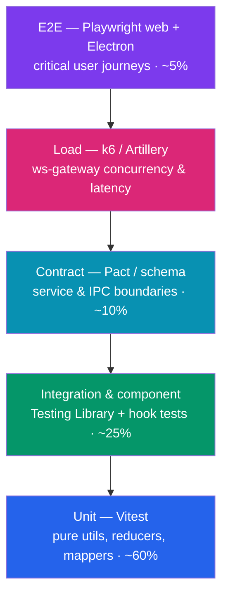
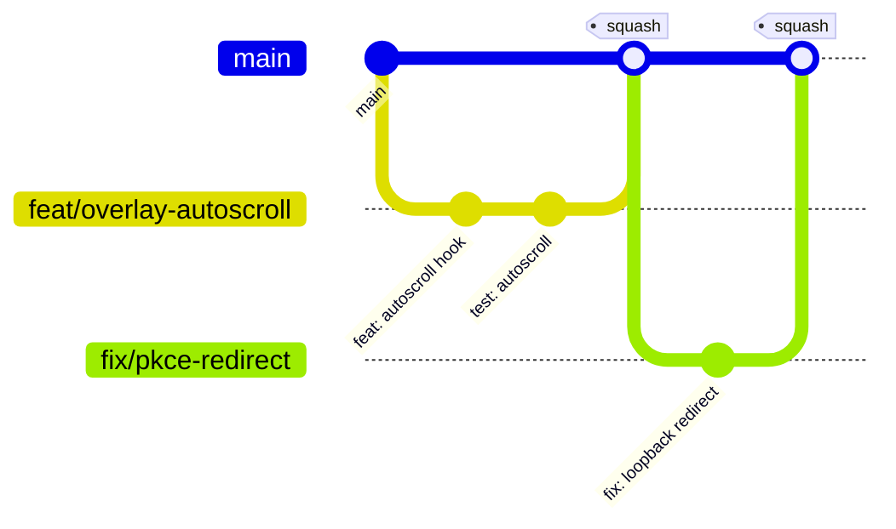
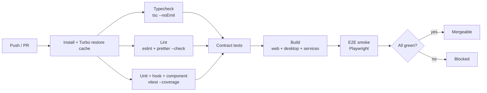

# Engineering Standards & Ways of Working

> Status: Draft · Owner: Principal Engineer (Platform) · Last updated: 2026-07-29 · Related: [Repository structure](03-repository-structure.md) · [Desktop app](10-desktop-app.md) · [Backend services](20-backend-services.md) · [Observability](61-observability.md) · [DevOps & infrastructure](60-devops-infrastructure.md) · [Design system](12-design-system.md)

This document is the contract every engineer on **Cue** (provisional brand) signs up to. It defines how we write, structure, type, test, review, and ship code across the monorepo — `apps/desktop`, `apps/web`, the backend services (`api`, `ws-gateway`, `ai-orchestrator`, `entitlements`, `billing-webhooks`), and the shared `packages/*`. The rules here are enforced by CI and by tooling wherever possible; where they cannot be automated they are enforced in review.

The guiding principle: **code is read far more than it is written, and this is a latency-critical, security-sensitive product.** Clarity, small units, strong types, and fast feedback loops win over cleverness every time.

---

## 1. The code-splitting law

Every module — a desktop overlay screen, a Next.js route, a NestJS feature, a shared UI component group — is decomposed the same way. This is non-negotiable and applies repo-wide.

### 1.1 The five roles

| File / folder | Responsibility | Must NOT contain |
| --- | --- | --- |
| `types.ts` | DTOs, props, domain types, enums, discriminated unions, zod schemas for the module | Runtime logic, side effects |
| `utils.ts` | Pure, stateless, deterministic functions. Same input → same output | React hooks, I/O, `Date.now()` without injection, network calls |
| `hooks/use-*.ts` | Stateful logic, effects, subscriptions, data fetching, IPC wiring, store selectors | JSX, presentational markup |
| Focused components (`*.tsx`) | One component, one job. Presentational; receive data + callbacks via props | Business logic, direct API/IPC calls, complex derivations |
| Page / container (`page.tsx`, `<Feature>.tsx`) | **Orchestration only.** Compose hooks + components, wire props, own layout | Business logic, data transforms, inline fetch/parse |

**Rules that CI and review enforce:**

1. **No single file over 700 LOC.** Enforced by an ESLint rule (`max-lines`, see §3). When a file approaches ~500 LOC, split proactively.
2. **Pages/containers orchestrate; logic lives in hooks and utils.** A page component is a wiring diagram: it reads from hooks, passes props down, and lays out children. If a page has a `useMemo` with a 30-line transform, that transform belongs in `utils.ts` and the memo in a hook.
3. **Components are presentational and focused.** A component that both fetches data and renders a table is two things — split the fetch into `use-*.ts`.
4. **Strong TypeScript types; avoid `any`.** `any` is banned by lint (`@typescript-eslint/no-explicit-any: error`). Use `unknown` + narrowing, generics, or a proper type. `packages/types` is the shared home for cross-boundary types, but it is not hand-authored: **wire/API DTOs are _generated_ from the `api` Zod schemas (the source of truth) via a codegen step, and DB row types are _generated_ from the Drizzle schema** — a CI drift check (`turbo run codegen:check`) fails the build if committed types diverge. Reconciled per [decision record](04-decision-record.md) (A09).
5. **Pure utils are unit-tested; hooks are integration-tested; components get component tests.** The split makes each layer independently testable (see §4).

### 1.2 Canonical folder shape

A feature module (identical shape in desktop renderer, web, and shared UI):

```text
overlay-cues/
├─ types.ts                 # CueItem, CueStream, OverlayCuesProps
├─ utils.ts                 # formatCue(), rankCues(), truncateForOverlay()
├─ hooks/
│  ├─ use-cue-stream.ts     # subscribes to ws-gateway stream via IPC
│  ├─ use-cue-visibility.ts # global-shortcut show/hide, opacity state
│  └─ use-cue-autoscroll.ts # teleprompter scroll behavior
├─ components/
│  ├─ cue-line.tsx          # renders one cue line (presentational)
│  ├─ cue-list.tsx          # maps cues → CueLine (presentational)
│  └─ cue-empty-state.tsx
├─ overlay-cues.tsx         # container: composes hooks + components
└─ index.ts                 # barrel: re-export public surface only
```

NestJS services follow the framework's grain but the same spirit — thin controllers orchestrate, providers/services hold logic, DTOs live in dedicated files, and no god-service over 700 LOC:

```text
ai-orchestrator/
├─ ai-orchestrator.controller.ts   # thin: validates, delegates
├─ ai-orchestrator.module.ts
├─ dto/                             # request/response DTOs (zod/class-validator)
├─ services/
│  ├─ stt-stream.service.ts        # Deepgram streaming client
│  ├─ context-assembly.service.ts  # transcript + RAG + profile → prompt
│  ├─ llm-stream.service.ts        # Claude streaming + prompt caching
│  └─ rag.service.ts               # pgvector retrieval (Voyage embeddings)
└─ utils/
   └─ latency-budget.ts            # pure timing helpers
```

### 1.3 Good vs bad example

**Bad — one file does everything (logic in the component, `any`, over-stuffed):**

```tsx
// overlay-cues.tsx  ❌
export function OverlayCues({ sessionId }: { sessionId: string }) {
  const [cues, setCues] = useState<any[]>([]); // ❌ any

  useEffect(() => {
    // ❌ IPC + parsing + business logic inline in a component
    const off = window.cue.onStream((raw: any) => {
      const parsed = JSON.parse(raw);
      const ranked = parsed.items
        .filter((c: any) => c.confidence > 0.4)
        .sort((a: any, b: any) => b.score - a.score)
        .slice(0, 5)
        .map((c: any) => ({ ...c, text: c.text.slice(0, 140) })); // ❌ transform inline
      setCues((prev) => [...prev, ...ranked]);
    });
    return off;
  }, [sessionId]);

  return (
    <div>
      {cues.map((c) => (
        <div key={c.id} style={{ opacity: c.confidence }}>{c.text}</div>
      ))}
    </div>
  );
}
```

**Good — split by role, strongly typed, orchestration-only container:**

```ts
// types.ts  ✅
export interface RawCue { id: string; text: string; confidence: number; score: number; }
export interface CueItem { id: string; text: string; confidence: number; }
export interface OverlayCuesProps { sessionId: string; }
```

```ts
// utils.ts  ✅ pure + testable
import type { RawCue, CueItem } from "./types";

const MAX_CUES = 5;
const CUE_CHAR_LIMIT = 140;
const MIN_CONFIDENCE = 0.4;

export function rankCues(raw: readonly RawCue[]): CueItem[] {
  return [...raw]
    .filter((c) => c.confidence > MIN_CONFIDENCE)
    .sort((a, b) => b.score - a.score)
    .slice(0, MAX_CUES)
    .map(({ id, text, confidence }) => ({
      id,
      confidence,
      text: text.length > CUE_CHAR_LIMIT ? `${text.slice(0, CUE_CHAR_LIMIT)}…` : text,
    }));
}
```

```ts
// hooks/use-cue-stream.ts  ✅ stateful logic, IPC wiring, no JSX
import { useEffect, useState } from "react";
import { rankCues } from "../utils";
import type { CueItem, RawCue } from "../types";

interface StreamFrame { items: RawCue[] }

export function useCueStream(sessionId: string): CueItem[] {
  const [cues, setCues] = useState<CueItem[]>([]);
  useEffect(() => {
    const off = window.cue.onStream((frame: StreamFrame) =>
      setCues((prev) => [...prev, ...rankCues(frame.items)]),
    );
    return off;
  }, [sessionId]);
  return cues;
}
```

```tsx
// components/cue-line.tsx  ✅ presentational, focused
import type { CueItem } from "../types";
export function CueLine({ cue }: { cue: CueItem }) {
  return <div className="cue-line" style={{ opacity: cue.confidence }}>{cue.text}</div>;
}
```

```tsx
// overlay-cues.tsx  ✅ container = orchestration only
import { useCueStream } from "./hooks/use-cue-stream";
import { CueLine } from "./components/cue-line";
import type { OverlayCuesProps } from "./types";

export function OverlayCues({ sessionId }: OverlayCuesProps) {
  const cues = useCueStream(sessionId);
  return (
    <div className="overlay-cues" role="log" aria-live="polite">
      {cues.map((cue) => <CueLine key={cue.id} cue={cue} />)}
    </div>
  );
}
```

`rankCues` is now a 4-line unit test; `useCueStream` is a hook test with a mocked `window.cue`; `CueLine` is a snapshot/render test; the container needs no logic test at all.

---

## 2. TypeScript configuration & strictness

TypeScript everywhere, Node 22 LTS, `"module": "NodeNext"` for backend, bundler resolution for Vite/Next. A single base config lives in `packages/config/tsconfig.base.json` and every app/package extends it.

```jsonc
// packages/config/tsconfig.base.json
{
  "compilerOptions": {
    "target": "ES2023",
    "lib": ["ES2023"],
    "strict": true,                          // enables all strict flags
    "noUncheckedIndexedAccess": true,        // arr[i] is T | undefined
    "exactOptionalPropertyTypes": true,      // { x?: T } ≠ { x: T | undefined }
    "noImplicitOverride": true,
    "noFallthroughCasesInSwitch": true,
    "noImplicitReturns": true,
    "noPropertyAccessFromIndexSignature": true,
    "useUnknownInCatchVariables": true,      // catch (e: unknown)
    "verbatimModuleSyntax": true,            // explicit import type
    "isolatedModules": true,
    "skipLibCheck": true,
    "forceConsistentCasingInFileNames": true,
    "declaration": true,
    "sourceMap": true
  }
}
```

**Rules:**

- `any` is a lint **error**, not a warning. Escape hatches (`as unknown as T`, `@ts-expect-error`) require an inline comment justifying them and are flagged in review.
- Cross-boundary types (API/wire DTOs, IPC message contracts, the `latest.yml`/`latest-mac.yml` release manifest, DB row types) are consumed from `packages/types` by both producer and consumer. No duplicated interface definitions. The DTOs there are **generated, not hand-written**: the `api` Zod schemas are the source of truth and a codegen step emits their `z.infer` types into `packages/types` (consumed by `sdk`, `ws-gateway`, `entitlements`, and clients); DB row types are generated on a separate, non-overlapping axis from the Drizzle schema (see [Data model](30-data-model.md) §4). A CI drift check regenerates both and fails the build on divergence. Reconciled per [decision record](04-decision-record.md) (A09).
- Runtime validation at every trust boundary uses **zod** schemas colocated with the DTO; `z.infer` derives the static type so the schema and type never drift — and, for API DTOs, this is the exact schema the `packages/types` codegen consumes.
- Prefer discriminated unions over boolean flags and optional soup. Model impossible states out of existence.

---

## 3. Linting, formatting & import boundaries

- **ESLint 9 flat config** shared from `packages/config/eslint`. **Prettier 3** for formatting (Prettier owns whitespace; ESLint owns correctness — no stylistic overlap).
- Key rules: `@typescript-eslint/no-explicit-any: error`, `no-floating-promises: error`, `@typescript-eslint/no-misused-promises: error`, `max-lines: ["error", { max: 700, skipBlankLines: true, skipComments: true }]`, `import/no-cycle: error`.

### 3.1 Import boundaries

Two layers of enforcement so architecture erosion is caught at commit time:

1. **Turborepo dependency graph** — a package can only import from packages it declares in `package.json`. `packages/ui` may depend on `packages/types` but never on `apps/*`. `apps/*` may depend on `packages/*` but never on each other.
2. **`eslint-plugin-import` + `eslint-plugin-boundaries`** — enforce intra-app layering:

```jsonc
// boundaries config (illustrative)
{
  "boundaries/elements": [
    { "type": "types",      "pattern": "**/types.ts" },
    { "type": "utils",      "pattern": "**/utils.ts" },
    { "type": "hooks",      "pattern": "**/hooks/*.ts" },
    { "type": "components", "pattern": "**/components/*.tsx" },
    { "type": "container",  "pattern": "**/*.tsx" }
  ],
  "boundaries/rules": [
    { "from": "utils",      "disallow": ["hooks", "components", "container"] },
    { "from": "components", "disallow": ["container"] },
    { "from": "types",      "disallow": ["utils", "hooks", "components", "container"] }
  ]
}
```

This makes the code-splitting law (§1) machine-checked: `utils.ts` importing a hook fails lint.

- **Electron process isolation is a hard boundary.** Renderer code may never import `electron` main-process modules or Node built-ins; all privileged operations go through a typed `contextBridge` preload API whose contract lives in `packages/types`. Enforced by a lint rule banning `electron`/`fs`/`child_process` imports in `src/renderer/**`. See [Desktop app](10-desktop-app.md).

---

## 4. Testing strategy

We test in proportion to the classic pyramid: many fast, isolated unit tests; fewer integration/component tests; a thin layer of high-value end-to-end tests. Given the latency and content-protection requirements, we add **load tests** and **contract tests** as first-class citizens.



| Layer | Tooling | Scope | Runs |
| --- | --- | --- | --- |
| Unit | **Vitest** | Pure functions in `utils.ts`, reducers, pure mappers, zod schemas, `packages/core` domain logic | On every commit, per-package, in watch mode locally |
| Hook | **Vitest + @testing-library/react** (`renderHook`) | `hooks/use-*.ts` with mocked IPC/fetch/store | Per PR |
| Component | **@testing-library/react** + Vitest (jsdom) | Presentational components, accessibility roles, interaction | Per PR |
| Contract | **Pact** (HTTP) + **zod-schema round-trip** (IPC & WS frames) | `api` ↔ `sdk`, `ws-gateway` ↔ desktop, entitlements ↔ Stripe webhooks | Per PR + on provider change |
| E2E (web) | **Playwright** | Download flow, auth (PKCE), checkout redirect, release-feed rendering | Per PR (smoke) + nightly (full) |
| E2E (desktop) | **Playwright for Electron** (`_electron` API) | App launch, login, overlay show/hide via global shortcut, content-protection flag set, updater feed parse | Nightly + pre-release |
| Load | **k6** (HTTP) + **Artillery** (WebSocket) | `ws-gateway` concurrent sessions, audio-frame throughput, p95 cue latency budget | Pre-release + weekly on staging |

**Coverage targets (enforced in CI as thresholds, not vanity metrics):**

- `packages/core`, `packages/sdk`, all `utils.ts`: **≥ 90% lines / branches** (pure logic, cheap to cover).
- Backend services (`api`, `ai-orchestrator`, `entitlements`, `billing-webhooks`): **≥ 80%**.
- Renderer hooks + components: **≥ 70%**.
- **Coverage is a floor, not a ceiling, and we do not chase 100%.** Meaningful assertions over line-count. New code lowering package coverage below its floor fails CI.

**Testing conventions:**

- Test files colocated: `utils.test.ts` beside `utils.ts`. E2E specs in `apps/*/e2e`.
- Deterministic: inject clocks (`() => Date`), seed randomness, freeze time in tests. No network in unit/component tests.
- **Content protection is verified in desktop E2E** by asserting `BrowserWindow.isContentProtected()` (macOS `NSWindowSharingType`, Windows `WDA_EXCLUDEFROMCAPTURE`) is set before any session starts — a release blocker if it regresses. See [Desktop app](10-desktop-app.md).
- **Load-test gates:** a release cannot ship if the `ws-gateway` load run breaches **either** canonical latency budget — server-controllable `cue_server_latency_ms` < **900 ms** p95 (endpointing→egress, the error-budgeted SLO) **and** full user-perceived `cue_latency_ms` < **1200 ms** p95 (endpointing→painted overlay token) — or STT partials < 300 ms. Cold-cache cues are included. The two budgets and their trace split are defined in [Observability §6/§9](61-observability.md) (ADR-61.1); see [Scalability](70-scalability.md) for the capacity model these runs validate.

### 4.4 End-to-end latency release gate

The k6/Artillery load gates above drive **synthetic audio through `ws-gateway`** — they validate the server slice but stop at egress and never paint a pixel. They cannot, on their own, certify the user-perceived budget. So we add a distinct **e2e latency release gate** that exercises the *full* `utterance → painted-overlay-token` path on real hardware.

| Property | Value |
| --- | --- |
| What it measures | `cue_server_latency_ms` (endpointing→egress) **and** `cue_latency_ms` (endpointing→**painted overlay token**), from the same START (`stt.speech_final`) as prod, using the ingress/egress trace split |
| Where | `staging`, against the live control plane in-region (client and region co-located so the *server* budget is not polluted by test-runner WAN) |
| Hardware | **Representative** dedicated runners: a mid-tier macOS (Apple Silicon) and a mid-tier Windows laptop matching the desktop min-spec — not a headless cloud box, because overlay paint + content-protection compositing are OS-real costs |
| Method | Scripted Playwright-for-Electron drives a recorded utterance corpus (incl. **cold-cache / cache-miss** first cues); the desktop stamps a monotonic *painted-token* timestamp echoed back so the client-network+paint leg is measured, not estimated |
| Pass condition | `cue_server_latency_ms` p95 < 900 ms **and** `cue_latency_ms` p95 < 1200 ms across the corpus; **breach of either budget blocks the release** |
| Wiring | Runs pre-release in CI on the self-hosted representative runners (§5.2), gating the desktop release tag alongside the content-protection matrix and the update tamper-rejection suite |

> **ADR-13.1 — Latency is gated at two altitudes.** The synthetic k6 load run gates the *server* budget cheaply on every pre-release; the hardware e2e gate additionally gates the *full user-perceived* budget on representative macOS/Windows before a desktop tag ships. A green load run is necessary but **not sufficient** — the paint leg only exists in the e2e gate. Both budgets are defined once in [Observability §6/§9](61-observability.md); this gate is where CI enforces them. *Addresses audit A07, SR-03 via [05-remediation-plan.md](05-remediation-plan.md).*

---

## 5. Git workflow

**Trunk-based development with short-lived branches (GitHub Flow).** `main` is always releasable. Branches live hours-to-days, not weeks; large features hide behind PostHog feature flags rather than long-running branches.



- **Branch naming:** `feat/…`, `fix/…`, `chore/…`, `docs/…`, `refactor/…`, `perf/…`.
- **Conventional Commits**, enforced by `commitlint` + Husky commit-msg hook. Format: `type(scope): subject`, e.g. `feat(desktop): exclude overlay from Teams capture`, `fix(ws-gateway): backpressure on audio frames`. Scopes map to services/packages. This drives automated CHANGELOG generation and semantic release versioning for the desktop app.
- **Squash-merge to `main`** so history reads as one logical change per PR. The squash subject must be a valid conventional commit.
- **`main` is protected:** no direct pushes, required status checks, required review, linear history, signed commits (GPG/SSH) required.

> Note (repo policy): CI performs merges and tags; engineers never push to `main` or open release PRs manually without explicit maintainer approval. Automated pushes are surfaced in the PR, never silent.

### 5.1 PR review checklist

Every PR description auto-includes this checklist (repo `.github/pull_request_template.md`). Reviewers block on any unchecked mandatory item:

- [ ] **Scope:** one logical change; PR is < ~400 lines of diff where feasible.
- [ ] **Code-splitting law:** no file > 700 LOC; logic in hooks/utils; components presentational; pages orchestrate.
- [ ] **Types:** no `any`; cross-boundary types sourced from `packages/types`; zod validation at trust boundaries.
- [ ] **Tests:** new logic has unit tests; hooks/components covered; coverage floors met; contract tests updated if a boundary changed.
- [ ] **Security:** no secrets in code; inputs validated; no new renderer→main import; authz checked; PII minimized. Ref [Authentication](40-authentication.md).
- [ ] **Observability:** meaningful structured logs, spans, and error capture added for new paths (see §7).
- [ ] **Performance:** latency-critical paths (audio→cue) profiled or reasoned about against the budget in [AI pipeline](21-ai-pipeline.md).
- [ ] **Docs:** relevant `docs/*` updated; CHANGELOG entry auto-generated via commit type.
- [ ] **Feature flag:** user-facing changes gated behind a flag if not fully baked.

Reviews: **at least one approving review** (two for changes to auth, payments, content-protection, or IaC). Authors do not merge their own PRs without a reviewer approval. CODEOWNERS routes reviews to the owning team.

### 5.2 CI gates

GitHub Actions pipeline; Turborepo remote caching skips unaffected packages. All gates must pass before merge:



| Gate | Command (per affected package) | Blocking |
| --- | --- | --- |
| Typecheck | `turbo run typecheck` (`tsc --noEmit`) | Yes |
| DTO/DB codegen drift | `turbo run codegen:check` (regenerate `packages/types` from `api` Zod + Drizzle; fail on diff) | Yes (A09) |
| Lint & format | `turbo run lint` + `prettier --check` | Yes |
| Test + coverage | `turbo run test -- --coverage` | Yes (coverage floors) |
| Contract | `turbo run test:contract` | Yes when a boundary changed |
| Build | `turbo run build` (Next build, Vite build, Nest build, electron-builder dry pack) | Yes |
| E2E smoke | `turbo run test:e2e -- --grep @smoke` | Yes |
| **Frozen lockfile** | `pnpm install --frozen-lockfile` (no CI-side lockfile mutation) | Yes |
| **Dependency-advisory scan** | `pnpm audit --prod` + advisory DB scan | Yes (high/critical **fail**) |
| **Secret scan** | `gitleaks` / `trufflehog` on the diff + full history on `main` | Yes (any finding **fails**) |
| **SBOM generation** | CycloneDX SBOM emitted per build, attached to the artifact | Yes (must generate) |
| Static analysis | CodeQL | Yes (high/critical) |
| Load / full E2E | k6 + Artillery + full Playwright | Nightly/pre-release, not per-PR |
| **e2e latency release gate** | hardware `utterance→painted-token` run (§4.4) | **Pre-release, blocks tag** (either budget breach) |
| **Update tamper-rejection** | reject bad manifest signature / swapped installer / mis-signed binary | **Pre-release, blocks desktop tag** |

The bold rows are the **merge-gate half of the software supply-chain program**; they catch problems at commit/PR time. Their heavier counterparts — **SLSA build provenance, independent update-manifest signing (minisign/TUF, key distinct from R2/S3), hash-pinned native addons, and signing-key provisioning** — plus the *provisioning* of the SBOM/scan tooling and the desktop release/update pipeline are owned by [DevOps & infrastructure §supply-chain](60-devops-infrastructure.md). `electron-updater autoDownload` must not be enabled until that program is live. *Addresses audit S-01, S-04 via [05-remediation-plan.md](05-remediation-plan.md).*

Full DR, environment promotion, code signing, and the desktop release/update pipeline are owned by [DevOps & infrastructure](60-devops-infrastructure.md).

---

## 6. Definition of Done

A change is **Done** — not "code complete" — only when all of the following hold:

1. Acceptance criteria met and demoed against the ticket.
2. Code follows the splitting law and all CI gates are green.
3. Unit/hook/component tests written; coverage floors respected; a regression test exists for any bug fixed.
4. Contract tests updated for any changed API/IPC/WS boundary; `packages/types` bumped and consumers updated.
5. Errors handled and logged per §7; new paths emit OpenTelemetry spans + Sentry capture.
6. Security & privacy reviewed: inputs validated, authz enforced, secrets in AWS Secrets Manager / OS keychain (never in code), PII minimized, training opt-out respected. See [Authentication](40-authentication.md).
7. Feature flag configured (and default state decided) if user-facing.
8. Relevant `docs/*` and the auto-generated CHANGELOG updated.
9. Observability confirmed: dashboards/alerts exist or are updated for new critical paths ([Observability](61-observability.md)).
10. Merged to `main` via squash; feature verified in `staging` before flag flip to prod.

---

## 7. Error-handling & logging conventions

### 7.1 Error handling

- **Typed, domain errors — never throw strings.** A shared `AppError` base (`packages/core`) carries a stable `code` (enum), HTTP/IPC status, `retryable` flag, and a **safe user-facing message** distinct from internal detail.

```ts
// packages/core/errors.ts
export type ErrorCode =
  | "AUTH_TOKEN_EXPIRED" | "ENTITLEMENT_EXCEEDED"
  | "STT_UPSTREAM_FAILED" | "LLM_RATE_LIMITED" | "SESSION_NOT_FOUND";

export class AppError extends Error {
  constructor(
    readonly code: ErrorCode,
    message: string,                 // internal, logged
    readonly opts: { status: number; retryable: boolean; userMessage: string } ,
    readonly cause?: unknown,
  ) { super(message); this.name = "AppError"; }
}
```

- **Result types for expected failures, exceptions for exceptional ones.** Predictable branches (validation, entitlement checks) return `Result<T, AppError>`; only truly exceptional conditions throw. Never use exceptions for control flow.
- **No swallowed errors.** Every `catch` must log, rethrow, or convert to a `Result`. `catch (e: unknown)` (per `useUnknownInCatchVariables`) then narrow. `no-floating-promises` guarantees every promise is awaited or explicitly handled.
- **Boundaries own translation.** NestJS uses a global exception filter mapping `AppError`→HTTP + `traceId`. React uses error boundaries around each overlay surface so one failing cue stream never blanks the whole overlay. The `ws-gateway` degrades gracefully — a failed LLM stream surfaces a "reconnecting" cue rather than tearing down the socket.
- **Resilience patterns** on all upstream calls (Deepgram, AssemblyAI fallback, Anthropic, Stripe): timeouts, bounded retries with jittered backoff, and circuit breakers. STT auto-fails over Deepgram→AssemblyAI. Detailed budgets in [AI pipeline](21-ai-pipeline.md).

### 7.2 Logging

- **Structured JSON via `pino`** everywhere on the backend; a thin pino-style logger in main-process desktop. Log **events with fields**, never interpolated prose.
- **Correlation:** every request/session carries a `traceId` (OpenTelemetry) + `sessionId`; propagated through `api`→`ws-gateway`→`ai-orchestrator` and returned to clients for support.
- **Levels:** `error` (needs attention), `warn` (degraded/handled), `info` (state transitions, e.g. session start/end), `debug` (dev only). Default prod level `info`.
- **Never log PII or secrets.** Transcript text, audio, tokens, resume/JD content, emails, and Stripe identifiers are redacted or hashed. A pino redaction paths config enforces this; PII minimization is a compliance requirement, not a preference.

```ts
logger.info({ event: "session.started", sessionId, traceId, tier, sttProvider: "deepgram" });
logger.error({ event: "llm.stream.failed", sessionId, traceId, code: "LLM_RATE_LIMITED", err });
// ❌ never: logger.info(`user ${email} said ${transcript}`)
```

Logs ship to CloudWatch/Loki; errors to **Sentry** (desktop + web + backend); traces to **OpenTelemetry**; product events to **PostHog**; infra metrics to **Prometheus/Grafana**. Alerting, SLOs, dashboards, and retention are owned by [Observability](61-observability.md).

---

## Open questions & risks

- **Coverage floors vs. velocity:** the 90% floor on `packages/core`/`utils` is achievable, but the 70% renderer-hook floor may be strained by hard-to-test Electron IPC and OS audio APIs. We may need a documented allowlist of "integration-only, unit-exempt" hooks — risk of that becoming a loophole.
- **Desktop E2E flakiness:** Playwright-for-Electron plus OS-level content-protection assertions are historically flaky across macOS/Windows CI runners. If nightly flake rate exceeds ~5% we need dedicated self-hosted signing/test runners — cost + maintenance implication for [DevOps](60-devops-infrastructure.md).
- **700-LOC limit vs. generated code:** Drizzle migrations, zod schemas, and generated SDK clients can legitimately exceed 700 LOC. Need a clear `overrides` glob so lint doesn't fight generated artifacts.
- **Contract-test ownership at the STT/LLM edge:** Deepgram/Anthropic are third parties we cannot run Pact against; we rely on recorded fixtures that can silently drift from live API behavior. Need a scheduled canary that hits real upstreams on staging.
- **Squash-merge vs. bisectability:** squashing keeps `main` clean but coarsens `git bisect` for latency regressions in the audio→cue path. Open question whether critical perf changes should merge-commit instead.
- **Enforcing "logic in hooks/utils" objectively:** the boundaries lint catches import direction but cannot measure "too much logic in a component." This stays partly a review judgment call — risk of inconsistent enforcement across teams.
- **e2e latency gate runner fidelity + cost:** the §4.4 gate needs *representative* macOS/Windows self-hosted runners (headless cloud boxes mis-measure overlay paint). Shared with the desktop-E2E runner need above; risk of gate flakiness from clock-skew in the painted-token echo — mitigation is a monotonic client clock with server round-trip correction (see [Observability open-Q3](61-observability.md)).
- **Supply-chain gate noise vs. velocity:** advisory + secret scans as hard high/critical gates can block on transitive-dep CVEs with no fix available; we need a time-boxed, reviewed allow-exception path (owned with [DevOps §supply-chain](60-devops-infrastructure.md)) that never silently downgrades a real finding.
