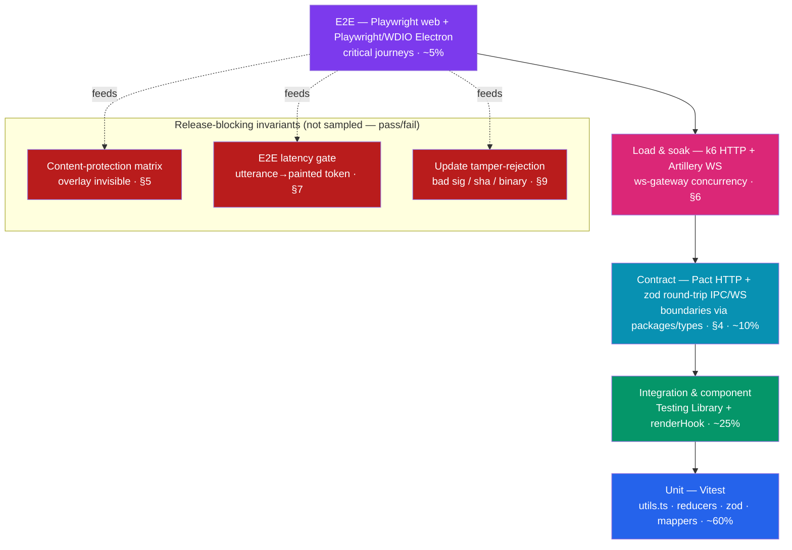
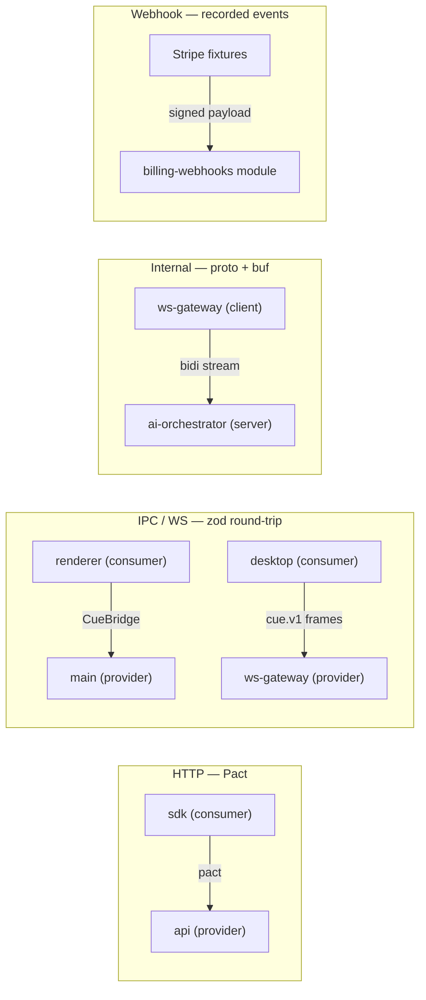
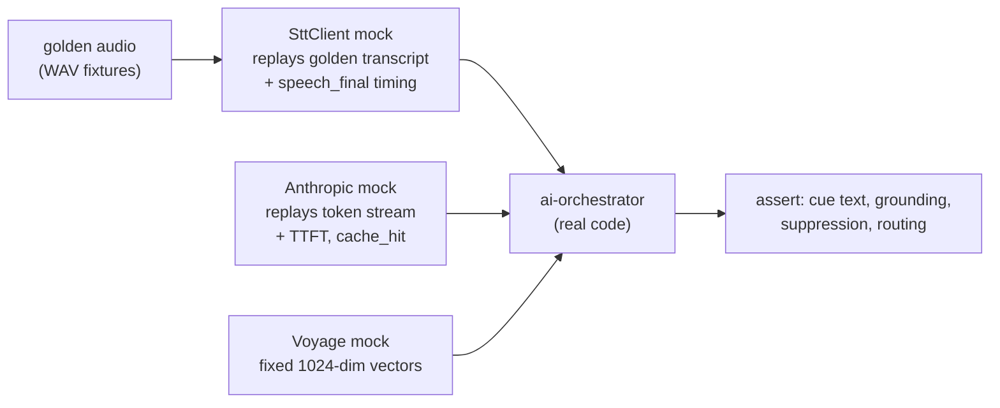
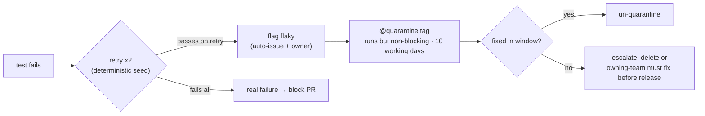

# Test & QA Strategy

> Status: Draft · Owner: Principal Engineer (Quality & Release) · Last updated: 2026-07-29 · Related: [Engineering standards](13-engineering-standards.md) · [Desktop app](10-desktop-app.md) · [AI pipeline](21-ai-pipeline.md) · [Backend services](20-backend-services.md) · [Observability](61-observability.md) · [Remediation plan](05-remediation-plan.md) · [Decision record](04-decision-record.md)

This document deepens the testing strategy sketched in [Engineering standards §4](13-engineering-standards.md) into an executable QA plan for **AssistMe**. §4 there sets the pyramid, tooling, and coverage floors; this doc specifies *how* each layer is written, *which* release gates block a tag, *how* the two hardest gates (content-protection invisibility and the two-budget latency gate) are mechanized, and how every gate wires into CI. It does not restate the CI pipeline diagram (owned by [§5.2 there](13-engineering-standards.md)) or the SLO catalog (owned by [Observability §9](61-observability.md)) — it consumes both.

Two principles frame everything below, inherited from the product's shape:

1. **Two properties are non-negotiable release blockers, not quality signals:** the overlay is *invisible to capture* (§5), and a cue is painted *inside both latency budgets* (§7). Neither is a percentage we optimize toward — a single regression blocks the desktop tag.
2. **We never test against real third parties on the hot path.** Deepgram, Anthropic, and Voyage are mocked with golden transcripts and recorded fixtures (§8); a scheduled canary (§8.4) is the only place live upstreams are hit, and it is diagnostic, not a merge gate.

---

## 1. The testing pyramid (deepened)

The proportions and tooling come from [Engineering standards §4](13-engineering-standards.md); this doc adds the two OS-real gates that sit *beside* the pyramid rather than inside it — they are pass/fail invariants, not sampled coverage.



| Layer | Tooling | What it proves | Cadence |
|---|---|---|---|
| Unit | **Vitest** | Pure `utils.ts`, reducers, zod schemas, `packages/core` domain logic, model-router decisions, backpressure math | Every commit (watch locally) |
| Hook | **Vitest + @testing-library/react** (`renderHook`) | `hooks/use-*.ts` with mocked `window.cue` IPC / fetch / Zustand store | Per PR |
| Component | **@testing-library/react** + Vitest (jsdom) | Presentational `*.tsx`, ARIA roles, reduced-motion, keyboard | Per PR |
| Contract | **Pact** (HTTP) + **zod round-trip** (IPC & WS frames) | `api`↔`sdk`, `ws-gateway`↔desktop, `ws-gateway`↔`ai-orchestrator` gRPC, `billing-webhooks`↔Stripe | Per PR + on provider change |
| E2E web | **Playwright** | Download flow, PKCE auth, checkout redirect, release-feed render | Per PR (`@smoke`) + nightly (full) |
| E2E desktop | **Playwright for Electron** (`_electron`) + **WebdriverIO** (native-menu / Squirrel install paths WDIO covers better) | Launch, login, overlay show/hide, click-through, updater feed parse | Nightly + pre-release |
| Load & soak | **k6** (HTTP) + **Artillery** (WebSocket) | `ws-gateway` concurrency, backpressure, reconnection, server-budget p95 | Pre-release + weekly on staging |

**Why two Electron drivers.** Playwright-for-Electron (`_electron.launch`) is the primary driver for in-window behavior (React overlay, IPC, shortcuts) because it shares the web Playwright API and fixtures. WebdriverIO's `wdio-electron-service` covers what Playwright cannot: driving the **installed** app through the Squirrel/NSIS installer, native menu-bar/tray interaction, and the auto-update *restart-and-relaunch* cycle. The updater tamper suite (§9) and the "accessory app, no Dock icon" assertions run under WDIO; everything else runs under Playwright.

---

## 2. Unit, hook & component layers

The code-splitting law ([Engineering standards §1](13-engineering-standards.md)) is what makes this layer cheap: because logic lives in `utils.ts` and `hooks/`, each is independently testable and the container needs no logic test.

**Unit — pure `utils.ts`.** Deterministic, no I/O, injected clocks. Example against the `rankCues` helper from [§1.3 there](13-engineering-standards.md):

```ts
// overlay-cues/utils.test.ts
import { describe, expect, it } from "vitest";
import { rankCues } from "./utils";
import type { RawCue } from "./types";

const raw = (over: Partial<RawCue>): RawCue =>
  ({ id: "c1", text: "hi", confidence: 0.9, score: 1, ...over });

describe("rankCues", () => {
  it("drops cues below the confidence floor", () => {
    expect(rankCues([raw({ confidence: 0.3 })])).toHaveLength(0);
  });
  it("caps at MAX_CUES and truncates to the char limit", () => {
    const out = rankCues(Array.from({ length: 9 }, (_, i) =>
      raw({ id: `c${i}`, score: i, text: "x".repeat(200) })));
    expect(out).toHaveLength(5);
    expect(out[0]!.text.endsWith("…")).toBe(true);
  });
});
```

**Hook — `hooks/use-*.ts`.** `renderHook` with a typed mock of the preload bridge, so the IPC contract is exercised without Electron. The mock is generated from the `@cue/types` `CueBridge` interface so it cannot drift from the real surface.

```ts
// hooks/use-cue-stream.test.ts
import { renderHook, act } from "@testing-library/react";
import { useCueStream } from "./use-cue-stream";
import { installCueBridgeMock } from "@cue/testing/bridge"; // typed from CueBridge

it("appends ranked cues as frames arrive", () => {
  const bridge = installCueBridgeMock();
  const { result } = renderHook(() => useCueStream("sess_1"));
  act(() => bridge.emit("cues:token", { items: [{ id: "a", text: "Mention Stripe", confidence: 0.8, score: 2 }] }));
  expect(result.current).toHaveLength(1);
});
```

**Component — presentational `*.tsx`.** jsdom render, assert roles and reduced-motion, never business logic. The overlay uses `role="log" aria-live="polite"`; the test asserts that contract so screen-reader accessibility (a core persona, [AI pipeline §11](21-ai-pipeline.md)) does not regress.

Conventions (all from [Engineering standards §4](13-engineering-standards.md), enforced here): test files colocated (`utils.test.ts` beside `utils.ts`); inject clocks (`() => Date`), seed randomness, freeze time; **no network** in unit/component tests — a lint rule bans `fetch`/`ws`/`grpc` imports under `**/*.test.ts` that are not the mock package.

---

## 3. Contract tests across service boundaries

Every shape that crosses a process boundary lives in `packages/types` and is **generated from the `api` Zod schemas** ([Backend services §8](20-backend-services.md), [Engineering standards §2](13-engineering-standards.md)). Contract tests prove producer and consumer agree on that generated shape — the codegen drift check (`turbo run codegen:check`) guarantees the *types* match; contract tests guarantee the *runtime behavior* matches.



| Boundary | Mechanism | Provider check | Consumer check |
|---|---|---|---|
| `sdk` ↔ `api` (REST `/v1`) | **Pact** | `api` verifies the consumer pact in CI | `sdk` publishes expectations from typed resource clients |
| renderer ↔ main (`contextBridge`) | **zod round-trip** on every `CueBridge` channel | main-side handler validates payload with the same zod schema | renderer asserts each channel against `@cue/types` |
| desktop ↔ `ws-gateway` (`cue.v1`) | **zod round-trip** on `ClientMsg`/`ServerMsg` + binary-frame header codec test | gateway rejects unknown `t`, malformed 4-byte header | client encodes/decodes the discriminated union |
| `ws-gateway` ↔ `ai-orchestrator` (gRPC bidi) | **proto compatibility** via `buf breaking` + a stream round-trip integration test | server honors half-close/finalize | client honors flow-control backpressure signals |
| `billing-webhooks` ↔ Stripe | **recorded signed events** replayed against the module | signature verify + idempotent dedupe by `event.id` | n/a (Stripe is the producer) |

The WS frame contract is the highest-value one, because the binary audio header ([Backend services §6.3](20-backend-services.md)) is hand-packed for hot-path efficiency and JSON schemas cannot cover it:

```ts
// packages/types/ws.contract.test.ts
import { encodeAudioHeader, decodeAudioHeader } from "@cue/types/ws";

it("round-trips the 4-byte audio frame header", () => {
  const h = { type: 0x01, channel: 0x02, seq: 65_535 } as const; // opus, loopback, wrap edge
  expect(decodeAudioHeader(encodeAudioHeader(h))).toEqual(h);
});
```

`buf breaking` runs against the committed proto so a change to the `ai-orchestrator` stream that would break a deployed `ws-gateway` fails the PR — the two services deploy independently ([Backend services §11](20-backend-services.md)), so an N/N-1 compatibility window is a contract, not a hope.

---

## 4. Content-protection verification matrix (release blocker)

Overlay invisibility is AssistMe's core promise ([Desktop app §5](10-desktop-app.md)). It is verified two ways, both gating the desktop tag: a **fast static assertion** on every desktop E2E run, and a **frame-capture matrix** on representative hardware pre-release.

**Static assertion (every desktop E2E run).** Before any session can start, `BrowserWindow.isContentProtected()` must be `true`, and on Windows the direct `SetWindowDisplayAffinity(WDA_EXCLUDEFROMCAPTURE)` belt-and-suspenders call ([ADR-10.2](10-desktop-app.md)) must have been applied. This is cheap and catches the common regression — a refactor that drops the re-assert on `show`/display-change.

```ts
// apps/desktop/e2e/content-protection.assert.spec.ts (Playwright for Electron)
test("content protection is asserted before a session can start", async () => {
  const app = await electron.launch({ args: ["."] });
  const isProtected = await app.evaluate(async ({ BrowserWindow }) => {
    const [overlay] = BrowserWindow.getAllWindows();
    return overlay!.isContentProtected();
  });
  expect(isProtected).toBe(true); // release blocker if false
});
```

**Frame-capture matrix (pre-release, representative hardware).** A native harness starts a recording via each target's *own* capture API, shows the overlay bearing a known sentinel (a high-entropy QR so detection is unambiguous), grabs a frame, and asserts the sentinel is **absent**. This is the matrix from [Desktop app §5.3](10-desktop-app.md), promoted here to a gate with explicit pass/fail rows:

| Target | macOS | Windows | Method | Gate |
|---|---|---|---|---|
| Zoom screen share (full screen) | ScreenCaptureKit | Graphics.Capture | Automated frame-diff | **Blocks** |
| Google Meet (Chrome tab + full screen) | SCK | Graphics.Capture | Automated | **Blocks** |
| Microsoft Teams (desktop + web) | SCK | Graphics.Capture | Automated | **Blocks** |
| Cisco Webex | SCK | Graphics.Capture | Automated | **Blocks** |
| OS full-screen recorder | `screencapture` / SCK | Win+G Game Bar, Snipping Tool | Automated | **Blocks** |
| OBS | SCK source | Graphics.Capture + Display Capture | Automated | **Blocks** |
| Multi-monitor + display hotplug | ✅ re-assert | ✅ re-assert | Automated (affinity re-test) | **Blocks** |
| Zoom share (specific window) | ✅ | ✅ | Manual QA lab | Tracked |
| Legacy `PrintWindow` / GDI `BitBlt` | — | documented unsupported | Manual | Non-gate (disclosed) |

```ts
// apps/desktop/e2e/content-protection.matrix.spec.ts (native capture harness)
for (const target of GATED_CAPTURE_TARGETS) {
  test(`overlay sentinel is absent from ${target.name} frame`, async () => {
    await showOverlayWithSentinel(SENTINEL_QR);
    const frame = await target.captureFrame();          // per-target native API
    expect(await detectSentinel(frame, SENTINEL_QR)).toBe(false); // MUST NOT appear
  });
}
```

**A failure on any gate row blocks the release.** Because native-addon and window-affinity behavior is ABI-bound to the Electron version, the full matrix re-runs on **every Electron bump** ([Desktop app §5.3, §8.5](10-desktop-app.md)) — a version upgrade is treated as a release for gating purposes. Non-gate rows are surfaced in the published compatibility docs so we never over-promise ([Desktop app §5.2](10-desktop-app.md)).

> **ADR-14.1 — Invisibility is a binary gate on representative hardware, not a CI-cloud check.** Headless cloud runners have no real compositor, so a frame-capture assertion there proves nothing. The matrix runs only on the self-hosted representative macOS/Windows runners ([§7](#7-e2e-latency-release-gate), shared with the latency gate). A green unit/component suite is necessary but never sufficient to ship the desktop tag. *Addresses audit S-04 posture via [05-remediation-plan.md](05-remediation-plan.md).*

---

## 5. ws-gateway load & soak tests

The realtime edge is stateful and long-lived, so it is load-tested on axes CRUD services never face: thousands of concurrent *persistent* sockets, sustained audio-frame throughput, backpressure under downstream lag, and reconnection storms. Redis is off the per-frame path ([Backend services §6](20-backend-services.md), A01), so these runs validate the gRPC hop and the socket layer, not a Redis `XADD` bottleneck.

| Test | Tool | Setup | Pass criterion |
|---|---|---|---|
| **Concurrent connections** | Artillery (WS engine) | Ramp to the region's peak concurrency + headroom ([Scalability](70-scalability.md)) | All `ready` frames received; no upgrade errors; `ws_active_connections` matches offered load |
| **Sustained audio throughput** | Artillery custom WS + synthetic Opus | Each vsocket streams 20 ms frames at real-time rate for the soak window | Frame drop rate ≈ 0 outside deliberate shed; server-budget p95 held (§6.2/§7) |
| **Backpressure** | Artillery + a throttled mock `ai-orchestrator` | Inject downstream lag so the per-session buffer crosses threshold | Gateway emits `{t:"backpressure", level:"shed"}`; never buffers unbounded; hard limit closes with `1013` |
| **Reconnection storm** | k6 (connect churn) + Artillery | Kill 30% of sockets simultaneously (simulated ECS task drain) | Clients reconnect with jittered backoff; resume within the 60 s grace replays only missed `*.final` frames; no thundering-herd on ticket mint |
| **Soak (leak detection)** | Artillery, 2–4 h | Hold steady peak load | Flat RSS/heap on gateway tasks; no FD leak; `ws_connection_duration_s` sane |

Backpressure and reconnection are asserted against the exact protocol from [Backend services §6.4–6.5](20-backend-services.md) — the test drives real `ClientMsg`/`ServerMsg` frames and checks the gateway coalesces disposable `transcript.partial` frames while never dropping a `cue.final`. The soak run is where we catch the slow leak that a 5-minute CI run cannot; it runs weekly on staging and pre-release, not per-PR.

---

## 6. E2E latency release gate

This is the [Engineering standards §4.4 + ADR-13.1](13-engineering-standards.md) gate, specified here as an executable harness. The load tests above drive synthetic audio through `ws-gateway` and stop at egress — they certify the **server-controllable** budget cheaply. They cannot paint a pixel, so they cannot certify the **user-perceived** budget. This gate closes that gap by exercising the full `utterance → painted-overlay-token` path on real hardware.

**The two budgets** (canonical, from [AI pipeline §4](21-ai-pipeline.md) / [Observability §6/§9](61-observability.md), locked by [remediation RM-LAT](05-remediation-plan.md)) — both start at the same point, end-of-utterance endpointing (`stt.speech_final`):

- **(a) `cue_server_latency_ms` p95 < 900 ms** — endpointing → first cue token leaving `ws-gateway` egress. Error-budgeted; the SLO.
- **(b) `cue_latency_ms` p95 < 1200 ms** — endpointing → first cue token **painted in the overlay**. Reported-only; adds the client downlink + paint leg.

| Property | Value |
|---|---|
| Measures | Both (a) and (b) from the same START as prod, using the `ws-gateway` ingress/egress trace split ([Observability §5](61-observability.md)) |
| Where | `staging`, client and region **co-located** so the *server* budget is not polluted by test-runner WAN |
| Hardware | **Representative** self-hosted runners: mid-tier macOS (Apple Silicon) + mid-tier Windows laptop at the desktop min-spec — never a headless box (overlay paint + content-protection compositing are OS-real costs) |
| Method | Playwright-for-Electron drives a recorded utterance corpus incl. **cold-cache / cache-miss first cues**; the desktop stamps a **monotonic painted-token timestamp** echoed back so the client-network+paint leg is *measured*, not estimated |
| Clock | Monotonic client clock + server round-trip skew correction (the [Observability open-Q3](61-observability.md) residual) so the painted-token echo is trustworthy |
| Pass | `cue_server_latency_ms` p95 < 900 ms **AND** `cue_latency_ms` p95 < 1200 ms across the corpus, cold cues folded in |
| Fails on | **Either** budget breach blocks the desktop tag |

```ts
// apps/desktop/e2e/latency-gate.spec.ts (representative-hardware runner)
test("utterance→painted-token holds both budgets across the corpus (cold folded in)", async () => {
  const samples: LatencySample[] = [];
  for (const utt of CORPUS /* includes session-opening cold-cache cues */) {
    const r = await driveUtteranceAndAwaitPaintedToken(utt); // stamps speech_final, egress, painted echo
    samples.push(r);
  }
  expect(p95(samples.map((s) => s.serverMs))).toBeLessThan(900);   // budget (a) — SLO
  expect(p95(samples.map((s) => s.paintedMs))).toBeLessThan(1200); // budget (b) — reported
});
```

The corpus **must** include cold-cache cues (first cue of a session pays the ~700 ms cold Claude TTFT, [AI pipeline §4](21-ai-pipeline.md)); folding them in is what makes the gate honest rather than a warm-only average. A green synthetic load run (§5) is necessary but not sufficient — only this gate has the paint leg.

---

## 7. STT / LLM mocking — golden transcripts & recorded fixtures

Deepgram, AssemblyAI, Anthropic, and Voyage are third parties we cannot run Pact against and must not hit on the hot path in CI. Determinism comes from **golden transcripts** (fixed STT output for a fixed audio input) and **recorded fixtures** (captured real upstream responses replayed by a mock).



| Fixture kind | Interface faked | What it pins | Where captured |
|---|---|---|---|
| **Golden transcript** | `SttClient` ([AI pipeline §10](21-ai-pipeline.md)) | interim + `is_final` + `speech_final` sequence and timing for a known WAV | Recorded once from Deepgram on a curated audio set, checked in |
| **Recorded LLM stream** | `@anthropic-ai/sdk` messages stream | `content_block_delta` token order, TTFT, `cache_hit`, `stop_reason` | Captured from a real Haiku/Sonnet call, sanitized, checked in |
| **Embedding fixture** | Voyage client | deterministic `voyage-3.5` @ 1024-dim vectors for known chunks | Captured once; dimension asserted (SR-09 guard) |

The mocks let unit/integration tests assert the *orchestrator's* behavior deterministically: model routing ([AI pipeline §5](21-ai-pipeline.md)) picks Haiku for live cues and Sonnet for the expand hotkey; grounding suppresses ungrounded specifics and emits `<none>` on small talk ([AI pipeline §8](21-ai-pipeline.md)); STT failover Deepgram→AssemblyAI replays the last ~1 s ring buffer on a simulated primary outage ([AI pipeline §10](21-ai-pipeline.md)); the prompt-cache prefix stays byte-identical across a session ([AI pipeline §6.2](21-ai-pipeline.md)) — a test hashes the prefix on cue 1 and cue N and asserts equality, catching the "prefix mutation bug" that [Observability §12](61-observability.md) alerts on.

```ts
// ai-orchestrator/context-assembly.cache-invariant.test.ts
it("keeps the cache prefix byte-identical across a session (else cache-miss storm)", async () => {
  const s = newSession(goldenTranscript("interview-backend-loop"));
  const first = prefixBytes(await s.buildPrompt(utterance(0)));
  const later = prefixBytes(await s.buildPrompt(utterance(42)));
  expect(sha256(first)).toEqual(sha256(later)); // breakpoints 1 & 2 must not mutate
});
```

**§7.4 Upstream canary (diagnostic, not a gate).** Recorded fixtures silently drift from live API behavior — the open risk in [Engineering standards §Open-questions](13-engineering-standards.md). A scheduled staging job hits the *real* Deepgram/Anthropic/Voyage endpoints nightly and diffs the shape (not content) against the fixtures; a drift opens a ticket and flags the fixtures stale. It never blocks a merge — a third-party outage must not redden the tree.

---

## 8. Update tamper-rejection suite (release blocker)

Auto-update is a fleet-wide RCE vector if the trust chain is weak ([Desktop app §8](10-desktop-app.md)). This suite asserts the client **rejects** every tampered case, driven by a local test feed that serves deliberately corrupted manifests/installers. It gates the desktop tag and re-runs on every Electron bump (updater behavior is ABI-bound). Layered checks, in order, from [Desktop app §8.1](10-desktop-app.md): (1) independent manifest signature → (2) version/channel monotonic → (3) sha512 → (4) OS code signature.

| Tamper case | Injected fault | Expected outcome | Which check |
|---|---|---|---|
| Bad manifest signature | `latest-*.yml.minisig` invalid/missing | Refused **before any download** | 1 (pinned minisign key, distinct from R2/S3) |
| Swapped installer | manifest sha512 no longer matches binary | Refused **before install** | 3 |
| Mis-signed binary (Win) | valid cert, **wrong** `publisherName` | Refused | 4 (`verifyUpdateCodeSignature` + pinned publisher) |
| Un-stapled artifact (mac) | notarization ticket absent | Refused | 4 (client-side stapling check) |
| Downgrade | version older than installed | Refused | 2 |

```ts
// apps/desktop/e2e/updater-tamper.spec.ts (WebdriverIO — drives the installed app)
for (const c of TAMPER_CASES) {
  it(`rejects: ${c.name}`, async () => {
    const feed = await serveFeed(c.fault);          // e.g. { manifestSig: "corrupt" }
    const result = await runUpdateCheck({ feedUrl: feed.url });
    expect(result.applied).toBe(false);
    expect(result.reason).toBe(c.expectedReason);   // specific, not generic
    if (c.preDownloadRefusal) expect(feed.downloadCount).toBe(0); // never fetched
  });
}
```

Two assertions matter beyond `applied === false`: the **specific `reason`** (so a refusal for the wrong reason — e.g. a network error masquerading as a signature rejection — is caught), and **no download occurred** for pre-download refusals (checks 1–2), proving the manifest signature gates the fetch, not just the install. `autoDownload` stays `false` until the supply-chain program is live ([Desktop app §8.4](10-desktop-app.md), [Engineering standards §5.2](13-engineering-standards.md)); this suite is a precondition for flipping `SUPPLY_CHAIN_PROGRAM_LIVE`, not a consequence of it.

---

## 9. Coverage targets & enforcement

Floors are from [Engineering standards §4](13-engineering-standards.md), enforced in CI as per-package thresholds (Vitest v8 coverage). Coverage is a **floor, not a target** — meaningful assertions over line count, and we do not chase 100%.

| Scope | Lines / branches floor | Rationale |
|---|---|---|
| `packages/core`, `packages/sdk`, all `utils.ts` | **≥ 90%** | Pure logic, cheap to cover, high blast radius |
| Backend services (`api`, `ai-orchestrator`, `entitlements`, `billing-webhooks`) | **≥ 80%** | Business logic; excludes bootstrap + generated DTOs |
| Renderer hooks + components | **≥ 70%** | Some IPC/OS-audio paths are integration-only |

New code that drops a package below its floor fails CI. Two documented carve-outs (the [§Open-questions](13-engineering-standards.md) risks): a small, reviewed **`integration-only` allowlist** for hooks that genuinely cannot be unit-tested (OS audio, native window affinity) — each entry needs a linked integration/E2E test and expires on review; and a lint **`overrides` glob** excluding generated artifacts (Drizzle migrations, zod-derived DTOs, generated SDK clients) from `max-lines` and coverage so the tooling does not fight generated code.

---

## 10. Flaky-test quarantine policy

Desktop E2E + OS-level content-protection assertions are historically flaky across CI runners ([Engineering standards §Open-questions](13-engineering-standards.md)). A flaky test that blocks merges erodes trust in the whole suite, so quarantine is explicit and time-boxed — never a silent `.skip`.



- **Detection:** CI records pass-on-retry as a flake signal; a nightly job computes per-test flake rate from the last 100 runs.
- **Quarantine:** a `@quarantine` tag keeps the test *running and reported* but non-blocking, with a mandatory linked issue + owner + entry date. Quarantined tests never count toward coverage floors.
- **Budget:** if the **nightly desktop-E2E flake rate exceeds ~5%** we stop tuning and provision more dedicated self-hosted runners ([Engineering standards §Open-questions](13-engineering-standards.md)) — flakiness above that is an infrastructure decision, not a test-author problem.
- **Hard rule:** the three release-blocking suites (§4 content-protection, §6 latency gate, §8 tamper-rejection) **cannot be quarantined**. A flake there is a runner-fidelity bug to fix (clock-skew in the painted-token echo, compositor timing), triaged immediately — the gate does not get weaker to make CI greener.

---

## 11. Test data management

Golden fixtures and synthetic data must be reproducible, PII-free, and versioned alongside the code that consumes them.

| Data | Home | Management |
|---|---|---|
| Golden audio (WAV) + transcripts | `packages/testing/fixtures/audio/` (Git LFS) | Curated set (accents, overlap, silence, non-native speakers per [AI pipeline §Open-Q5](21-ai-pipeline.md)); versioned; a hash manifest detects accidental edits |
| Recorded LLM/embedding streams | `packages/testing/fixtures/llm/` | Captured from real upstreams, **sanitized** (no real PII), checked in; refreshed when the canary (§7.4) flags drift |
| Synthetic documents (RAG) | Generated by a seeded factory | Fake resumes/JDs/KB from a deterministic seed — never real user documents |
| Sentinel patterns | `packages/testing/fixtures/sentinel/` | High-entropy QR for the invisibility matrix (§4) |
| DB seed | `packages/testing/seed.ts` | Deterministic Drizzle seed; each integration test runs in a **transaction rolled back** on teardown (or an ephemeral schema) so tests never see each other's rows |
| Backend integration deps | **Testcontainers** | Real Postgres+pgvector and Redis in throwaway containers — no shared staging DB, no cross-test bleed |

**Privacy is a test-data rule, not just a prod rule** ([Observability §8](61-observability.md)): no fixture contains real transcript, audio, resume, email, or Stripe identifiers. A CI lint scans `fixtures/**` against the same PII denylist the telemetry scrubber uses, so a real name in a "sanitized" fixture fails the build.

---

## 12. How each gate wires into CI

The pipeline diagram is owned by [Engineering standards §5.2](13-engineering-standards.md); this table maps each *testing* gate to where it runs and what it blocks. Turborepo remote caching skips unaffected packages so per-PR gates stay fast.

| Gate | Command | Runs | Blocks |
|---|---|---|---|
| Unit + hook + component | `turbo run test -- --coverage` | Per commit / PR | Merge (coverage floors) |
| Contract (HTTP + IPC/WS + proto) | `turbo run test:contract` + `buf breaking` | Per PR + on boundary change | Merge |
| DTO/DB codegen drift | `turbo run codegen:check` | Per PR | Merge |
| E2E smoke (web + desktop) | `turbo run test:e2e -- --grep @smoke` | Per PR | Merge |
| E2E full | full Playwright / WDIO | Nightly | Non-blocking (triaged) |
| ws-gateway load | k6 + Artillery | Pre-release + weekly staging | **Release** (server-budget breach) |
| ws-gateway soak | Artillery 2–4 h | Weekly staging | Non-blocking (leak alert) |
| **Content-protection matrix** | native harness on rep. runners | Pre-release + every Electron bump | **Desktop tag** (any gate row) |
| **E2E latency gate** | `latency-gate.spec.ts` on rep. runners | Pre-release | **Desktop tag** (either budget) |
| **Update tamper-rejection** | `updater-tamper.spec.ts` (WDIO) | Pre-release + every Electron bump | **Desktop tag** (any case accepted) |
| Upstream canary | scheduled staging job (§7.4) | Nightly | Non-blocking (drift ticket) |

The bold rows are the three OS-real release blockers; they run only on the self-hosted representative macOS/Windows runners (shared fleet, [ADR-14.1](#4-content-protection-verification-matrix-release-blocker)). A desktop tag requires **all three green plus a green server-budget load run** — the standard merge gates alone never authorize a desktop release.

---

## Open questions & risks

- **Representative-runner fidelity is the linchpin of two gates.** The content-protection matrix (§4) and the latency gate (§6) both depend on self-hosted macOS/Windows runners that mirror the desktop min-spec. If the baseline hardware drifts from what users actually run, both gates silently mis-measure — the invisibility check on a runner with a different compositor, and the paint leg on a faster/slower GPU. An agreed, documented hardware baseline (which laptops, which OS builds) is a prerequisite, shared with [Engineering standards §Open-questions](13-engineering-standards.md).
- **Painted-token clock skew (latency gate).** The user-perceived budget (b) is only as trustworthy as the monotonic client clock + server round-trip correction ([Observability open-Q3](61-observability.md)). A skew bug mis-sizes the client leg and could pass a truly-slow build or fail a fast one; the correction itself needs a test.
- **Golden-fixture drift vs. determinism (§7).** Recorded LLM/STT fixtures are deterministic by design but diverge from live upstream behavior over time. The nightly canary (§7.4) detects shape drift but not subtle quality drift (e.g. Haiku phrasing changes that break a grounding assertion); we may need periodic human review of a sampled cue set.
- **Content-protection matrix maintenance cost.** Zoom/Meet/Teams/Webex/OBS each change capture internals across versions; the harness must track their APIs or a gate row silently tests the wrong path. Owning a version-pin matrix for the meeting apps under test is real ongoing cost.
- **Coverage carve-outs becoming loopholes.** The `integration-only` hook allowlist (§9) is necessary for OS-audio/native paths but risks becoming a dumping ground; each entry needs an expiry and a linked integration test, audited in review — otherwise the 70% renderer floor hollows out.
- **Soak-test cost.** Multi-hour weekly soak runs on staging consume real infra and STT/LLM-mock capacity; the leak signal is valuable but the budget must be bounded, coordinated with [Observability §Open-questions](61-observability.md) on total telemetry/CI cost.
- **Two Electron drivers, two flake surfaces.** Splitting E2E across Playwright and WebdriverIO doubles the driver-specific flake modes and maintenance; if the WDIO-only surface (installer, native menus, updater relaunch) stabilizes, consolidating onto one driver would cut cost — revisit once the updater suite is mature.
