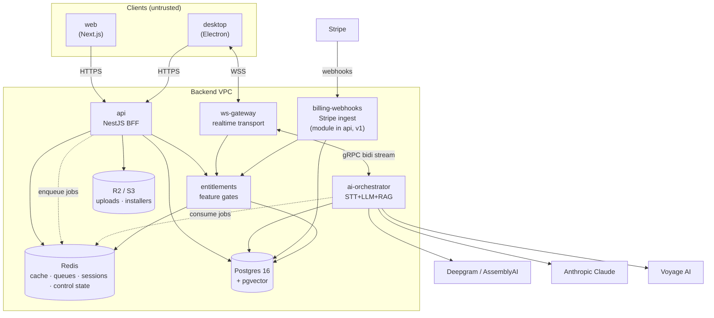
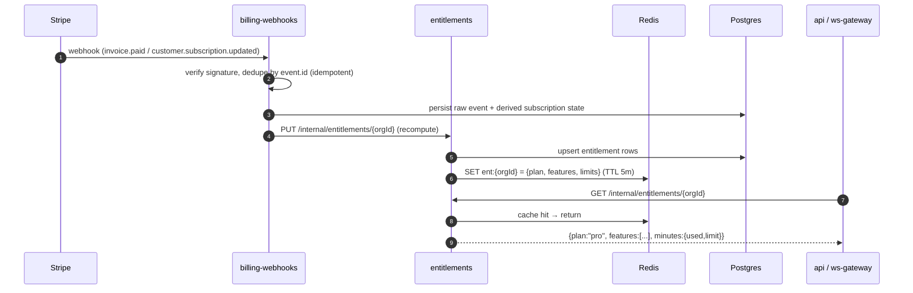
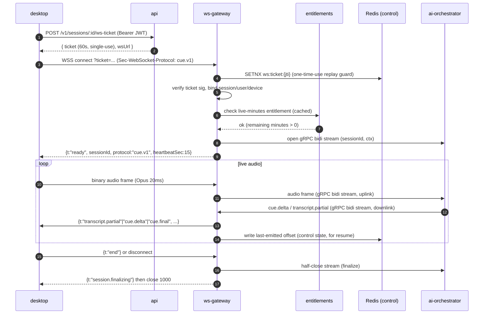
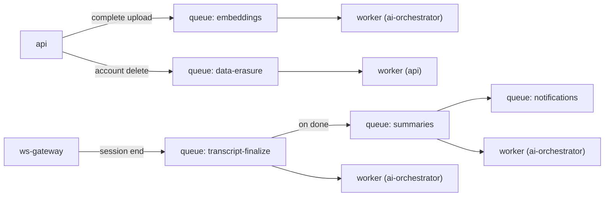
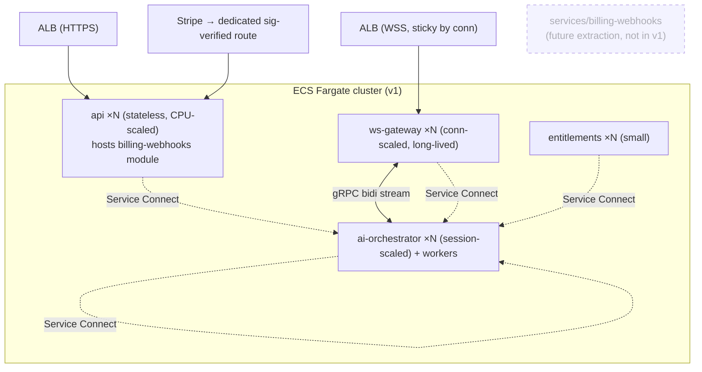

# Backend Services

> Status: Draft · Owner: Principal Architect (Backend) · Last updated: 2026-07-29 · Related: [System architecture](02-system-architecture.md) · [Repository structure](03-repository-structure.md) · [AI pipeline](21-ai-pipeline.md) · [Data model](30-data-model.md) · [Authentication](40-authentication.md) · [Entitlements](50-subscriptions-entitlements.md) · [Payments (Stripe)](51-payments-stripe.md) · [DevOps / infra](60-devops-infrastructure.md) · [Observability](61-observability.md) · [Scalability](70-scalability.md)

This doc owns the **backend service topology** for Cue: what each service does, how it is structured internally, the contracts between them, and the two client-facing surfaces (the REST/BFF API and the realtime WebSocket protocol). It does not re-derive the AI latency budget (that is [AI pipeline](21-ai-pipeline.md)), the SQL schema ([Data model](30-data-model.md)), the auth token exchange ([Authentication](40-authentication.md)), or the Fargate/Terraform wiring ([DevOps](60-devops-infrastructure.md)) — those are summarized in one line and linked.

---

## 1. Service catalog

Four deployable backend services in v1 (`api`, `ws-gateway`, `ai-orchestrator`, `entitlements`) plus the two clients they serve; `billing-webhooks` is a canonical logical service that ships as a NestJS module inside `services/api` in v1, extractable to a standalone service later (see A02). All are TypeScript on Node 22 LTS, containerized, and run on AWS ECS Fargate behind an ALB. See [DevOps](60-devops-infrastructure.md) for the cluster/task-definition detail. Reconciled per [decision record](04-decision-record.md) (A02).

| Service | Runtime | Protocol in | Scales on | Durable state | Owns |
|---|---|---|---|---|---|
| `api` | NestJS 11 | HTTPS (REST) | RPS / CPU | none (stateless) | CRUD, auth exchange, uploads, entitlement checks, session lifecycle |
| `ws-gateway` | Node + `ws`/uWebSockets.js | WSS | concurrent connections | Redis (session/presence) | realtime transport, audio ingest, cue fan-out, backpressure |
| `ai-orchestrator` | NestJS 11 (lean/standalone bootstrap, no HTTP middleware on the gRPC hot path) | internal gRPC (bidi streaming) | active AI sessions | Redis (session offsets / control only) | STT ↔ Claude ↔ RAG streaming pipeline |
| `entitlements` | NestJS 11 | internal REST + Redis | RPS | Redis + Postgres | source of truth for feature gates & usage counters |
| `billing-webhooks` | NestJS 11 module in `services/api` (v1); extractable at sustained webhook volume/latency | HTTPS (Stripe webhooks) | webhook volume | Postgres | ingest Stripe events → drive entitlements |

`ai-orchestrator` and `api` (which hosts the `billing-webhooks` module) also run **BullMQ workers** for async jobs (§7).

### 1.1 Why four v1 services (five logical), not one

**Decision.** Split the realtime hot path (`ws-gateway` + `ai-orchestrator`) from the request/response BFF (`api`), and isolate money-handling in `entitlements`. `billing-webhooks` is a canonical logical service that ships as a NestJS module inside `services/api` for v1 (own controller/route + Stripe raw-body signature verification), extractable to a standalone `services/billing-webhooks` when sustained webhook volume or processing latency threatens the `api` deploy cadence/blast radius. Reconciled per [decision record](04-decision-record.md) (A02).
**Context.** The live path has a < 1.2s p95 SLO and a fundamentally different scaling curve (long-lived stateful connections, GPU-adjacent LLM/STT fan-out) than CRUD. Billing must never share a blast radius with user-facing latency.
**Alternatives considered.** (a) One NestJS monolith — simplest, but a slow LLM stream or a webhook storm would starve CRUD; deploys couple unrelated code. (b) Fully per-domain microservices — premature; ops overhead outweighs benefit at our stage.
**Trade-offs.** Four deployable services add inter-service contracts and deploy surface, but each scales and fails independently; keeping `billing-webhooks` as an in-`api` module in v1 avoids a fifth deploy target until webhook load warrants it.
**Consequence.** Client edges (`api`, `ws-gateway`) are stateless and horizontally scalable; the stateful core is Postgres/Redis/R2. Matches ADR-003 in [System architecture](02-system-architecture.md).

---

## 2. Service boundaries (component view)



**Rules that keep boundaries clean:**

1. **Only `api` and `ws-gateway` are internet-facing.** The Stripe webhook path is served by `api` (the `billing-webhooks` module) on a dedicated signature-verified route. Everything else is VPC-internal, reachable via ECS Service Connect / Cloud Map DNS.
2. **No service reads Stripe directly** except `billing-webhooks`. Feature checks always go through `entitlements`. See [Entitlements](50-subscriptions-entitlements.md).
3. **The realtime path never traverses `api`.** `desktop` opens a WSS to `ws-gateway`; `api` only mints the short-lived WS ticket (§6.2).
4. **All cross-service DTOs live in `packages/types`.** No service hand-rolls another service's shapes (§8).

---

## 3. `api` — NestJS BFF

The Backend-for-Frontend that both `desktop` and `web` call for everything that is not a live audio stream: auth exchange, user/org CRUD, session records, transcript history, document upload + RAG management, and billing entry points.

### 3.1 Module structure

NestJS feature modules, one per resource, each following the same internal shape. This mirrors the frontend code-splitting discipline in [Engineering standards](13-engineering-standards.md) — thin controllers orchestrate; logic lives in services; DTOs are typed and shared.

```
services/api/src/
├── main.ts                      # bootstrap, global pipes/filters/interceptors
├── app.module.ts
├── common/
│   ├── guards/                  # JwtAuthGuard, OrgRoleGuard (RBAC)
│   ├── interceptors/            # idempotency, request-id, timing
│   ├── filters/                 # AppExceptionFilter → error taxonomy (§10)
│   ├── pipes/                   # ZodValidationPipe
│   └── decorators/              # @CurrentUser, @Idempotent, @RequireEntitlement
├── modules/
│   ├── auth/                    # token exchange, PKCE callback, refresh, device binding
│   ├── users/
│   ├── orgs/                    # org + team + membership (RBAC)
│   ├── sessions/                # meeting/interview session records + WS ticket mint
│   ├── transcripts/             # transcript + cue history (read-mostly)
│   ├── documents/               # RAG uploads: presigned PUT, status, list, delete
│   ├── billing/                 # Stripe Checkout / Portal session creation (thin)
│   ├── billing-webhooks/        # Stripe webhook controller + raw-body sig verify (canonical logical service, module in api v1 — A02)
│   └── health/                  # liveness / readiness
├── clients/                     # generated SDK-adjacent internal clients (ent, ai)
└── db/                          # Drizzle instance + repositories
```

Each module: `*.controller.ts` (routing + Swagger), `*.service.ts` (business logic), `dto/` (Zod schemas → inferred types, re-exported from `packages/types`), `*.repository.ts` (Drizzle queries). No file over 700 LOC; split services by use case when they grow.

### 3.2 API design conventions

- **Style: REST over HTTP/1.1 + JSON**, versioned by URL prefix `/v1`. We chose REST over tRPC at the public edge because the desktop app auto-updates independently of the backend and needs a stable, versioned, non-RPC-coupled contract; internal service-to-service calls may use gRPC. The **typed SDK** (§5) gives us tRPC-like DX on top of REST without the coupling.
- **Validation:** Zod schemas at the boundary via a global `ZodValidationPipe`; the same schemas are the source of the DTO types in `packages/types`.
- **Pagination:** cursor-based (`?cursor=&limit=`), opaque base64 cursor, `limit` max 100.
- **Errors:** RFC 9457 `application/problem+json`, single taxonomy (§10).
- **Idempotency:** `Idempotency-Key` header on all unsafe mutations (§9).
- **Rate limiting:** per-user + per-IP token buckets in Redis (§9.2).
- **Auth:** `Authorization: Bearer <JWT>`; verified by `JwtAuthGuard`. Full token model in [Authentication](40-authentication.md).

### 3.3 Resource map

| Resource | Endpoints (v1) | Notes |
|---|---|---|
| auth | `POST /v1/auth/token`, `POST /v1/auth/refresh`, `POST /v1/auth/device`, `POST /v1/auth/logout` | PKCE exchange, refresh rotation, device binding → [Auth](40-authentication.md) |
| users | `GET /v1/users/me`, `PATCH /v1/users/me`, `DELETE /v1/users/me` | self-service; delete triggers erasure job |
| orgs | `GET/POST /v1/orgs`, `GET/PATCH /v1/orgs/:id`, `POST /v1/orgs/:id/members`, `PATCH /v1/orgs/:id/members/:uid` | RBAC via `OrgRoleGuard` |
| sessions | `POST /v1/sessions`, `GET /v1/sessions`, `GET /v1/sessions/:id`, `POST /v1/sessions/:id/ws-ticket`, `PATCH /v1/sessions/:id`, `DELETE /v1/sessions/:id` | session record + WS ticket mint |
| transcripts | `GET /v1/sessions/:id/transcript`, `GET /v1/sessions/:id/cues`, `GET /v1/sessions/:id/summary` | read-mostly; summary is async-generated |
| documents | `POST /v1/documents` (presign), `POST /v1/documents/:id/complete`, `GET /v1/documents`, `DELETE /v1/documents/:id` | RAG uploads; embeddings via job → [AI pipeline](21-ai-pipeline.md) |
| billing | `POST /v1/billing/checkout`, `POST /v1/billing/portal`, `GET /v1/billing/entitlements` | thin proxies → Stripe / `entitlements` → [Payments](51-payments-stripe.md) |

### 3.4 Example endpoint contracts

**Create a session** (before a meeting starts):

```http
POST /v1/sessions HTTP/1.1
Authorization: Bearer <jwt>
Idempotency-Key: 4f1c...e2
Content-Type: application/json

{ "kind": "interview", "title": "Backend SWE loop", "disclosed": false, "documentIds": ["doc_9a2"] }
```

```jsonc
// 201 Created
{
  "id": "ses_7Kd2",
  "kind": "interview",
  "title": "Backend SWE loop",
  "disclosed": false,
  "status": "created",
  "documentIds": ["doc_9a2"],
  "createdAt": "2026-07-29T10:12:00.000Z"
}
```

**Mint a WS ticket** (short-lived, one-time, scoped to a session):

```http
POST /v1/sessions/ses_7Kd2/ws-ticket
Authorization: Bearer <jwt>
```

```jsonc
// 200 OK — ticket is a signed JWT, ttl 60s, single-use (see §6.2)
{ "ticket": "eyJhbGciOi...", "wsUrl": "wss://rt.usecue.app/v1/stream", "expiresAt": "2026-07-29T10:13:00.000Z" }
```

**Presign a document upload** (RAG):

```http
POST /v1/documents
{ "filename": "resume.pdf", "contentType": "application/pdf", "sizeBytes": 84213, "kind": "resume" }
```

```jsonc
// 201 — client PUTs directly to R2, then calls /complete to trigger the embedding job
{
  "id": "doc_9a2",
  "upload": { "method": "PUT", "url": "https://r2.../doc_9a2?X-Amz-Signature=...", "headers": { "Content-Type": "application/pdf" }, "expiresIn": 900 },
  "status": "awaiting_upload"
}
```

**Error shape (RFC 9457):**

```jsonc
// 403
{
  "type": "https://errors.usecue.app/entitlement-required",
  "title": "Entitlement required",
  "status": 403,
  "code": "ENTITLEMENT_RAG_UPLOAD",
  "detail": "RAG uploads require Pro or higher.",
  "instance": "/v1/documents",
  "requestId": "req_01J..."
}
```

---

## 4. `entitlements` & `billing-webhooks` (summary + boundary)

These two own the money → capability path; full detail in [Entitlements](50-subscriptions-entitlements.md) and [Payments](51-payments-stripe.md). Their contract with the rest of the backend:



`api` and `ws-gateway` consult `entitlements` via a cached internal client; on cache miss `entitlements` recomputes from Postgres. Usage counters (live minutes, token spend) are incremented in Redis by `ai-orchestrator` and periodically flushed to Postgres — see [Entitlements §usage-metering](50-subscriptions-entitlements.md).

---

## 5. Typed SDK — `packages/sdk`

A single generated + hand-thin typed client that `desktop`, `web`, and internal services use so no one hand-writes fetch calls. Types are imported from `packages/types` (§8); the SDK adds transport, auth refresh, retries, and idempotency-key generation.

```
packages/sdk/src/
├── client.ts            # createCueClient({ baseUrl, tokenProvider })
├── http.ts              # fetch wrapper: retries, backoff, problem+json parsing
├── auth.ts              # token refresh interceptor (401 → refresh → retry once)
├── idempotency.ts       # auto-generate + persist keys per mutation
├── resources/
│   ├── sessions.ts
│   ├── documents.ts
│   ├── transcripts.ts
│   ├── orgs.ts
│   └── billing.ts
└── index.ts
```

```ts
// packages/sdk/src/resources/sessions.ts
import type { CreateSessionDto, Session, WsTicket } from '@cue/types';
import type { HttpClient } from '../http';

export class SessionsResource {
  constructor(private readonly http: HttpClient) {}

  create(body: CreateSessionDto, opts?: { idempotencyKey?: string }): Promise<Session> {
    return this.http.post('/v1/sessions', body, { idempotency: true, ...opts });
  }

  wsTicket(sessionId: string): Promise<WsTicket> {
    return this.http.post(`/v1/sessions/${sessionId}/ws-ticket`, undefined);
  }

  list(params?: { cursor?: string; limit?: number }): Promise<Paginated<Session>> {
    return this.http.get('/v1/sessions', { query: params });
  }
}
```

**Usage from the desktop renderer** (Zustand action):

```ts
const cue = createCueClient({ baseUrl: env.API_URL, tokenProvider: keychainTokens });
const session = await cue.sessions.create({ kind: 'interview', title, disclosed: false });
const { ticket, wsUrl } = await cue.sessions.wsTicket(session.id);
// hand ticket to the realtime layer (§6)
```

**Decision — REST + generated SDK over end-to-end tRPC.** tRPC would give perfect inference but hard-couples client and server versions; our desktop clients auto-update on their own cadence and must tolerate an older/newer backend behind a stable `/v1`. The SDK is generated from the same Zod/OpenAPI source, so we keep type-safety without the coupling. Internal service-to-service calls (`api`→`entitlements`, `ws-gateway`→`ai-orchestrator`) may use gRPC where latency matters.

---

## 6. `ws-gateway` — realtime transport

The always-on WebSocket edge for the live path. It does **transport only**: authenticate the connection, ingest binary audio frames, relay them to `ai-orchestrator` over a **gRPC bidirectional stream** (HTTP/2, typed, low-latency), and fan cues/transcripts back to the one connected client. Redis is **not** on the per-frame audio path — it holds only control state (single-use ticket, session/presence, resume offsets). The AI work itself is in [AI pipeline](21-ai-pipeline.md). Reconciled per [decision record](04-decision-record.md) (A01).

### 6.1 Connection lifecycle



### 6.2 Auth handshake

- The JWT is **never** put on the WS query string (it would leak into logs/history). Instead `api` mints a **single-use, 60s WS ticket** — a short JWT signed with a gateway-specific key, carrying `{sub, sessionId, deviceId, jti}`.
- `ws-gateway` verifies the signature, then `SETNX ws:ticket:{jti}` in Redis with the ticket TTL to enforce **one-time use** (replay protection).
- The upgraded connection is bound to `{userId, sessionId, deviceId}`; the gateway holds no long-lived credential.
- Entitlement re-check on connect and on a periodic timer so an exhausted plan tears the stream down mid-session with a `quota.exceeded` control frame. See [Authentication](40-authentication.md) and [Entitlements](50-subscriptions-entitlements.md).

### 6.3 Message protocol (`cue.v1`)

Two channels over the one socket: **binary frames = audio ingest** (client→server only), **text frames = JSON control/data** (both directions).

**Binary audio frame** — a 4-byte little-endian header + payload, so we avoid JSON overhead on the hot path:

```
byte 0      : frame type   (0x01 = audio/opus, 0x02 = audio/pcm16)
byte 1      : channel      (0x00 = mixed, 0x01 = mic, 0x02 = loopback)
bytes 2-3   : sequence     (uint16, wraps; used for gap detection)
bytes 4..N  : payload      (Opus packet or PCM16 chunk)
```

**JSON control/data envelope** (discriminated union on `t`, all typed in `packages/types`):

```ts
// packages/types/src/ws.ts  (shared by ws-gateway AND desktop)
export type ClientMsg =
  | { t: 'hello'; protocol: 'cue.v1'; codec: 'opus' | 'pcm16'; sampleRate: 16000 | 48000 }
  | { t: 'mute'; channel: 'mic' | 'loopback'; muted: boolean }
  | { t: 'ask'; prompt: string }              // manual "give me a cue now" nudge
  | { t: 'mode'; disclosed: boolean }         // toggle disclosed mode mid-session
  | { t: 'heartbeat'; ts: number }
  | { t: 'end' };

export type ServerMsg =
  | { t: 'ready'; sessionId: string; protocol: 'cue.v1'; heartbeatSec: number }
  | { t: 'transcript.partial'; speaker: 'them' | 'me'; text: string; ts: number }
  | { t: 'transcript.final'; speaker: 'them' | 'me'; text: string; startMs: number; endMs: number }
  | { t: 'cue.delta'; cueId: string; text: string }          // streamed token chunk
  | { t: 'cue.final'; cueId: string; text: string; model: 'haiku-4-5' | 'sonnet-5' }
  | { t: 'backpressure'; level: 'ok' | 'shed' }              // server asking client to slow audio
  | { t: 'quota.exceeded'; remainingMs: 0 }
  | { t: 'heartbeat'; ts: number }
  | { t: 'error'; code: WsErrorCode; message: string }
  | { t: 'session.finalizing' };
```

### 6.4 Backpressure

Audio arrives at a fixed real-time rate, but downstream (STT/LLM) can momentarily lag. The gateway protects itself and the client:

- **Ingest side (client→gateway):** the gateway watches the gRPC/HTTP2 stream flow-control signals to `ai-orchestrator` and the per-session buffer depth. If the audio backlog exceeds a threshold, it emits `{t:"backpressure", level:"shed"}`; the desktop client responds by dropping to a lower-bitrate Opus profile and, if still saturated, dropping loopback silence frames (VAD-gated). We never buffer unbounded audio server-side.
- **Egress side (gateway→client):** cue/transcript frames are small; we cap the outbound queue per socket. If the client's TCP send buffer is full (slow network), we coalesce `transcript.partial` frames (keep latest, drop superseded partials) rather than growing the queue — partials are disposable, finals are not.
- **Hard limit:** per-connection max in-flight bytes; exceeding it closes the socket with code `1013` (try again later) and a `error` frame.

### 6.5 Heartbeat & reconnection

- **Heartbeat:** app-level `heartbeat` every 15s each way (not just WS ping/pong, so we detect a half-open app even when the TCP stack thinks it is fine). Miss 2 → server closes with `1001`.
- **Reconnection:** the client reconnects with exponential backoff (0.5s → cap 10s, full jitter). It requests a **fresh WS ticket** each time (tickets are single-use). The session is **resumable**: the gateway keeps the session's last-emitted offsets in Redis (control state) for a grace window (60s), so on reconnect within the window the client sends `{t:"hello", resumeFrom:<lastSeq>}` and the gateway replays only missed `cue.final`/`transcript.final` frames. Beyond the grace window the session is finalized and the client starts a new one.
- **State ownership:** the gateway itself is stateless across restarts — session/presence/offsets live in Redis — so an ECS task replacement during a deploy drains connections and clients reconnect to another task transparently.

---

## 7. Job queues — BullMQ on Redis

Async, non-real-time work runs as BullMQ queues (Redis-backed). Producers enqueue; dedicated worker processes (co-located in the `ai-orchestrator` and `api` task definitions — `api` hosts the `billing-webhooks` module — or scaled as their own Fargate service under load) consume.



| Queue | Trigger | Work | Idempotency key |
|---|---|---|---|
| `embeddings` | `POST /documents/:id/complete` | chunk doc → Voyage embeddings → pgvector upsert | `doc:{id}:{contentHash}` |
| `transcript-finalize` | WS `end` / disconnect | reconcile partials→finals, persist transcript, dedupe cues | `session:{id}:finalize` |
| `summaries` | after finalize | Claude summary (opus-5 for deep, sonnet-5 default) → persist | `session:{id}:summary` |
| `notifications` | after summary | "your summary is ready" email/push (requires consent) | `session:{id}:notify` |
| `data-erasure` | account/session delete | hard-delete rows, purge R2 objects, revoke embeddings | `erasure:{userId}:{req}` |

**Conventions:** every job carries a stable idempotency key (jobs may be redelivered); handlers are idempotent (upsert, not insert). Retries with exponential backoff, max attempts per queue, dead-letter queue `*.dlq` for exhausted jobs with a Sentry alert. Job payload types live in `packages/types`. See [AI pipeline](21-ai-pipeline.md) for embedding/summary internals and [Data model](30-data-model.md) for what gets persisted.

---

## 8. Inter-service contracts — `packages/types`

The single source of truth for every shape that crosses a process boundary: HTTP DTOs, WS envelope, job payloads, internal service DTOs, and the release-manifest contract shared with the updater.

```
packages/types/src/
├── http/            # request/response DTOs (mirror Zod schemas in api)
│   ├── sessions.ts
│   ├── documents.ts
│   └── errors.ts    # ProblemDetails + WsErrorCode + AppErrorCode enums
├── ws.ts            # ClientMsg / ServerMsg union + binary frame layout consts
├── jobs.ts          # BullMQ job data + result types, keyed by queue name
├── internal/        # service-to-service DTOs (entitlements, ai-orchestrator)
│   ├── entitlements.ts
│   └── orchestrator.ts
├── domain/          # shared domain enums (SessionKind, Speaker, Plan, Role)
└── release.ts       # electron-updater manifest contract (latest.yml shape)
```

**Rules:**
- A service may only import shapes it consumes; it never redefines another service's shape.
- HTTP/wire DTOs are **generated from** the Zod schemas in `api` via a codegen step: the `api` Zod schemas are the single source of truth (the schema is the runtime validator), and `z.infer` emits the shared static DTO types into `packages/types`, consumed by `sdk`, `ws-gateway`, `entitlements`, and the clients. A **CI drift check** (`turbo run codegen:check`) regenerates and fails the build if the committed types diverge from the schemas, so validation and types can never drift. DB row types are a separate axis — inferred from the Drizzle schema ([Data model §4](30-data-model.md)) and re-exported through `packages/types`; the two owners do not overlap. Reconciled per [decision record](04-decision-record.md) (A09).
- Breaking a shared type is a breaking change gated by CI (type-check across all packages in the Turborepo graph, plus the DTO codegen drift check). See [Repository structure](03-repository-structure.md) and [Engineering standards](13-engineering-standards.md).

```ts
// packages/types/src/internal/entitlements.ts — consumed by api, ws-gateway
export interface Entitlement {
  orgId: string;
  plan: 'free' | 'pro' | 'team' | 'enterprise';
  features: FeatureFlag[];                 // e.g. 'rag_upload', 'model_sonnet', 'sso'
  limits: { liveMinutes: number; ragDocs: number };
  usage:  { liveMinutesUsed: number };
  computedAt: string;                      // ISO; freshness for cache decisions
}
```

---

## 9. Cross-cutting: idempotency, rate limiting, versioning

### 9.1 Idempotency

- All unsafe HTTP mutations accept an `Idempotency-Key` (UUID) header. The SDK generates and persists one per logical mutation so a client retry after a network blip does not double-create.
- Implementation: a NestJS interceptor stores `key → {status, responseHash, body}` in Redis (TTL 24h) keyed by `{userId, route, key}`. A replay with the same key + same body returns the stored response; same key + different body → `409 IDEMPOTENCY_CONFLICT`.
- Webhooks (`billing-webhooks`) and BullMQ jobs are idempotent by their own natural keys (Stripe `event.id`, job idempotency key) — §4, §7.

### 9.2 Rate limiting

- Redis token-bucket, two dimensions: **per-user** (authenticated) and **per-IP** (pre-auth endpoints). Limits are tier-aware — a Free user has a tighter API budget than Pro; the limit is read from `entitlements`.
- The realtime path is limited by **concurrent sessions per user** (enforced at ticket mint) and **live-minutes** (metered), not by RPS.
- `429` responses carry `Retry-After` and `RateLimit-*` headers. Cross-links: [Observability](61-observability.md) for the dashboards, [Scalability](70-scalability.md) for capacity.

### 9.3 Error taxonomy (§10 below) & versioning

- **HTTP API:** URL-versioned `/v1`. Additive changes only within a major; breaking changes ship `/v2` with an overlap window and a `Deprecation`/`Sunset` header on `/v1`.
- **WS protocol:** the `hello`/`ready` handshake negotiates `protocol: "cue.v1"`; the gateway supports N and N-1 during a rollout so auto-updated desktop clients on either version connect cleanly.
- **SDK** is semver'd against the API major; the desktop app pins a compatible SDK range.

---

## 10. Error taxonomy

One flat, stable enum of machine-readable codes shared via `packages/types`, surfaced as `problem+json` over HTTP and as `{t:"error", code}` over WS. Codes never get renumbered; new ones are additive.

| Domain | Code | HTTP | Meaning |
|---|---|---|---|
| auth | `AUTH_INVALID_TOKEN` | 401 | expired/invalid JWT |
| auth | `AUTH_DEVICE_UNBOUND` | 401 | device not registered/bound |
| authz | `FORBIDDEN_ROLE` | 403 | RBAC role insufficient |
| entitlement | `ENTITLEMENT_*` | 403 | feature not in plan (e.g. `ENTITLEMENT_RAG_UPLOAD`) |
| quota | `QUOTA_LIVE_MINUTES` | 402/`quota.exceeded` | metered limit hit |
| validation | `VALIDATION_FAILED` | 422 | Zod validation error (with field list) |
| idempotency | `IDEMPOTENCY_CONFLICT` | 409 | same key, different body |
| ratelimit | `RATE_LIMITED` | 429 | bucket exhausted |
| resource | `NOT_FOUND` | 404 | resource missing / not owned |
| upstream | `UPSTREAM_STT` / `UPSTREAM_LLM` | 502 | Deepgram/Claude failure (client may retry) |
| ws | `WS_TICKET_REPLAY` | — | single-use ticket reused |
| ws | `WS_BACKPRESSURE` | 1013 | server shedding load |
| internal | `INTERNAL` | 500 | unexpected; correlated by `requestId` |

Every error carries a `requestId` (propagated as an OpenTelemetry trace id) for correlation across services — see [Observability](61-observability.md).

---

## 11. Deployment shape (Fargate)

Each service is one ECS Fargate **service** in the cluster, task defs and autoscaling owned by [DevOps](60-devops-infrastructure.md). Summary of the differences that matter to this doc:



| Service | Scaling signal | Deploy strategy | Notes |
|---|---|---|---|
| `api` | ALB RPS + CPU | rolling / canary | stateless; fast to scale; hosts the `billing-webhooks` module (idempotent Stripe ingest on a dedicated sig-verified route) |
| `ws-gateway` | active connections | **connection-draining** rolling | long-lived sockets; drain then replace; clients auto-reconnect (§6.5) |
| `ai-orchestrator` | active AI sessions + queue depth | rolling | workers co-located; HPA on gRPC stream backlog |
| `entitlements` | RPS | rolling | tiny, cache-fronted |
| `billing-webhooks` (logical) | webhook volume | — (module in `api` v1) | canonical logical service; extract to standalone `services/billing-webhooks` when sustained webhook volume/latency threatens the `api` deploy cadence/blast radius (A02) |

Health: `/health/live` (process up) and `/health/ready` (deps reachable) on every service; `ws-gateway` readiness also checks the `ai-orchestrator` gRPC channel. Regions us-east-1 + eu-west-1 for data residency — [DevOps](60-devops-infrastructure.md), [Scalability](70-scalability.md).

---

## Open questions & risks

1. **~~gRPC vs Redis-streams for `ws-gateway`↔`ai-orchestrator`~~ — RESOLVED (A01).** The hop uses **gRPC bidirectional streaming** (HTTP/2, typed, low-latency); Redis is off the per-frame audio path and holds only control state (single-use ticket, session/presence, resume offsets). This also closes the SR-01 per-frame `XADD` SPOF concern. Residual: validate same-AZ gRPC p95 stays inside the §4 budget under load and confirm resume semantics hold with offsets-in-Redis rather than a durable stream — coordinate with [AI pipeline](21-ai-pipeline.md).
2. **WS ticket vs subprotocol auth.** Single-use tickets add an API round-trip before connect (~1 RTT). Acceptable pre-meeting, but if it hurts reconnection latency we may allow a short grace re-auth using the prior ticket's `jti` lineage.
3. **Worker co-location.** Running BullMQ workers inside `ai-orchestrator` tasks is simple but couples their scaling; if summary/embedding load spikes independently we split workers into their own Fargate service. Trigger: DLQ growth or worker CPU starving the stream consumer.
4. **Idempotency store TTL.** 24h covers client retries but not multi-day offline desktop resumes; may need to persist keys for created sessions longer.
5. **Cross-region session affinity.** A user roaming between regions mid-session is unsupported (session is region-pinned via the ticket). Acceptable, but document the failure mode for enterprise DR — see [Scalability](70-scalability.md).
6. **Backpressure UX.** Dropping to lower-bitrate Opus under load may degrade STT accuracy; need to measure the accuracy/latency trade-off with [AI pipeline](21-ai-pipeline.md) before finalizing the shed policy.
