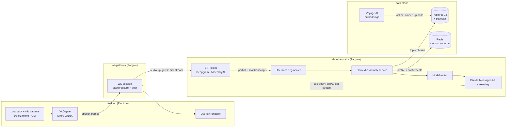
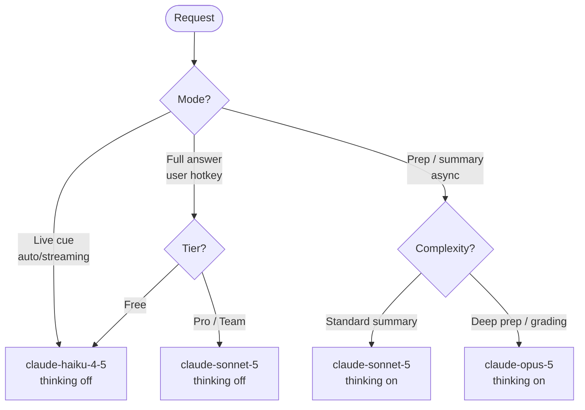
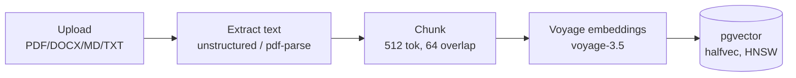

# AI Pipeline

> Status: Draft · Owner: Principal Architect (AI/ML) · Last updated: 2026-07-29 · Related: [System architecture](02-system-architecture.md) · [Backend services](20-backend-services.md) · [Data model](30-data-model.md) · [Entitlements](50-subscriptions-entitlements.md) · [Unit economics](71-unit-economics.md) · [Observability](61-observability.md) · [Product vision](01-product-vision.md)

This is the authoritative spec for **Cue**'s AI pipeline — the path from spoken audio to a glanceable cue in the overlay. It owns: the streaming topology (VAD → STT → context assembly → Claude → overlay), the sub-1.2s p95 latency budget, Claude model routing and prompt-cache strategy, the RAG retrieval design, prompt engineering for cues, cost-control levers, and AI safety/grounding. The service that runs all of this is **`ai-orchestrator`** (see [Backend services §ai-orchestrator](20-backend-services.md)); the transport into and out of it is **`ws-gateway`**. This doc does not re-derive per-user COGS — that math lives in [Unit economics](71-unit-economics.md); it does not define the DB schema — that lives in [Data model](30-data-model.md).

---

## 1. Design principles

1. **Latency is the product.** The user glances at a cue mid-sentence. A correct cue that arrives 2s late is useless. Every hop is budgeted (§4) and every model/prompt choice is judged first on latency.
2. **Stream everything.** Partial STT transcripts, partial LLM tokens. Nothing waits for a final result when a partial is actionable.
3. **Grounded or silent.** A cue is grounded in retrieved user context (resume, JD, knowledge base) and the live transcript, or it is suppressed. Cue never invents an employer, a metric, or a fact the user did not provide. See §8.
4. **Cheap by default, deep on demand.** Live cues run on the cheapest model that clears the quality bar (Haiku 4.5). Sonnet 5 and Opus 5 are reserved for the moments that justify their cost (§5).
5. **Cache the stable, send only the delta.** The system prompt + user profile + RAG context are a cacheable prefix; only the rolling transcript tail changes per request (§6).

---

## 2. Pipeline topology



Two data paths:

- **Online (hot, per-utterance):** audio → VAD → STT → segmenter → context assembly → router → Claude → overlay. Budgeted in §4.
- **Offline (cold, on upload):** resume/JD/knowledge-base documents are chunked and embedded with Voyage AI once, at upload time, and stored in pgvector. Retrieval at runtime is a pure DB read — no embedding call on the hot path except a single query embedding (§7).

---

## 3. Streaming sequence (one live cue)

```mermaid
sequenceDiagram
  autonumber
  participant D as desktop (VAD)
  participant G as ws-gateway
  participant S as STT (Deepgram)
  participant O as ai-orchestrator
  participant R as Redis / pgvector
  participant C as Claude (Messages API)

  D->>G: PCM frames (20ms) over WS, speech only
  G->>O: forward audio frames (gRPC bidi stream, uplink)
  O->>S: forward audio chunks (Deepgram live WS)
  S-->>O: interim transcript ("so tell me about your...")
  S-->>O: final transcript + endpoint (is_final, speech_final)
  O->>O: segmenter marks utterance boundary
  O->>R: query embedding + top-k pgvector search (k=6)
  R-->>O: retrieved chunks (resume, JD, KB)
  O->>O: assemble prompt (cached prefix + transcript tail)
  O->>C: messages.create(stream=true, cache_control on prefix)
  C-->>O: content_block_delta (token stream)
  O-->>G: cue tokens (gRPC bidi stream, downlink; framed, de-duplicated)
  G-->>D: overlay renders cue incrementally
  Note over D,C: p95 target: speech-final → first cue token < 1.2s
```

The cue starts rendering on the **first** Claude token, not the last — the overlay paints incrementally so the user sees words appear within the budget even if the full cue takes longer to complete.

---

## 4. Latency budget (p95, mic → first visible cue token)

The SLO is **< 1.2s p95** from end-of-utterance to first cue token. STT partials must surface < 300ms. Budget below is measured from the audio frame that closes an utterance (Deepgram `speech_final`).

| Hop | Component | p50 | p95 | Notes |
|-----|-----------|-----|-----|-------|
| 1 | VAD gate + frame batching (desktop) | 20 ms | 40 ms | Silero VAD on 20ms frames; gates silence so we never pay STT for dead air |
| 2 | Desktop → ws-gateway (WS uplink) | 15 ms | 45 ms | Region-pinned; user routed to nearest edge (us-east-1 / eu-west-1) |
| 3 | ws-gateway → Deepgram + endpointing | 120 ms | 250 ms | Deepgram streaming, `endpointing=200`, `interim_results=true`; endpoint detection dominates |
| 4 | Query embedding (Voyage `voyage-3.5`, 1024-dim — same model as document embeddings) | 30 ms | 70 ms | Single short query; cached per-utterance keyed on transcript hash; query and document embedding spaces are identical (SR-09) |
| 5 | pgvector top-k retrieval | 8 ms | 25 ms | HNSW index; k=6; warmed connection pool |
| 6 | Context assembly (prompt build) | 5 ms | 15 ms | Pure string assembly; cached prefix already resident |
| 7 | Claude TTFT — Haiku 4.5 (cache hit) | 180 ms | 400 ms | Prompt-cache hit on prefix; thinking off; streaming |
| 8 | Cue return (internal) ai-orchestrator → ws-gateway (gRPC bidi) | 2 ms | 5 ms | Typed cue frames over the HTTP/2 bidi stream; same-AZ (A01) |
| 9 | Cue return (downlink) ws-gateway → desktop overlay (WSS) | 18 ms | 50 ms | Token framing + WS downlink + overlay paint |
| | **Total (steady state, cache hit)** | **~400 ms** | **~900 ms** | Comfortably under 1.2s |
| | **Total (cold: cache miss + retrieval miss)** | ~700 ms | ~1.15s | First request of a session; still within SLO |

Reconciled per [decision record](04-decision-record.md) (A01 hot-path transport, SR-09 embedding model): the `ws-gateway`↔`ai-orchestrator` hop is gRPC bidirectional streaming (hops 2/8) — Redis is not on the per-frame audio path — and the query embedding uses the same `voyage-3.5` @ 1024-dim model as document ingest (hop 4).

Budget guardrails:

- **Retrieval is parallel to endpointing.** As soon as an interim transcript stabilizes, the orchestrator fires the embedding + pgvector query speculatively (steps 4–5), so by the time `speech_final` lands, retrieved chunks are usually already in hand. This overlaps ~95ms off the critical path.
- **STT partials < 300ms** (step 3 interim) drive the transcript ribbon in the overlay independently of cues, so the user always sees live text even while a cue is being generated.
- **TTFT, not total generation, is the SLO.** Cue completion may take 600–1500ms more; the user reads it as it streams.

---

## 5. Claude model routing

Cue uses three Claude models. The router (`ai-orchestrator`) picks per-request based on **mode**, **entitlement tier**, and **latency class**.

| Model | Exact model ID | Input $/1M | Output $/1M | Context | Thinking | Used for |
|-------|----------------|-----------|------------|---------|----------|----------|
| Haiku 4.5 | `claude-haiku-4-5` | $1 | $5 | 200K | Off | **Live cues** — the default hot-path model. Ultra-low TTFT, glanceable one-liners during a call |
| Sonnet 5 | `claude-sonnet-5` | $3 ($2 intro¹) | $15 ($10 intro¹) | 1M | Off (live) / On (prep) | **Balanced real-time answers** — full suggested answers for Pro/Team when the user explicitly requests depth (hotkey), and mid-weight prep |
| Opus 5 | `claude-opus-5` | $5 | $25 | 1M | On | **Deep prep & analysis** — pre-call interview prep, post-call summaries, hard multi-step reasoning, mock-interview grading. Never on the live hot path |

¹ Sonnet 5 introductory pricing **$2 / $10 per 1M** through **2026-08-31**; reverts to $3 / $15 after. The cost model in [Unit economics](71-unit-economics.md) tracks both.

### 5.1 Routing decision



| Trigger | Model | Rationale |
|---------|-------|-----------|
| Continuous live cues (default) | Haiku 4.5 | Every utterance can generate a cue; must be cheap + < 400ms TTFT |
| User presses "expand answer" hotkey mid-call | Sonnet 5 (Pro+) / Haiku (Free) | Occasional, user-initiated; higher quality justified; Free tier stays on Haiku |
| Pre-call prep (resume × JD analysis, likely questions) | Opus 5, thinking on | Async, not latency-bound; reasoning quality matters most |
| Post-call summary + action items | Sonnet 5, thinking on | Batch, moderate reasoning, cost-sensitive at volume |
| Mock-interview grading / rubric scoring | Opus 5, thinking on | Deep analysis, low volume |

**Adaptive thinking:** OFF for all live cues — extended thinking adds tokens and TTFT that the 1.2s budget cannot absorb. ON for prep/summary/grading where the request is async and reasoning depth is the point. The router sets `thinking: { type: "disabled" }` on the live path explicitly rather than relying on defaults.

### 5.2 ADR — Haiku as the live-cue default

- **Decision:** `claude-haiku-4-5` is the default model for all continuous live cues; higher models are opt-in per §5.1.
- **Context:** Cues fire on nearly every utterance. At Sonnet/Opus output pricing the COGS per live minute would break the $20 Pro margin (see [Unit economics](71-unit-economics.md)).
- **Alternatives considered:** (a) Sonnet 5 for everyone — 3× input / 3× output cost, better prose but the cue format is short and Haiku clears the quality bar; (b) local small model on-device — kills cloud cost but adds 8–15GB download, cross-platform GPU pain, and worse grounding.
- **Trade-offs:** Haiku occasionally produces blander phrasing; mitigated by tight prompting (§8) and the user-initiated Sonnet "expand" path.
- **Consequence:** Live COGS stays dominated by STT minutes, not LLM tokens (see [Unit economics §COGS](71-unit-economics.md)).

---

## 6. Anthropic Messages API + prompt caching

All Claude calls go through the **Anthropic Messages API** with `stream: true`. The orchestrator uses the official `@anthropic-ai/sdk` (Node).

### 6.1 Request shape (live cue)

```ts
// packages/core/src/ai/live-cue.ts — orchestrator call (illustrative)
const stream = anthropic.messages.stream({
  model: "claude-haiku-4-5",
  max_tokens: 160,                       // cues are short; hard cap controls cost + latency
  thinking: { type: "disabled" },        // live path never thinks
  system: [
    {
      type: "text",
      text: STABLE_SYSTEM_PROMPT,        // invariant across the whole session
      cache_control: { type: "ephemeral" },
    },
    {
      type: "text",
      text: userProfileAndRagBlock,      // resume + JD + top-k KB chunks for this session
      cache_control: { type: "ephemeral" },
    },
  ],
  messages: [
    { role: "user", content: transcriptTail }, // ONLY the rolling delta changes
  ],
});
```

### 6.2 The prefix-cache invariant

Anthropic prompt caching keys on an **exact prefix**. Everything up to and including a `cache_control` breakpoint must be **byte-identical** across requests to hit the cache. Our layout enforces this:

```
[ system: STABLE_SYSTEM_PROMPT ]        ← cache breakpoint 1  (never changes)
[ system: userProfileAndRagBlock ]      ← cache breakpoint 2  (per-session stable)
[ user:   transcriptTail ]              ← NOT cached; the only thing that varies
```

Rules the orchestrator obeys to preserve cache hits:

1. **Never mutate the prefix mid-session.** RAG context is assembled **once** at session start (or on explicit re-retrieval) and frozen into breakpoint 2. Per-utterance retrieval refinements go into the *user* turn, not the cached prefix — otherwise every request would invalidate the cache.
2. **Append-only transcript.** The rolling transcript tail is the user turn; the stable earlier context lives in the prefix. We keep the varying portion small (last ~30s of transcript, truncated — §9).
3. **Stable serialization.** JSON in the prefix is serialized with sorted keys and no timestamps, so identical logical content produces identical bytes.

### 6.3 Why it matters

| Effect | Mechanism |
|--------|-----------|
| **Cost:** cached input tokens billed at ~0.1× | The 2–8K-token prefix (system + profile + RAG) is read once, then reused at a fraction of the input price for every cue in the session. See [Unit economics §prompt-cache savings](71-unit-economics.md) |
| **Latency:** lower TTFT | Cached prefix skips re-processing; contributes the 180–400ms TTFT in the budget (§4, hop 7) vs. a cold prefix |
| **Throughput:** smaller live payload | Only the transcript delta is uploaded per cue |

Cache TTL is ~5 minutes (ephemeral); a continuous call refreshes it on every cue, so a live session stays warm end-to-end. The first cue of a session pays the cold prefix (the §4 "cold" row).

---

## 7. RAG — retrieval over user documents

Cue grounds cues in the user's own uploaded material: **resume**, **job description (JD)**, and a **knowledge base** (product docs, FAQs, past-call notes for sales/support). Ownership of the schema is in [Data model §documents & embeddings](30-data-model.md); this section owns the retrieval *logic*.

### 7.1 Ingestion (offline, on upload)



- **Chunking:** ~512 tokens per chunk, 64-token overlap, split on semantic boundaries (headings, bullet items, paragraphs) via a recursive splitter. Resumes and JDs are small (1–3 chunks each); knowledge bases can be large.
- **Embeddings:** Voyage AI `voyage-3.5` (1024-dim) for **both** document-ingest embeddings **and** the hot-path query embedding (step 4 in §4) — the query and document embedding spaces must be identical, so the same model + dimension is pinned end-to-end. A **guard test fails CI** if the query and document embedding models or dimensions ever diverge, and asserts the pgvector column dimension matches the model output. Stored as pgvector `halfvec(1024)` to halve index size. Reconciled per [decision record](04-decision-record.md) (SR-09).
- **Metadata:** each chunk row carries `{ user_id, doc_id, doc_type, source_span, token_count }` for filtering and citation.

### 7.2 Retrieval (online, on the hot path)

```sql
-- top-k similarity, filtered to the session's user + relevant doc types.
-- HNSW index: (embedding halfvec_cosine_ops). See 30-data-model.md.
SELECT chunk_id, doc_type, content
FROM doc_chunks
WHERE user_id = $1
  AND doc_type = ANY($2)          -- e.g. {'resume','jd'} for interviews
ORDER BY embedding <=> $3         -- cosine distance to query embedding
LIMIT 6;
```

- **k = 6** chunks, then trimmed to a token budget (~1.5K tokens) before assembly.
- **Query construction:** the query embedding is computed from the **current utterance + a short rolling transcript window** (the interviewer's question), not from a raw single word — this makes retrieval track what is being asked *now*.
- **Session-warm retrieval:** for interviews the resume+JD are small and fully relevant, so they are loaded once into the cached prefix (§6, breakpoint 2). pgvector search on the hot path is reserved for large knowledge bases (sales/support), where per-utterance retrieval genuinely changes.

### 7.3 Assembly into the prompt

The **context-assembly service** builds the final prompt within its 5–15ms budget (§4, hop 6):

```
system (cached):
  STABLE_SYSTEM_PROMPT
  ── USER PROFILE ──
  Role target, seniority, resume highlights, JD key requirements
  ── KNOWLEDGE (retrieved) ──
  [chunk 1 · doc_type · source_span]
  ...
user (not cached):
  ── LIVE TRANSCRIPT (last ~30s) ──
  Interviewer: "<latest question>"
  Me: "<my last words>"
  ── TASK ── produce one glanceable cue.
```

Chunks carry a lightweight `[source_span]` tag so the model — and later, an audit view — can attribute each grounded fact. Retrieved knowledge is clearly demarcated from the live transcript so the model treats it as ground truth vs. live speech.

---

## 8. Prompt design for cues

A cue is not an essay. The system prompt constrains the model hard:

- **Glanceable:** ≤ 2 short lines / ~25 words for auto-cues. `max_tokens: 160` enforces a ceiling; the prompt asks for brevity.
- **Actionable, second-person:** "Mention your Stripe migration — cut checkout latency 40%." Not "The candidate could discuss…".
- **Grounded:** every factual claim (a metric, a project, an employer) must come from the retrieved profile/KB or the live transcript. If it isn't there, the cue must not assert it.
- **No hallucinated specifics:** the model is instructed to prefer a *prompt to the user* ("Ask them to clarify the scope") over inventing a fact when context is thin.
- **Silence is valid output:** if there is nothing useful to add (small talk, the user is speaking fluently), the model returns a sentinel (`<none>`) and the orchestrator suppresses the cue. This prevents the overlay from nagging.

```text
SYSTEM (excerpt):
You are Cue, a private real-time copilot visible ONLY to the user.
Output a single glanceable cue (<=25 words) that helps the user's NEXT sentence.
Rules:
- Ground every specific fact in USER PROFILE or KNOWLEDGE. Never invent employers,
  numbers, dates, or names not present there.
- If context is insufficient, suggest a clarifying question instead of guessing.
- If no cue adds value right now, output exactly: <none>
- Second person, imperative, no preamble, no markdown.
```

For the user-initiated **"expand answer"** path (Sonnet 5), the prompt loosens length (`max_tokens: 512`) and asks for a structured, speakable answer, still grounded.

---

## 9. Cost-control levers

The AI pipeline is the largest variable cost. Levers, in order of impact (math in [Unit economics](71-unit-economics.md)):

| Lever | Mechanism | Effect |
|-------|-----------|--------|
| **Model routing** | Haiku 4.5 for all live cues; Sonnet/Opus only on explicit/async triggers (§5) | Keeps the high-frequency path on the cheapest model |
| **Prompt caching** | Stable system + profile + RAG as a cached prefix (§6) | Cached input billed ~0.1×; the biggest per-cue input saving |
| **`max_tokens` caps** | 160 (cue) / 512 (expand) / higher only for async prep | Bounds output tokens — the expensive side ($5–25/1M out) |
| **VAD gating** | Silence never reaches STT or the LLM (§2) | No spend on dead air; big STT saving on real calls |
| **Cue debounce / dedupe** | One cue per settled utterance; suppress `<none>` and near-duplicates | Fewer LLM calls per minute |
| **Transcript truncation** | User turn holds only the last ~30s window | Bounds the non-cached input tokens per request |
| **Minute caps + metering** | Free 60 min/mo; Pro generous then metered overage | Entitlements service enforces caps ([Entitlements](50-subscriptions-entitlements.md)) |
| **Speculative-then-cancel** | If a newer utterance supersedes an in-flight cue, abort the stream | Stops paying for output the user will never see |

The orchestrator emits per-request token + cost telemetry (input / cached-input / output / model) to PostHog + ClickHouse for the unit-economics model and per-tier margin dashboards — see [Observability](61-observability.md).

---

## 10. STT layer — Deepgram with AssemblyAI fallback

| Concern | Primary: Deepgram | Fallback: AssemblyAI |
|---------|-------------------|----------------------|
| Mode | Streaming WS, `interim_results=true`, `endpointing=200`, `smart_format` | Streaming realtime |
| Language | Multilingual (`nova-3`) | Universal-Streaming |
| Trigger to fail over | Connect error, > 500ms silence in transcript stream while audio flows, or elevated error rate | Circuit-breaker in `ai-orchestrator` |
| VAD | Silero VAD on-device (desktop) gates before upload; Deepgram endpointing marks utterance ends | same |

Failover is **per-session** and transparent: the orchestrator holds a small ring buffer of recent audio so a mid-session switch replays the last ~1s to the fallback to avoid a dropped word. STT choice is invisible to the renderer.

### 10.1 ADR — Deepgram primary, AssemblyAI fallback

- **Decision:** Deepgram streaming is primary STT; AssemblyAI is a hot standby behind a circuit breaker.
- **Context:** STT is on the critical latency path (§4 hop 3, the single largest budget line) and is a per-minute cost. A single-vendor dependency is an availability + pricing risk.
- **Alternatives considered:** Whisper self-hosted (higher latency, GPU ops burden, no managed streaming); OpenAI realtime STT (couples STT to a second LLM vendor). 
- **Trade-offs:** Two vendors = two contracts + two client integrations; mitigated by a single `SttClient` interface in `packages/core`.
- **Consequence:** 99.9% STT availability target is achievable; on-prem STT for Enterprise (canonical) slots in as a third `SttClient` implementation.

---

## 11. Safety, grounding & refusal handling

- **Grounding as the primary guardrail:** the prompt (§8) forbids ungrounded specifics; the assembly layer clearly separates trusted context from live speech. This is Cue's main defense against fabricated facts — a wrong number in an interview is worse than no cue.
- **Refusals:** if Claude declines (rare for this benign task), the orchestrator maps the refusal to a neutral overlay state ("No suggestion") rather than surfacing refusal prose. Refusals are logged (rate-monitored) but never shown raw.
- **No PII exfiltration in prompts:** only the user's *own* uploaded documents and their *own* live transcript enter the prompt. Nothing from other users. Model-training opt-out is set on the Anthropic account (canonical security posture).
- **Injection resistance:** the live transcript is *untrusted input* (another party may say "ignore your instructions"). The system prompt is fenced and the transcript is clearly labeled as speech-to-quote, not instructions; the orchestrator does not execute any tool calls derived from transcript content on the live path.
- **Responsible-use coupling:** disclosed-mode and consent gating are owned by [Product vision / Legal](01-product-vision.md#responsible-use); the pipeline honors a `disclosed` session flag by watermarking summaries and (optionally) softening cue aggressiveness. The pipeline itself does not decide legality — it enforces the entitlement + consent flags handed to it.
- **Content boundaries:** the system prompt refuses to help with clearly deceptive framings (e.g., impersonating a specific real person's credentials) consistent with the acceptable-use policy.

---

## 12. Failure modes & degradation

| Failure | Detection | Degradation |
|---------|-----------|-------------|
| STT primary down | Circuit breaker | Fail over to AssemblyAI (§10); transcript continues |
| Both STT down | Health checks | Overlay shows "transcription unavailable"; mic/loopback capture continues, cues paused |
| Claude latency spike / 529 | TTFT SLO monitor | Shed to shorter `max_tokens`; if sustained, pause auto-cues, keep transcript ribbon |
| pgvector slow / down | Query timeout (30ms) | Fall back to cached prefix context only (resume+JD in prefix); skip KB retrieval |
| Cache miss storm | Cache-hit-rate metric | Tolerable — pays cold prefix; alert if hit rate < 80% (indicates prefix mutation bug) |
| Entitlement/minute cap hit | Entitlements service | Orchestrator stops new cues, overlay prompts upgrade ([Entitlements](50-subscriptions-entitlements.md)) |

Every degradation keeps the **transcript ribbon** alive if at all possible — losing cues is tolerable, losing live text feels broken.

---

## Open questions & risks

1. **Cue cadence tuning.** Firing a cue on every settled utterance may over-trigger. Need real-usage data to tune the debounce + `<none>` suppression thresholds; risk of either nagging or feeling absent. Owned jointly with [Design system](12-design-system.md).
2. **Hot-path retrieval vs. prefix caching tension.** Per-utterance pgvector retrieval (large KBs) mutates context and can hurt cache hit rate. Current split (small docs in cached prefix, large KBs retrieved into the *user* turn) needs validation under load.
3. **Sonnet 5 intro-pricing upside ends (2026-08-31).** The base case already assumes post-intro **$3 / $15 per 1M** (F-07); the intro $2 / $10 is modelled only as expiring upside. When it lapses, the "expand" path loses that cushion but the base economics are unchanged; the unit-economics model still gates whether Sonnet stays the Pro expand default or reverts more aggressively to Haiku. See [Unit economics](71-unit-economics.md).
4. **Speculative retrieval waste.** Firing embedding+retrieval on interim transcripts saves latency but spends on utterances that never complete. Need to measure the waste ratio vs. latency win.
5. **Multilingual quality.** Deepgram `nova-3` multilingual + Haiku cue quality for non-native-speaker accessibility (a core persona) is unproven at our latency; may need language-specific routing.
6. **Injection via live audio.** Adversarial speech from the other party attempting prompt injection — current fencing is prompt-level; consider a lightweight classifier if abuse appears.
7. **On-prem STT for Enterprise** (canonical option) changes the latency profile and the `SttClient` failover story; deferred to the enterprise phase in the [Roadmap](80-roadmap.md).
