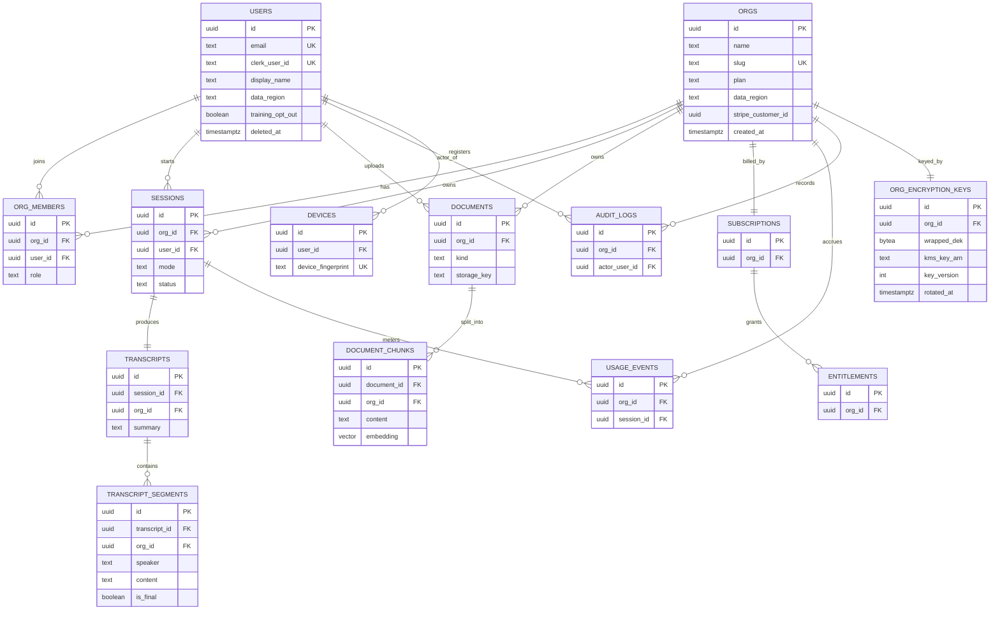

# Data Model

> Status: Draft · Owner: Principal Architect (Data) · Last updated: 2026-07-29 · Related: [System architecture](02-system-architecture.md) · [Backend services](20-backend-services.md) · [AI pipeline](21-ai-pipeline.md) · [Authentication](40-authentication.md) · [Entitlements](50-subscriptions-entitlements.md) · [Payments](51-payments-stripe.md) · [Observability](61-observability.md) · [Scalability](70-scalability.md) · [Unit economics](71-unit-economics.md)

This is the authoritative data-layer specification for **Cue** (provisional brand). It owns the PostgreSQL 16 schema (as concrete Drizzle DDL), the pgvector embedding strategy, the Redis key map, the object-storage layout, the migration workflow, multi-tenancy isolation, and the full data lifecycle / retention / GDPR posture. Service-level access patterns are summarized here and owned by [Backend services](20-backend-services.md); the recording-consent and legal posture is owned by the legal/compliance doc (see [Product vision → responsible use](01-product-vision.md)).

---

## 1. Principles

1. **SQL-first, strongly typed.** Drizzle ORM is the single source of truth for **DB row types**, derived via `InferSelectModel` / `InferInsertModel` and re-exported (generated, not hand-written) into `packages/types`. This is a distinct, non-overlapping axis from **API/wire DTOs**, which are generated from the `api` Zod schemas (their source of truth) — see [Engineering standards](13-engineering-standards.md) §1/§2 and [decision record](04-decision-record.md) (A09). A CI drift check regenerates both and fails on divergence. No `any`; no schema drift between DB and app.
2. **Tenant-scoped by default.** Every row that belongs to a customer carries an `org_id`. A user always acts inside exactly one org context per request (a personal org for consumer/Free users, a real org for Team/Enterprise). See [§8 Multi-tenancy](#8-multi-tenancy-isolation).
3. **Hot vs. warm vs. cold separation.** Live transcript deltas stream through Redis (ephemeral); durable transcript + AI output land in Postgres; large blobs (uploads, exports, installers) live in object storage. Postgres never stores raw audio.
4. **PII minimization + retention by class.** Every table is tagged with a PII class (see [§9](#9-data-lifecycle--retention)). Retention and deletion are enforced by scheduled jobs, not by hope.
5. **Residency-aware.** `us-east-1` and `eu-west-1` each run an isolated primary. A user's `data_region` is fixed at signup and pins all their durable data to one region.

---

## 2. Entity-relationship overview



---

## 3. Schema (Drizzle DDL)

All tables live under `packages/core/src/db/schema/`, one file per domain area (each well under the 700-LOC cap), re-exported from `schema/index.ts`. Shared column helpers keep IDs/timestamps consistent.

### 3.1 Shared helpers & enums

```ts
// packages/core/src/db/schema/_shared.ts
import { sql } from 'drizzle-orm';
import { pgEnum, timestamp, uuid } from 'drizzle-orm/pg-core';

/** Every table: server-generated UUIDv7 (time-ordered) PK. */
export const primaryId = () =>
  uuid('id').primaryKey().default(sql`uuidv7()`);

export const timestamps = {
  createdAt: timestamp('created_at', { withTimezone: true }).notNull().defaultNow(),
  updatedAt: timestamp('updated_at', { withTimezone: true }).notNull().defaultNow(),
};

/** Soft-delete marker used by GDPR erasure + retention jobs. */
export const softDelete = {
  deletedAt: timestamp('deleted_at', { withTimezone: true }),
};

export const dataRegionEnum = pgEnum('data_region', ['us', 'eu']);
export const planEnum = pgEnum('plan', ['free', 'pro', 'team', 'enterprise']);
export const orgRoleEnum = pgEnum('org_role', ['owner', 'admin', 'member', 'billing']);
export const sessionModeEnum = pgEnum('session_mode', [
  'interview_prep', 'interview_live', 'sales', 'support', 'meeting_notes',
]);
export const sessionStatusEnum = pgEnum('session_status', [
  'active', 'ended', 'processing', 'failed', 'purged',
]);
export const documentKindEnum = pgEnum('document_kind', [
  'resume', 'job_description', 'knowledge_base', 'product_doc', 'other',
]);
export const documentStatusEnum = pgEnum('document_status', [
  'uploaded', 'parsing', 'embedding', 'ready', 'failed',
]);
export const usageKindEnum = pgEnum('usage_kind', [
  'live_minutes', 'stt_seconds', 'llm_input_tokens', 'llm_output_tokens', 'rag_query',
]);
```

> UUIDv7 (time-ordered) is used for every PK so B-tree inserts stay append-friendly and indexes don't fragment under high transcript-segment write volume. Postgres 16 lacks a native `uuidv7()`; we install a small SQL function via the first migration (or the `pg_uuidv7` extension where the managed provider allows it).

### 3.2 Identity: users, orgs, members, devices

```ts
// packages/core/src/db/schema/identity.ts
import { boolean, index, pgTable, text, timestamp, unique, uuid } from 'drizzle-orm/pg-core';
import { primaryId, timestamps, softDelete, dataRegionEnum, planEnum, orgRoleEnum } from './_shared';

export const orgs = pgTable('orgs', {
  id: primaryId(),
  name: text('name').notNull(),
  slug: text('slug').notNull(),
  plan: planEnum('plan').notNull().default('free'),
  dataRegion: dataRegionEnum('data_region').notNull(),
  isPersonal: boolean('is_personal').notNull().default(false), // personal org for consumer users
  stripeCustomerId: text('stripe_customer_id'),
  ...timestamps,
  ...softDelete,
}, (t) => ({
  slugUk: unique('orgs_slug_uk').on(t.slug),
  regionIdx: index('orgs_region_idx').on(t.dataRegion),
}));

export const users = pgTable('users', {
  id: primaryId(),
  email: text('email').notNull(),
  clerkUserId: text('clerk_user_id').notNull(), // external IdP subject (Clerk / WorkOS)
  displayName: text('display_name'),
  avatarUrl: text('avatar_url'),
  dataRegion: dataRegionEnum('data_region').notNull(),
  trainingOptOut: boolean('training_opt_out').notNull().default(true), // opt-OUT by default
  totpEnabled: boolean('totp_enabled').notNull().default(false),
  lastActiveAt: timestamp('last_active_at', { withTimezone: true }),
  ...timestamps,
  ...softDelete,
}, (t) => ({
  emailUk: unique('users_email_uk').on(t.email),
  clerkUk: unique('users_clerk_uk').on(t.clerkUserId),
}));

export const orgMembers = pgTable('org_members', {
  id: primaryId(),
  orgId: uuid('org_id').notNull().references(() => orgs.id, { onDelete: 'cascade' }),
  userId: uuid('user_id').notNull().references(() => users.id, { onDelete: 'cascade' }),
  role: orgRoleEnum('role').notNull().default('member'),
  joinedAt: timestamp('joined_at', { withTimezone: true }).notNull().defaultNow(),
}, (t) => ({
  memberUk: unique('org_members_uk').on(t.orgId, t.userId),
  byUser: index('org_members_user_idx').on(t.userId),
}));

// Device binding for the desktop app — see 40-authentication.md (PKCE + device binding).
export const devices = pgTable('devices', {
  id: primaryId(),
  userId: uuid('user_id').notNull().references(() => users.id, { onDelete: 'cascade' }),
  platform: text('platform').notNull(), // 'macos' | 'windows'
  appVersion: text('app_version'),
  deviceFingerprint: text('device_fingerprint').notNull(), // salted hash, not raw HW id
  publicKey: text('public_key'), // for refresh-token device binding
  lastSeenAt: timestamp('last_seen_at', { withTimezone: true }),
  revokedAt: timestamp('revoked_at', { withTimezone: true }),
  ...timestamps,
}, (t) => ({
  fpUk: unique('devices_fingerprint_uk').on(t.deviceFingerprint),
  byUser: index('devices_user_idx').on(t.userId),
}));
```

> `devices.device_fingerprint` stores a salted SHA-256 of hardware identifiers, never the raw values — the raw fingerprint is a PII-sensitive identifier we deliberately do not retain.

### 3.3 Sessions, transcripts, segments

```ts
// packages/core/src/db/schema/sessions.ts
import { boolean, index, integer, pgTable, text, timestamp, uuid } from 'drizzle-orm/pg-core';
import { primaryId, timestamps, sessionModeEnum, sessionStatusEnum } from './_shared';
import { orgs, users } from './identity';

export const sessions = pgTable('sessions', {
  id: primaryId(),
  orgId: uuid('org_id').notNull().references(() => orgs.id, { onDelete: 'cascade' }),
  userId: uuid('user_id').notNull().references(() => users.id, { onDelete: 'restrict' }),
  mode: sessionModeEnum('mode').notNull(),
  status: sessionStatusEnum('status').notNull().default('active'),
  disclosed: boolean('disclosed').notNull().default(false), // "disclosed mode" — consent surfaced to all parties
  title: text('title'),
  language: text('language').notNull().default('en'),
  durationSeconds: integer('duration_seconds').notNull().default(0),
  startedAt: timestamp('started_at', { withTimezone: true }).notNull().defaultNow(),
  endedAt: timestamp('ended_at', { withTimezone: true }),
  purgeAfter: timestamp('purge_after', { withTimezone: true }), // set from retention policy
  ...timestamps,
}, (t) => ({
  byOrg: index('sessions_org_idx').on(t.orgId, t.startedAt),
  byUser: index('sessions_user_idx').on(t.userId, t.startedAt),
  purgeIdx: index('sessions_purge_idx').on(t.purgeAfter),
}));

export const transcripts = pgTable('transcripts', {
  id: primaryId(),
  sessionId: uuid('session_id').notNull().references(() => sessions.id, { onDelete: 'cascade' }),
  orgId: uuid('org_id').notNull().references(() => orgs.id, { onDelete: 'cascade' }),
  language: text('language').notNull().default('en'),
  segmentCount: integer('segment_count').notNull().default(0),
  summary: text('summary'), // AI-generated post-session summary
  ...timestamps,
}, (t) => ({
  bySession: index('transcripts_session_idx').on(t.sessionId),
}));

export const transcriptSegments = pgTable('transcript_segments', {
  id: primaryId(),
  transcriptId: uuid('transcript_id').notNull().references(() => transcripts.id, { onDelete: 'cascade' }),
  orgId: uuid('org_id').notNull().references(() => orgs.id, { onDelete: 'cascade' }),
  speaker: text('speaker').notNull().default('unknown'), // 'me' | 'other' | 'unknown' (diarization)
  content: text('content').notNull(),
  startMs: integer('start_ms').notNull(),
  endMs: integer('end_ms').notNull(),
  isFinal: boolean('is_final').notNull().default(true),
  confidence: integer('confidence'), // 0-100
  ...timestamps,
}, (t) => ({
  // Primary read pattern: fetch a transcript's segments in time order.
  byTranscript: index('segments_transcript_idx').on(t.transcriptId, t.startMs),
}));
```

> Only **final** segments are persisted here. Interim/partial STT results live in Redis and never touch Postgres — see [§6 Redis](#6-redis-usage-map) and the [AI pipeline](21-ai-pipeline.md) for the streaming contract.

### 3.4 Documents & pgvector chunks (RAG)

```ts
// packages/core/src/db/schema/documents.ts
import { index, integer, pgTable, text, uuid, vector } from 'drizzle-orm/pg-core';
import { primaryId, timestamps, documentKindEnum, documentStatusEnum } from './_shared';
import { orgs, users } from './identity';

export const documents = pgTable('documents', {
  id: primaryId(),
  orgId: uuid('org_id').notNull().references(() => orgs.id, { onDelete: 'cascade' }),
  userId: uuid('user_id').notNull().references(() => users.id, { onDelete: 'restrict' }),
  kind: documentKindEnum('kind').notNull(),
  title: text('title').notNull(),
  storageKey: text('storage_key').notNull(), // R2/S3 object key of the source file
  mimeType: text('mime_type'),
  byteSize: integer('byte_size'),
  status: documentStatusEnum('status').notNull().default('uploaded'),
  ...timestamps,
}, (t) => ({
  byOrg: index('documents_org_idx').on(t.orgId),
}));

// Voyage AI `voyage-3.5` -> 1024 dims (same model for query + document embeddings; see 04-decision-record.md SR-09).
// Change the literal here AND reindex if the model changes.
export const documentChunks = pgTable('document_chunks', {
  id: primaryId(),
  documentId: uuid('document_id').notNull().references(() => documents.id, { onDelete: 'cascade' }),
  orgId: uuid('org_id').notNull().references(() => orgs.id, { onDelete: 'cascade' }),
  chunkIndex: integer('chunk_index').notNull(),
  content: text('content').notNull(),
  tokenCount: integer('token_count'),
  embedding: vector('embedding', { dimensions: 1024 }).notNull(),
  ...timestamps,
}, (t) => ({
  byDoc: index('chunks_doc_idx').on(t.documentId, t.chunkIndex),
  // HNSW over cosine distance. Built AFTER bulk load; see §5 pgvector.
  embeddingIdx: index('chunks_embedding_hnsw')
    .using('hnsw', t.embedding.op('vector_cosine_ops'))
    .with({ m: 16, ef_construction: 64 }),
  // Tenant filter is applied BEFORE the ANN scan — partial/composite planning helped by this.
  byOrg: index('chunks_org_idx').on(t.orgId),
}));
```

### 3.5 Billing, entitlements, usage

Feature-gate semantics are owned by [Entitlements](50-subscriptions-entitlements.md); Stripe sync is owned by [Payments](51-payments-stripe.md). This schema is the persisted projection those services read/write.

```ts
// packages/core/src/db/schema/billing.ts
import { index, jsonb, numeric, pgTable, text, timestamp, unique, uuid } from 'drizzle-orm/pg-core';
import { primaryId, timestamps, usageKindEnum } from './_shared';
import { orgs } from './identity';
import { sessions } from './sessions';

export const subscriptions = pgTable('subscriptions', {
  id: primaryId(),
  orgId: uuid('org_id').notNull().references(() => orgs.id, { onDelete: 'cascade' }),
  stripeSubscriptionId: text('stripe_subscription_id').notNull(),
  stripePriceId: text('stripe_price_id').notNull(),
  tier: text('tier').notNull(), // 'pro' | 'team' | 'enterprise'
  status: text('status').notNull(), // trialing | active | past_due | canceled | ...
  seats: numeric('seats').notNull().default('1'),
  trialEndsAt: timestamp('trial_ends_at', { withTimezone: true }),
  currentPeriodEnd: timestamp('current_period_end', { withTimezone: true }).notNull(),
  cancelAtPeriodEnd: timestamp('cancel_at_period_end', { withTimezone: true }),
  ...timestamps,
}, (t) => ({
  stripeUk: unique('subs_stripe_uk').on(t.stripeSubscriptionId),
  byOrg: index('subs_org_idx').on(t.orgId),
}));

// Denormalized, fast-to-read feature gates. Source of truth = the entitlements service,
// rebuilt from Stripe webhooks. Read on every session start.
export const entitlements = pgTable('entitlements', {
  id: primaryId(),
  orgId: uuid('org_id').notNull().references(() => orgs.id, { onDelete: 'cascade' }),
  feature: text('feature').notNull(), // 'live_minutes' | 'models' | 'rag_uploads' | 'history' | 'sso'
  limits: jsonb('limits').notNull(), // e.g. { monthlyMinutes: 60, models: ['haiku'] }
  ...timestamps,
}, (t) => ({
  orgFeatureUk: unique('entitlements_org_feature_uk').on(t.orgId, t.feature),
}));

// Append-only metering ledger. Aggregated to Stripe usage records + shown in-app.
export const usageEvents = pgTable('usage_events', {
  id: primaryId(),
  orgId: uuid('org_id').notNull().references(() => orgs.id, { onDelete: 'cascade' }),
  sessionId: uuid('session_id').references(() => sessions.id, { onDelete: 'set null' }),
  kind: usageKindEnum('kind').notNull(),
  quantity: numeric('quantity').notNull(),
  unit: text('unit').notNull(), // 'minutes' | 'seconds' | 'tokens' | 'queries'
  occurredAt: timestamp('occurred_at', { withTimezone: true }).notNull().defaultNow(),
  reportedToStripeAt: timestamp('reported_to_stripe_at', { withTimezone: true }),
}, (t) => ({
  // Billing rollups: sum by org over a period.
  byOrgTime: index('usage_org_time_idx').on(t.orgId, t.occurredAt),
  unreportedIdx: index('usage_unreported_idx').on(t.reportedToStripeAt),
}));
```

> `usage_events` is a high-volume append-only ledger. It is **range-partitioned monthly by `occurred_at`** (declarative partitioning), which makes retention pruning a partition `DETACH`/`DROP` instead of a mass `DELETE`. See [Scalability](70-scalability.md) for the partitioning rollout.

### 3.6 Audit logs

```ts
// packages/core/src/db/schema/audit.ts
import { index, jsonb, pgTable, text, uuid } from 'drizzle-orm/pg-core';
import { primaryId, timestamps } from './_shared';
import { orgs, users } from './identity';

export const auditLogs = pgTable('audit_logs', {
  id: primaryId(),
  orgId: uuid('org_id').notNull().references(() => orgs.id, { onDelete: 'cascade' }),
  actorUserId: uuid('actor_user_id').references(() => users.id, { onDelete: 'set null' }),
  action: text('action').notNull(), // 'session.start' | 'document.delete' | 'member.invite' | ...
  targetType: text('target_type'),
  targetId: text('target_id'),
  ip: text('ip'),
  userAgent: text('user_agent'),
  metadata: jsonb('metadata').notNull().default('{}'),
  ...timestamps,
}, (t) => ({
  byOrgTime: index('audit_org_time_idx').on(t.orgId, t.createdAt),
}));
```

> Audit logs are **append-only and immutable at the app layer** (no update/delete grants for the app role) and monthly-partitioned. They are the compliance evidence trail for SOC 2 and for consent/disclosure events — retained 400 days regardless of user deletion of other data (legal basis: legitimate interest / legal obligation). See legal/compliance doc.

### 3.7 Per-org encryption keys (envelope encryption)

Each org gets a per-tenant **data key (DEK)** wrapped by a regional **AWS KMS CMK**; only the wrapped ciphertext is stored. The plaintext DEK exists only transiently in a service's memory after a `kms:Decrypt` and is cached briefly (see [§9.4](#94-envelope-encryption-launch-requirement)). This row is the addressing/rotation record — it never holds plaintext key material.

```ts
// packages/core/src/db/schema/encryption.ts
import { customType, index, integer, pgTable, text, timestamp, unique, uuid } from 'drizzle-orm/pg-core';
import { primaryId, timestamps } from './_shared';
import { orgs } from './identity';

// pgcrypto/raw bytes; the DEK is AES-256, wrapped (encrypted) by the KMS CMK.
const bytea = customType<{ data: Buffer }>({ dataType: () => 'bytea' });

export const orgEncryptionKeys = pgTable('org_encryption_keys', {
  id: primaryId(),
  orgId: uuid('org_id').notNull().references(() => orgs.id, { onDelete: 'cascade' }),
  wrappedDek: bytea('wrapped_dek').notNull(),          // KMS-encrypted DEK ciphertext (never plaintext)
  kmsKeyArn: text('kms_key_arn').notNull(),            // regional CMK that wrapped this DEK
  keyVersion: integer('key_version').notNull().default(1),
  rotatedAt: timestamp('rotated_at', { withTimezone: true }),
  ...timestamps,
}, (t) => ({
  // One ACTIVE key per org; historical versions retained for decrypt-during-rotation.
  orgVersionUk: unique('org_enc_keys_org_version_uk').on(t.orgId, t.keyVersion),
  byOrg: index('org_enc_keys_org_idx').on(t.orgId),
}));
```

> `key_version` supports **online key rotation** (see §9.4); ciphertext columns carry the tag so the right DEK is selected at decrypt time. The CMK is region-pinned to `data_region` — a US org's DEK is never wrapped by the EU CMK.

---

## 4. Derived types (single source of truth)

> Scope: this section owns **DB row types only** — Drizzle is their source of truth, generated into `packages/types`. API/wire DTOs are a separate axis generated from the `api` Zod schemas; the two owners do not overlap. Reconciled per [decision record](04-decision-record.md) (A09).

```ts
// packages/types/src/db.ts — re-exported to sdk + apps
import type { InferSelectModel, InferInsertModel } from 'drizzle-orm';
import { sessions, transcriptSegments, documentChunks } from '@cue/core/db/schema';

export type Session = InferSelectModel<typeof sessions>;
export type NewSession = InferInsertModel<typeof sessions>;
export type TranscriptSegment = InferSelectModel<typeof transcriptSegments>;
// The embedding column is stripped from public DTOs — never sent to clients.
export type DocumentChunk = Omit<InferSelectModel<typeof documentChunks>, 'embedding'>;
```

---

## 5. pgvector strategy

| Decision | Value | Rationale |
|---|---|---|
| Extension | `vector` (pgvector ≥ 0.7) | Native to Neon / Aurora pg16; no separate vector DB to operate. |
| Embedding model | Voyage AI `voyage-3.5` (query + document, 1024-dim) | Owned by [AI pipeline](21-ai-pipeline.md); **identical model + space end-to-end** for both document-ingest and hot-path query embeddings. Reconciled per [decision record](04-decision-record.md) (SR-09). |
| Dimensions | **1024** | Must match the model output exactly; hard-coded in the `vector(1024)` column + a guard test that pins the column dimension to the model output **and fails if the query and document embedding models/dimensions ever diverge**. |
| Distance | Cosine (`vector_cosine_ops`) | Voyage embeddings are used with cosine similarity. |
| Index | **HNSW** (`m=16, ef_construction=64`) | Best recall/latency for our modest per-tenant corpus; no training step, tolerant of incremental inserts (unlike IVFFlat which needs a representative training set and reindex as data grows). |
| Query-time knob | `SET hnsw.ef_search = 40` per query | Tunes recall vs. latency at read time. |

**Retrieval query pattern** — tenant filter first, then ANN, then re-rank in the context-assembly service:

```sql
-- Bound parameters: :orgId (tenant), :queryEmbedding (1024-dim), :k
SET LOCAL hnsw.ef_search = 40;
SELECT dc.id, dc.document_id, dc.content,
       1 - (dc.embedding <=> :queryEmbedding) AS score
FROM document_chunks dc
WHERE dc.org_id = :orgId          -- hard tenant boundary, applied before the ANN scan
ORDER BY dc.embedding <=> :queryEmbedding   -- cosine distance operator
LIMIT :k;                          -- typically k = 8, then re-ranked to top 4
```

> Index build is deferred until after the initial bulk-embed of a document (build HNSW once, not per row) to keep upload latency low. Because corpora are small and per-tenant (a resume + a JD + a KB), a single shared HNSW index with an `org_id` pre-filter is sufficient at launch; per-tenant partitioned indexes are a [Scalability](70-scalability.md) lever if a single Enterprise tenant's KB grows large.

---

## 6. Redis usage map

Redis (Upstash serverless in dev/small regions, ElastiCache in prod) carries everything ephemeral. **No durable customer data is authoritative in Redis** — it is cache, coordination, and queue only.

> **Redis is reclassified as sensitive-data-bearing.** The interim transcript buffer (`sess:{sessionId}:interim`) and live session state carry transcript-derived content in the clear, so Redis is treated as a **Sensitive** store on par with `transcript_segments` — not as inert infrastructure. This drives the ElastiCache controls owned by [Authentication](40-authentication.md) §2.3 / [DevOps](60-devops-infrastructure.md) §2.3: **encryption in transit (TLS) + at rest + an AUTH token**, and internal service-to-service TLS via ECS Service Connect. Interim-buffer keys carry a **short TTL and are trimmed aggressively** (200 entries) so transcript content does not accumulate. _Addresses audit S-02 via [05-remediation-plan.md](05-remediation-plan.md)._

| Purpose | Key pattern | Type | TTL / eviction | Notes |
|---|---|---|---|---|
| Entitlements cache | `ent:{orgId}` | Hash | 5 min + webhook bust | Read on every session start; invalidated by billing-webhooks. |
| Session live state | `sess:{sessionId}:state` | Hash | 6 h idle | ws-gateway <-> ai-orchestrator shared cursor. |
| Interim transcript buffer | `sess:{sessionId}:interim` | Stream | trimmed to 200 entries | Partial STT results; never persisted. |
| Rate limit (API) | `rl:api:{userId}:{window}` | String (counter) | window length | Token-bucket via `INCR`+`EXPIRE`; API p99 budget protected. |
| Rate limit (live minutes gate) | `rl:min:{orgId}:{month}` | String | end of month | Fast pre-check before writing `usage_events`. |
| Auth: refresh rotation | `rt:{tokenId}` | String | refresh TTL | One-time-use detection for refresh tokens — see [Auth](40-authentication.md). |
| Auth: PKCE transaction | `pkce:{state}` | String | 10 min | Desktop OAuth loopback exchange. |
| Idempotency (Stripe webhooks) | `idem:stripe:{eventId}` | String | 24 h | Dedupe webhook redelivery. |
| BullMQ queues | `bull:{queueName}:*` | Streams/ZSet | queue-managed | Job queues below. |
| Presence / device sessions | `presence:{userId}` | Set | 30 s heartbeat | Active devices for a user. |

**BullMQ queues**

| Queue | Producer | Worker | Job |
|---|---|---|---|
| `doc-ingest` | api (on upload) | ai-orchestrator | Parse → chunk → embed (Voyage) → write `document_chunks`. |
| `session-finalize` | ws-gateway (on end) | ai-orchestrator | Persist final segments, generate summary, compute `usage_events`. |
| `usage-report` | cron | entitlements | Aggregate unreported `usage_events` → Stripe usage records. |
| `retention-sweep` | cron | api | Purge sessions past `purge_after`; drop old partitions. |
| `gdpr-export` / `gdpr-erase` | api (on request) | api | Build export bundle / execute erasure (see §9). |

---

## 7. Object storage layout

Cloudflare R2 (primary; S3-compatible) with an S3 fallback. Region-pinned buckets mirror `data_region`. Access is exclusively via short-lived pre-signed URLs minted by `api`; buckets are private with no public read.

```
r2://cue-user-uploads-{us|eu}/
  orgs/{orgId}/documents/{documentId}/source.{ext}      # original uploaded RAG source
  orgs/{orgId}/exports/{exportId}/cue-export.zip        # GDPR / user data export bundles (TTL 7d)
r2://cue-releases/                                       # PUBLIC-read via CDN, region-agnostic
  desktop/latest-mac.yml
  desktop/latest.yml
  desktop/{version}/Cue-{version}-{arch}.dmg
  desktop/{version}/Cue-Setup-{version}.exe
```

| Bucket | Contents | Access | Region | Lifecycle |
|---|---|---|---|---|
| `cue-user-uploads-{us,eu}` | RAG source files | Private, pre-signed only | Pinned to user region | Deleted on document delete / account erasure. |
| `cue-user-uploads/exports` | GDPR export ZIPs | Private, pre-signed, single-download | Pinned | Auto-expire 7 days. |
| `cue-releases` | Signed installers + update feed | Public via CloudFront/CDN | Global | Keep last N versions; older pruned. |

> Raw meeting **audio is never written to object storage or Postgres.** It is processed in-memory / in-flight through ws-gateway to the STT provider and discarded. Only text transcripts persist. This is a core privacy stance — see [Desktop app](10-desktop-app.md) and the legal doc.

---

## 8. Multi-tenancy isolation

**Model: shared database, shared schema, `org_id` on every tenant row, enforced in the data-access layer AND with Postgres Row-Level Security as defense-in-depth.**

```mermaid
flowchart LR
  req[Authenticated request] --> ctx[Set org context:<br/>SET LOCAL app.current_org = :orgId]
  ctx --> repo[Repository layer<br/>every query .where(eq(t.orgId, ctx.orgId))]
  repo --> rls[Postgres RLS policy<br/>USING org_id = current_setting('app.current_org')]
  rls --> db[(PostgreSQL)]
```

- **App layer (primary):** all tenant queries go through repository functions that require an `orgId` from the authenticated context; a lint rule + code review forbid raw tenant-table access outside repositories.
- **DB layer (backstop):** RLS policies on every tenant table so a query missing the `org_id` filter returns zero rows rather than leaking cross-tenant data. The app connects as a non-superuser role subject to RLS; `SET LOCAL app.current_org` is issued at the start of each request's transaction.

```sql
ALTER TABLE transcript_segments ENABLE ROW LEVEL SECURITY;
CREATE POLICY tenant_isolation ON transcript_segments
  USING (org_id = current_setting('app.current_org')::uuid);
```

- **Consumer users** get an auto-provisioned `is_personal = true` org so the same code path serves individuals and teams.
- **Enterprise hard isolation** (dedicated DB / schema) is an Enterprise-tier upsell tracked in [Scalability](70-scalability.md); the default shared model covers Free/Pro/Team.

---

## 9. Data lifecycle & retention

### 9.1 PII classification & retention matrix

| Data | PII class | Store | Encryption at rest | Default retention | Deletion trigger |
|---|---|---|---|---|---|
| `users` (email, name) | Direct PII | Postgres | AES-256 (KMS) | Life of account | Erasure request → anonymize |
| `devices.fingerprint` | Pseudonymous | Postgres | AES-256 | Life of device | Device revoke / account delete |
| Raw audio | Sensitive | **Not stored** | n/a | 0 (in-flight only) | n/a |
| `transcript_segments.content` | Sensitive (content) | Postgres | **Volume KMS + per-org envelope** | **Free 7d / Pro 90d / Team+ configurable** | `purge_after` sweep + erasure |
| `transcripts.summary` / notes | Sensitive (content) | Postgres | **Volume KMS + per-org envelope** | Tied to parent session | `purge_after` sweep + erasure |
| `documents` + source blobs | Sensitive | Postgres + R2 | Volume KMS + R2 SSE | Until user deletes | Document delete / erasure |
| `document_chunks.content` | Sensitive (content) | Postgres | **Volume KMS + per-org envelope** | Tied to parent document | Cascade on document delete |
| `document_chunks.embedding` | Derived-sensitive | Postgres | Volume KMS (vector NOT enveloped) | Tied to parent document | Cascade on document delete |
| Redis interim buffer / session state | Sensitive (transcript-derived) | Redis | ElastiCache at-rest + in-transit + AUTH | TTL / trim (ephemeral) | TTL expiry |
| `usage_events` | Pseudonymous | Postgres | Volume KMS | 24 months (billing/tax) | Partition drop |
| `audit_logs` | Metadata | Postgres | Volume KMS | 400 days | Partition drop (survives account delete) |
| `subscriptions`/`entitlements` | Pseudonymous | Postgres + Stripe | Volume KMS | Life of account + legal hold | Anonymize on erasure |

Baseline encryption at rest is the managed provider's storage-level KMS encryption (Aurora/Neon volume encryption; R2 SSE) with TLS 1.2+ in transit everywhere. **On top of that, transcript/summary/chunk content is per-org envelope-encrypted at the application layer — a launch requirement, not a deferred enhancement (see [§9.4](#94-envelope-encryption-launch-requirement)).** _Addresses audit S-02 via [05-remediation-plan.md](05-remediation-plan.md)._

### 9.2 Retention enforcement

`sessions.purge_after` is stamped at creation from the org's plan policy. The `retention-sweep` BullMQ job (daily) sets those sessions `status = 'purged'`, hard-deletes their transcripts/segments (cascade), and drops expired monthly partitions of `usage_events` / `audit_logs`.

### 9.3 GDPR / CCPA: export, erasure, opt-out

- **Right to access / portability:** `gdpr-export` job assembles a ZIP (profile, sessions, transcripts, documents metadata, usage) to `exports/`, returns a single-use 7-day pre-signed URL.
- **Right to erasure:** `gdpr-erase` cascades hard-deletes across tenant data, anonymizes `users` (email → `deleted+{id}@cue.invalid`, name nulled, `deleted_at` set), revokes devices, deletes R2 objects, and requests Stripe customer deletion. `audit_logs` and tax-relevant `usage_events` are retained under legal-obligation basis with the actor reference severed.
- **Model-training opt-out:** `users.training_opt_out` defaults to **true** (we do not train on customer content by default) and is passed to the LLM/STT providers as a no-retention / no-training flag on every request — see [AI pipeline](21-ai-pipeline.md).
- **Data residency:** `users.data_region` / `orgs.data_region` (`us`|`eu`) pin all durable rows and blobs to the matching regional stack. Cross-region access is not performed; the `eu-west-1` stack is a fully separate Postgres primary + R2 bucket. Region is chosen at signup and is not silently migrated.

### 9.4 Envelope encryption (LAUNCH requirement)

> **Decision (ADR-30.1): per-org application/envelope encryption of transcript content ships at launch.** The standing open question ("does transcript content warrant envelope encryption beyond volume KMS?") is resolved **yes, at launch** — not deferred to Scalability. Volume-level KMS alone protects against stolen disks/snapshots but not against a compromised DB role, a leaked logical backup, or one tenant's data being read via another's connection; a per-tenant DEK adds a cryptographic tenant boundary and bounds blast radius to a single org. _Addresses audit S-02 via [05-remediation-plan.md](05-remediation-plan.md); consistent with [04-decision-record.md](04-decision-record.md)._

**Scheme (three layers):**

1. **KMS CMK (root):** a regional AWS KMS Customer Master Key per `data_region`. Never leaves KMS; used only to wrap/unwrap DEKs via `kms:Encrypt` / `kms:Decrypt`.
2. **Per-org DEK:** an AES-256 data key generated once per org (`kms:GenerateDataKey`), stored only as KMS-wrapped ciphertext in `org_encryption_keys.wrapped_dek` (§3.7). Unwrapped on demand and held in a short-TTL in-process cache (≤5 min) so the hot transcript-write path does not call KMS per segment.
3. **Column ciphertext:** `transcript_segments.content`, `transcripts.summary`/notes, and `document_chunks.content` are AES-256-GCM encrypted with the org DEK before insert (AAD binds `org_id` + column + `key_version`). The existing `text` columns hold the compact `key_version:nonce:ciphertext` envelope (base64) — column types and all indexes unchanged; only the value's plaintext-vs-ciphertext contract changes at the app layer.

- **NOT enveloped:** the `document_chunks.embedding` vector stays cleartext at the app layer (volume KMS only) — enveloping it would break the ANN index / cosine operator. Envelope the source **content**, not the vector; `voyage-3.5@1024` and all DDL/indexes are unchanged.
- **Search/latency trade-off:** enveloped content is not SQL-searchable in the clear — acceptable because retrieval runs over the embedding index (§5) and full-text search over raw transcript content is not a launch feature.
- **Rotation:** a new DEK bumps `key_version`; a background sweep re-encrypts under it, older versions staying decrypt-only until it drains. CMK rotation is handled by KMS independently.

### 9.5 Logical backup encryption

Logical backups (`pg_dump`) are **independently encrypted at the application layer with a key distinct from the Aurora volume/SSE key** — envelope-encrypted with a dedicated backup CMK before the dump artifact lands in object storage. A leaked or mis-permissioned volume snapshot or `pg_dump` file therefore cannot be read with the storage-layer key alone. Restore requires access to the backup CMK, which is granted separately from the live DB role.

---

## 10. Migrations (Drizzle Kit)

Workflow: schema files are the source; `drizzle-kit generate` diffs them into SQL migrations committed to the repo; CI applies them with `drizzle-kit migrate` against staging then prod (blue-green friendly, additive-first).

```jsonc
// drizzle.config.ts (per region via DATABASE_URL)
export default {
  schema: './packages/core/src/db/schema/index.ts',
  out: './packages/core/drizzle',
  dialect: 'postgresql',
  dbCredentials: { url: process.env.DATABASE_URL! },
  verbose: true,
  strict: true,
};
```

```bash
# Author a change (dev): edit schema/*.ts, then generate + commit the emitted SQL:
pnpm drizzle-kit generate --name add_session_disclosed_flag
# CI (staging → prod), gated in GitHub Actions:
pnpm drizzle-kit migrate    # applies pending migrations transactionally
```

**Special (non-diffable) migrations** — pgvector extension, HNSW index, RLS policies, `uuidv7()` function, and declarative partitions are hand-authored SQL migrations, e.g.:

```sql
-- 0000_bootstrap.sql
CREATE EXTENSION IF NOT EXISTS vector;
-- uuidv7() shim (or CREATE EXTENSION pg_uuidv7 where available) + function body

-- 0007_chunks_hnsw.sql  (built after initial data load)
CREATE INDEX CONCURRENTLY chunks_embedding_hnsw
  ON document_chunks USING hnsw (embedding vector_cosine_ops)
  WITH (m = 16, ef_construction = 64);
```

**Rules:** additive/backward-compatible migrations only during a deploy window (add column nullable → backfill job → enforce not-null in a later migration); destructive changes are two-phase; every migration runs on staging with production-shaped data before prod; index creation uses `CONCURRENTLY`. See [Engineering standards](13-engineering-standards.md) and [DevOps](60-devops-infrastructure.md) for CI gates.

---

## Open questions & risks

- **HNSW at scale for large Enterprise KBs:** a single shared index with an `org_id` pre-filter may degrade recall/latency once a tenant's corpus is large. Decision point: per-tenant partial indexes or a partitioned `document_chunks` table. Owned jointly with [Scalability](70-scalability.md).
- **Embedding dimension lock-in:** `vector(1024)` is coupled to `voyage-3.5` (query + document per SR-09). A model change needs a re-embed + reindex migration and a dual-write window moving both embeddings together; needs a documented re-embedding runbook.
- **Transcript retention vs. product value:** Free 7-day retention limits the "history" value prop but reduces liability. Confirm tiers with legal/compliance and GTM.
- **RLS performance overhead:** confirm the `current_setting` cast is planned efficiently on the hot `transcript_segments` path; benchmark vs. app-layer-only isolation.
- **`usage_events` volume:** validate monthly partitioning + Redis pre-aggregation keeps write amplification and Stripe reporting within budget.
- **Envelope-encryption cost:** **Resolved (ADR-30.1, §9.4): required at launch.** Residual risk — the per-org DEK unwrap adds a KMS `Decrypt` on cache miss on the write path; validate the ≤5-min DEK cache keeps p95 within the [Scalability](70-scalability.md) budget and that KMS quotas cover per-region peak org concurrency.
- **UUIDv7 availability:** confirm the provider (Neon/Aurora) permits `pg_uuidv7`; else the SQL-function shim is the fallback and must be perf-tested.
