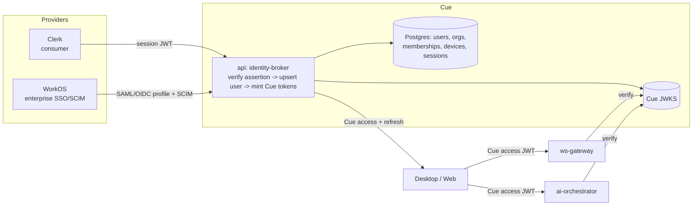
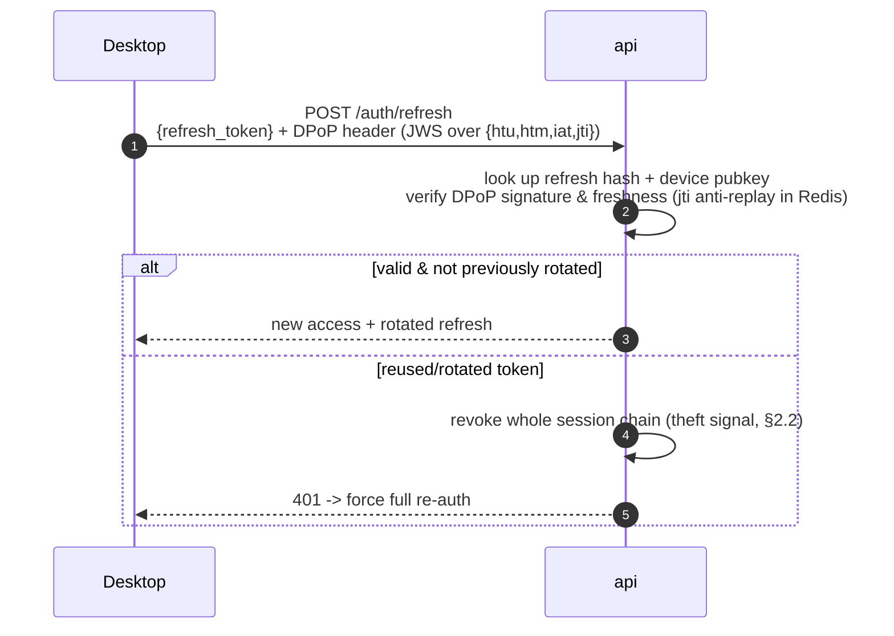
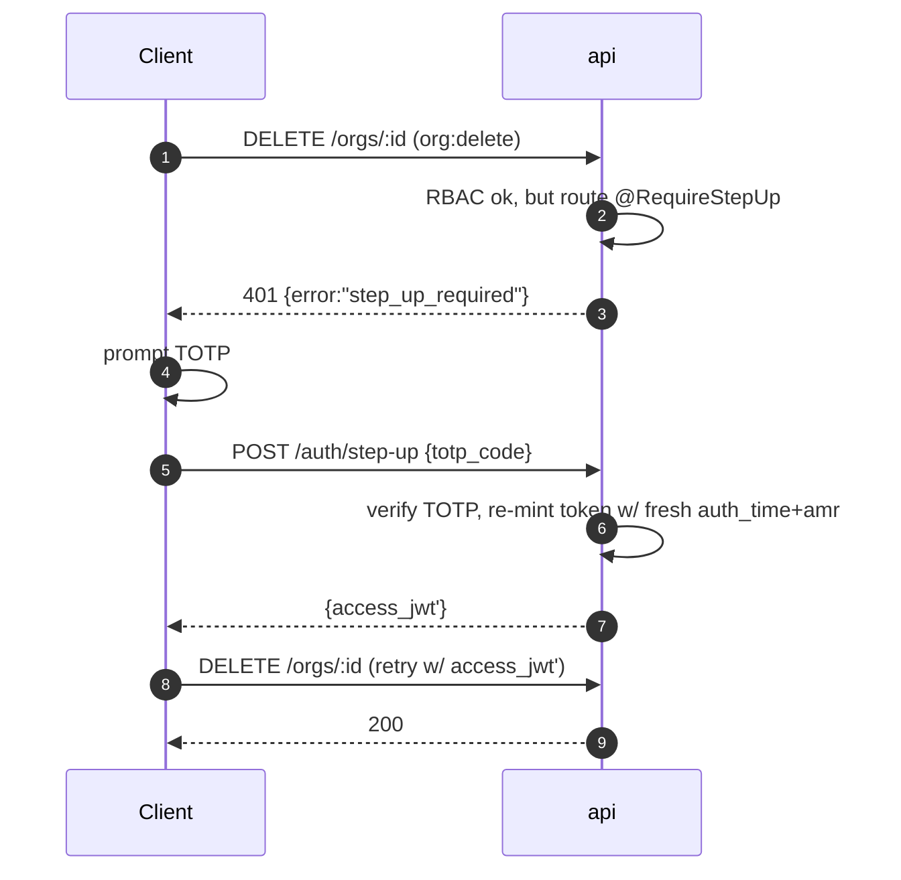

# Authentication, Authorization & Identity Security

> Status: Draft · Owner: Principal Architect (Identity & Security) · Last updated: 2026-07-29 · Related: [System architecture](02-system-architecture.md) · [Desktop app](10-desktop-app.md) · [Backend services](20-backend-services.md) · [Data model](30-data-model.md) · [Subscriptions & entitlements](50-subscriptions-entitlements.md) · [DevOps & infrastructure](60-devops-infrastructure.md) · [Observability](61-observability.md)

This document is the authoritative reference for **who a caller is** (authentication) and **what they may do** (authorization) across every surface of **Cue** (provisional brand): the Electron desktop app, the Next.js web app, and the backend services (`api`, `ws-gateway`, `ai-orchestrator`, `entitlements`). It owns the token model, the desktop OAuth/PKCE flow, device binding, the RBAC org/team model, session lifecycle, step-up 2FA, and auth-endpoint hardening.

It does **not** own: the jurisdictional recording-consent law analysis (owned by the legal/compliance doc — linked below as `legal/compliance`), the entitlement/feature-gate logic ([Entitlements](50-subscriptions-entitlements.md) — auth only supplies the identity context it keys off), or the Postgres DDL for the full schema ([Data model](30-data-model.md) — this doc shows only the identity tables and links to the canonical source).

---

## 1. Identity providers: who does what

Cue uses a **split-provider** identity strategy. Consumer self-serve auth and enterprise SSO have fundamentally different lifecycles, and forcing one provider to do both leads to a compromised implementation of each.

| Concern | Provider | Rationale |
|---|---|---|
| Consumer signup/login (email+password, Google, Microsoft, Apple), email verification, password reset, TOTP 2FA | **Clerk** | Fast to ship, hosted UI + headless SDK, first-class OAuth social, built-in TOTP/backup codes, org primitives. |
| Enterprise SSO (SAML 2.0, OIDC), SCIM 2.0 user/group provisioning, directory sync | **WorkOS** | Purpose-built for B2B SSO; one integration covers Okta, Entra ID, Google Workspace, JumpCloud, PingFederate, etc. SCIM keeps org membership in sync without manual admin. |
| Machine/service identity (inter-service auth) | **AWS IAM + mTLS + internal JWT** | Services never use human auth; see [Backend services](20-backend-services.md). |

> **ADR-40.1 — Split consumer/enterprise identity (Clerk + WorkOS) rather than one IdP**
> - **Decision:** Clerk for consumer, WorkOS for enterprise SSO/SCIM; both mint into **our own** first-party session (see §2), so downstream services never depend on a specific IdP.
> - **Context:** Free/Pro/Team tiers are consumer-grade self-serve; Enterprise requires SAML/SCIM/SLA. A single provider either over-serves consumers (cost, friction) or under-serves enterprise (missing SCIM/SAML depth).
> - **Alternatives considered:** (a) Clerk-only — Clerk's enterprise SSO is improving but SCIM/directory-sync breadth trails WorkOS. (b) Auth.js (self-hosted) — maximal control, but we own the entire security surface (password hashing, breach detection, MFA, social token refresh) with no team to spare pre-SOC 2. (c) WorkOS AuthKit for both — weaker consumer UX/social breadth today.
> - **Trade-offs:** Two vendors to integrate and reconcile; mitigated by the **identity-broker** pattern in §2 — both feed a single internal user record and session, so the rest of the system is provider-agnostic. Auth.js remains a documented fallback if we ever in-source consumer auth.
> - **Consequence:** `api` exposes provider-neutral `/auth/*` endpoints; swapping or adding a provider is a broker-layer change, not a system-wide one.

### 1.1 The identity-broker principle

Neither Clerk's nor WorkOS's session token is ever trusted directly by `ws-gateway` or `ai-orchestrator`. Instead:

1. The provider authenticates the human and returns a provider assertion (Clerk session JWT / WorkOS profile).
2. `api` verifies that assertion against the provider's JWKS, then **upserts** a canonical `users` row (keyed by provider + provider subject) and mints **Cue's own** access + refresh tokens (§2).
3. All downstream services validate **only** Cue tokens against Cue's JWKS.

This keeps provider lock-in at the edge and gives us one place to enforce device binding, entitlement claims, and revocation.



---

## 2. Token model

Cue issues its own tokens. Two token types, asymmetric signing, short access lifetime, rotating refresh.

| Token | Format | Lifetime | Signing | Storage (desktop) | Storage (web) |
|---|---|---|---|---|---|
| **Access** | JWT (JWS, `ES256`) | **10 min** | EdDSA/ECDSA private key in AWS Secrets Manager; public JWKS at `GET /.well-known/jwks.json` | In-memory only (renderer never persists it) | In-memory (React state), never `localStorage` |
| **Refresh** | Opaque 256-bit random (stored **hashed** server-side), bound to a `session_id` | **30 days** sliding, **absolute max 90 days** | n/a (opaque; server looks up hash) | OS keychain via Electron `safeStorage` | `HttpOnly; Secure; SameSite=Lax` cookie, path-scoped to `/auth/refresh` |

### 2.1 Access-token claims

```jsonc
{
  "iss": "https://api.cue.app",
  "sub": "usr_2a9…",              // Cue user id
  "sid": "ses_7f3…",             // session id (revocable, see §5)
  "did": "dev_c41…",             // bound device id (see §3)
  "org": "org_18b…",             // active org context (nullable for personal)
  "roles": ["org:member"],       // RBAC roles in active org (see §4)
  "plan": "pro",                 // coarse plan hint ONLY — NOT the entitlement source of truth
  "aud": ["api", "ws-gateway", "ai-orchestrator"],
  "iat": 1753776000,
  "exp": 1753776600,             // iat + 600s
  "jti": "jwt_9c2…"
}
```

> The `plan` claim is a **hint** for cheap UI decisions. The authoritative feature gate is the `entitlements` service, which is keyed by `sub`/`org` and read fresh (with Redis cache) on privileged calls — see [Entitlements](50-subscriptions-entitlements.md). We deliberately do **not** encode fine-grained entitlements in the JWT so that a plan change (upgrade, downgrade, trial expiry, Stripe webhook) takes effect within seconds without waiting for token expiry.

### 2.2 Refresh & rotation

- **Refresh rotation is mandatory.** Every call to `POST /auth/refresh` invalidates the presented refresh token and issues a new one (new opaque secret, same `session_id`). We store the **SHA-256 hash** of the refresh secret, never the secret itself.
- **Reuse detection.** If a refresh token that has already been rotated is presented again, we treat it as a **theft signal**: the entire `session_id` chain is revoked immediately, an audit event is written, and the user is forced to re-authenticate. This is the standard OAuth refresh-token-rotation replay defense.
- **Sliding + absolute expiry.** Each rotation extends the sliding window (30 days) but never past the 90-day absolute cap; after that, full re-auth (with 2FA if enabled) is required.
- **Access-token revocation window.** Because access tokens are stateless JWTs, a revoked session is still technically valid until its ≤10-min `exp`. For the highest-sensitivity actions (billing changes, device removal, org role changes) `api` performs an **online `sid` check** against a Redis revocation set, closing the window to near-zero. Streaming sessions on `ws-gateway` subscribe to a Redis pub/sub `revoke:<sid>` channel and drop the socket on revocation.

> **ADR-40.2 — Stateless access JWT + opaque rotating refresh, hybrid revocation**
> - **Decision:** `ES256` access JWT (10 min) validated statelessly at the edge; opaque hashed refresh with mandatory rotation + reuse detection; Redis `sid` denylist consulted only for high-sensitivity actions and for live WS sessions.
> - **Context:** `ws-gateway` and `ai-orchestrator` are latency-critical and horizontally scaled; a DB/Redis round-trip on every audio frame is unacceptable given the <1.2s p95 cue budget (see [System architecture](02-system-architecture.md)).
> - **Alternatives:** (a) Fully stateful opaque access tokens — a lookup per request, kills latency budget. (b) Long-lived access JWTs — larger theft blast radius. (c) No online check at all — cannot promptly revoke.
> - **Trade-offs:** Up to a 10-min stale-access window for low-sensitivity reads; accepted and bounded by short lifetime + selective online checks.
> - **Consequence:** Cheap validation on the hot path; strong, fast revocation where it matters.

---

## 3. Desktop authentication flow (OAuth 2.0 Authorization Code + PKCE)

The Electron app **never** embeds a login webview and never handles the user's IdP password. It launches the **system browser**, runs Authorization Code + PKCE (RFC 7636), and receives the code back via a **loopback redirect** (RFC 8252 — "OAuth 2.0 for Native Apps"). A custom deep-link scheme (`cue://auth/callback`) is the fallback when the loopback port cannot bind.

### 3.1 Why system browser + loopback (not an embedded webview)

- Embedded webviews defeat the point of federated login (they can read the user's IdP credentials, they don't share the OS SSO session, and Google/Microsoft/Apple block many of them).
- Loopback redirect (`http://127.0.0.1:<ephemeral-port>/callback`) keeps the authorization code on-device and needs no public redirect infrastructure.
- PKCE removes the need for a client secret in a distributable binary (a secret in a shipped app is not a secret).

### 3.2 Sequence

```mermaid
sequenceDiagram
    autonumber
    participant D as Desktop (main proc)
    participant LB as Loopback server<br/>127.0.0.1:PORT
    participant BR as System browser
    participant API as api (auth)
    participant IDP as Clerk / WorkOS
    participant KC as OS Keychain<br/>(safeStorage)

    D->>D: generate code_verifier (128B random)<br/>code_challenge = S256(code_verifier)<br/>state (CSRF nonce), nonce
    D->>LB: bind ephemeral loopback port, start one-shot server
    D->>BR: open /auth/desktop/authorize?<br/>response_type=code&code_challenge=…&<br/>state=…&redirect_uri=http://127.0.0.1:PORT/cb&<br/>device_pubkey=…
    BR->>API: GET authorize (system browser session)
    API->>IDP: begin hosted login (social / SSO / password + 2FA)
    IDP-->>BR: user authenticates (+ TOTP if enabled)
    IDP-->>API: assertion
    API->>API: verify assertion, upsert user,<br/>create auth code bound to code_challenge+device
    API-->>BR: 302 -> http://127.0.0.1:PORT/cb?code=…&state=…
    BR->>LB: GET /cb?code&state
    LB->>D: hand code+state to main proc
    D->>D: assert state matches (CSRF)
    D->>API: POST /auth/token<br/>{code, code_verifier, device_pubkey, device_meta}
    API->>API: verify S256(code_verifier)==code_challenge<br/>bind/register device (§3.3)
    API-->>D: {access_jwt (10m), refresh_token, session_id, device_id}
    D->>KC: safeStorage.encryptString(refresh_token) -> keychain
    LB-->>BR: 200 "You can return to Cue" (auto-close tab)
    D->>D: keep access_jwt in memory; schedule silent refresh
```

### 3.3 Concrete desktop-side implementation notes

- **PKCE:** `code_verifier` = 96 bytes from `crypto.randomBytes`, base64url; `code_challenge` = `base64url(sha256(verifier))`, `code_challenge_method=S256`. Plain method is rejected server-side.
- **Loopback server:** a one-shot Node `http` server on an ephemeral port (`server.listen(0)`), bound to `127.0.0.1` only, torn down the instant the code arrives or after a **60s** timeout. Only the exact `state`-matching request is accepted; everything else gets `400`.
- **Deep-link fallback:** the app registers the `cue://` scheme (`app.setAsDefaultProtocolClient('cue')`); macOS delivers via the `open-url` event, Windows/Linux via `second-instance`. Used only when no loopback port can bind (locked-down corporate machines).
- **Secure storage:** the refresh token is encrypted with Electron `safeStorage.encryptString()` (Keychain on macOS, DPAPI on Windows) before being written to disk under `app.getPath('userData')`. On platforms where `safeStorage.isEncryptionAvailable()` is false, we fall back to `keytar` (libsecret). The access token is **never** persisted. Detail on the renderer/main IPC boundary that guards this lives in [Desktop app](10-desktop-app.md).
- **Silent refresh:** the main process refreshes at `exp − 60s`; the renderer requests tokens over a locked-down `contextBridge` IPC channel and never touches the keychain directly.

### 3.4 Device binding & registration

At token exchange the desktop generates a per-install **device keypair** (Ed25519, private key in `safeStorage`) and sends the public key. `api` creates a `devices` row and binds the `session`/tokens to `device_id`. Subsequent refreshes must be accompanied by a **DPoP-style proof** (a short JWS signed by the device private key over the request), so a stolen refresh token alone — without the device private key — cannot be replayed from another machine.



Device management surfaces in-app and on the web: a user can list and revoke devices; org admins can revoke any org member's devices (see §4 permission matrix). Free/Pro cap concurrent bound devices per plan (enforced via `entitlements`, see [Entitlements](50-subscriptions-entitlements.md)).

---

## 4. Authorization — RBAC, org & team model

### 4.1 Entity model

```mermaid
erDiagram
    USERS ||--o{ MEMBERSHIPS : has
    ORGS  ||--o{ MEMBERSHIPS : has
    ORGS  ||--o{ TEAMS : contains
    TEAMS ||--o{ TEAM_MEMBERS : has
    MEMBERSHIPS ||--o{ TEAM_MEMBERS : maps
    USERS ||--o{ DEVICES : registers
    USERS ||--o{ SESSIONS : owns
    SESSIONS ||--o{ REFRESH_TOKENS : rotates

    USERS { uuid id PK; text provider; text provider_sub; text email; bool email_verified; bool totp_enabled; timestamptz created_at }
    ORGS  { uuid id PK; text name; text plan; text sso_connection_id; bool scim_enabled }
    MEMBERSHIPS { uuid id PK; uuid user_id FK; uuid org_id FK; text role; text status; timestamptz joined_at }
    TEAMS { uuid id PK; uuid org_id FK; text name }
    TEAM_MEMBERS { uuid id PK; uuid team_id FK; uuid membership_id FK; text team_role }
    DEVICES { uuid id PK; uuid user_id FK; text platform; text public_key; text name; timestamptz last_seen_at; bool revoked }
    SESSIONS { uuid id PK; uuid user_id FK; uuid device_id FK; uuid org_id FK; text ip; timestamptz created_at; timestamptz revoked_at }
    REFRESH_TOKENS { uuid id PK; uuid session_id FK; text token_hash; timestamptz rotated_at; timestamptz expires_at; bool used }
```

Canonical DDL (Drizzle schema + migrations) lives in [Data model](30-data-model.md); the above is the identity subset for reference.

### 4.2 Roles

Two scopes of role. **Org roles** govern the org/billing/admin surface; **team roles** govern shared-knowledge-base access within a team.

| Org role | Intended for | Key powers |
|---|---|---|
| `org:owner` | Founder / billing owner | Everything below + transfer ownership, delete org, manage billing & Stripe portal |
| `org:admin` | IT / team lead | Manage members, SSO/SCIM config, teams, device revocation, shared KB |
| `org:member` | Individual seat | Use the product, own sessions/history, own devices |
| `org:billing` | Finance (no product access) | View/manage billing only |

| Team role | Key powers |
|---|---|
| `team:lead` | Manage team membership, curate shared knowledge base |
| `team:member` | Read shared KB, use team resources |

Personal (non-org) accounts have an implicit single-user org context (`org` claim null); all "own resource" permissions apply.

### 4.3 Permission matrix (illustrative)

| Action | owner | admin | member | billing |
|---|:--:|:--:|:--:|:--:|
| Start a live copilot session | ✅ | ✅ | ✅ | ❌ |
| Read/delete **own** session history | ✅ | ✅ | ✅ | ❌ |
| Read **another member's** history | ❌* | ❌* | ❌ | ❌ |
| Upload personal RAG docs | ✅ | ✅ | ✅ | ❌ |
| Curate **shared** knowledge base | ✅ | ✅ | team:lead only | ❌ |
| Invite / remove members | ✅ | ✅ | ❌ | ❌ |
| Configure SSO / SCIM | ✅ | ✅ | ❌ | ❌ |
| Revoke any member's devices/sessions | ✅ | ✅ | ❌ | ❌ |
| Manage subscription / Stripe portal | ✅ | ❌ | ❌ | ✅ |
| Delete org | ✅ | ❌ | ❌ | ❌ |

\* Cross-member session content is private by default even to admins; an org may opt into admin visibility only where the recording-consent/compliance model permits it — this is governed by the `legal/compliance` doc, not by RBAC alone.

### 4.4 Enforcement

Authorization is enforced in `api` via a NestJS guard + a small policy layer. Roles come from the verified access JWT (`roles`, `org`); resource-level checks (ownership, team membership) hit Postgres/Redis. Keep the code split per the house standards — `types.ts` (role/permission unions), `utils.ts` (pure `can(role, action, resource)`), `hooks/` on the client, thin guards that orchestrate:

```typescript
// packages/core/authz/permissions.ts  (pure, unit-tested, no I/O)
export type OrgRole = 'org:owner' | 'org:admin' | 'org:member' | 'org:billing';
export type Action = 'session:start' | 'member:invite' | 'sso:configure'
  | 'billing:manage' | 'device:revoke-any' | 'org:delete' | 'kb:curate-shared';

const MATRIX: Record<Action, ReadonlySet<OrgRole>> = {
  'session:start':    new Set(['org:owner','org:admin','org:member']),
  'member:invite':    new Set(['org:owner','org:admin']),
  'sso:configure':    new Set(['org:owner','org:admin']),
  'billing:manage':   new Set(['org:owner','org:billing']),
  'device:revoke-any':new Set(['org:owner','org:admin']),
  'org:delete':       new Set(['org:owner']),
  'kb:curate-shared': new Set(['org:owner','org:admin']),
};

export const can = (role: OrgRole, action: Action): boolean =>
  MATRIX[action]?.has(role) ?? false;
```

```typescript
// services/api/src/auth/roles.guard.ts (orchestrates; logic lives in core)
@Injectable()
export class RolesGuard implements CanActivate {
  constructor(private reflector: Reflector) {}
  canActivate(ctx: ExecutionContext): boolean {
    const action = this.reflector.get<Action>('action', ctx.getHandler());
    if (!action) return true;
    const { roles, org } = ctx.switchToHttp().getRequest().auth; // from JWT
    return !!org && roles.some((r: OrgRole) => can(r, action));
  }
}
```

WorkOS SCIM is the source of truth for enterprise org membership: SCIM `POST/PATCH/DELETE` on users/groups map to `memberships` and `team_members` rows so deprovisioning in the customer's IdP revokes Cue access automatically.

---

## 5. Session management, revocation & step-up 2FA

### 5.1 Sessions

A `session` = one authenticated `(user, device)` pairing. It holds the refresh-token chain and is the unit of revocation. Every access JWT carries `sid`; every refresh belongs to a `sid`.

Users see an active-sessions list (device name, platform, IP-derived location, last-seen) on web and desktop and can **revoke** any session. Revocation:

1. sets `sessions.revoked_at`,
2. adds `sid` to the Redis denylist (`revoked:sid`, TTL = access-token max lifetime so it self-cleans),
3. publishes `revoke:<sid>` so live `ws-gateway` sockets for that session drop within ~1s.

`POST /auth/logout` revokes the current session; `POST /auth/logout-all` revokes every session for the user (used after a password change or theft signal).

### 5.2 Two-factor & step-up

- **Enrollment:** TOTP (RFC 6238) via Clerk, plus one-time backup codes. WorkOS/enterprise MFA is delegated to the customer's IdP.
- **Step-up authentication:** certain actions require a **fresh** strong factor regardless of a valid session — org deletion, changing SSO config, removing another member's device, changing billing owner, disabling 2FA, exporting all session history. `api` marks these routes `@RequireStepUp()`; if the JWT's `auth_time`/`amr` doesn't show a recent (≤5 min) strong factor, `api` returns `401 step_up_required` and the client prompts for TOTP before retrying. The result is recorded as a fresh `amr` in a re-minted short-lived token.



### 5.3 Consent capture at session start

Every **live copilot session** begins with an explicit consent gate before any audio is captured or streamed. `api` records a `session_consent` row: `{ session_id, user_id, consent_mode, jurisdiction_hint, disclosed_flag, ts, policy_version }`.

- **Modes:** `personal-prep` (interview prep / practice — no other party), `disclosed` (the user has informed other participants that AI note-taking is active), and `notes-only`.
- Recording-consent law varies (two-party-consent US states, GDPR lawful basis, etc.). Cue surfaces a jurisdiction-aware prompt and a **"disclosed mode"** banner/announcement helper. **The authoritative acceptable-use policy, the jurisdictional matrix, and the exact consent copy are owned by the `legal/compliance` doc** — auth only persists the immutable, audit-logged consent record and blocks capture until it exists.

---

## 6. Security hardening

| Threat | Control |
|---|---|
| **CSRF** (web) | State-changing routes require the `HttpOnly SameSite=Lax` refresh cookie *and* a double-submit `X-CSRF-Token` header; `/auth/refresh` is `POST`-only and `SameSite`-scoped. Desktop uses bearer tokens (not cookies), so is not CSRF-exposed. |
| **PKCE downgrade** | `code_challenge_method=plain` rejected; auth code single-use, ≤60s TTL, bound to `code_challenge` + `device`. |
| **Authorization-code interception** | Loopback bound to `127.0.0.1` only; `state` nonce checked; code exchange requires the matching `code_verifier`. |
| **Refresh-token theft** | Rotation + reuse detection (§2.2); device-bound DPoP proof (§3.4); hashed-at-rest; short 30-day sliding / 90-day absolute. |
| **Access-token theft** | 10-min lifetime; `aud` pinned per service; audience-restricted; Redis `sid` denylist for sensitive ops + live WS. |
| **Open redirect** | `redirect_uri` allowlist: only `127.0.0.1` loopback, `cue://auth/callback`, and exact web origins. |
| **Brute force / credential stuffing** | Provider-side (Clerk) breach-password checks + rate limits; on our `/auth/*` an IP + account sliding-window limiter (Redis token bucket): e.g. `POST /auth/token` 10/min/IP, `/auth/step-up` 5/min/account, exponential backoff + lockout on repeated TOTP failure. |
| **JWT algorithm confusion** | Only `ES256` accepted; `alg:none` and HS↔RS confusion rejected; keys from JWKS by `kid`; regular key rotation via Secrets Manager. |
| **Enumeration** | Uniform responses/timing on login & password-reset (no "user exists" leak). |
| **Session fixation** | New `session_id` minted on every authentication; never reuses a pre-auth id. |
| **Audit** | All auth events (login, refresh, rotation-reuse, revocation, step-up, device add/remove, role change, SSO/SCIM change) written to an append-only audit log — see [Observability](61-observability.md). |

Rate limiting, JWKS distribution, and Secrets Manager rotation are operationalized in [DevOps & infrastructure](60-devops-infrastructure.md).

---

## 7. API surface (auth endpoints)

| Method & path | Purpose | Notes |
|---|---|---|
| `GET /auth/desktop/authorize` | Start desktop PKCE flow | opens in system browser |
| `POST /auth/token` | Exchange code → tokens | requires `code_verifier`, `device_pubkey` |
| `POST /auth/refresh` | Rotate refresh, mint access | requires DPoP proof (desktop) |
| `POST /auth/step-up` | Re-mint token after TOTP | for `@RequireStepUp` routes |
| `POST /auth/logout` / `logout-all` | Revoke session(s) | |
| `GET /auth/sessions` · `DELETE /auth/sessions/:sid` | List / revoke sessions | |
| `GET /auth/devices` · `DELETE /auth/devices/:id` | List / revoke devices | admin can target org members |
| `POST /auth/consent` | Persist live-session consent record | blocks capture until present |
| `GET /.well-known/jwks.json` | Public verification keys | consumed by all services |
| WorkOS/Clerk webhooks | SCIM provisioning, session events | signature-verified |

Full request/response DTOs live in `packages/types` and are consumed via `packages/sdk`; the endpoint contracts are catalogued in [Backend services](20-backend-services.md).

---

## Open questions & risks

- **Dual-provider reconciliation.** A user who signs up consumer-side (Clerk) and later joins an enterprise org (WorkOS SSO) needs account linking by verified email. Risk of duplicate identities / account-takeover via unverified-email linking — needs a strict verified-email merge policy and step-up before linking.
- **`plan` claim staleness vs. entitlements.** We rely on the `entitlements` service for the real gate, but any code path that trusts the JWT `plan` hint for anything beyond UI hints is a latent over-grant bug. Needs a lint/review rule.
- **DPoP support surface.** Device-bound refresh via DPoP-style proofs is well-defined for our own desktop client, but partners/CLI/future mobile need a clear story; scope for v1 is desktop + web only.
- **Access-token revocation window.** The ≤10-min stale-access window is accepted for low-sensitivity reads; if a future feature makes any read sensitive, it must opt into the online `sid` check — this needs an explicit classification of every endpoint.
- **SCIM edge cases.** Group-nesting, partial SCIM implementations across IdPs, and deprovisioning-vs-active-session timing (a SCIM delete must trigger `logout-all`) need integration test coverage per IdP.
- **Consent record integrity.** The consent row is legally load-bearing; it must be tamper-evident (append-only, hash-chained) — coordinate the exact integrity mechanism with the `legal/compliance` doc.
- **Keychain fallback exposure.** On Linux/edge cases where `safeStorage` is unavailable and we fall back to plaintext-capable stores, the refresh token's at-rest protection weakens; decide whether to hard-require encryption-available or degrade with a warning.
