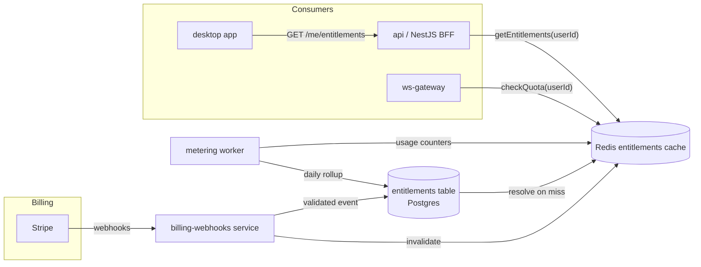
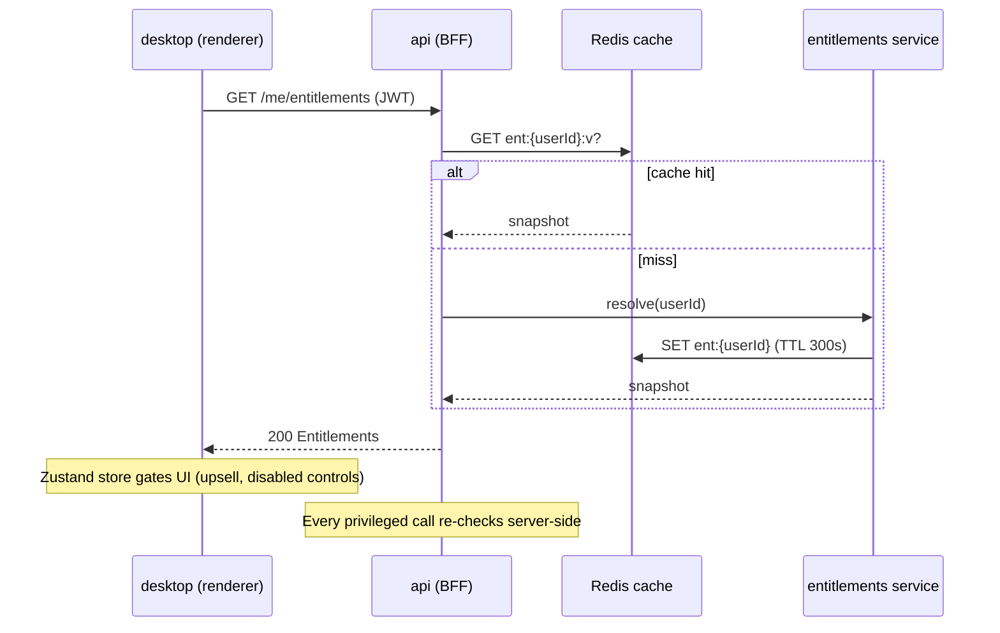
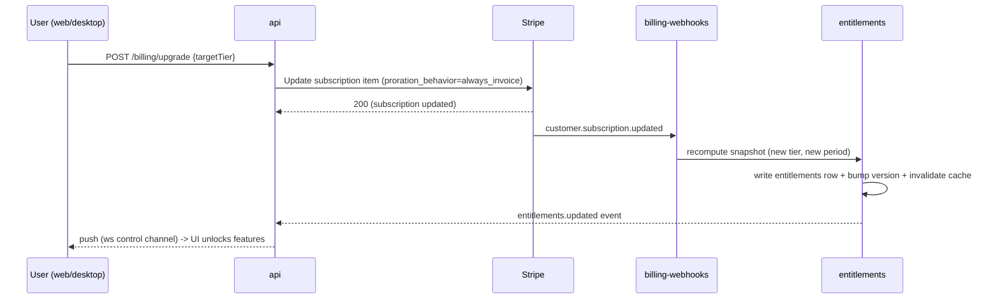

# AssistMe — Subscriptions & Entitlements

> Status: Draft · Owner: Platform / Billing Architect · Last updated: 2026-07-29 · Related: [Payments (Stripe)](51-payments-stripe.md) · [AI Pipeline](21-ai-pipeline.md) · [Unit Economics](71-unit-economics.md) · [Backend Services](20-backend-services.md) · [Authentication](40-authentication.md) · [Data Model](30-data-model.md) · [Product Vision](01-product-vision.md)

> **AssistMe** (formerly Cue) is a provisional working title. All brand references are placeholders.

---

## 1. Scope & responsibility

This document owns the **monetization and entitlement model**: what each tier includes, how the `entitlements` service becomes the single source of truth for every feature gate, and how AI live-minute usage is metered, enforced, and displayed.

It does **not** own the Stripe integration mechanics (Checkout, webhooks, Tax, dunning) — that lives in [Payments (Stripe)](51-payments-stripe.md). It does not own the per-user cost math — that lives in [Unit Economics](71-unit-economics.md). Where those overlap, we link rather than duplicate.

The `entitlements` service is the **authoritative feature-gate oracle**. Stripe is the source of truth for *billing state* (what the customer pays for); `entitlements` translates billing state into *runtime capability* (what the app allows) and is the only thing `api`, `ws-gateway`, and `desktop` are allowed to ask.

---

## 2. Pricing tiers (canonical)

| Tier | Price | Live minutes / mo | LLM access | RAG uploads | History | Team / admin | Support |
|------|-------|-------------------|------------|-------------|---------|--------------|---------|
| **Free** | $0 | **60** | Haiku only (`claude-haiku-4-5`) | ❌ | 7-day rolling | — | Community |
| **Pro** | **$20/mo** ($200/yr) | **1,200** + metered overage | Haiku + Sonnet (`claude-sonnet-5`) | ✅ up to 50 docs / 200 MB | Unlimited | — | Email, 24h |
| **Team** | **$30/user/mo** ($300/user/yr) | **1,500/user**, pooled + overage | Haiku + Sonnet + Opus (`claude-opus-5`) for prep | ✅ shared KB, 500 docs / 2 GB / seat | Unlimited + shared | Admin console, roles, SSO-lite (Google/Microsoft OAuth) | Priority, 8h |
| **Enterprise** | Custom | Custom / pooled, SLA-backed | All models, dedicated capacity option | ✅ shared KB + on-prem STT option | Unlimited + retention controls | SSO/SAML/SCIM, audit export, DPA | Dedicated CSM, SLA |

Notes:
- **Annual = 2 months free** (10× monthly): Pro $200/yr, Team $300/user/yr. Enforced via distinct Stripe Prices — see [Payments](51-payments-stripe.md#2-product--price-catalog).
- **14-day Pro trial** on signup, no card required for Free→trial; card required to *continue* into paid.
- **Metered overage** for live minutes beyond the plan allotment (Pro/Team only) — billed per-minute via a Stripe metered Price. Free has a **hard cap**, not overage.
- Model access is a *capability gate*, but the [AI Pipeline](21-ai-pipeline.md) may still route a Pro user's request to Haiku for latency reasons; the tier defines the *ceiling*, not the forced model.

### Live-minute definition

One **live minute** = one wall-clock minute during which a session is actively streaming audio into `ws-gateway` and receiving AI cues. Minutes are counted **per active session**, rounded up to the nearest whole minute at session close, and *also* accrued in real time for enforcement (see §6). Prep-mode / async document analysis is **not** metered as live minutes; it is metered separately as tokens against a generous soft budget (Pro/Team) — see [Unit Economics](71-unit-economics.md).

---

## 3. Feature-gate matrix

The canonical mapping of **feature → tier**. Every row corresponds to a named entitlement key stored in the `entitlements` table. Keys are stable strings the app checks; do not check tier names directly in feature code.

| Feature | Entitlement key | Free | Pro | Team | Enterprise |
|---------|-----------------|:----:|:---:|:----:|:----------:|
| Live overlay + cues | `live.session` | ✅ | ✅ | ✅ | ✅ |
| Live minutes / mo | `live.minutes.quota` | 60 | 1,200 | 1,500/seat | custom |
| Overage minutes | `live.minutes.overage` | ❌ | ✅ | ✅ | ✅/custom |
| Haiku live cues | `model.haiku` | ✅ | ✅ | ✅ | ✅ |
| Sonnet real-time answers | `model.sonnet` | ❌ | ✅ | ✅ | ✅ |
| Opus deep prep/analysis | `model.opus` | ❌ | ❌ | ✅ | ✅ |
| RAG document uploads | `rag.upload` | ❌ | ✅ | ✅ | ✅ |
| RAG storage quota | `rag.storage.bytes` | 0 | 200 MB | 2 GB/seat | custom |
| Shared team knowledge base | `rag.shared_kb` | ❌ | ❌ | ✅ | ✅ |
| Session history & transcripts | `history.retention` | 7d | ∞ | ∞ | ∞ + policy |
| Export (md / pdf / json) | `history.export` | ❌ | ✅ | ✅ | ✅ |
| Disclosed / consent mode | `session.disclosed_mode` | ✅ | ✅ | ✅ | ✅ |
| Custom prompt templates | `prompts.custom` | 1 | 10 | unlimited | unlimited |
| Admin console | `org.admin` | ❌ | ❌ | ✅ | ✅ |
| Roles / RBAC | `org.rbac` | ❌ | ❌ | basic | full |
| SSO-lite (OAuth) | `auth.sso_lite` | ❌ | ❌ | ✅ | ✅ |
| SSO/SAML + SCIM | `auth.saml_scim` | ❌ | ❌ | ❌ | ✅ |
| Audit log export | `org.audit_export` | ❌ | ❌ | ❌ | ✅ |
| On-prem / BYO STT | `stt.on_prem` | ❌ | ❌ | ❌ | ✅ |
| DPA + data residency (eu-west-1) | `compliance.residency` | ❌ | ❌ | ❌ | ✅ |
| SLA (99.9% credit-backed) | `sla.uptime` | ❌ | ❌ | ❌ | ✅ |
| Concurrent live sessions | `live.concurrency` | 1 | 2 | 3/seat | custom |
| Priority AI queue | `ai.priority` | ❌ | ❌ | ✅ | ✅ |

Legend: ✅ enabled · ❌ disabled · numeric = quota value.

> Entitlement keys are the **contract** between billing and app. They are defined once in `packages/types` (`EntitlementKey` union + `Entitlements` DTO) and consumed by `packages/sdk`, `api`, `ws-gateway`, and `desktop`. See [Repository Structure](03-repository-structure.md).

---

## 4. The entitlements service as single source of truth

### 4.1 Principle

> **Stripe answers "what does this customer pay for?" · `entitlements` answers "what is this user allowed to do right now?"**

Feature code never queries Stripe and never inspects a raw subscription object. It asks `entitlements` for a resolved, denormalized `Entitlements` snapshot keyed by `userId` (and `orgId` for team plans). This keeps the hot path fast (Redis-cached, sub-millisecond) and decouples the app from billing-provider specifics.

### 4.2 Where entitlements come from



Flow: **Stripe → `billing-webhooks` → `entitlements` table (Postgres) → Redis cache → consumers.** Metering counters flow the other direction into the same cache for quota enforcement (§6).

### 4.3 Resolution algorithm

`entitlements.resolve(userId)` produces the effective snapshot:

1. Load the user's **subscription record** (from the last processed Stripe webhook; §51 owns writing it).
2. Map `priceId → tier → base entitlement template` (templates live in `packages/core`).
3. For **Team/Enterprise**, resolve `orgId`, apply org-level entitlements, and prefer the **org plan** over any personal plan (org wins).
4. Apply **overrides**: trial flags, grandfathered pricing, manual grants (support-issued credits), enterprise custom quotas.
5. Compute **quota remainders** by subtracting current-period usage counters (§6).
6. Cache the snapshot in Redis with a version tag; TTL 300s, but **event-driven invalidation** is primary (webhook or usage-threshold flush).

```ts
// packages/types/src/entitlements.ts
export type EntitlementKey =
  | 'live.session' | 'live.minutes.quota' | 'live.minutes.overage'
  | 'model.haiku' | 'model.sonnet' | 'model.opus'
  | 'rag.upload' | 'rag.storage.bytes' | 'rag.shared_kb'
  | 'history.retention' | 'history.export'
  | 'org.admin' | 'org.rbac' | 'auth.sso_lite' | 'auth.saml_scim'
  | 'org.audit_export' | 'stt.on_prem' | 'compliance.residency'
  | 'sla.uptime' | 'live.concurrency' | 'ai.priority'
  | 'prompts.custom' | 'session.disclosed_mode';

export interface EntitlementValue {
  enabled: boolean;
  limit?: number;          // numeric quota, if any
  remaining?: number;      // computed against current-period usage
  meta?: Record<string, string | number>;
}

export interface Entitlements {
  userId: string;
  orgId?: string;
  tier: 'free' | 'pro' | 'team' | 'enterprise';
  status: 'active' | 'trialing' | 'past_due' | 'canceled' | 'incomplete';
  periodEnd: string;       // ISO; when the current billing period resets quotas
  keys: Record<EntitlementKey, EntitlementValue>;
  version: number;         // monotonic; bumped on every write for cache races
}
```

### 4.4 The `entitlements` table

Owned by [Data Model](30-data-model.md); summarized here for the billing view.

```sql
-- one row per (user or org) billing subject
CREATE TABLE entitlements (
  id            uuid PRIMARY KEY DEFAULT gen_random_uuid(),
  subject_type  text NOT NULL CHECK (subject_type IN ('user','org')),
  subject_id    uuid NOT NULL,
  tier          text NOT NULL,
  status        text NOT NULL,
  stripe_customer_id     text,
  stripe_subscription_id text,
  current_period_end     timestamptz NOT NULL,
  keys          jsonb NOT NULL,          -- resolved EntitlementValue map
  version       bigint NOT NULL DEFAULT 1,
  updated_at    timestamptz NOT NULL DEFAULT now(),
  UNIQUE (subject_type, subject_id)
);
CREATE INDEX ON entitlements (stripe_subscription_id);
```

### 4.5 Feature-check API contract

```ts
// packages/sdk — used by api, ws-gateway
interface EntitlementsClient {
  get(userId: string): Promise<Entitlements>;                 // cached
  can(userId: string, key: EntitlementKey): Promise<boolean>; // enabled?
  quota(userId: string, key: EntitlementKey): Promise<{ limit: number; remaining: number }>;
}
```

Desktop never calls Redis; it fetches `GET /me/entitlements` from `api` on launch and after any billing change (server pushes an `entitlements.updated` event over the existing `ws-gateway` control channel). The renderer stores the snapshot in Zustand and drives UI gating (disabled buttons, upsell prompts) from it — **but the server always re-checks**; the client gate is UX, not security.



---

## 5. Feature gating in practice

### 5.1 Server-side (authoritative)

`api` uses a NestJS guard; `ws-gateway` checks at session-open and mid-stream.

```ts
// api: services/api/src/entitlements/require-entitlement.guard.ts
@Injectable()
export class RequireEntitlementGuard implements CanActivate {
  constructor(private readonly ent: EntitlementsClient,
              private readonly reflector: Reflector) {}
  async canActivate(ctx: ExecutionContext): Promise<boolean> {
    const key = this.reflector.get<EntitlementKey>('entitlement', ctx.getHandler());
    const { userId } = ctx.switchToHttp().getRequest().auth;
    if (!(await this.ent.can(userId, key))) {
      throw new ForbiddenException({ code: 'ENTITLEMENT_DENIED', key });
    }
    return true;
  }
}

// usage
@RequireEntitlement('rag.upload')
@Post('documents')
uploadDoc() { /* ... */ }
```

`ws-gateway` gates model selection and concurrency at the moment a live session opens:

```ts
// ws-gateway: on session start
const ent = await entitlements.get(userId);
if (!ent.keys['live.session'].enabled) return close(4403, 'no_live');
if (activeSessions(userId) >= ent.keys['live.concurrency'].limit)
  return close(4409, 'concurrency_exceeded');
const model = pickModel(requestedModel, ent);   // clamps to tier ceiling
```

### 5.2 Client-side (UX only)

Desktop reads the snapshot and renders locked features with an inline upsell (e.g. a Free user opening the RAG panel sees "Upload your resume — upgrade to Pro"). The 402/403 from the server is the real gate; the client gate exists only to avoid round-trips and dead-end clicks.

---

## 6. Usage-based metering (live minutes)

The most cost-sensitive gate. Minutes map directly to STT + LLM spend — see [Unit Economics](71-unit-economics.md) and [AI Pipeline](21-ai-pipeline.md).

### 6.1 Where minutes are counted

Counting happens in `ws-gateway` (it owns the live audio socket) and is confirmed by `ai-orchestrator` (only minutes that actually produced cues count against quota — a silent/idle stream with VAD detecting no speech does not burn quota unfairly).

```mermaid
flowchart TD
  A[audio frames arrive at ws-gateway] --> V{VAD: speech?}
  V -- no --> IDLE[idle heartbeat: not metered]
  V -- yes --> ACC[increment active-second counter]
  ACC --> TICK[every 15s: flush partial minute]
  TICK --> RC[(Redis: usage:{userId}:{period})]
  RC --> THR{threshold crossed?}
  THR -- 80% --> WARN[emit soft-warn -> desktop toast]
  THR -- 100% --> ENF{tier?}
  ENF -- Free --> CAP[hard cap: end session, upsell]
  ENF -- Pro/Team --> OVER[enter overage: keep streaming, meter to Stripe]
  RC -.session close.-> ROLL[metering worker: round up, persist usage_events]
  ROLL --> STRIPE[report to Stripe usage records]
```

### 6.2 Counting algorithm

- `ws-gateway` maintains a per-session **active-seconds** counter, incremented only while VAD reports speech within the session window (prevents billing users for a muted 40-minute standup they never spoke in).
- Every 15s the counter is flushed to Redis `usage:{subjectId}:{periodStart}` via `INCRBY` — cheap, atomic, survives gateway restarts.
- On **session close** the metering worker rounds the session's active-seconds **up to the nearest whole minute**, writes an immutable `usage_events` row (Postgres, audit trail), and reports the delta to Stripe (Pro/Team, overage price) — see [Payments](51-payments-stripe.md#7-usage-reporting).
- Team plans **pool** minutes across seats: the counter subject is `orgId`, not `userId`, with per-user attribution stored in `usage_events.meta` for the admin console.

```sql
CREATE TABLE usage_events (
  id           uuid PRIMARY KEY DEFAULT gen_random_uuid(),
  subject_type text NOT NULL,
  subject_id   uuid NOT NULL,
  session_id   uuid NOT NULL,
  metric       text NOT NULL DEFAULT 'live_minutes',
  quantity     integer NOT NULL,        -- whole minutes, rounded up
  billable     integer NOT NULL,        -- portion beyond quota (overage)
  period_start date NOT NULL,
  reported_to_stripe boolean NOT NULL DEFAULT false,
  stripe_usage_record_id text,
  created_at   timestamptz NOT NULL DEFAULT now(),
  UNIQUE (session_id)                    -- idempotent per session
);
CREATE INDEX ON usage_events (subject_id, period_start);
```

### 6.3 Enforcement ladder: soft warn → hard cap → overage

| Threshold | Free | Pro / Team |
|-----------|------|------------|
| 80% of quota | Toast + email: "12 minutes left this month" | Toast: "You've used 80% of your plan minutes" |
| 100% of quota | **Hard cap**: current session gets a 60s grace, then closes with an upgrade CTA; new sessions blocked until reset or upgrade | **Overage begins**: streaming continues uninterrupted; each further minute is a metered, billable unit reported to Stripe |
| Overage soft ceiling (Pro/Team) | n/a | At a configurable spend ceiling (default $50 overage/mo, org-settable), warn admin; require explicit opt-in to continue past it (prevents runaway bills) |

Enforcement reads the Redis counter, not Postgres, on the hot path. The counter carries `limit` and `remaining` from the entitlements snapshot; when `remaining <= 0`, `ws-gateway` consults `live.minutes.overage`:
- `overage.enabled === false` → hard cap.
- `overage.enabled === true` → keep streaming, tag subsequent minutes `billable`.

Quotas **reset** at `current_period_end` (Stripe's billing anchor), not calendar month — the entitlements snapshot carries the reset instant so the counter key rotates deterministically.

### 6.4 Displaying usage

- **Desktop**: a minutes meter in the overlay's status strip and a fuller breakdown in Settings → Usage, driven by the same snapshot + a lightweight `GET /me/usage` poll (30s). Overage minutes render in an amber "billable" band.
- **Web**: account dashboard mirrors it; Team admins see pooled usage + per-seat attribution.
- **Source of truth for display** is the Redis counter for the live number and `usage_events` for the historical/invoice-reconciled number. When they disagree (rare, e.g. after a gateway crash), `usage_events` wins on the next rollup.

---

## 7. Trials, discounts, and lifecycle changes

### 7.1 14-day Pro trial

- Every new account starts on **Free** but is offered an immediate **14-day Pro trial**. Trial can be started without a card (`status: trialing`, full Pro entitlements) — we optimize for activation.
- A card *may* be added during the trial to convert seamlessly; if none is added, the trial ends → account **downgrades to Free**, not `past_due`. This is a product choice (no involuntary charges, less dunning risk). Stripe subscription is created in `trialing` only when a card is attached; card-less trials are tracked as an entitlements-level trial flag with an expiry.
- Trial state is an **override** in resolution (§4.3): `keys` = Pro template, `status = trialing`, plus a `trialEndsAt` in `meta`. Countdown surfaces in desktop + web.

### 7.2 Annual discount (2 months free)

Modeled purely as separate Stripe Prices (monthly vs. yearly) — see [Payments](51-payments-stripe.md#2-product--price-catalog). Entitlements are identical between billing intervals; only `periodEnd` (and therefore quota-reset cadence) differs. **Annual quotas still reset monthly**, anchored to the subscription's monthly cycle within the year, so an annual Pro user gets 1,200 minutes each month, not 14,400 up front.

### 7.3 Upgrades, downgrades, proration

| Change | When it takes effect | Proration | Entitlements behavior |
|--------|---------------------|-----------|----------------------|
| **Upgrade** (Free→Pro, Pro→Team) | **Immediately** | Stripe prorates the remainder of the period (charge now) | New entitlements applied on `subscription.updated` webhook; higher quotas available at once |
| **Downgrade** (Team→Pro, Pro→Free) | **At period end** | Credit or scheduled change (no mid-period refund) | Snapshot keeps higher tier until `current_period_end`, then flips; prevents paying-for-less-mid-period surprises |
| **Seat add/remove** (Team) | Add: immediate + prorated; Remove: period end | Stripe seat proration | Pooled quota recomputed on `subscription.updated` |
| **Interval switch** (monthly↔annual) | Next renewal (or immediate w/ proration if upgrading) | Stripe handles | `periodEnd` changes; quota cadence unchanged (§7.2) |

All of these are driven by Stripe events; entitlements never initiates a billing change, it only *reacts* to `customer.subscription.updated`. The user-facing action (the button that requests the change) goes through `api` → Stripe (Checkout for new, Customer Portal or Billing API for changes), then the resulting webhook updates entitlements. See [Payments — proration & lifecycle](51-payments-stripe.md#6-lifecycle--proration).



---

## 8. Failure modes & guarantees

| Scenario | Behavior | Rationale |
|----------|----------|-----------|
| Redis cache down | Fall back to Postgres `entitlements` read (slower, still correct); degrade gracefully | Never grant more than paid; correctness over latency for gating |
| Stripe webhook delayed | User keeps current entitlements until event processed; upgrades feel instant only after `subscription.updated` | Eventual consistency; §51 makes webhooks idempotent & retried |
| Payment failed (`past_due`) | Enter **grace period** (default 7 days): entitlements stay at paid tier, banner warns; after grace with no recovery → downgrade to Free | Balances revenue recovery (dunning) vs. user goodwill — see [Payments — dunning](51-payments-stripe.md#8-dunning--failed-payments) |
| Usage counter lost (gateway crash mid-session) | Next rollup reconciles from `usage_events`; unpersisted partial minute is forgiven (favors user) | Never over-bill on our own infra fault |
| Entitlement check unavailable at session open | Fail **closed** for paid-only features, fail **open** for `live.session` at Free quota (offline-tolerant) | Don't lock a paying user out of the core feature over a transient blip |
| Manual support grant | Override layer in resolution; time-boxed, audited | Support can comp minutes without touching Stripe |

---

## 9. Key decisions (ADR)

**ADR-50-01 — Entitlements service as the single gate, not Stripe reads.**
- *Context*: Feature code needs sub-ms gating on the live hot path; Stripe API is slow and rate-limited.
- *Alternatives*: (a) query Stripe per check; (b) embed tier in the JWT; (c) dedicated entitlements service + cache.
- *Trade-offs*: JWT-embedding is fast but stale until token refresh and can't carry live quota remainders; direct Stripe reads are authoritative but far too slow and couple every service to Stripe.
- *Consequence*: **(c)** — `entitlements` service + Redis cache + Postgres source. Stripe → webhooks → entitlements is the only billing→app path.

**ADR-50-02 — Meter active-speech seconds, not wall-clock connection time.**
- *Context*: Users leave sessions open during long silent meetings; billing wall-clock feels punitive and inflates COGS attribution.
- *Alternatives*: wall-clock connected time; per-token; active-speech seconds via VAD.
- *Trade-offs*: token-metering is the truest cost proxy but is opaque to users ("what's a token?"); wall-clock is simplest but unfair; active-speech aligns cost (STT/LLM only fire on speech) with a unit users understand.
- *Consequence*: **active-speech seconds, rounded up to minutes per session.** Tokens are still tracked internally for cost accounting in [Unit Economics](71-unit-economics.md).

**ADR-50-03 — Card-less trials downgrade to Free, never auto-charge.**
- *Context*: Trial → involuntary charge is a top source of chargebacks and 1-star reviews.
- *Alternatives*: require card up front; card-less trial → downgrade; card-less trial → auto-charge if card added later.
- *Trade-offs*: requiring a card lifts conversion quality but kills top-of-funnel activation; auto-charge risks disputes.
- *Consequence*: **card-less trial → graceful downgrade to Free.** Card can be added anytime to convert. Fewer disputes, higher activation.

**ADR-50-04 — Downgrades at period end, upgrades immediate.**
- *Context*: Standard SaaS expectation; avoids mid-period refund complexity and revenue leakage.
- *Consequence*: Upgrades prorate and apply instantly (fast gratification, more revenue); downgrades schedule to `period_end` (no refunds, keeps entitlements the user already paid for).

---

## 10. Open questions & risks

- **Team pooled-minute fairness**: pooling across seats can let one heavy user exhaust the team pool. Do we need per-seat soft sub-caps configurable by admins? Leaning yes for Team GA.
- **Overage price sensitivity**: the canonical overage rate is **$0.13/min** (Reconciled per [decision record](04-decision-record.md) (F-01)) — set to preserve the ~10×-COGS margin defense (~9× the ~1.5¢/min live COGS); the residual risk is confirming it does not shock users, i.e. validating against willingness-to-pay before Pro launch. Cost basis owned by [Unit Economics](71-unit-economics.md).
- **Enterprise custom entitlements at scale**: the override layer works for a handful of custom deals; beyond ~50 enterprise accounts we may need a first-class "entitlement plan" entity rather than per-subject overrides.
- **Trial abuse**: card-less trials invite multi-account farming for free Pro minutes. Mitigation (device binding via [Auth](40-authentication.md), email/domain heuristics) needs a defined threshold before scale.
- **Quota reset vs. annual billing edge cases**: annual subscribers whose monthly quota-reset anchor drifts across DST / month-length boundaries — need deterministic anchor math (store the anchor day, clamp to month length).
- **Model-access ceiling vs. routing**: if the [AI Pipeline](21-ai-pipeline.md) downgrades a Pro user to Haiku under load, do we credit minutes or communicate it? Product decision pending.
- **Consistency window**: the gap between a Stripe change and the entitlements update is bounded by webhook latency; for high-stakes upgrades we optimistically apply on the synchronous Stripe API response (§7.3) — need to confirm we always reconcile if the later webhook disagrees.
