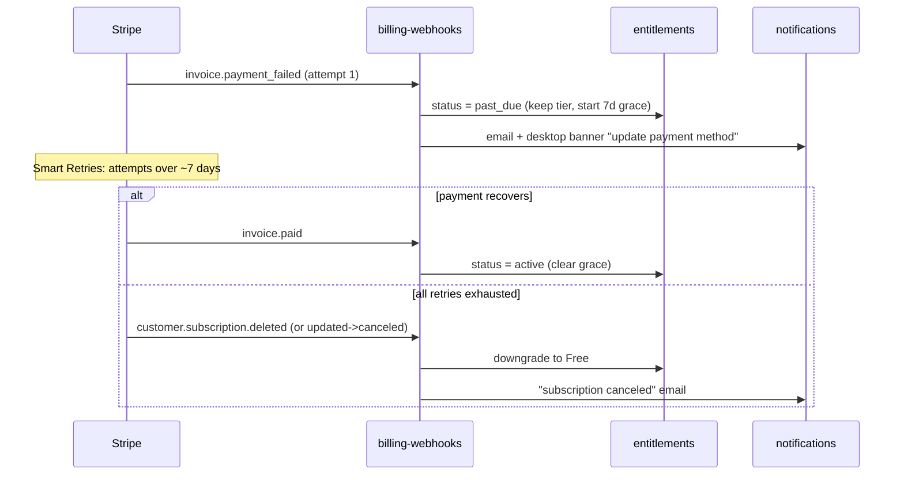

# Cue — Payments (Stripe Integration)

> Status: Draft · Owner: Platform / Billing Architect · Last updated: 2026-07-29 · Related: [Subscriptions & Entitlements](50-subscriptions-entitlements.md) · [Authentication](40-authentication.md) · [Backend Services](20-backend-services.md) · [Data Model](30-data-model.md) · [Unit Economics](71-unit-economics.md) · [DevOps](60-devops-infrastructure.md)

> **Cue** is a provisional working title. All brand references are placeholders.

---

## 1. Scope & responsibility

This document owns the **Stripe integration**: the product/price catalog, hosted Checkout, Billing (subscriptions + metered overage), Customer Portal, Stripe Tax, and the `billing-webhooks` service that turns Stripe events into entitlement updates. It owns revenue flows, proration mechanics, dunning, refunds, chargebacks, PCI posture, and the test/fixture strategy.

It does **not** own the entitlement model or feature gates — that is [Subscriptions & Entitlements](50-subscriptions-entitlements.md). Legal billing terms (refund policy language, tax obligations, contract terms) are summarized here and owned by the legal/compliance doc. Cost math is [Unit Economics](71-unit-economics.md).

**Design stance**: Stripe is the **system of record for billing state**; `billing-webhooks` is the **only writer** that translates that state into the `entitlements` table. `api` may *initiate* billing actions (create Checkout sessions, open the Portal, request subscription changes) but never writes entitlements from a synchronous Stripe response as the authority — the webhook always reconciles.

---

## 2. Product & price catalog

Configured in Stripe (Test + Live), managed as code via a seeding script (`packages/core/billing/catalog.ts`) so Test/Live stay in lockstep and price IDs are checked into config, never hard-coded in feature logic.

| Product | Price nickname | Interval | Amount | Stripe price type | Env var |
|---------|---------------|----------|--------|-------------------|---------|
| Cue Pro | `pro_monthly` | month | $20.00 | recurring licensed | `STRIPE_PRICE_PRO_MONTHLY` |
| Cue Pro | `pro_annual` | year | $200.00 | recurring licensed | `STRIPE_PRICE_PRO_ANNUAL` |
| Cue Team | `team_monthly` | month | $30.00 / seat | recurring licensed, `quantity`=seats | `STRIPE_PRICE_TEAM_MONTHLY` |
| Cue Team | `team_annual` | year | $300.00 / seat | recurring licensed | `STRIPE_PRICE_TEAM_ANNUAL` |
| Overage minutes | `overage_minutes` | month | $0.02 / min (illustrative) | **recurring metered**, `usage_type=metered`, `aggregate_usage=sum` | `STRIPE_PRICE_OVERAGE_MINUTES` |
| Cue Enterprise | `enterprise_custom` | custom | quote | recurring, negotiated | created per-deal |

Notes:
- **Annual = 2 months free** is baked into the annual amounts (10× monthly). No coupon needed.
- The **metered overage price** is attached as a *second subscription item* on Pro/Team subscriptions, so a paid subscription has two items: the licensed base + the metered overage. Usage records report only billable (over-quota) minutes — see §7.
- Overage rate ($0.02/min) is **illustrative**; the final number is owned by [Unit Economics](71-unit-economics.md) and must clear marginal COGS with margin.
- Enterprise uses negotiated prices + invoicing (Stripe Invoicing / `collection_method=send_invoice`), not self-serve Checkout.

```ts
// packages/core/billing/catalog.ts — single source for price IDs
export const PRICES = {
  pro_monthly:   env('STRIPE_PRICE_PRO_MONTHLY'),
  pro_annual:    env('STRIPE_PRICE_PRO_ANNUAL'),
  team_monthly:  env('STRIPE_PRICE_TEAM_MONTHLY'),
  team_annual:   env('STRIPE_PRICE_TEAM_ANNUAL'),
  overage:       env('STRIPE_PRICE_OVERAGE_MINUTES'),
} as const;

export const priceToTier: Record<string, 'pro' | 'team'> = {
  [PRICES.pro_monthly]: 'pro',  [PRICES.pro_annual]: 'pro',
  [PRICES.team_monthly]: 'team', [PRICES.team_annual]: 'team',
};
```

---

## 3. Checkout (hosted)

We use **Stripe-hosted Checkout** (redirect) for all new subscriptions — no custom card form, which keeps us in **PCI SAQ-A** (§10). The desktop app opens Checkout in the **system browser** (not an embedded webview) for the same reason it does OAuth that way (see [Auth — desktop PKCE](40-authentication.md)); on success Stripe redirects to a web success page, and the app is notified via the `entitlements.updated` push once the webhook lands.

```ts
// api: POST /billing/checkout
async createCheckout(userId: string, priceId: string, seats = 1) {
  const customer = await this.ensureStripeCustomer(userId); // idempotent
  return stripe.checkout.sessions.create({
    mode: 'subscription',
    customer: customer.id,
    line_items: priceToTier[priceId] === 'team'
      ? [{ price: priceId, quantity: seats },
         { price: PRICES.overage }]           // metered item, no quantity
      : [{ price: priceId },
         { price: PRICES.overage }],
    subscription_data: {
      trial_period_days: 14,                  // Pro trial (card-on-file path)
      metadata: { userId, orgId: '', appTier: priceToTier[priceId] },
    },
    automatic_tax: { enabled: true },          // Stripe Tax
    tax_id_collection: { enabled: true },      // B2B VAT/GST IDs (Team/Ent)
    customer_update: { address: 'auto', name: 'auto' },
    allow_promotion_codes: true,
    client_reference_id: userId,
    success_url: `${WEB}/billing/success?cs={CHECKOUT_SESSION_ID}`,
    cancel_url: `${WEB}/pricing`,
  });
}
```

Key points:
- `client_reference_id` + `subscription_data.metadata.userId` let the webhook attribute the subscription to a Cue account deterministically.
- Metered overage item is added at Checkout so it exists before any overage occurs.
- `automatic_tax` + `tax_id_collection` → Stripe Tax handles VAT/GST/sales tax and reverse-charge for B2B.
- One Stripe **Customer** per Cue billing subject (user for Pro, org for Team), created idempotently and stored on the subject.

---

## 4. Customer Portal (self-serve)

The Stripe-hosted **Customer Portal** handles: update payment method, view/download invoices, switch plan (Pro↔Team, monthly↔annual), cancel, and update billing address/tax ID. This offloads a large surface of billing UI and stays SAQ-A.

```ts
// api: POST /billing/portal
async createPortal(userId: string) {
  const { stripeCustomerId } = await this.subject(userId);
  return stripe.billingPortal.sessions.create({
    customer: stripeCustomerId,
    return_url: `${WEB}/account/billing`,
    // configuration pins allowed products/prices + proration behavior
    configuration: env('STRIPE_PORTAL_CONFIG_ID'),
  });
}
```

The Portal **configuration** (created once, referenced by ID) restricts which prices users can switch between and sets `proration_behavior`. Every change a user makes in the Portal fires webhooks we already handle (§5), so the Portal needs **no bespoke callback** — entitlements reconcile automatically.

---

## 5. Webhooks — the billing→entitlements bridge

The `billing-webhooks` service is a small, hardened NestJS module (can run in the `api` container or standalone on ECS Fargate; standalone preferred for blast-radius isolation). It is the **only** writer to `entitlements` for billing-driven changes.

### 5.1 Events handled

| Event | Action |
|-------|--------|
| `checkout.session.completed` | Attach `stripeCustomerId`/`subscriptionId` to the subject; provisional entitlements (webhook `subscription.created` finalizes) |
| `customer.subscription.created` | Create entitlements row: map price→tier, set status, period end |
| `customer.subscription.updated` | Re-resolve tier/quota (upgrade, downgrade schedule, seat change, interval switch, trial→active, `past_due`) |
| `customer.subscription.deleted` | Downgrade subject to **Free**; keep customer record for history |
| `customer.subscription.trial_will_end` | (3 days out) trigger reminder email/desktop nudge |
| `invoice.paid` | Confirm active period; clear any dunning state; extend `current_period_end` |
| `invoice.payment_failed` | Enter dunning: mark `past_due`, start grace timer, notify (§8) |
| `invoice.upcoming` | Optional pre-billing usage summary email for metered overage |
| `customer.updated` | Sync billing email / tax status |
| `charge.dispute.created` | Chargeback: flag account, alert billing ops, optionally restrict (§9) |
| `charge.refunded` | Record refund; adjust entitlements if full refund of current period |

### 5.2 Security & idempotency

Every webhook request is:
1. **Signature-verified** with `stripe.webhooks.constructEvent(rawBody, sig, STRIPE_WEBHOOK_SECRET)` — the endpoint reads the **raw body** (NestJS `rawBody: true`), never parsed JSON, or signature verification fails. Reject with 400 on failure.
2. **Idempotent**: each `event.id` is inserted into a `processed_webhook_events` table with a unique constraint *before* processing; a duplicate delivery (Stripe retries aggressively) hits the constraint and short-circuits with 200. Processing runs inside the same transaction as the entitlements write.
3. **Fast-ack**: verify + enqueue, then return 200 within Stripe's timeout; heavy work (emails, usage reconciliation) is offloaded to a Redis-backed queue (BullMQ) so a slow side-effect never causes Stripe to retry a successful business write.
4. **Ordered defensively**: Stripe does not guarantee ordering, so every handler is written to be **order-independent** — it re-resolves state from the event's current object (e.g. `subscription.updated` carries the full current subscription), never applies a delta.

```ts
// billing-webhooks: apps/api/src/billing/webhooks.controller.ts
@Post('stripe')
async handle(@Req() req: RawBodyRequest<Request>, @Headers('stripe-signature') sig: string) {
  let event: Stripe.Event;
  try {
    event = stripe.webhooks.constructEvent(req.rawBody!, sig, env('STRIPE_WEBHOOK_SECRET'));
  } catch { throw new BadRequestException('invalid signature'); }

  const fresh = await this.dedupe.insert(event.id);      // unique(event_id)
  if (!fresh) return { received: true };                 // already processed

  await this.router.dispatch(event);                     // tx: entitlements write
  return { received: true };
}
```

```sql
CREATE TABLE processed_webhook_events (
  event_id     text PRIMARY KEY,
  type         text NOT NULL,
  processed_at timestamptz NOT NULL DEFAULT now()
);
```

### 5.3 Purchase flow (sequence)

```mermaid
sequenceDiagram
  participant U as User (web/desktop)
  participant W as web (Next.js)
  participant A as api
  participant CO as Stripe Checkout
  participant ST as Stripe
  participant BW as billing-webhooks
  participant E as entitlements
  U->>A: POST /billing/checkout {priceId}
  A->>ST: ensure Customer + create Checkout Session
  ST-->>A: session.url
  A-->>U: redirect to Checkout (system browser)
  U->>CO: enter card (Stripe-hosted; we never see it)
  CO->>ST: create subscription
  ST-->>U: redirect success_url
  ST->>BW: checkout.session.completed
  ST->>BW: customer.subscription.created
  BW->>BW: verify sig + dedupe(event.id)
  BW->>E: upsert entitlements (tier, status, period_end)
  E->>E: bump version + invalidate Redis cache
  E-->>A: entitlements.updated
  A-->>U: push (ws) -> UI unlocks Pro features
```

---

## 6. Lifecycle & proration

Stripe computes proration; we only set the **behavior**. Aligns with [Subscriptions §7.3](50-subscriptions-entitlements.md#73-upgrades-downgrades-proration).

| Action | Stripe mechanism | `proration_behavior` |
|--------|------------------|----------------------|
| Upgrade (Pro→Team, monthly→annual up) | `subscriptions.update` swap price / add seats | `always_invoice` (charge prorated now, apply immediately) |
| Downgrade (Team→Pro) | `subscriptions.update` with schedule | `none` + Subscription Schedule to switch at `period_end` |
| Cancel | Portal or `subscriptions.update({cancel_at_period_end:true})` | Access until period end, then `subscription.deleted` → Free |
| Seat change (Team) | update licensed item `quantity` | `create_prorations` (add) / period-end (remove) |
| Reactivate before period end | clear `cancel_at_period_end` | — |

Downgrades use **Subscription Schedules** so the higher tier persists (and stays paid-for) until the period boundary; the `subscription.updated` webhook carries the scheduled change and entitlements keeps the current tier's `keys` until the switch event actually lands.

---

## 7. Usage reporting (metered overage)

Live-minute counting is owned by `ws-gateway` + the metering worker — see [Subscriptions §6](50-subscriptions-entitlements.md#6-usage-based-metering-live-minutes). Here we cover only *how billable minutes reach Stripe*.

- On session close, the metering worker computes `billable` minutes (over-quota portion) and, if `> 0`, creates a **usage record** against the subscription's metered item:

```ts
await stripe.subscriptionItems.createUsageRecord(overageItemId, {
  quantity: billableMinutes,
  timestamp: sessionClosedAtUnix,
  action: 'increment',           // Stripe sums across the period
}, { idempotencyKey: `usage_${sessionId}` });   // dedupe on retry
```

- **Idempotency key = `usage_${sessionId}`** guarantees a retried report never double-bills. The `usage_events.session_id` unique constraint gives the same guarantee on our side.
- Stripe aggregates (`aggregate_usage=sum`) and bills the total at the end of the period on the normal invoice — overage appears as a metered line item, so the user sees base + overage on one invoice.
- `reported_to_stripe` + `stripe_usage_record_id` on `usage_events` close the reconciliation loop; a nightly job re-reports any `reported_to_stripe=false` rows (recovers from transient Stripe outages).

---

## 8. Dunning & failed payments



- **Smart Retries** (Stripe Billing) handles the retry schedule (ML-timed, ~4 attempts over ~7 days). We do not hand-roll retry logic.
- During `past_due`, entitlements **keep the paid tier** for a configurable grace window (default 7 days) — a paying customer with an expired card should not lose their overlay mid-interview. A non-dismissable banner + email drive them to the Portal to fix the card.
- If retries exhaust → subscription canceled → downgrade to Free. Reconstitution is a fresh Checkout.
- Dunning emails are transactional (Stripe can send its own; we augment with in-app for desktop).

---

## 9. Refunds & chargebacks

- **Refunds** are issued via Stripe Dashboard or `refunds.create` by billing ops (not self-serve). A full refund of the *current* period triggers a `charge.refunded` handler that may downgrade to Free immediately; partial/goodwill refunds leave entitlements untouched. Refund policy language is owned by the legal/compliance doc.
- **Chargebacks** (`charge.dispute.created`): flag the account, alert billing ops, submit evidence via Stripe (Cue is Stripe-hosted so we rely on Stripe's dispute flow). Repeat-dispute accounts can be restricted from re-subscribing (fraud control). We track dispute rate as a health metric (target < 0.5%, well under Stripe's 0.75% threshold).
- **Involuntary churn is minimized upstream** by the card-less-trial choice ([Subscriptions ADR-50-03](50-subscriptions-entitlements.md#9-key-decisions-adr)) — no surprise charges means far fewer disputes.

---

## 10. PCI posture

- Cue is **PCI DSS SAQ-A** eligible: all card data entry happens on **Stripe-hosted** surfaces (Checkout, Customer Portal). Card numbers, CVCs, and full PANs **never touch Cue servers, logs, or the desktop app**. We store only Stripe object IDs (`cus_…`, `sub_…`, `pi_…`) and last-4/brand as returned by Stripe for display.
- No custom card form, no Stripe Elements holding raw PAN in our DOM, no card data in URLs or query strings (aligns with global privacy rules). Redirect-based Checkout keeps the card surface entirely on Stripe's domain.
- Webhook endpoint is signature-verified (§5.2); `STRIPE_SECRET_KEY` / `STRIPE_WEBHOOK_SECRET` live in AWS Secrets Manager (see [DevOps](60-devops-infrastructure.md)), never in the repo, never in the desktop bundle. The desktop app calls **only** `api` for billing initiation and holds **no** Stripe secret.
- Entering card details manually on the user's behalf is a **prohibited action** for the assistant/product flows; all payment entry is user-driven on Stripe's hosted page.

---

## 11. Test mode & fixtures

- **Test/Live parity**: the catalog seeding script (`catalog.ts`) runs against both, so price IDs and Portal config differ only by env var. Never mix a Test price ID into Live config.
- **`stripe listen`** forwards webhooks to `localhost` in dev; `stripe trigger checkout.session.completed` (and the other events) drive local handler tests. Test clocks (`test_helpers.testClocks`) simulate trial-end, renewal, and dunning timelines without waiting real days.
- **Fixtures** for CI: recorded Stripe event payloads + the official signing secret for Test drive the `billing-webhooks` unit/integration tests. Idempotency is tested by replaying the same `event.id` twice and asserting a single entitlements write.
- **Test cards**: `4242…` (success), `4000 0000 0000 0341` (attach fails), `4000 0000 0000 9995` (charge fails → dunning path), `4000 0000 0000 0259` (dispute). Verified in CI against Test mode.
- **Contract tests** ensure `packages/types` billing DTOs and the entitlements write shape stay in sync across `api`, `billing-webhooks`, and `entitlements` — see [Engineering Standards](13-engineering-standards.md).

```jsonc
// env matrix (excerpt) — dev/staging use Test keys, prod uses Live
{
  "STRIPE_SECRET_KEY":      "sk_test_… | sk_live_…",     // Secrets Manager
  "STRIPE_WEBHOOK_SECRET":  "whsec_…",                    // per-env endpoint
  "STRIPE_PORTAL_CONFIG_ID":"bpc_…",
  "STRIPE_PRICE_PRO_MONTHLY":"price_…"
}
```

---

## 12. Key decisions (ADR)

**ADR-51-01 — Stripe-hosted Checkout + Portal (SAQ-A), no custom card UI.**
- *Context*: Handling card data directly triggers heavy PCI scope (SAQ-D) and audit burden.
- *Alternatives*: Stripe Elements (embedded), hosted Checkout/Portal, third-party biller.
- *Trade-offs*: Elements gives brand-perfect UI but keeps PAN in our DOM and expands PCI scope; hosted redirects cede some UI control.
- *Consequence*: **Hosted Checkout + Portal.** Minimal PCI scope (SAQ-A), fastest to ship, least card-data risk. Desktop opens them in the system browser.

**ADR-51-02 — Webhooks are the only writer of billing→entitlements state.**
- *Context*: Synchronous Stripe API responses can race with, and be contradicted by, later webhooks; Stripe doesn't guarantee event order.
- *Alternatives*: write entitlements from the sync API response; write from webhooks only; write from both.
- *Trade-offs*: sync-only feels instant but drifts from Stripe's true state; webhook-only is authoritative but adds a small latency.
- *Consequence*: **Webhook-only as authority**, with optimistic UI on the sync response for upgrades, always reconciled by the webhook. Handlers are idempotent and order-independent.

**ADR-51-03 — Metered overage as a second subscription item with per-session idempotency.**
- *Context*: Over-quota minutes must bill accurately despite retries, gateway crashes, and out-of-order reporting.
- *Alternatives*: separate one-off invoices per overage; metered subscription item with usage records.
- *Trade-offs*: one-off invoices fragment the customer's billing; metered items consolidate onto one invoice but require careful idempotency.
- *Consequence*: **Metered item + `createUsageRecord` keyed by `sessionId`**, mirrored by a unique `usage_events.session_id` — double-billing is structurally impossible.

---

## 13. Open questions & risks

- **Overage rate finalization**: $0.02/min is a placeholder; the real number is blocked on [Unit Economics](71-unit-economics.md) and must clear marginal COGS with margin before Pro GA.
- **Stripe Tax coverage**: confirm registration thresholds per jurisdiction (US states, EU OSS, UK VAT) before charging internationally; who owns the tax registration operationally?
- **Grace-period length**: 7 days balances revenue recovery vs. goodwill; needs validation against observed recovery curves post-launch.
- **Enterprise invoicing**: self-serve Checkout doesn't cover PO/net-30 invoicing; the Stripe Invoicing path for Enterprise is sketched but not fully specced (multi-year terms, custom quotas, DPA gating).
- **Webhook endpoint availability**: if `billing-webhooks` is down, Stripe retries for up to 3 days — is that window sufficient given our deploy cadence? Need a dead-letter + manual replay runbook ([DevOps](60-devops-infrastructure.md)).
- **Trial→paid attribution across web/desktop**: ensure `client_reference_id`/metadata always carries the correct `userId`/`orgId` when Checkout is launched from the desktop system-browser flow.
- **Currency & localized pricing**: single-currency (USD) at launch; multi-currency Prices and purchasing-power pricing are a post-launch decision with revenue-recognition implications.
- **Chargeback fraud loop**: define the automated restriction threshold for repeat disputers without penalizing legitimate refund requests.
