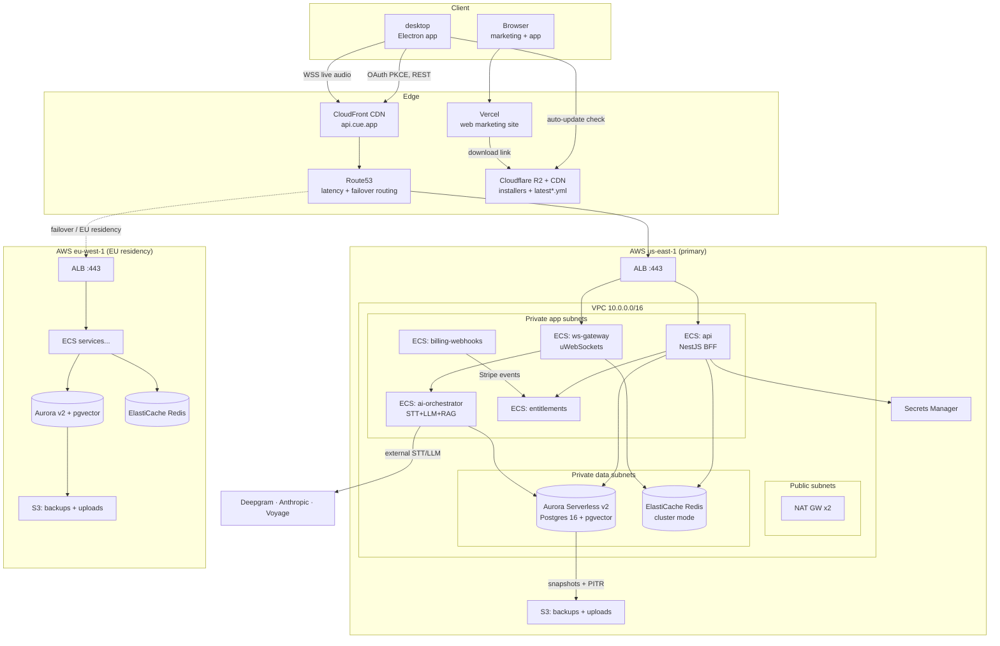
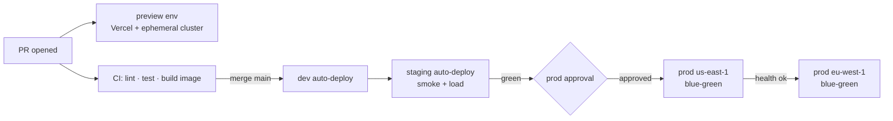
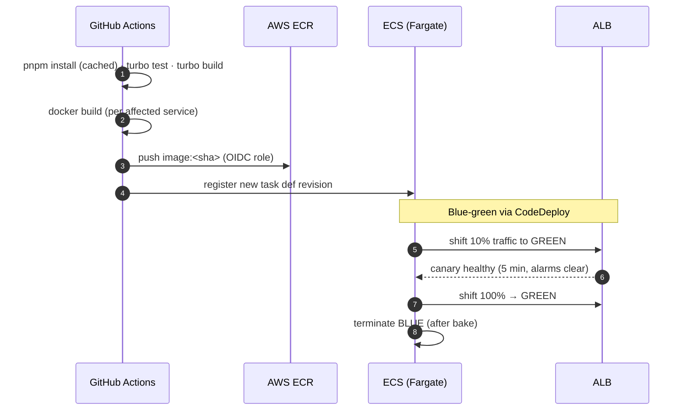
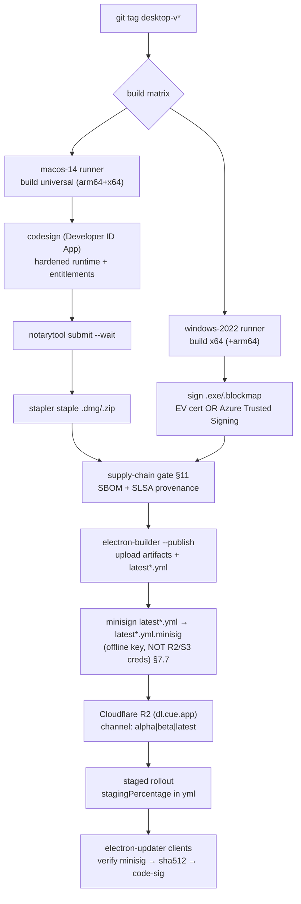

# DevOps & Infrastructure

> Status: Draft · Owner: Principal Architect (Infrastructure & Delivery) · Last updated: 2026-07-29 · Related: [System architecture](02-system-architecture.md) · [Backend services](20-backend-services.md) · [Data model](30-data-model.md) · [Web landing](11-web-landing.md) · [Desktop app](10-desktop-app.md) · [Observability](61-observability.md) · [Scalability](70-scalability.md) · [Unit economics](71-unit-economics.md)

This doc owns how **Cue** is hosted, provisioned, and delivered: the AWS topology, Terraform layout, environments and promotion, the three CI/CD pipelines (web, backend services, and the desktop release + code-signing pipeline), secrets, backups, and disaster recovery. It does not define scaling policy in depth ([Scalability](70-scalability.md)) or the metric/alert catalog ([Observability](61-observability.md)) — it links to them.

---

## 1. Principles

1. **Everything is Terraform.** No console clicks in staging or prod. The only manual bootstrap is the Terraform state backend itself (§4.1) and root-account break-glass.
2. **Two regions, one control plane.** `us-east-1` is primary; `eu-west-1` serves EU-resident data ([Data model §data-residency](30-data-model.md)). Regions are symmetric Terraform module instantiations, not bespoke stacks.
3. **Immutable artifacts, promoted not rebuilt.** A container image or a signed installer built once in CI is the exact bytes promoted dev → staging → prod. We promote a digest, never rebuild per environment.
4. **Least privilege by default.** Each ECS task has its own IAM task role scoped to the exact secrets/buckets/queues it needs. CI uses GitHub OIDC federation — no long-lived AWS keys in GitHub.
5. **The desktop release pipeline is a first-class product surface.** A mis-signed or un-notarized build is a P1 — it blocks every user's ability to install/update. It gets the same rigor as prod backend deploys.

---

## 2. AWS topology

Cue runs on AWS ECS Fargate behind an ALB in each region, with a serverless-leaning data tier. The web marketing site is on Vercel (not AWS) and is covered in §6.1; installers and the update feed live on Cloudflare R2 + CDN so downloads never touch AWS egress (a deliberate COGS choice — see [Unit economics](71-unit-economics.md)).



### 2.1 Network layout (per region)

| Layer | CIDR (us-east-1) | Contents | Egress |
|---|---|---|---|
| Public subnets (2 AZ) | 10.0.0.0/24, 10.0.1.0/24 | ALB, NAT gateways | Internet GW |
| Private app subnets (2 AZ) | 10.0.10.0/24, 10.0.11.0/24 | All ECS Fargate tasks | via NAT |
| Private data subnets (2 AZ) | 10.0.20.0/24, 10.0.21.0/24 | Aurora, ElastiCache | none (VPC endpoints only) |

- **Two AZs minimum** per region for the ALB, Fargate spread, Aurora, and Redis (multi-AZ). Three AZs in prod us-east-1.
- **VPC endpoints** (interface + gateway) for S3, Secrets Manager, ECR, CloudWatch Logs so data-subnet traffic to AWS services never traverses the NAT/Internet.
- **Security groups** are the primary firewall: ALB SG → app SG :3000-3002; app SG → data SG :5432/:6379 only. No SG allows 0.0.0.0/0 inbound except the ALB on :443.
- `eu-west-1` uses 10.1.0.0/16 with the identical subnet shape.

### 2.2 Compute — ECS Fargate services

Each [canonical service](02-system-architecture.md#canonical-service-names) is one ECS service. Fargate (not EC2) because we do not want to manage a node fleet and our load is bursty. `ai-orchestrator` and `ws-gateway` are the latency-critical, connection-heavy services and get the most headroom.

| Service | Port | Task size (prod baseline) | Min/Max tasks | Scale signal | Health check |
|---|---|---|---|---|---|
| `api` (NestJS BFF) | 3000 | 0.5 vCPU / 1 GB | 3 / 20 | ALB req count + CPU | `GET /healthz` |
| `ws-gateway` | 3001 | 1 vCPU / 2 GB | 3 / 40 | active WS connections (custom CW metric) | TCP + `GET /healthz` |
| `ai-orchestrator` | 3002 | 2 vCPU / 4 GB | 3 / 60 | in-flight streams + CPU | `GET /healthz` |
| `entitlements` | 3003 | 0.25 vCPU / 0.5 GB | 2 / 6 | CPU | `GET /healthz` |
| `billing-webhooks` | 3004 | 0.25 vCPU / 0.5 GB | 2 / 4 | SQS/ALB queue depth | `GET /healthz` |

Scaling policy detail (target-tracking values, connection draining, warm pools) lives in [Scalability §autoscaling](70-scalability.md). ECS deployment strategy is in §6.2.

### 2.3 Data tier

- **PostgreSQL 16 on Aurora Serverless v2** (primary choice for prod) with the `pgvector` extension for RAG embeddings. ACU range 0.5–16 in staging, 2–32 in prod. Rationale in ADR-INF-01. **Neon** is the accepted alternative for dev/preview branches — its instant branching is used for per-PR ephemeral databases; prod stays on Aurora for VPC isolation and predictable IOPS.
- **Redis via ElastiCache** (cluster mode enabled, multi-AZ, automatic failover) for cache, rate limiting, session store, and BullMQ job queues. **Upstash** is the alternative used only for Vercel-side/edge needs where a serverless HTTP Redis is convenient; the backend uses ElastiCache in-VPC.
- **Object storage:** installers + `latest*.yml` on **Cloudflare R2** (zero egress fees, fronted by Cloudflare CDN). User uploads (resume/JD/knowledge base) + DB backups on **S3** per region (in-VPC via gateway endpoint, SSE-KMS encrypted). See [Data model](30-data-model.md) for bucket key layout and lifecycle.
- **ClickHouse** (optional, Phase 2) for product-analytics events, fed from PostHog/warehouse — not on the request path.

---

## 3. ADRs

### ADR-INF-01 — Aurora Serverless v2 as primary Postgres
- **Decision:** Prod Postgres is Aurora Serverless v2 with pgvector; Neon is used for dev/preview branches only.
- **Context:** Bursty load (meetings cluster in business hours across timezones), need pgvector, need VPC isolation, need predictable PITR/DR, and want cheap ephemeral per-PR DBs.
- **Alternatives:** All-Neon (great DX + branching, but external to VPC, egress + data-residency friction, less control over IOPS); self-managed Postgres on RDS provisioned (no true scale-to-low, over-provisioned off-hours); RDS + separate vector DB (Pinecone) (extra system, extra cost, split consistency).
- **Trade-offs:** Aurora v2 has a non-zero floor cost (min ACU) and scales in ~15s steps, not instant; Neon branching DX is better. We accept the floor for VPC isolation, KMS, and DR maturity.
- **Consequence:** One Postgres engine, pgvector co-located with relational data (no cross-store joins for RAG), Neon reserved for dev velocity.

### ADR-INF-02 — Installers + update feed on Cloudflare R2, not S3/CloudFront
- **Decision:** Signed installers and `latest*.yml` are served from R2 behind Cloudflare CDN.
- **Context:** Installers are 90–180 MB; every install and every auto-update GETs them. Egress at scale is the single largest infra line item candidate.
- **Alternatives:** S3 + CloudFront (integrated with our AWS IaC, but per-GB egress is materially higher); GitHub Releases (rate-limited, no custom domain, weak for enterprise allowlisting).
- **Trade-offs:** R2 is a second cloud vendor in the stack (operational surface, separate IAM/Terraform provider). We accept it because zero-egress economics dominate at our download volume ([Unit economics](71-unit-economics.md)).
- **Consequence:** `electron-updater` points at `https://dl.cue.app` (R2 custom domain); the desktop release pipeline (§7) publishes there.

### ADR-INF-03 — GitHub OIDC federation, no static AWS keys in CI
- **Decision:** GitHub Actions assumes short-lived AWS roles via OIDC; no `AWS_ACCESS_KEY_ID` secrets stored in GitHub.
- **Context:** Long-lived keys in CI are the most common cloud-breach vector.
- **Alternatives:** Static IAM user keys (exfiltration risk, rotation toil); self-hosted runners with instance profiles (fleet to manage).
- **Trade-offs:** OIDC trust policy is slightly more setup and per-environment role scoping.
- **Consequence:** Each environment (`dev`/`staging`/`prod`) has a distinct deploy role with a trust condition on the repo + branch/environment; prod deploys additionally require a GitHub Environment approval.

---

## 4. Terraform layout

SQL-first, module-per-concern, one thin root stack per (environment × region) that instantiates shared modules. Remote state in S3 + DynamoDB lock, one state file per stack.

```text
infra/
  terraform/
    modules/                     # reusable, region-agnostic building blocks
      network/                   # VPC, subnets, NAT, route tables, endpoints, SGs
      ecs-cluster/               # cluster, capacity providers, exec logging
      ecs-service/               # generic Fargate service (task def, ALB TG, autoscale, SG)
      aurora/                    # Aurora Serverless v2 + pgvector param group + PITR
      elasticache/               # Redis cluster mode, multi-AZ, SGs
      alb/                       # ALB, listeners, ACM cert, WAF assoc
      s3-bucket/                 # encrypted bucket + lifecycle + policy
      cloudfront-api/            # CDN in front of api ALB (TLS, WAF, cache rules)
      secrets/                   # Secrets Manager entries + rotation lambdas
      observability/             # CW log groups, alarms, OTel collector task
      iam-github-oidc/           # OIDC provider + per-env deploy roles
    stacks/
      global/                    # Route53 zones, ACM (us-east-1 for CF), OIDC provider
      dev/us-east-1/             # single-region, small
      staging/us-east-1/
      prod/us-east-1/            # primary
      prod/eu-west-1/            # EU residency
    envs/
      dev.tfvars
      staging.tfvars
      prod.tfvars
```

### 4.1 State backend & workflow

```hcl
# stacks/prod/us-east-1/backend.tf
terraform {
  backend "s3" {
    bucket         = "cue-tfstate-prod"
    key            = "prod/us-east-1/terraform.tfstate"
    region         = "us-east-1"
    dynamodb_table = "cue-tflock"        # state locking
    encrypt        = true
    kms_key_id     = "alias/cue-tfstate"
  }
}
```

- **Plan on PR, apply on merge.** `terraform plan` runs in CI on every PR touching `infra/**` and posts the plan as a PR comment (via `tfcmt`). `apply` runs only after merge to `main`, gated by a GitHub Environment approval for `prod/*`.
- **`terraform fmt`, `validate`, `tflint`, and `checkov`** are required CI gates ([Engineering standards](13-engineering-standards.md)).
- Drift detection: a nightly `terraform plan` job alerts if live infra has drifted from state.

### 4.2 Example: a Fargate service module instantiation

```hcl
# stacks/prod/us-east-1/services.tf
module "ai_orchestrator" {
  source            = "../../../modules/ecs-service"
  name              = "ai-orchestrator"
  cluster_arn       = module.ecs.cluster_arn
  vpc_id            = module.network.vpc_id
  subnet_ids        = module.network.private_app_subnet_ids
  image             = "${var.ecr_repo}/ai-orchestrator@${var.ai_orchestrator_digest}"
  container_port    = 3002
  cpu               = 2048   # 2 vCPU
  memory            = 4096   # 4 GB
  desired_count     = 3
  min_count         = 3
  max_count         = 60
  health_check_path = "/healthz"
  autoscale = {
    target_cpu           = 60
    custom_metric        = "InFlightStreams"
    custom_metric_target = 40
  }
  secrets = [
    "ANTHROPIC_API_KEY", "DEEPGRAM_API_KEY", "VOYAGE_API_KEY", "DATABASE_URL",
  ]
  environment = { NODE_ENV = "production", OTEL_EXPORTER_OTLP_ENDPOINT = var.otel_endpoint }
}
```

---

## 5. Environments & promotion

| Env | Region(s) | Data | Purpose | Deploy trigger |
|---|---|---|---|---|
| **preview** | us-east-1 | Neon branch (ephemeral) | per-PR full-stack preview (web on Vercel Preview, services on a shared ephemeral cluster) | open PR |
| **dev** | us-east-1 | Aurora (small) | integration / manual QA | merge to `main` (auto) |
| **staging** | us-east-1 | Aurora (prod-shaped, synthetic data) | pre-prod smoke, load tests, release rehearsal | merge to `main` (auto) |
| **prod** | us-east-1 + eu-west-1 | Aurora multi-AZ | live | manual approval after staging green |

**Promotion is digest promotion.** CI builds one image per service, tags it with the git SHA, pushes to ECR. `dev` and `staging` deploy that digest automatically on merge. Prod deploys the *same digest* after a human approves the GitHub `production` Environment. Config differs only via `*.tfvars` and Secrets Manager — never a rebuild.



---

## 6. CI/CD — web & backend services

All pipelines are **GitHub Actions**, orchestrated with **Turborepo** remote caching so only affected packages build. Branching, required checks, and merge rules are owned by [Engineering standards](13-engineering-standards.md); this section covers deployment. Every pipeline below also runs the supply-chain gates (frozen lockfile, advisory + secret scans, SBOM, provenance, native-addon verification) defined in §11 — they are a precondition, not an afterthought, and gate whether the desktop app may auto-update.

### 6.1 Web (Next.js → Vercel)

The marketing/app site ([Web landing](11-web-landing.md)) deploys through Vercel's native Git integration, not through our ECS pipeline.

- **Preview deployments** on every PR (unique URL, wired to a Neon DB branch + staging API).
- **Production** deploy on merge to `main`, promoted from the exact preview build (Vercel's "promote" — no rebuild).
- The download API route reads the release manifest from R2 (`latest.yml`/`latest-mac.yml`) — see §7.5 and [Web landing §download-flow](11-web-landing.md).
- Turbo cache + Vercel skip-build for unaffected changes keep marketing-only edits from redeploying services.

### 6.2 Backend services (build → test → image → ECS)



- **Deploy strategy: blue-green via AWS CodeDeploy** for `api`, `entitlements`, `billing-webhooks` (clean cutover, instant rollback by traffic shift back to BLUE).
- **`ws-gateway` uses a canary/linear shift**, not hard blue-green, because it holds long-lived WebSocket connections: new tasks take new connections while old tasks drain existing streams up to a max lifetime (see [Scalability §connection-draining](70-scalability.md)). Deploys never kill a live meeting mid-stream.
- **`ai-orchestrator`** likewise drains in-flight streams before task termination (`stopTimeout` 120s, `SIGTERM` → finish current stream → exit).
- **Rollback:** CodeDeploy auto-rollback on a CloudWatch alarm breach (p99 latency, 5xx rate, health check failures) during the bake window. Manual rollback = redeploy previous digest (kept in ECR, immutable tags).
- **DB migrations (Drizzle Kit)** run as a one-off ECS task *before* the service deploy, gated to be backward-compatible (expand/contract pattern) so blue and green can run against the same schema. See [Data model §migrations](30-data-model.md).

---

## 7. Desktop release pipeline (electron-builder → signing → feed)

The desktop app ([Desktop app](10-desktop-app.md)) ships as signed, notarized installers with a self-hosted update feed consumed by `electron-updater`. This pipeline is triggered by a semver git tag (`desktop-v1.4.0`) and never by a normal merge.



> The `electron-builder --publish` step and the `latest*.yml` object are only trustworthy once the supply-chain program (§11) is live and the manifest is independently signed (§7.7). Until then, `autoUpdater.autoDownload` stays **off** ([Desktop app §auto-update](10-desktop-app.md)).

### 7.1 Build matrix

`electron-builder` runs on native runners per OS (cross-signing macOS from Linux is not viable).

| Runner | Target | Arch | Output |
|---|---|---|---|
| `macos-14` (Apple silicon) | `dmg`, `zip` | universal (arm64 + x64) | `Cue-1.4.0-universal.dmg`, `Cue-1.4.0-universal-mac.zip` |
| `windows-2022` | `nsis` | x64 (arm64 in Phase 2) | `Cue Setup 1.4.0.exe` + `.blockmap` |

The `.zip` on macOS is required by `electron-updater` for delta updates; the `.dmg` is the human download. The `.blockmap` on Windows enables differential (delta) downloads so an update transfers only changed blocks.

### 7.2 macOS: sign → notarize → staple

```yaml
# .github/workflows/desktop-release.yml (macos job, abridged)
- name: Import Developer ID cert
  env:
    APPLE_CERT_P12: ${{ secrets.APPLE_DEVELOPER_ID_P12 }}   # base64
    APPLE_CERT_PASSWORD: ${{ secrets.APPLE_CERT_PASSWORD }}
  run: ./scripts/import-macos-cert.sh   # creates a temp keychain, imports, unlocks

- name: Build · sign · notarize · staple · publish
  env:
    CSC_LINK: ${{ runner.temp }}/cert.p12
    CSC_KEY_PASSWORD: ${{ secrets.APPLE_CERT_PASSWORD }}
    APPLE_API_KEY: ${{ secrets.APPLE_API_KEY_P8 }}          # App Store Connect API key (.p8)
    APPLE_API_KEY_ID: ${{ secrets.APPLE_API_KEY_ID }}
    APPLE_API_ISSUER: ${{ secrets.APPLE_API_ISSUER }}
  run: pnpm --filter desktop build:mac --publish always
```

- **Hardened Runtime** enabled with entitlements the app genuinely needs: `com.apple.security.device.audio-input` (mic), and the ScreenCaptureKit/Core Audio tap capabilities for system-audio capture ([Desktop app §audio-capture](10-desktop-app.md)). No `disable-library-validation` unless a native module forces it (it should not).
- **Notarization** via `notarytool` using an App Store Connect API key (not app-specific passwords). electron-builder submits and polls; the job fails if notarization is rejected.
- **Stapling** the ticket onto the `.dmg`/`.zip` so Gatekeeper passes offline. A build that is signed but not stapled is treated as a pipeline failure.

### 7.3 Windows: signing

Two accepted paths (ADR-INF-04):

| Option | How | Pros | Cons |
|---|---|---|---|
| **Azure Trusted Signing** (preferred) | Cloud HSM-backed cert, `AzureSignTool` invoked by electron-builder `signtoolOptions` | No physical token, keys never on runner, cheap, immediate MS SmartScreen reputation with EV-class cert | Azure tenant + RBAC setup |
| **OV/EV cert on cloud HSM** | `.pfx`/HSM via `signtool` | Familiar | EV token/HSM logistics; OV builds SmartScreen reputation slowly |

Both sign the `.exe` **and** the `.blockmap`. We default to **Azure Trusted Signing** to avoid token custody and get EV-tier SmartScreen trust from day one.

### 7.4 ADR-INF-04 — Azure Trusted Signing for Windows
- **Decision:** Windows binaries are signed via Azure Trusted Signing.
- **Context:** Physical EV USB tokens can't be used on ephemeral GitHub-hosted runners; SmartScreen reputation matters for consumer download conversion.
- **Alternatives:** Self-hosted runner + physical EV token (fleet + custody); OV cert (slow SmartScreen warm-up scares users).
- **Trade-offs:** Ties Windows signing to an Azure account.
- **Consequence:** Signing keys stay in Azure's HSM; CI holds only a scoped service-principal credential.

### 7.5 Publishing & the update feed

- electron-builder `--publish` uploads installers + `latest.yml` (Win) and `latest-mac.yml` (macOS) to R2 under a channel prefix: `dl.cue.app/{alpha,beta,latest}/`.
- `electron-updater` is configured with `provider: generic, url: https://dl.cue.app/latest` (channel selectable in-app for beta opt-in). The manifest contract (`latest*.yml` shape: version, path, sha512, size, releaseDate, and optional `stagingPercentage`) is typed in `packages/types` ([Repo structure](03-repository-structure.md)) and consumed by the web download route ([Web landing](11-web-landing.md)).
- **Integrity (layered):** every published `latest*.yml` carries the artifact `sha512`, which `electron-updater` verifies alongside the OS code signature before applying. But `sha512` alone is **insufficient** — the manifest and the hash it contains share R2's origin, so an attacker who can write to the bucket (or its credentials) can rewrite both the installer *and* its recorded hash. The manifest is therefore **independently signed** with an offline key whose custody is separate from R2/S3 (§7.7), and the client verifies that signature *first*. Native addon and dependency integrity is enforced upstream by the supply-chain program (§11).

### 7.6 Staged rollout

We ship gradually to catch regressions before 100% of users update:

- `latest*.yml` includes `stagingPercentage` (e.g. 10 → 25 → 50 → 100). `electron-updater` deterministically hashes the machine GUID to decide inclusion, so a given machine's cohort is stable across checks.
- Progression is manual/observed: hold at 10% for ~24h, watch [Sentry crash-free sessions + update-failure metrics](61-observability.md), then bump. A regression = set `stagingPercentage` back / re-publish the previous version as `latest` (rollback is a manifest edit + prior artifacts already on R2).
- Channels: internal builds → `alpha`, opt-in testers → `beta`, GA → `latest`.

### 7.7 Independent update-manifest signing (ADR-INF-05)

The auto-update trust root cannot be R2 itself. After `--publish` uploads the artifacts and `latest*.yml`, a dedicated CI step signs each manifest with **minisign**, producing `latest*.yml.minisig` alongside it. The signing private key is held **outside** the R2/S3 credential boundary (see key custody below); a compromise of the R2 bucket or its write credentials therefore cannot forge a manifest the client will accept.

- **Signing:** `minisign -Sm latest.yml -s <key>` (and `latest-mac.yml`) runs on the release runner, key injected from GitHub Actions secrets scoped to the `desktop-release` environment only. The `.minisig` files are uploaded to the same channel prefix.
- **Client verification order** (enforced in the desktop client, [Desktop app §auto-update](10-desktop-app.md)): (1) verify `latest*.yml.minisig` against the **minisign public key pinned in the app binary**; reject if absent or invalid — *before* any hash or size is read from the manifest. (2) verify the artifact `sha512`/size from the now-trusted manifest. (3) verify the OS code signature (macOS notarization staple / Windows `publisherName` + `verifyUpdateCodeSignature`). Any failure aborts the update; there is no fallback path.
- **Why minisign over TUF for v1:** a single pinned Ed25519 public key + detached signature is the minimum viable independent root and ships today with zero server infrastructure. A TUF-style role-separated feed (root/targets/snapshot/timestamp with key rotation and revocation) is the Phase-2 upgrade tracked in Open questions — the manifest contract already leaves room for it.

**Key custody (distinct trust boundaries):**

| Key | Purpose | Custody | Never used for |
|---|---|---|---|
| minisign manifest key | signs `latest*.yml` | offline-generated; private half in `desktop-release` GH environment secret (or KMS-wrapped, sealed); public half pinned in app binary + committed to repo | R2/S3 writes, code signing |
| R2 write credentials | upload artifacts + manifest | `desktop-release` env, scoped to the `dl.cue.app` bucket | signing anything |
| Apple / Azure code-signing keys | OS code signature | Apple keychain / Azure HSM (§7.2–7.4) | manifest signing |

Because these three roots are independent, no single credential compromise yields an installable malicious update: forging the binary needs the OS signing key, forging the manifest needs the minisign key, and neither is the R2 credential.

Addresses audit **S-01** (and the desktop-side of **S-04**) via [remediation plan](05-remediation-plan.md); tamper-rejection CI tests for a bad `.minisig`, a swapped installer (bad sha512), and a mis-signed binary are a release blocker owned by [Desktop app §auto-update](10-desktop-app.md) and [Engineering standards §5.2](13-engineering-standards.md).

### 7.8 ADR-INF-05 — Independent minisign manifest signing, key custody split from R2

- **Decision:** `latest*.yml` is signed with minisign using a key custodially separate from R2/S3 and OS code-signing keys; the client verifies the manifest signature before trusting any hash inside it.
- **Context:** `electron-updater`'s default trust chain (sha512 in the manifest + code signature) collapses if the manifest and installer share one origin — whoever can write R2 can rewrite both. sha512 alone is not tamper-evidence when the hash lives next to the file it describes.
- **Alternatives:** sha512-only (default — rejected, single origin); full TUF feed now (correct end state but heavy for v1 — deferred); reuse the code-signing key to sign the manifest (rejected — collapses two trust roots into one).
- **Trade-offs:** one more key to custody and rotate; a lost minisign key forces a client update to re-pin. Accepted for a genuinely independent update root.
- **Consequence:** `autoDownload` remains gated on §11 + this signature being live; the pinned public key is a release-blocking dependency; rotation requires shipping a new binary with the new key (documented runbook).

---

## 8. Secrets management

| Where | Contents | Rotation |
|---|---|---|
| **AWS Secrets Manager** (per region) | `DATABASE_URL`, `REDIS_URL`, `ANTHROPIC_API_KEY`, `DEEPGRAM_API_KEY`, `ASSEMBLYAI_API_KEY`, `VOYAGE_API_KEY`, `STRIPE_SECRET_KEY`, `STRIPE_WEBHOOK_SECRET`, JWT signing keys, Clerk/WorkOS secrets | automatic rotation (Lambda) for DB creds; provider keys rotated quarterly via runbook |
| **GitHub Actions secrets / OIDC** | signing certs (`APPLE_DEVELOPER_ID_P12`, `APPLE_API_KEY_P8`, Azure signing SP), `MINISIGN_SECRET_KEY` + passphrase (manifest signing, `desktop-release` env only — §7.7), R2 write credentials (separate scope), Vercel token, Turbo cache token. **No AWS static keys** (OIDC). | on personnel change + annually; minisign key rotation ships a new pinned public key |
| **Vercel env** | web-side public + a few server-only (Stripe publishable, API base URL) | with GitHub |
| **Desktop client** | *no shared secrets*. Uses OAuth PKCE (public client); user tokens live in the OS keychain (Electron `safeStorage`/keytar) — never in the bundle. See [Auth](40-authentication.md). |

- ECS tasks receive secrets via the task definition `secrets` block (Secrets Manager ARN → env var), decrypted at container start with the task role's `kms:Decrypt` — secrets never sit in Terraform state as plaintext (only ARNs) and never in the image.
- KMS CMKs per environment; separate key for tfstate, backups, and app secrets.

---

## 9. Backups & disaster recovery

### 9.1 Backup matrix

| Asset | Mechanism | Frequency | Retention |
|---|---|---|---|
| Aurora Postgres | Automated snapshots + **PITR (continuous)** | continuous WAL, snapshot daily | 35 days PITR; monthly snapshot copied cross-region 1yr |
| Aurora (logical) | `pg_dump` to S3 (schema + critical tables) | nightly | 30 days |
| User uploads (S3) | Versioning + cross-region replication (CRR) us↔eu | continuous | versioned 90 days |
| Installers + feed (R2) | Immutable per-version objects; never overwritten | per release | indefinite (small) |
| Redis | Not authoritative — rebuildable. Daily snapshot for sessions/queues convenience only | daily | 3 days |
| Secrets | Secrets Manager built-in versioning + IaC | on change | 10 versions |
| Terraform state | S3 versioning + KMS | on apply | indefinite |

Redis is explicitly **not** a source of truth; entitlement/session state can be rehydrated from Postgres + Stripe ([Entitlements](50-subscriptions-entitlements.md)), so a Redis loss is a cache-warm event, not data loss.

### 9.2 DR targets & strategy

| Scenario | Strategy | RPO | RTO |
|---|---|---|---|
| Single AZ failure | Multi-AZ Aurora + Fargate spread auto-recover | ~0 | < 5 min (automatic) |
| Full region loss (us-east-1) | Promote eu-west-1 / restore from cross-region snapshot; Route53 failover | ≤ 5 min (cross-region snapshot lag) | ≤ 60 min (prod SLA) |
| Accidental data deletion | Aurora PITR to timestamp | ≤ 5 min | < 30 min |
| Bad deploy | Blue-green rollback / redeploy prior digest | 0 | < 10 min |
| Bad desktop release | Revert `stagingPercentage` / re-publish prior version | 0 | < 15 min |

- **us-east-1 is active; eu-west-1 serves EU-resident traffic and doubles as the primary DR target.** For non-EU data we run a warm-standby posture in eu-west-1: infra is Terraform-defined and can be stood up / scaled from baseline, Aurora restored from the latest cross-region snapshot. This is warm standby (RTO ≤ 60 min), not active-active — active-active is a Phase 3 decision tracked in [Scalability §multi-region](70-scalability.md).
- Route53 health checks + failover routing flip the `api.cue.app` record to the surviving region.
- **DR is rehearsed quarterly** (game day): restore Aurora into an isolated stack, point a staging clone at it, validate. An untested backup is not a backup.
- **The 99.9% uptime NFR** ([targets](02-system-architecture.md)) drives the ≤ 60 min prod RTO — that budget is tracked as an error budget in [Observability §slos](61-observability.md).

---

## 10. Cost & FinOps hooks

- **Tagging standard** enforced by Terraform: every resource carries `Environment`, `Service`, `CostCenter`, `Region`. AWS Cost Explorer + budgets alert per service.
- The largest controllable lines are **LLM/STT vendor spend** (not AWS — owned by [AI pipeline §cost-controls](21-ai-pipeline.md) and [Unit economics](71-unit-economics.md)) and **Fargate for `ai-orchestrator`**. Aurora v2 min-ACU and NAT egress are watched; R2 keeps installer egress at ~$0.
- Fargate Spot for `dev`/`staging` non-critical tasks; on-demand for prod latency-critical services.

---

## 11. Software supply-chain program

Everything Cue ships — backend images and, especially, the auto-updating desktop binary — is only as trustworthy as the pipeline that builds it. Because `electron-updater` can silently push a new binary to every user, an attacker who slips a malicious dependency, a leaked credential, or a tampered artifact into the build inherits our install base. This section defines the program that must be **live before `autoUpdater.autoDownload` is enabled** ([Desktop app §auto-update](10-desktop-app.md)); until then the desktop app checks for updates but requires an explicit user click, and the trust root (§7.7) is not yet complete.

> **ADR-INF-06 — Supply-chain program gates `autoDownload`.**
> - **Decision:** `autoDownload = false` until the six gates below plus independent manifest signing (§7.7) are enforced in CI and the desktop release pipeline. Enabling silent auto-update is a one-way trust decision and is treated as such.
> - **Context:** silent auto-update turns any build-time compromise into a fleet-wide compromise. The existing pipeline signs and notarizes the binary but does nothing to attest *what went into it* or *that the manifest is authentic*.
> - **Alternatives:** enable `autoDownload` now and add hardening later (rejected — the window between shipping auto-update and hardening it is exactly the exploitable gap); rely on OS code signing alone (rejected — code signing proves *who* built it, not that the inputs were clean or the manifest untampered).
> - **Trade-offs:** slower path to hands-off updates; some gates add CI minutes.
> - **Consequence:** the gates are hard merge/release blockers, not advisory; the desktop app defaults to click-to-update until sign-off.
>
> Addresses audit **S-01** via [remediation plan](05-remediation-plan.md); canonical transport/service decisions unchanged ([decision record](04-decision-record.md)).

### 11.1 The gates, and where they slot into the pipeline

| # | Gate | Tool | Enforced at | Fail action |
|---|---|---|---|---|
| 1 | **Frozen lockfile** | `pnpm install --frozen-lockfile` | every CI install (web §6.1, backend §6.2, desktop §7) | build fails if `pnpm-lock.yaml` would change |
| 2 | **Dependency-advisory scan** | `pnpm audit` + `osv-scanner` (or GHSA/Dependabot) | PR merge gate | **fail on high/critical**; documented, expiring waiver for accepted risk |
| 3 | **Secret scan** | `gitleaks` + `trufflehog` (verified-secrets mode) | PR merge gate + full-history scan nightly | fail on any detected live secret |
| 4 | **CycloneDX SBOM** | `@cyclonedx/cyclonedx-npm` (JS) + Syft (container/binary) | release build (backend image tag, desktop tag §7) | release fails if SBOM cannot be generated; SBOM published as a release asset |
| 5 | **SLSA-style build provenance** | GitHub OIDC attestations (`actions/attest-build-provenance`) | release build | release fails if attestation not produced; provenance binds artifact digest → commit → builder identity |
| 6 | **Hash-pinned / verified native addons** | lockfile `integrity` (sha512) enforced; prebuilt native binaries verified against a checked-in allowlist of expected hashes | install + desktop build | fail if a native addon's fetched binary hash is not on the allowlist |

Gates 1–3 are **PR merge blockers** (they run on every PR and protect `main`); gates 4–6 are **release blockers** (they run when a backend image is tagged or a `desktop-v*` tag triggers §7). The desktop pipeline additionally runs the tamper-rejection suite and the independent manifest-signing step (§7.7). These are the provisioning/keys half of the program; the merge-gate half (the exact CI job list and blocking semantics) is owned by [Engineering standards §5.2](13-engineering-standards.md) and cross-linked here — the two must stay reconciled.

```mermaid
flowchart LR
  subgraph "PR merge gates (every PR)"
    G1["pnpm --frozen-lockfile"]
    G2["advisory scan<br/>fail high/critical"]
    G3["gitleaks + trufflehog"]
  end
  subgraph "Release gates (tag / image build)"
    G4["CycloneDX SBOM"]
    G5["SLSA provenance attest"]
    G6["native-addon hash verify"]
  end
  subgraph "Desktop release only (§7)"
    T["tamper-rejection suite"]
    M["minisign manifest §7.7"]
  end
  G1 --> G2 --> G3 --> MERGE(("merge to main"))
  MERGE --> G4 --> G5 --> G6 --> ART(("signed artifact"))
  ART --> T --> M --> GATE{"program live?"}
  GATE -->|"yes"| AD["autoDownload allowed"]
  GATE -->|"no"| CU["click-to-update only"]
```



### 11.2 Native addon integrity

The desktop app links native modules (audio capture, `keytar`/`safeStorage`, content-protection shims — [Desktop app](10-desktop-app.md)). These fetch prebuilt binaries at install time, which is a classic supply-chain blind spot: the JS lockfile pins the package but not always the downloaded `.node`.

- Prefer `node-gyp` **source builds** in CI where feasible, so the binary is produced from pinned source under provenance (gate 5) rather than downloaded.
- Where a prebuilt binary is unavoidable, its sha512 is recorded in `desktop/native-addons.lock.json` (checked into the repo); the build fails if a fetched binary does not match. Updating an addon is a reviewed PR that changes the recorded hash.
- `pnpm` `integrity` hashes are enforced (gate 1/6); `pnpm` config disallows lifecycle scripts for dependencies outside an explicit allowlist to blunt install-time script attacks.

### 11.3 SBOM & provenance handling

- One **CycloneDX** SBOM per release artifact (backend image and each desktop installer), attached as a release asset and retained with the artifact. Enables fast blast-radius answers when a new advisory lands ("are we shipping the vulnerable version, and in which release?").
- **Provenance** is a signed in-toto/SLSA attestation generated by the trusted GitHub-hosted builder via OIDC, binding the artifact digest to the source commit and the workflow that built it. It is verifiable offline and is the machine-checkable answer to "did *our* pipeline build this exact byte sequence?".
- SBOM + provenance travel with the artifact into R2 (desktop) / ECR (backend) so an auditor or an incident responder can reconstruct the chain from a deployed digest back to source. This complements, and does not replace, the independent manifest signature (§7.7).

---

## Open questions & risks

1. **Active-active vs warm-standby for non-EU DR.** Warm standby meets 60 min RTO but a stricter enterprise SLA (or a big region outage during peak) may force active-active — that roughly doubles data-tier cost and adds cross-region write-conflict complexity. Decision deferred to [Scalability](70-scalability.md); revisit at first enterprise SLA commitment.
2. **Aurora v2 cold-start / min-ACU floor.** At low traffic the min ACU is a fixed cost; at spike, 15s scaling steps may lag a sudden meeting surge. Need load-test evidence (staging) that pre-warm/min-ACU is tuned so DB scaling never becomes the latency bottleneck.
3. **macOS entitlements & notarization fragility.** ScreenCaptureKit/Core Audio-tap entitlements plus content-protection APIs are exactly the surface Apple scrutinizes; a notarization policy change could block a release. Mitigation: keep entitlements minimal and documented, and monitor Apple developer release notes; a rejected notarization is a release-blocking P1.
4. **Two clouds (AWS + Cloudflare R2) + Vercel + Azure signing.** Four control planes to secure and IaC. Justified by economics/DX, but raises the audit and secret-sprawl surface — consolidate into Terraform providers and document in the SOC 2 scope.
5. **Windows arm64.** Deferred to Phase 2; verify WASAPI loopback + `SetWindowDisplayAffinity` parity on arm64 before committing a matrix target.
6. **DB migration safety under blue-green.** Expand/contract discipline is a human process; a non-backward-compatible migration slipping through would break the BLUE fleet mid-deploy. Enforce with a CI migration-linter check ([Engineering standards](13-engineering-standards.md)).
7. **minisign → TUF upgrade path (§7.7).** A single pinned minisign key has no in-band rotation or revocation: a compromised or lost signing key forces every client to update to re-pin a new key, and there is no timestamp/freshness role to defeat rollback/freeze attacks. Acceptable for v1; a TUF-style role-separated feed is the Phase-2 target — schedule it before the install base is large enough that a forced re-pin is operationally painful.
8. **Supply-chain gate ownership split.** §11 owns provisioning + keys; [Engineering standards §5.2](13-engineering-standards.md) owns the CI job definitions and blocking semantics. These must not drift — a gate marked blocking in one doc but advisory in the other silently defeats the program. Reconcile on every change to either.
