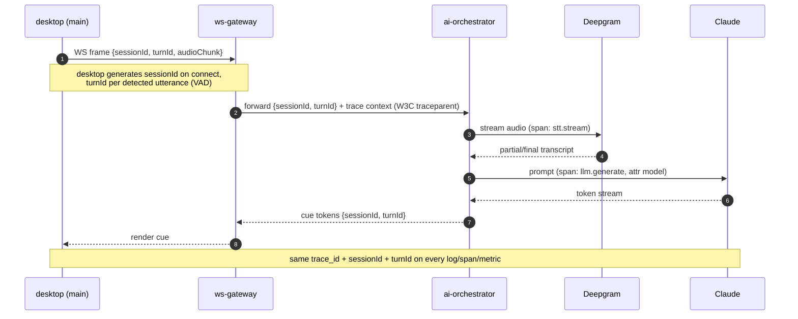
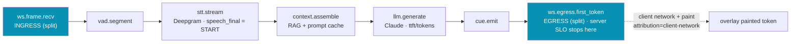

# Observability & Operations

> Status: Draft · Owner: Principal Architect (Reliability & Operations) · Last updated: 2026-07-29 · Related: [System architecture](02-system-architecture.md) · [DevOps & infrastructure](60-devops-infrastructure.md) · [Backend services](20-backend-services.md) · [AI pipeline](21-ai-pipeline.md) · [Desktop app](10-desktop-app.md) · [Scalability](70-scalability.md) · [Data model](30-data-model.md)

This doc owns how we know **AssistMe** is healthy: the three pillars (logs, metrics, traces), product analytics + feature flags, crash reporting, the SLO/SLI/error-budget catalog tied to the [non-functional targets](02-system-architecture.md), alerting + on-call + runbooks, and the hard rule that telemetry never carries transcript content or PII. Infra provisioning of these tools lives in [DevOps](60-devops-infrastructure.md); this doc defines *what* we measure and *how we respond*.

---

## 1. Principles

1. **Latency is the SLO — and it is two budgets, not one.** The product's reason to exist is a cue in the overlay fast. We refuse to publish a single summed e2e p95 (summing per-stage p95s overstates the achievable objective). Instead we error-budget the **server-controllable** slice — `cue_server_latency_ms` p95 < **900 ms**, measured from end-of-utterance endpointing to first cue token leaving `ws-gateway` egress — and *report only* the **full user-perceived** slice — `cue_latency_ms` p95 < **1200 ms**, which adds client uplink/downlink + overlay paint. Everything we instrument first answers "where did the budget go, and was it ours or the client network's?" (§6 latency decomposition, §9 SLO catalog).
2. **One correlation ID from tap to overlay.** A single `sessionId` + per-utterance `turnId` threads desktop → `ws-gateway` → `ai-orchestrator` → STT/LLM and back. You can reconstruct any single cue's full journey.
3. **Never log the content.** Transcripts, cue text, resume/JD/knowledge-base contents, audio, and PII are *never* in logs, metrics labels, traces, or analytics events. We log *shapes and durations*, not *substance* (§8).
4. **Signals drive budgets, budgets drive priority.** SLIs feed error budgets; a burned budget changes what the team is allowed to ship ([DevOps §environments](60-devops-infrastructure.md)).
5. **Every alert links a runbook.** An alert with no runbook is a bug. Pages are actionable; everything else is a ticket.

---

## 2. Stack at a glance

| Concern | Tool | Scope |
|---|---|---|
| Structured logging | **pino** → CloudWatch Logs (+ Loki for query) | all services + desktop main-process (redacted) |
| Metrics | **Prometheus** (scrape) + **Grafana** (dashboards) | services, infra, business metrics |
| Tracing | **OpenTelemetry** SDK → OTel Collector → Grafana Tempo | all services + the LLM/STT spans |
| Error tracking | **Sentry** | desktop (renderer + main), web, backend |
| Product analytics + flags | **PostHog** | web + desktop (consented, PII-safe) |
| Infra metrics | CloudWatch → Prometheus (via exporter) + Grafana | ECS/ALB/Aurora/Redis |
| Uptime / synthetics | Grafana Synthetic Monitoring + Route53 health checks | public endpoints |
| Alerting | **Grafana Alerting** + **PagerDuty** | routes by severity |

OpenTelemetry is the backbone: pino logs, Prometheus metrics (via the OTel metrics SDK / prom exporter), and Tempo traces all share the same `trace_id`/`sessionId`/`turnId` resource attributes, so a Grafana panel jumps log ↔ metric ↔ trace on one identifier.

---

## 3. Logging

### 3.1 Structured pino, one schema

Every service uses `pino` with a shared serializer from `packages/core` so log shape is identical across `api`, `ws-gateway`, `ai-orchestrator`, `entitlements`, `billing-webhooks`.

```jsonc
// canonical log line (info) — note: NO transcript/PII fields exist in the schema
{
  "level": 30,
  "time": 1753800000000,
  "service": "ai-orchestrator",
  "env": "prod",
  "region": "us-east-1",
  "trace_id": "4bf92f3577b34da6a3ce929d0e0e4736",   // OTel trace id
  "sessionId": "sess_01H...",                          // meeting session
  "turnId": "turn_00042",                              // one utterance→cue cycle
  "userIdHash": "sha256:9f2c...",                      // salted hash, never raw id/email
  "event": "llm.stream.first_token",
  "model": "claude-haiku-4-5",
  "durationMs": 380,
  "tokensIn": 1240,        // counts only — never the tokens themselves
  "tokensOut": 0
}
```

### 3.2 Correlation across the realtime path



- Desktop main-process injects `sessionId`; `ws-gateway` accepts it and mints/propagates the W3C `traceparent`. `turnId` is created at VAD utterance boundaries ([AI pipeline](21-ai-pipeline.md)).
- Renderer logs go to Sentry (breadcrumbs) + a rate-limited, redacted local ring buffer the user can attach to a support bundle — they do **not** stream raw to the backend.

### 3.3 Transport & retention

- Services log to stdout → CloudWatch Logs (via the Fargate awslogs driver) → shipped to **Loki** for fast label-based query in Grafana.
- Retention: `prod` 30 days hot in Loki, 90 days in CloudWatch (S3 archive after). `dev`/`staging` 7 days.
- Log levels: `info` default; `debug` behind a PostHog flag, time-boxed, never left on in prod.

---

## 4. Metrics

### 4.1 RED + USE

- **RED** (per service, request-oriented): **R**ate, **E**rrors, **D**uration — for `api`, `ws-gateway`, `ai-orchestrator`, `entitlements`, `billing-webhooks`.
- **USE** (per resource): **U**tilization, **S**aturation, **E**rrors — for CPU/mem (Fargate), Aurora ACU/connections, Redis memory/evictions, ALB queue depth.

### 4.2 Key metrics catalog

The starred rows are the ones on the top-line "is the product working" dashboard.

| Metric | Type | Labels | Target | Why |
|---|---|---|---|---|
| ⭐ `cue_server_latency_ms` (endpointing→ws-gateway egress) | histogram | region, model, tier | **p95 < 900** — the error-budgeted SLO | server-controllable slice; the only latency the SLO governs |
| ⭐ `cue_latency_ms` (endpointing→painted overlay token) | histogram | region, model, tier | p50 < 600 · **p95 < 1200 · reported-only** | full user-perceived slice; client-network tail attributed, not error-budgeted |
| ⭐ `stt_partial_lag_ms` | histogram | provider (deepgram/assembly) | p95 < 300 | STT partials feed responsiveness |
| ⭐ `llm_ttft_ms` (time-to-first-token) | histogram | model | p95 < 500 | dominant contributor to cue latency |
| `llm_tokens_per_sec` | gauge | model | > 40 | streaming smoothness |
| ⭐ `ws_active_connections` | gauge | region, service | capacity signal | scaling + saturation |
| `ws_connection_duration_s` | histogram | — | — | drain/deploy behavior |
| ⭐ `api_request_duration_ms` | histogram | route, method, status | **p99 < 200** (excl. LLM) | backend NFR |
| `api_5xx_rate` | counter→ratio | route | < 0.1% | error SLO |
| ⭐ `minutes_consumed` | counter | userIdHash, tier | billing truth | metering + [entitlements](50-subscriptions-entitlements.md) |
| `stt_stream_errors` | counter | provider | — | triggers STT failover |
| `llm_stream_errors` | counter | model | — | model routing/fallback |
| `llm_cost_usd` (derived) | counter | model | budget | [unit economics](71-unit-economics.md) |
| `update_apply_success_ratio` | gauge | version, channel | > 99% | staged-rollout gate ([DevOps §7.6](60-devops-infrastructure.md)) |
| `crash_free_sessions` | gauge | os, version | > 99.5% | desktop release health |
| `entitlement_check_ms` | histogram | — | p99 < 20 | must not add latency to gating |
| `aurora_acu` / `redis_mem_pct` | gauge | region | headroom | USE saturation |

- `minutes_consumed` and `llm_cost_usd` are **business** metrics but live here because reliability and cost are inseparable on the AI path; they reconcile against Stripe metering ([Payments](51-payments-stripe.md)) and the [cost model](71-unit-economics.md).
- **Cardinality guard:** `userIdHash` is used only on counters aggregated server-side, never as a Prometheus label on high-frequency histograms (it would explode cardinality). Per-user rollups come from the events warehouse, not Prometheus.
- **Both latency metrics share one start point:** end-of-utterance **endpointing** (Deepgram `speech_final`), timestamped at `ai-orchestrator` and stamped onto the `turnId`. `cue_server_latency_ms` stops at `ws-gateway` **egress** (first cue token leaves the socket); `cue_latency_ms` continues to the client's *painted-overlay-token* timestamp echoed back on the next frame. The difference between the two histograms **is** the client-network + paint tail (§6, §9). **Cold-cache (cache-miss) cues are folded into both reported p95s** — we never exclude the slow first cue of a session.

> **ADR-61.1 — Two latency budgets, one error budget.** We error-budget `cue_server_latency_ms` (< 900 ms p95, endpointing→egress) because it is the only slice we control; we publish `cue_latency_ms` (< 1200 ms p95) for product truth but exclude it from the error budget so an SLO can never be burned by a user's home Wi-Fi. Aligns with [decision record](04-decision-record.md) latency budgets. *Addresses audit SR-03, SR-11, SR-14, A07 via [05-remediation-plan.md](05-remediation-plan.md).*

### 4.3 Dashboards (Grafana)

1. **Product health (NOC):** the ⭐ rows — cue latency percentiles, STT lag, LLM TTFT, active WS, api p99, error budget burn.
2. **Per-service RED** (one row per service).
3. **AI cost & usage:** tokens, cost by model, minutes consumed, cache-hit ratio ([AI pipeline](21-ai-pipeline.md)).
4. **Infra USE:** Fargate, Aurora, Redis, ALB.
5. **Release health:** crash-free sessions, update apply ratio by version/channel.

---

## 5. Tracing

- **OpenTelemetry** SDK in every Node service (auto-instrumentation for HTTP, Postgres/Drizzle, Redis, ws) plus **manual spans** on the AI path.
- Spans on the critical path: `ws.frame.recv` → `vad.segment` → `stt.stream` (emits the `stt.speech_final` event = the **endpointing start point** for both latency metrics) → `context.assemble` (RAG retrieval + prompt build) → `llm.generate` (attrs: `model`, `tokens_in`, `tokens_out`, `cache_hit`, `ttft_ms`) → `cue.emit` → `ws.egress.first_token`. The **LLM and STT calls are explicit child spans** so a trace shows exactly how the budget was spent.
- **Client vs server attribution — the trace split.** Two span boundaries carry `attribution` resource attributes: `ws.frame.recv` (**ingress**) and `ws.egress.first_token` (**egress**). Everything *between* ingress-of-the-endpointed-turn and egress is `attribution=server` and rolls up to `cue_server_latency_ms`; the uplink before ingress and the downlink+paint after egress (reconstructed from the client's echoed paint timestamp) are `attribution=client-network` and appear only in `cue_latency_ms`. On-call reads the two tags to answer "was this our 900 ms or their network?" without guessing.
- Exporter → **OTel Collector** (sidecar/daemon per cluster) → **Tempo**. Trace ↔ log ↔ metric correlation via shared `trace_id`.
- **Sampling:** tail-based — keep 100% of traces where `cue_latency_ms > 1200` or any error, plus a 5% baseline of healthy traces. This keeps slow/broken cues fully observable without paying to store every healthy one.



`cue_server_latency_ms` = START (`speech_final`) → EGRESS. `cue_latency_ms` = START → overlay painted token (adds the dashed client leg).

---

## 6. Latency decomposition (the money view)

The single most important operational artifact: the cue-latency budget, broken into spans so a p95 regression points at the offending stage. Aligns with [AI pipeline §latency-budget](21-ai-pipeline.md) and the two-budget model of §1 / ADR-61.1.

**We do not sum per-stage p95s into an e2e p95** — that overstates the achievable objective (independent tails do not co-occur). The table below is a *diagnostic* decomposition (where did a given trace's time go), grouped by attribution. The **objective** is the measured end-to-end histogram of each budget, not the column sum.

**Group A — client-network + paint (attribution=client-network, EXCLUDED from the SLO, present in `cue_latency_ms`):**

| Stage | Indicative p95 | Span | Position |
|---|---|---|---|
| Desktop capture + encode + WS uplink | 120 ms | `ws.frame.recv` | before ingress |
| VAD segmentation (client) | 40 ms | `vad.segment` | before START |
| Downlink + overlay paint | 200 ms | client paint echo | after egress |

**Group B — server-controllable (attribution=server, endpointing→egress, the `cue_server_latency_ms` SLO, p95 < 900 ms):**

| Stage | Budget (p95) | Span | Alert if p95 > |
|---|---|---|---|
| Endpointing → context assembly (RAG + prompt build, cached *and* cold) | 150 ms | `context.assemble` | 250 ms |
| LLM time-to-first-token | 450 ms | `llm.generate` (ttft) | 600 ms |
| Cue emit + serialize + `ws-gateway` egress | 100 ms | `cue.emit` → `ws.egress.first_token` | 200 ms |
| **Server-controllable e2e (SLO)** | **< 900 ms** | START→EGRESS (measured, not summed) | **900 ms** |
| **Full user-perceived (reported)** | **< 1200 ms** | START→painted token (measured) | reported-only |

The START point is `stt.speech_final` (end-of-utterance endpointing); the two split points are `ws.frame.recv` (ingress) and `ws.egress.first_token` (egress). **Cold-cache (cache-miss) cues are folded into both measured p95s** — the prompt-cache-miss first cue is counted, not excluded. A `cue_server_latency_ms` p95 breach auto-links the Grafana panel to the slowest Group-B stage histogram so on-call sees *which* span blew the 900 ms within seconds; a `cue_latency_ms`-only breach (server green, full red) points on-call straight at the client-network leg.

*Addresses audit SR-03, SR-11, SR-14, A07 via [05-remediation-plan.md](05-remediation-plan.md).*

---

## 7. Product analytics, feature flags, crash reporting

### 7.1 PostHog (consented, PII-safe)

- Autocapture **off**. We emit an explicit, typed event allowlist from `packages/core` (e.g. `session_started`, `cue_shown`, `cue_dismissed`, `upload_added`, `trial_started`, `plan_upgraded`). Properties are enums/counts/durations — **never** cue text, transcript, or file contents.
- User identity in PostHog is the salted `userIdHash`, not email; EU users' analytics are region-pinned. Analytics respect the user's consent + [acceptable-use/consent model](01-product-vision.md#responsible-use) — a user in "no-telemetry" mode emits nothing beyond crash counts.
- **Feature flags** drive gradual rollout of features and the debug-log toggle; flags are read server-side in services and client-side in web/desktop with the same PostHog project.

### 7.2 Sentry (crash + error)

- **Desktop:** both processes. Renderer errors + main-process crashes (native crash reporter → Sentry). Source maps + symbol upload in the release pipeline ([DevOps §7](60-devops-infrastructure.md)) so stacks are symbolicated; release = the desktop semver tag, so `crash_free_sessions` is tracked per version and gates staged rollout.
- **Web + backend:** unhandled exceptions with `trace_id` linked so a Sentry issue jumps to the Tempo trace.
- **Scrubbing:** Sentry `beforeSend` strips request bodies, headers with tokens, and any field on the PII denylist (§8). Breadcrumbs are event-name only.

---

## 8. Privacy in telemetry (hard rules)

This is a privacy product; the observability stack is a top exfiltration risk if sloppy. Owned jointly with [security/compliance](01-product-vision.md#responsible-use) and [Data model §data-lifecycle](30-data-model.md).

- **Never captured, anywhere (logs/metrics/traces/analytics/Sentry):** audio bytes, transcript text (partial or final), cue/answer text, uploaded document contents, prompt or completion token *content*, raw email, raw user id, IP beyond coarse geo, payment data.
- **Allowed:** durations, counts, token *counts*, model names, status codes, salted `userIdHash`, `sessionId`/`turnId` (opaque), coarse region.
- **Enforcement is code, not policy:** a shared pino redaction config + a Sentry `beforeSend` scrubber + an OTel span processor that drops any attribute not on the allowlist, all in `packages/core`. A CI lint rule (custom ESLint) fails the build if a log/span/analytics call references a denylisted field name. Redaction is applied at the *source* SDK, before anything leaves the process.
- **Right to be forgotten:** telemetry keyed by `userIdHash` is purgeable; a deletion request ([Data model](30-data-model.md)) fans out to PostHog + Sentry + log stores.

---

## 9. SLOs, SLIs & error budgets

Tied directly to the [NFR targets](02-system-architecture.md). Windows are rolling 28-day.

| SLO | SLI (measurement) | Objective | Error budget (28d) |
|---|---|---|---|
| **Cue server latency** *(error-budgeted)* | % of cues with `cue_server_latency_ms` < 900 — measured `stt.speech_final` → `ws.egress.first_token` (attribution=server), cold-cache cues included | 95% | 5% of cues |
| **Cue full latency** *(reported-only, NOT error-budgeted)* | % of cues with `cue_latency_ms` < 1200 — START → painted overlay token; the client-network tail is attributed via the ingress/egress split, so this row informs but never burns budget | 95% (target) | n/a — reported, not gated |
| **Cue availability** | % of started sessions that stream ≥1 cue without server error | 99.9% | ~40 min |
| **API availability** | % `api` requests non-5xx | 99.9% | ~40 min |
| **API latency** | % `api` requests < 200 ms p99 (excl. LLM) | 99% | 1% |
| **STT freshness** | % turns with `stt_partial_lag_ms` < 300 | 95% | 5% |
| **Uptime (edge)** | synthetic + Route53 health check success | 99.9% | ~40 min |
| **Desktop stability** | `crash_free_sessions` | 99.5% | 0.5% of sessions |

**Error-budget policy:** when a rolling budget is >50% consumed, non-critical feature deploys pause and reliability work is prioritized; when exhausted, only fixes + rollbacks ship until the budget recovers. Budget burn is a first-class panel on the NOC dashboard and reviewed weekly. This links the reliability posture to the release gates in [DevOps §environments](60-devops-infrastructure.md).

---

## 10. Alerting, on-call & runbooks

### 10.1 Severity → routing

| Sev | Definition | Route | Ack SLA |
|---|---|---|---|
| **P1** | User-facing outage: cue availability < SLO, region down, auth broken, payment webhooks failing, desktop release un-installable | PagerDuty page (24/7) | 5 min |
| **P2** | Degradation: latency SLO burning fast, STT failover active, elevated 5xx, budget >50% | PagerDuty (business hours) + Slack | 30 min |
| **P3** | Warnings: saturation nearing threshold, single-AZ blip, slow budget burn | Slack ticket | next day |

- **Multi-window burn-rate alerts** (fast 1h + slow 6h windows) on the **`cue_server_latency_ms`** SLO and the availability SLOs — the standard Google SRE pattern — so we page on real budget threats, not on single noisy minutes. `cue_latency_ms` (full, reported-only) drives a separate non-paging *client-degradation* dashboard signal; it never burns the error budget (§9, ADR-61.1).
- Alerts are defined as code (Grafana Alerting provisioned via Terraform, [DevOps §4](60-devops-infrastructure.md)); every alert rule embeds a `runbook_url` annotation.

### 10.2 Representative runbooks (live in `docs/runbooks/`, Phase 1)

- **RB-01 — Cue latency SLO burn.** Open the latency-decomposition dashboard → find the blown stage. If `llm.generate` ttft: check Anthropic status + model routing, consider shedding to `claude-haiku-4-5` for live cues. If `stt.stream`: check Deepgram health, confirm failover to AssemblyAI engaged. If `context.assemble`: check pgvector query time + prompt-cache hit ratio. Escalate to AI on-call if vendor-side.
- **RB-02 — ws-gateway saturation / connection storm.** Check `ws_active_connections` vs task count; confirm autoscaling firing; verify no reconnect storm (desktop backoff). Scale max tasks; if a bad deploy, roll back per [DevOps §6.2](60-devops-infrastructure.md) (drains, never kills live meetings).
- **RB-03 — Bad desktop release.** Crash-free < threshold or `update_apply_success_ratio` dropping: set `stagingPercentage` back / re-publish prior version as `latest` ([DevOps §7.6](60-devops-infrastructure.md)); triage Sentry issue for the release; hotfix + new tag.
- **RB-04 — Region failover.** Route53 flip us-east-1 → eu-west-1; restore/scale per DR runbook ([DevOps §9.2](60-devops-infrastructure.md)); verify RPO/RTO.
- **RB-05 — Stripe webhook failure.** `billing-webhooks` 5xx / DLQ growth: entitlements may be stale; replay from Stripe, reconcile via [entitlements](50-subscriptions-entitlements.md) / [payments](51-payments-stripe.md).

### 10.3 On-call

- Primary + secondary rotation, weekly, following-the-sun once EU staffed. Every P1/P2 gets a blameless postmortem within 3 business days with action items tracked. Synthetic checks run from both regions so we detect edge failures before users report them.

---

## Open questions & risks

1. **Cardinality vs granularity.** `sessionId`/`turnId` are invaluable for correlation but must stay out of Prometheus labels; the exact split between Prometheus (aggregate) and the events warehouse (per-session) needs load validation to avoid a metrics-cost blowout.
2. **Tail sampling tuning.** Keeping 100% of >1200ms + errors plus 5% baseline is a starting point; under a latency incident this can spike Tempo ingest. Need a collector-side rate cap that never drops error/slow traces first.
3. **Client-side latency attribution — RESOLVED (ADR-61.1).** Server-controllable latency (`cue_server_latency_ms`, SLO'd) is now separated from user-network latency (folded only into the reported `cue_latency_ms`) via two trace split points: `ws.frame.recv` (ingress) and `ws.egress.first_token` (egress), carrying an `attribution` attribute (§5, §6). Residual risk: the client paint-timestamp echo must be trustworthy and clock-skew-corrected, else the client-network leg is mis-sized — needs a monotonic client clock + server round-trip correction, validated in the e2e release gate ([engineering standards §4.4](13-engineering-standards.md)). *Addresses audit SR-03, SR-11, SR-14, A07 via [05-remediation-plan.md](05-remediation-plan.md).*
4. **Redaction completeness.** The denylist ESLint rule + SDK-level scrubbers are only as good as their field coverage; a new field name for transcript data could slip through. Mitigation: default-deny span/analytics attributes (allowlist), and a periodic telemetry-egress audit sampling real prod payloads in a secure enclave.
5. **PostHog EU residency.** EU analytics must not leave region; verify PostHog project region-pinning and that feature-flag evaluation doesn't round-trip PII cross-region.
6. **Cost of observability itself.** Loki + Tempo + Prometheus + PostHog + Sentry at scale is a real line item; needs its own budget alert and retention tuning so telemetry cost stays a small, known fraction of COGS ([Unit economics](71-unit-economics.md)).
