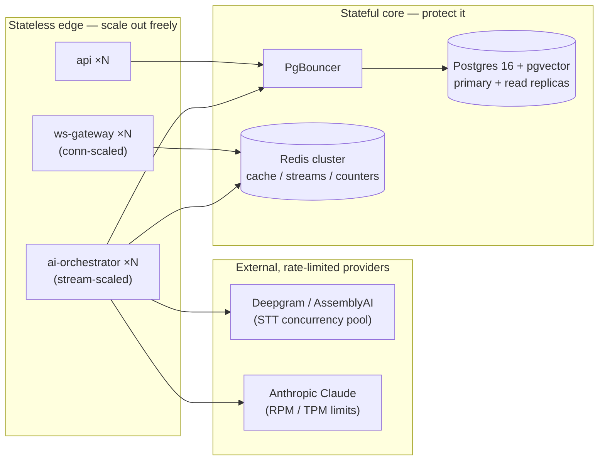
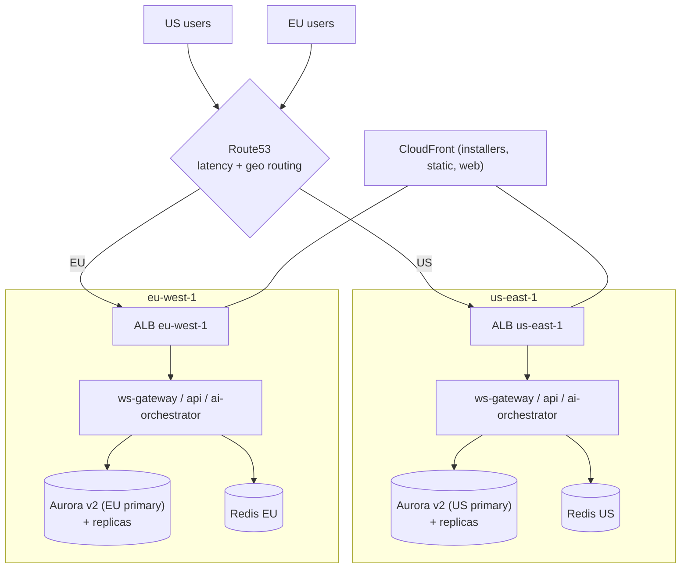
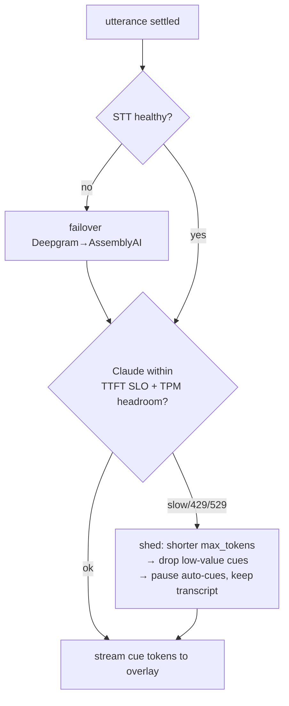

# Scalability & Resilience

> Status: Draft · Owner: Principal Architect (Platform) · Last updated: 2026-07-29 · Related: [System architecture](02-system-architecture.md) · [Backend services](20-backend-services.md) · [AI pipeline](21-ai-pipeline.md) · [Data model](30-data-model.md) · [DevOps / infra](60-devops-infrastructure.md) · [Observability](61-observability.md) · [Unit economics](71-unit-economics.md)

This doc owns **how Cue stays fast and up as concurrent live sessions grow**. It identifies the five load-bearing bottlenecks, gives each a scaling strategy, derives a **capacity model** (assumptions → required `ws-gateway` instances, STT concurrency, LLM throughput), defines the **multi-region / data-residency** topology, and specifies the **resilience patterns** (circuit breakers, retries, graceful degradation, backpressure) and the **load-testing plan**.

It does not re-derive the latency budget (that is [AI pipeline §4](21-ai-pipeline.md)), the service internals ([Backend services](20-backend-services.md)), the Terraform/Fargate wiring ([DevOps](60-devops-infrastructure.md)), or the cost math ([Unit economics](71-unit-economics.md)) — each is summarized in one line and linked.

> **Every external number in this doc is a labelled ASSUMPTION or ESTIMATE to be validated by load testing (§8) and production telemetry.** They exist to size the system, not to promise a SLA.

---

## 1. What actually scales — and what doesn't

Cue has two fundamentally different load curves, established in [Backend services ADR](20-backend-services.md):

| Surface | Load unit | Curve | Scaling axis |
|---|---|---|---|
| `api` (BFF) | request/sec | classic RPS, short-lived | CPU / RPS target tracking |
| `ws-gateway` | **concurrent live connections** | long-lived, stateful edge | active connections |
| `ai-orchestrator` | **concurrent STT+LLM streams** | long-lived, provider-bound | in-flight streams |
| `entitlements` / `billing-webhooks` | request/sec, bursty | low volume | CPU |
| Postgres / pgvector | connections + query load | stateful, hard to shard | replicas + PgBouncer |
| Redis | ops/sec, streams | stateful | cluster / sharding |

**The design invariant:** the stateless edges (`api`, `ws-gateway`, `ai-orchestrator`) scale horizontally on Fargate; the stateful core (Postgres, Redis, R2) is the thing we must protect from connection storms and query load. Every bottleneck below is either "add more stateless tasks" (easy) or "protect the stateful core" (the real engineering).



---

## 2. Bottleneck-by-bottleneck strategy

### 2.1 `ws-gateway` fan-out of long-lived connections

**The problem.** Every live session is a WebSocket that stays open for the whole call (avg ~25 min, §4) and streams binary audio up + cue/transcript frames down. Unlike RPS load, you cannot "finish" a connection quickly to free the slot; 10,000 concurrent calls = 10,000 sockets pinned for ~25 minutes each. A naive deploy that kills a task drops every call on it.

**Strategy.**
- **Connection-scaled autoscaling.** ECS target-tracking on a **custom `active_connections` metric** (emitted per task to CloudWatch), not CPU — CPU stays low while sockets sit mostly idle relaying audio. Target ≈ 60% of the per-task connection ceiling (§3) so a scale-out event has headroom to absorb the in-flight ramp.
- **Connection-draining rolling deploys** (per [Backend services §7](20-backend-services.md)): on task replacement, the gateway stops accepting new upgrades, signals connected clients, and clients reconnect to another task. Because **all session state lives in Redis** (offsets, presence, stream), a replaced task loses no session — the client resumes within the 60s grace window (`resumeFrom:<lastSeq>`).
- **No sharding by user in v1.** The gateway is stateless per-connection; any task can serve any session. Session→stream affinity lives in Redis, not in a task. This avoids a sticky-routing layer. **If** a single hot session ever needs cross-task coordination (e.g. Team co-listening), we add a Redis-Stream-keyed shard map — noted as a future item, not built now.
- **ALB is the connection distributor.** WSS terminates at the ALB; least-outstanding-requests routing spreads new upgrades. No sticky sessions needed because reconnection re-tickets (§ resilience).

**Bounded, not buffered.** The gateway never buffers unbounded audio: per-connection max in-flight bytes, backpressure frames to the client, socket close at the hard limit (`1013`). See §6.4.

### 2.2 STT provider concurrency + cost

**The problem.** Each live session holds **one concurrent Deepgram streaming connection** for its whole duration. STT concurrency therefore equals peak concurrent sessions — and it is a **negotiated, capped, per-minute-billed** external resource, the single largest line in the latency budget ([AI pipeline §4](21-ai-pipeline.md)) and a major COGS line ([Unit economics](71-unit-economics.md)).

**Strategy.**
- **Concurrency pool with a headroom buffer.** `ai-orchestrator` treats STT streams as a leased resource from a pool sized to the **negotiated provider concurrency ceiling × 0.8**. A session cannot start a live stream without a lease; if the pool is exhausted the session is queued or degraded (§6).
- **Two-provider pool (Deepgram primary, AssemblyAI fallback).** Per [AI pipeline §STT abstraction](21-ai-pipeline.md), the provider is behind an interface. The pool can bleed overflow or a provider outage onto the secondary, and pre-negotiated headroom on both means neither is a single point of concurrency failure.
- **Capacity is bought ahead of the curve.** STT ceilings are contractual; the capacity model (§3) feeds procurement so we raise the concurrency ceiling before peak concurrency reaches 80% of it. This is a **lead-time bottleneck** — tracked as an operational risk (§9).
- **Minute caps bound the aggregate.** Free 60 min/mo and Pro plan caps ([Entitlements](50-subscriptions-entitlements.md)) put a ceiling on both cost and concurrency demand.

### 2.3 Claude rate limits + latency

**The problem.** Anthropic enforces per-org **RPM** (requests/min) and **TPM** (tokens/min) limits. At scale, thousands of concurrent sessions each firing ~4 cues/min (§3) can approach the account TPM/RPM ceiling, and a `429`/`529` on the hot path is a visible cue stall. Claude TTFT is also on the < 1.2s p95 budget.

**Strategy.**
- **Token-bucket admission control in `ai-orchestrator`.** A shared Redis token bucket tracks account-level RPM/TPM headroom; live-cue requests draw from it. When headroom is low, the orchestrator **sheds gracefully** before Anthropic returns a 429: shorten `max_tokens`, drop low-value cues (dedup harder), and only then queue.
- **Fallback model routing.** The router ([AI pipeline §5](21-ai-pipeline.md)) already prefers Haiku on the hot path. Under sustained rate pressure it can (a) keep cues on Haiku but reduce cue frequency, (b) never *escalate* to Sonnet/Opus on the live path, and (c) for async prep/summary work, **queue and defer** rather than compete with live traffic for the account TPM.
- **Prompt caching cuts TPM pressure, not just cost.** The 2–8K cached prefix is billed and *counted* at ~0.1× ([AI pipeline §6](21-ai-pipeline.md)); caching therefore multiplies effective TPM headroom by keeping per-cue billed input small (§ Unit economics confirms the ~70% input reduction).
- **Priority classes.** Live cues = P0 (never queued behind async). Prep/summary/grading = P1 (queued via BullMQ, can wait). This isolation means a burst of post-call summaries can never starve live cues of Claude quota.
- **Capacity asks to Anthropic ahead of growth**, same lead-time discipline as STT.

### 2.4 pgvector query load (RAG retrieval)

**The problem.** Every live session that has uploaded docs does a **vector similarity search per query** (k=6 chunks, [AI pipeline §7](21-ai-pipeline.md)). At high concurrency these `<=>` cosine scans compete with OLTP traffic on the same Postgres and can spike p99.

**Strategy.**
- **RAG reads go to read replicas.** Embeddings are read-heavy and tolerate slight replica lag (a resume uploaded 2s ago need not be instantly searchable mid-call). `ai-orchestrator` routes vector search to an Aurora read replica; writes (embedding a new upload) go to the primary.
- **HNSW index, tuned.** pgvector HNSW (`m=16, ef_construction=64`, query `ef_search` tuned for recall/latency) keeps ANN search sub-10ms per query at our chunk volumes ([Data model](30-data-model.md) owns the DDL). IVFFlat considered and rejected for the mixed insert/query pattern.
- **Per-session retrieval cache.** RAG context for a session is assembled once and **cached in the prompt prefix** — it is not re-queried every cue. Only a materially new query intent triggers a fresh retrieval. This collapses per-session vector queries from "per cue" to a handful.
- **Tenant-scoped queries always filter `user_id` first** (indexed) so the ANN scan is over one user's small chunk set, not the global corpus.

### 2.5 Postgres connections

**The problem.** Fargate autoscaling multiplies tasks; each task with a naive pool can open dozens of Postgres connections. 200 tasks × 20 connections = 4,000 connections — Aurora Serverless v2 and Neon both fall over on raw connection count long before CPU.

**Strategy.**
- **PgBouncer in transaction-pooling mode** in front of the primary and replicas. Application tasks hold cheap client-side connections; PgBouncer multiplexes them onto a small server-side pool (target server pool ≤ ~200). This decouples task count from server connection count.
- **Aurora Serverless v2** primary scales ACUs on load; **read replicas** absorb RAG + analytics-ish reads. Region-local replicas keep read latency low (§5).
- **Drizzle** connection pools sized *small per task* (e.g. `max: 5`) because PgBouncer does the real fan-in.
- **Redis absorbs the hot path.** Sessions, presence, WS offsets, entitlement checks, and usage counters live in Redis ([Backend services §5](20-backend-services.md)), so the live path barely touches Postgres — the DB sees session finalize/flush, not per-cue traffic.

### Bottleneck summary

| Bottleneck | Scaling lever | Protects | Lead time |
|---|---|---|---|
| `ws-gateway` connections | conn-scaled Fargate + ALB spread + Redis-held state | availability of live calls | minutes (autoscale) |
| STT concurrency | leased pool @ 0.8× ceiling, 2-provider overflow | latency + cost | **weeks (contract)** |
| Claude RPM/TPM | Redis token bucket + fallback routing + priority classes + caching | cue continuity | **weeks (contract)** |
| pgvector load | read replicas + HNSW + prefix-cached RAG | API p99 | days |
| Postgres connections | PgBouncer + Aurora v2 + Redis hot path | whole DB | days |

---

## 3. Capacity model

> **All inputs are ASSUMPTIONS.** They are labelled `[A#]` and must be replaced by measured values from the load-test plan (§8) and production telemetry.

### 3.1 Demand assumptions

| # | Assumption | Value | Rationale |
|---|---|---|---|
| A1 | Monthly active users (MAU) at "Growth" scale | 100,000 | planning scenario; see [Roadmap](80-roadmap.md) |
| A2 | Avg live sessions / active user / week | 3 | interviews + sales calls + meetings |
| A3 | Avg session length | 25 min | interview/sales-call norm |
| A4 | Business-hours concentration (peak-to-average factor) | 6× | calls cluster in local business hours |
| A5 | Time-zone spread across our two regions | US + EU only in v1 | limits global smoothing |
| A6 | Cues generated per active session-minute | 4 | one per settled utterance ([AI pipeline §9](21-ai-pipeline.md)) |
| A7 | Billed input tokens per cue (with caching) | ~440 | 400 fresh + 4,000 cached@0.1× ([Unit economics §3](71-unit-economics.md)) |
| A8 | Output tokens per cue | ~120 | `max_tokens:160`, typical fill |

### 3.2 Derived peak concurrency

```
Weekly session-minutes  = A1 × A2 × A3
                        = 100,000 × 3 × 25          = 7,500,000 session-min / week
Avg concurrent sessions = weekly-min / (7 days × 24h × 60min)
                        = 7,500,000 / 10,080         ≈ 744 avg concurrent
Peak concurrent (A4)    = 744 × 6                     ≈ 4,500 concurrent live sessions
```

**Planning target: ~4,500 concurrent live sessions at Growth scale (100k MAU).** We size to **2× that (9,000)** for burst headroom.

### 3.3 Required `ws-gateway` capacity

| # | Assumption / derivation | Value |
|---|---|---|
| A9 | Sustainable active audio-relay connections per Fargate task (4 vCPU / 8 GB) | **2,500** (ESTIMATE — validate in §8; Opus audio relay + fan-out is I/O-light but CPU-bound on framing) |
| — | Tasks for 9,000 peak @ 60% target utilization | `9,000 / (2,500 × 0.6)` = **6 tasks** |
| — | + Multi-AZ / rolling-deploy headroom | round to **8–10 tasks** at Growth peak |

`ws-gateway` is cheap to scale — the binding constraint is not the gateway, it is the providers behind `ai-orchestrator`.

### 3.4 Required STT concurrency

```
STT concurrent streams = peak concurrent sessions ≈ 4,500 (headroom target 9,000)
```

We must hold a **negotiated Deepgram concurrency ceiling ≥ 9,000 / 0.8 ≈ 11,250 streams** at Growth scale, split with AssemblyAI headroom for failover. **This is the hard external ceiling** — provisioned by contract, not autoscaling (§2.2).

### 3.5 Required Claude throughput

```
Cues/min at peak      = 4,500 sessions × 4 cues/min          = 18,000 cues/min  → 18,000 RPM
Input TPM (billed)    = 18,000 × 440 billed input tok        ≈ 7.9M input TPM
Output TPM            = 18,000 × 120 output tok              ≈ 2.2M output TPM
```

At Growth peak we need Anthropic headroom of **~18k RPM and ~10M TPM (input+output) on Haiku**. Prompt caching is what makes this feasible — **without caching the billed input TPM would be ~10× higher** (4,400 vs 440 tok/cue) and both cost and TPM pressure would break (§ Unit economics). Async prep/summary (Sonnet/Opus) draws from a **separate, smaller quota** and is queued (P1), so it never competes with live cues.

### 3.6 Scenario table

| Scenario | MAU [A1] | Peak concurrent | `ws-gateway` tasks | STT ceiling needed | Haiku input TPM |
|---|---|---|---|---|---|
| Launch | 5,000 | ~225 | 2 (min HA) | ~280 | ~0.4M |
| Growth | 100,000 | ~4,500 | 8–10 | ~11,250 | ~7.9M |
| Scale | 1,000,000 | ~45,000 | ~40 | ~112,500 | ~79M |

At **Scale**, STT concurrency and Claude TPM are the real conversations (multi-account/enterprise commitments, possibly on-prem STT for Enterprise per canonical stack) — the compute tier stays trivially horizontal.

---

## 4. Multi-region strategy & data residency

**Two active regions from day one: `us-east-1` and `eu-west-1`** (canonical infra). This is driven by **data residency (GDPR)** first, latency second.



- **Region pinning, not global replication of user data.** A user's home region is chosen at signup (residency preference) and pinned. Their sessions, transcripts, uploads, and embeddings live **only** in that region's Postgres/R2. There is **no cross-region replication of user PII** — that is the residency guarantee, not a limitation to fix.
- **The live path is region-local end-to-end.** Desktop connects to the nearest region's `ws-gateway`; STT/LLM egress from that region; RAG queries hit that region's replicas. This is what keeps the [§4 latency budget](21-ai-pipeline.md) achievable (region hop is 15/45ms, not a transatlantic 90ms).
- **Global vs regional data.** Global (no residency concern): installers, `latest.yml` update feeds, marketing site, release manifest — served from CloudFront/R2 with global reach. Regional: everything user-scoped.
- **Failover posture (v1): in-region HA across AZs, not cross-region user failover.** A full-region outage degrades that region's users (documented DR RTO in [DevOps §DR](60-devops-infrastructure.md)); we do **not** silently fail EU users over to US because that would violate residency. Cross-region DR for the control plane (auth, entitlements metadata) is warm-standby; user-data DR is snapshot/restore within region.
- **Provider regionality.** Deepgram/AssemblyAI and Anthropic endpoints are selected per region where regional endpoints exist; where they do not, the DPA + sub-processor disclosure covers the transfer ([Legal/compliance] via [Product vision](01-product-vision.md)).

---

## 5. Resilience patterns

The live path depends on two external, latency-variable providers (STT, Claude). Resilience is designed around **degrade, never hang**.



### 5.1 Circuit breakers

Every external dependency call from `ai-orchestrator` is wrapped in a circuit breaker (closed → open → half-open):

| Dependency | Trip condition | Open-state behavior |
|---|---|---|
| Deepgram | error rate > 25% / 10s or connect timeout | route new streams to AssemblyAI |
| AssemblyAI | same | if both open → "transcription unavailable", capture continues, cues paused |
| Claude (live) | 529/timeout rate > threshold | shed to shorter cues, then pause auto-cues; transcript ribbon stays live |
| Postgres primary | connect failures | reads serve from replica; writes buffer to Redis + retry (bounded) |

Half-open probes a single canary stream/request before fully closing again.

### 5.2 Retries with backoff

- **Idempotent internal calls** (`api`→`entitlements`, gRPC/HTTP): retry 3× with exponential backoff + full jitter (50ms → cap 1s). Never retry on the *live cue* path — a retried cue is a late cue, which is a useless cue; instead we drop and let the next utterance produce a fresh one.
- **STT stream reconnect:** on a dropped provider socket mid-session, reconnect with backoff while buffering ≤ a bounded audio window; if reconnect exceeds the window, failover provider.
- **WS client reconnect:** exponential backoff 0.5s → cap 10s, full jitter, single-use ticket per attempt, resumable within 60s ([Backend services §6.5](20-backend-services.md)).
- **Webhook retries** (Stripe → `billing-webhooks`) are provider-driven + our own dead-letter replay ([Payments](51-payments-stripe.md)).

### 5.3 Graceful degradation ladder

The product stays *useful* as dependencies slow, in this order (each step is user-visible but non-fatal):

1. **All green** — cues stream < 1.2s p95.
2. **Claude slow / near TPM cap** — reduce cue frequency, shorten `max_tokens`, dedup harder.
3. **Claude shedding** — pause auto-cues; keep the **live transcript ribbon** (STT still flowing) so the user is never blind.
4. **STT primary down** — transparent failover to secondary (user sees nothing).
5. **Both STT down** — overlay shows "transcription unavailable"; **mic/loopback capture keeps running locally** so recording/notes are not lost; cues paused.
6. **Entitlement/minute cap hit** — cues stop, overlay prompts upgrade ([Entitlements](50-subscriptions-entitlements.md)).

The ladder is authoritative alongside [AI pipeline §degradation](21-ai-pipeline.md); this doc owns the *platform* framing, that doc owns the *pipeline* specifics.

### 5.4 Backpressure

End-to-end, bounded at every hop (detail in [Backend services §6.4](20-backend-services.md)):
- **Client → gateway:** gateway watches Redis `XADD` latency + per-session buffer depth; emits `{t:"backpressure", level:"shed"}`; client drops to lower-bitrate Opus, then VAD-gated silence-frame dropping. Hard cap → socket close `1013`. **Never buffer unbounded audio server-side.**
- **Gateway → orchestrator:** Redis stream depth is monitored; a slow orchestrator consumer applies backpressure upstream rather than growing the stream unboundedly.
- **Orchestrator → providers:** the STT lease pool + Claude token bucket *are* the backpressure — no lease/no token ⇒ degrade per the ladder, never queue the live path unboundedly.

### 5.5 Bulkheads & isolation

- **Priority classes** isolate live (P0) from async prep/summary (P1) for both Claude quota and worker pools — a summary storm cannot starve live cues.
- **Money path isolation:** `entitlements` + `billing-webhooks` run as separate services/tasks so a billing incident never shares a blast radius with live latency ([Backend services ADR](20-backend-services.md)).
- **Per-tenant fairness:** Redis rate limits cap any single user/org's cue rate + STT leases so one runaway client cannot exhaust a shared pool.

---

## 6. Overload behavior (what happens at 100% capacity)

When peak exceeds provisioned headroom (e.g. an unmodeled surge past the STT ceiling):

1. **New sessions are admission-controlled**, not silently broken. `api` checks STT/LLM pool headroom before minting a WS ticket; if exhausted, the client shows "high demand — starting notes-only mode" and opens in **transcript-only** (STT lease acquired, cues deferred) or a short queue.
2. **In-flight sessions are protected.** We never evict a running call to admit a new one — the long-lived nature means eviction is maximally disruptive. Admission control degrades *new* sessions, preserves *active* ones.
3. **Free tier degrades first.** Under scarcity, entitlement-aware admission favors paid sessions (documented in [Entitlements](50-subscriptions-entitlements.md)); Free may drop to transcript-only sooner. This aligns overload behavior with the loss-leader economics ([Unit economics §free tier](71-unit-economics.md)).

---

## 7. Autoscaling configuration (concrete)

| Service | Scale metric | Target | Min / Max (Growth) | Deploy strategy |
|---|---|---|---|---|
| `api` | ALB RequestCountPerTarget + CPU | 65% CPU | 3 / 40 | rolling, fast |
| `ws-gateway` | custom `active_connections` | 60% of per-task ceiling | 3 / 30 | **connection-draining** rolling |
| `ai-orchestrator` | custom `inflight_streams` + provider-lease saturation | 70% | 3 / 40 | rolling, drain streams |
| `entitlements` | CPU | 65% | 2 / 10 | rolling |
| `billing-webhooks` | SQS/queue depth | n/a | 2 / 8 | rolling |

- **Scale-out is aggressive, scale-in is conservative** (long cooldown) because long-lived connections make premature scale-in disruptive.
- **Provisioned baseline before known peaks.** Scheduled scaling raises the floor ahead of regional business-hours ramps (A4 = 6×) rather than chasing the curve reactively — reactive-only autoscaling lags the ramp of long-lived sessions.
- Warm pools / provisioned capacity keep cold-start out of the live-path scale-out window.

---

## 8. Load-testing plan

We validate every `[A#]` assumption before it becomes a SLA promise.

| Test | Tool | Validates | Pass criterion |
|---|---|---|---|
| **WS soak** — N long-lived connections streaming synthetic Opus audio for 30 min | k6 (`xk6-websockets`) + custom audio replayer | A9 (conns/task), memory/FD leaks, drain-on-deploy | no dropped calls across a rolling deploy; flat memory |
| **Concurrency ramp** — 0 → 2× peak concurrent sessions | k6 + synthetic session harness | §3 capacity numbers, autoscale reaction time | p95 live latency stays < 1.2s through the ramp |
| **STT failover** — kill primary mid-load | fault injection (toxiproxy on provider egress) | §5.1 breaker + failover transparency | zero user-visible cue loss on failover |
| **Claude 429/529 storm** — inject rate-limit responses | mock Anthropic edge / toxiproxy | §2.3 token bucket + degradation ladder | degrades per §5.3, never hangs |
| **pgvector load** — RAG queries at peak concurrency | pgbench + vector query mix | §2.4 replica routing, p99 | RAG search p99 < target, no OLTP p99 regression |
| **Connection-storm reconnect** — drop 50% of sockets simultaneously | chaos on ALB/tasks | §5.2 reconnect+resume | all resume within 60s grace, no thundering-herd on `api` ticket mint |
| **Backpressure** — throttle a session's downstream | toxiproxy | §5.4 bounded buffers | server memory bounded; client sheds bitrate |

- **Cadence:** full suite before each scale milestone (Launch → Growth → Scale) and on any change to the live path. A trimmed WS-soak + degradation suite runs nightly against staging.
- **Chaos in staging** (GameDays): scheduled region-AZ loss, provider outage, Redis failover — validate DR RTO/RPO with [DevOps](60-devops-infrastructure.md).
- **Observability closes the loop:** load tests assert on the same SLO dashboards/traces defined in [Observability](61-observability.md) (live-latency p95, breaker state, pool saturation, provider error rate), so a test failure and a prod incident look identical.

---

## 9. Open questions & risks

1. **A9 (connections per `ws-gateway` task) is unvalidated** and drives the whole gateway sizing. Audio-relay CPU cost per connection under real Opus + fan-out is an estimate; the WS-soak test (§8) must produce a measured number before we publish capacity commitments.
2. **STT & Claude are lead-time bottlenecks, not autoscaling ones.** Concurrency ceilings and TPM/RPM are contractual and take weeks to raise. A viral spike (a launch, press) can outrun procurement; §6 admission control is the safety valve, but the *business* risk (turning away demand) needs a capacity-buffer policy owned with [Roadmap](80-roadmap.md).
3. **Redis is a shared stateful dependency on the hot path** (streams, offsets, counters, token bucket). Its own scaling/HA (cluster mode, failover time) is summarized here but owned by [Data model](30-data-model.md) / [DevOps](60-devops-infrastructure.md); a Redis failover stall would stall the live path — needs its own chaos test.
4. **No cross-region user failover by design** (residency). A full `eu-west-1` outage degrades EU users to DR-restore RTO. Whether that is acceptable, or whether we need an in-EU multi-region posture (e.g. a second EU region), is a compliance + cost decision open with [DevOps](60-devops-infrastructure.md).
5. **Peak-to-average factor A4=6×** assumes US+EU-only, business-hours-clustered usage. Adding APAC (future) both smooths the curve *and* adds a third region — changes both capacity and residency models.
6. **pgvector on the primary vs a dedicated vector store.** If RAG query load at Scale degrades OLTP despite replicas, we may split embeddings onto a dedicated vector service — a data-model decision to revisit with [Data model](30-data-model.md), not committed now.
7. **Admission-control UX under overload** ("notes-only mode") must be designed so degradation feels like a feature, not a failure — needs [Design system](12-design-system.md) input.
