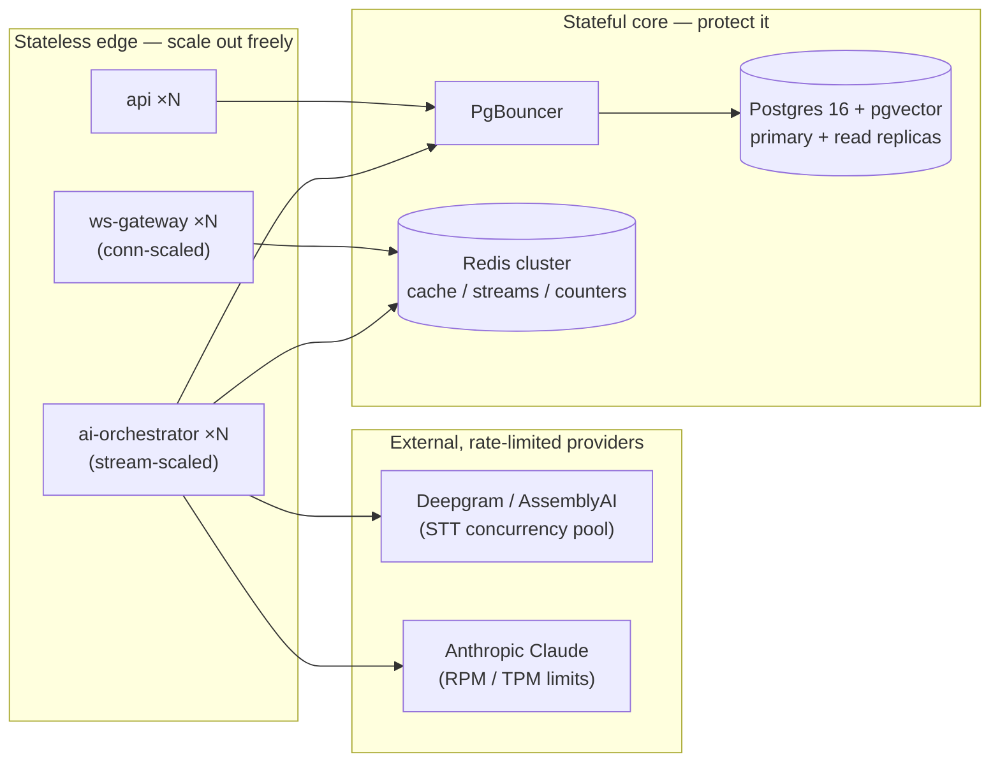
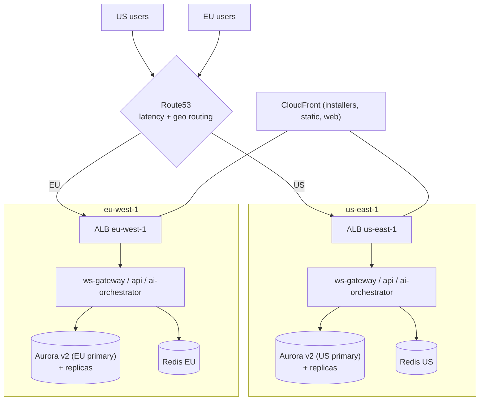
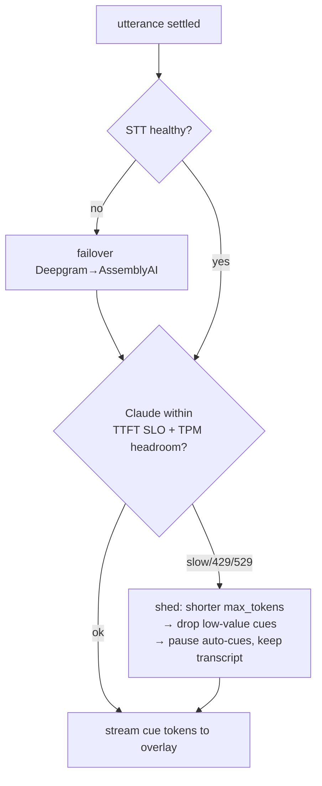

# Scalability & Resilience

> Status: Draft · Owner: Principal Architect (Platform) · Last updated: 2026-07-29 · Related: [Decision record](04-decision-record.md) · [Remediation plan](05-remediation-plan.md) · [System architecture](02-system-architecture.md) · [Backend services](20-backend-services.md) · [AI pipeline](21-ai-pipeline.md) · [Data model](30-data-model.md) · [Authentication](40-authentication.md) · [DevOps / infra](60-devops-infrastructure.md) · [Observability](61-observability.md) · [Unit economics](71-unit-economics.md)

This doc owns **how Cue stays fast and up as concurrent live sessions grow**. It identifies the five load-bearing bottlenecks, gives each a scaling strategy, derives a **capacity model** (assumptions → required `ws-gateway` instances, STT concurrency, LLM throughput), defines the **multi-region / data-residency** topology, and specifies the **resilience patterns** (circuit breakers, retries, graceful degradation, backpressure) and the **load-testing plan**.

It does not re-derive the latency budget (that is [AI pipeline §4](21-ai-pipeline.md)), the service internals ([Backend services](20-backend-services.md)), the Terraform/Fargate wiring ([DevOps](60-devops-infrastructure.md)), or the cost math ([Unit economics](71-unit-economics.md)) — each is summarized in one line and linked.

> **Every external number in this doc is a labelled ASSUMPTION or ESTIMATE to be validated by load testing (§8) and production telemetry.** They exist to size the system, not to promise a SLA.

---

## 1. What actually scales — and what doesn't

Cue has two fundamentally different load curves, established in [Backend services ADR](20-backend-services.md):

| Surface | Load unit | Curve | Scaling axis |
|---|---|---|---|
| `api` (BFF) | request/sec | classic RPS, short-lived | CPU / RPS target tracking |
| `ws-gateway` | **concurrent live connections** | long-lived, stateful edge | active connections |
| `ai-orchestrator` | **concurrent STT+LLM streams** | long-lived, provider-bound | in-flight streams |
| `entitlements` / `billing-webhooks` | request/sec, bursty | low volume | CPU |
| Postgres / pgvector | connections + query load | stateful, hard to shard | replicas + PgBouncer |
| Redis | ops/sec, streams | stateful | cluster / sharding |

**The design invariant:** the stateless edges (`api`, `ws-gateway`, `ai-orchestrator`) scale horizontally on Fargate; the stateful core (Postgres, Redis, R2) is the thing we must protect from connection storms and query load. Every bottleneck below is either "add more stateless tasks" (easy) or "protect the stateful core" (the real engineering).



---

## 2. Bottleneck-by-bottleneck strategy

### 2.1 `ws-gateway` fan-out of long-lived connections

**The problem.** Every live session is a WebSocket that stays open for the whole call (avg ~25 min, §4) and streams binary audio up + cue/transcript frames down. Unlike RPS load, you cannot "finish" a connection quickly to free the slot; 10,000 concurrent calls = 10,000 sockets pinned for ~25 minutes each. A naive deploy that kills a task drops every call on it.

**Strategy.**
- **Connection-scaled autoscaling.** ECS target-tracking on a **custom `active_connections` metric** (emitted per task to CloudWatch), not CPU — CPU stays low while sockets sit mostly idle relaying audio. Target ≈ 60% of the per-task connection ceiling (§3) so a scale-out event has headroom to absorb the in-flight ramp.
- **Connection-draining rolling deploys** (per [Backend services §7](20-backend-services.md)): on task replacement, the gateway stops accepting new upgrades, signals connected clients, and clients reconnect to another task. Because **all session state lives in Redis** (offsets, presence, stream), a replaced task loses no session — the client resumes within the 60s grace window (`resumeFrom:<lastSeq>`).
- **No sharding by user in v1.** The gateway is stateless per-connection; any task can serve any session. Session→stream affinity lives in Redis, not in a task. This avoids a sticky-routing layer. **If** a single hot session ever needs cross-task coordination (e.g. Team co-listening), we add a Redis-Stream-keyed shard map — noted as a future item, not built now.
- **ALB is the connection distributor.** WSS terminates at the ALB; least-outstanding-requests routing spreads new upgrades. No sticky sessions needed because reconnection re-tickets (§ resilience).

**Bounded, not buffered.** The gateway never buffers unbounded audio: per-connection max in-flight bytes, backpressure frames to the client, socket close at the hard limit (`1013`). See §6.4.

### 2.2 STT provider concurrency + cost

**The problem.** Each live session holds **one concurrent Deepgram streaming connection** for its whole duration. STT concurrency therefore equals peak concurrent sessions — and it is a **negotiated, capped, per-minute-billed** external resource, the single largest line in the latency budget ([AI pipeline §4](21-ai-pipeline.md)) and a major COGS line ([Unit economics](71-unit-economics.md)).

**Strategy.**
- **Concurrency pool with a headroom buffer.** `ai-orchestrator` treats STT streams as a leased resource from a pool sized to the **negotiated provider concurrency ceiling × 0.8**. A session cannot start a live stream without a lease; if the pool is exhausted the session is queued or degraded (§6).
- **Two-provider pool (Deepgram primary, AssemblyAI fallback).** Per [AI pipeline §STT abstraction](21-ai-pipeline.md), the provider is behind an interface. The pool can bleed overflow or a provider outage onto the secondary, and pre-negotiated headroom on both means neither is a single point of concurrency failure.
- **Capacity is bought ahead of the curve.** STT ceilings are contractual; the capacity model (§3) feeds procurement so we raise the concurrency ceiling before peak concurrency reaches 80% of it. This is a **lead-time bottleneck** — tracked as an operational risk (§9).
- **Minute caps bound the aggregate.** Free 60 min/mo and Pro plan caps ([Entitlements](50-subscriptions-entitlements.md)) put a ceiling on both cost and concurrency demand.

### 2.3 Claude rate limits + latency

**The problem.** Anthropic enforces per-org **RPM** (requests/min) and **TPM** (tokens/min) limits. At scale, thousands of concurrent sessions each firing ~4 cues/min (§3) can approach the account TPM/RPM ceiling, and a `429`/`529` on the hot path is a visible cue stall. Claude TTFT is also on the < 1.2s p95 budget.

**Strategy.**
- **Token-bucket admission control in `ai-orchestrator`, per region.** A Redis token bucket tracks RPM/TPM headroom; live-cue requests draw from it. When headroom is low, the orchestrator **sheds gracefully** before Anthropic returns a 429: shorten `max_tokens`, drop low-value cues (dedup harder), and only then queue. The bucket is **genuinely regional** — see §4.4 and ADR-70.3: each region draws from its own admission budget (held in that region's control Redis, §2.6), not a shared global counter that silently overcommits one region against the other.
- **Fallback model routing.** The router ([AI pipeline §5](21-ai-pipeline.md)) already prefers Haiku on the hot path. Under sustained rate pressure it can (a) keep cues on Haiku but reduce cue frequency, (b) never *escalate* to Sonnet/Opus on the live path, and (c) for async prep/summary work, **queue and defer** rather than compete with live traffic for the account TPM.
- **Prompt caching cuts TPM pressure, not just cost.** The 2–8K cached prefix is billed and *counted* at ~0.1× ([AI pipeline §6](21-ai-pipeline.md)); caching therefore multiplies effective TPM headroom by keeping per-cue billed input small (§ Unit economics confirms the ~70% input reduction).
- **Priority classes.** Live cues = P0 (never queued behind async). Prep/summary/grading = P1 (queued via BullMQ, can wait). This isolation means a burst of post-call summaries can never starve live cues of Claude quota.
- **Capacity asks to Anthropic ahead of growth**, same lead-time discipline as STT.

### 2.4 pgvector query load (RAG retrieval)

**The problem.** Every live session that has uploaded docs does a **vector similarity search per query** (k=6 chunks, [AI pipeline §7](21-ai-pipeline.md)). At high concurrency these `<=>` cosine scans compete with OLTP traffic on the same Postgres and can spike p99.

**Strategy.**
- **RAG reads go to read replicas.** Embeddings are read-heavy and tolerate slight replica lag (a resume uploaded 2s ago need not be instantly searchable mid-call). `ai-orchestrator` routes vector search to an Aurora read replica; writes (embedding a new upload) go to the primary.
- **HNSW index, tuned.** pgvector HNSW (`m=16, ef_construction=64`, query `ef_search` tuned for recall/latency) keeps ANN search sub-10ms per query at our chunk volumes ([Data model](30-data-model.md) owns the DDL). IVFFlat considered and rejected for the mixed insert/query pattern.
- **Per-session retrieval cache.** RAG context for a session is assembled once and **cached in the prompt prefix** — it is not re-queried every cue. Only a materially new query intent triggers a fresh retrieval. This collapses per-session vector queries from "per cue" to a handful.
- **Tenant-scoped queries pre-filter `org_id` first** (indexed) so the ANN scan is over one tenant's chunk set, not the global corpus. **But a filtered HNSW scan is not free of recall risk:** a `WHERE org_id = $1` predicate applied to a global HNSW graph can make the graph traversal walk mostly non-matching neighbors and return < k in-tenant hits at a given `ef_search`, silently dropping recall. We therefore treat filtered-HNSW recall as a **thing to measure, not assume** — see §2.7 (recall validation) and ADR-70.4, and the recall@k load-suite assertion in §8. Addresses audit **SR-07** via [05-remediation-plan.md](05-remediation-plan.md).

### 2.5 Postgres connections

**The problem.** Fargate autoscaling multiplies tasks; each task with a naive pool can open dozens of Postgres connections. 200 tasks × 20 connections = 4,000 connections — Aurora Serverless v2 and Neon both fall over on raw connection count long before CPU.

**Strategy.**
- **PgBouncer in transaction-pooling mode** in front of the primary and replicas. Application tasks hold cheap client-side connections; PgBouncer multiplexes them onto a small server-side pool (target server pool ≤ ~200). This decouples task count from server connection count.
- **Aurora Serverless v2** primary scales ACUs on load; **read replicas** absorb RAG + analytics-ish reads. Region-local replicas keep read latency low (§5).
- **Drizzle** connection pools sized *small per task* (e.g. `max: 5`) because PgBouncer does the real fan-in.
- **Redis absorbs the hot path.** Sessions, presence, WS offsets, entitlement checks, and usage counters live in Redis ([Backend services §5](20-backend-services.md)), so the live path barely touches Postgres — the DB sees session finalize/flush, not per-cue traffic.

### 2.6 Redis is two workloads, not one — split the clusters

The doc previously treated "Redis" as a single dependency. It is not: two workloads with **different ops profiles, latency criticality, and failover tolerance** share the name, and co-locating them means a session-churn hotspot can stall the latency-critical admission path (and vice versa). We split them into two ElastiCache clusters per region.

| Cluster | Owns | Ops profile | Latency criticality | Failover tolerance |
|---|---|---|---|---|
| **Control Redis** | Claude RPM/TPM token bucket, STT lease counters, per-tenant rate-limit counters, usage counters, entitlement-check cache | **low ops/sec, tiny values, hot-path on every cue** | Extreme — a stalled `INCR`/token draw delays or drops a cue | Must fail over fast; a few seconds of unavailability degrades admission (fail-open to bounded local budget, see below) |
| **Session/stream Redis** | Session state, presence/heartbeat, WS sequence offsets (`resumeFrom`), BullMQ async queues (prep/summary/grading) | **higher ops/sec, session-lifecycle churn, off the per-cue path** | Moderate — resume/offset staleness is recoverable via client replay | Tolerates a short failover; BullMQ jobs are durable and retryable |

- **Canonical audio invariant preserved.** Per [04-decision-record.md](04-decision-record.md) (gRPC bidi hot path, Redis OFF the per-frame audio path), **neither** cluster carries per-frame audio — audio frames stay in-process on `ws-gateway`/`ai-orchestrator` with gRPC/HTTP-2 flow control (§5.4). Redis carries session *metadata* and control counters only.
- **Fail-open admission under control-Redis loss.** If control Redis is briefly unavailable, `ai-orchestrator` falls back to a **conservative per-instance local token budget** (a fraction of the regional bucket ÷ instance count) so cues keep flowing degraded rather than hanging — never fail-closed on the live path.
- **Independent failover, independent chaos tests.** Each cluster is ElastiCache Multi-AZ with auto-failover; the §8 suite exercises failover of *each* cluster separately (closing the "shared Redis stall" risk previously only noted in §9.3).
- Sensitivity/encryption controls for both clusters (encryption in transit + at rest + AUTH, reclassified as sensitive-data-bearing) are owned by [30-data-model.md](30-data-model.md) / [40-authentication.md](40-authentication.md); this doc owns only the *split and sizing*.

> **ADR-70.2 — Split control Redis from session/stream Redis (per region).** *Decision:* run two ElastiCache clusters per region rather than one. *Why:* the admission-control token bucket is low-volume but latency-critical on every cue, while session/offset/BullMQ traffic is high-churn and only moderately latency-sensitive; sharing one cluster couples their failure modes and lets session churn evict or stall admission keys. *Trade-off:* two clusters per region ≈ +2 small nodes of cost per region — accepted; it is small against COGS and buys blast-radius isolation. Addresses audit **SR-05** via [05-remediation-plan.md](05-remediation-plan.md).

### 2.7 Filtered-HNSW recall validation (not an assumption)

Filtered ANN is the one retrieval correctness risk we cannot leave to "sub-10ms" latency claims. The plan:

- **Measure recall@k under a realistic multi-tenant corpus**, not a single-tenant synthetic one: many `org_id`s of widely varying chunk counts (a few docs to tens of thousands), the smaller tenants being exactly where a global HNSW graph under an `org_id` pre-filter degrades.
- **Ground truth = exact brute-force** cosine over the tenant's chunks (`SET enable_indexscan=off` / sequential `<=>`); recall@k = |HNSW top-k ∩ exact top-k| / k, asserted **≥ 0.95 at the production `ef_search`** across tenant-size buckets.
- **Escalation ladder if recall dips** below target for selective tenants: (1) raise `ef_search`; (2) enable pgvector **iterative index scans** (`hnsw.iterative_scan`, 0.8.x) so the scan keeps walking until k in-tenant hits are found; (3) **per-tenant partial indexes** (`WHERE org_id = …`) for large tenants and/or **table partitioning by `org_id`-hash** so each tenant queries its own graph — planned before Growth (§3), not retrofitted after a recall incident.
- Both **recall@k AND p99 latency** are asserted together in the load suite (§8) — a fix that restores recall by blowing latency is a failed fix.

> **ADR-70.4 — Filtered-HNSW recall is a measured gate, with a per-tenant index path before Growth.** *Decision:* treat recall@k (≥ 0.95) under an `org_id` pre-filter as a first-class load-suite assertion, and commit to per-tenant partial/partitioned indexes before Growth scale rather than assuming a single global HNSW graph holds recall. *Why:* selective filters on a global HNSW graph are a known recall-degradation mode; silent low recall is a correctness bug that looks like "the AI is dumb," not an outage. *Trade-off:* per-tenant partial indexes add index-maintenance and planning complexity — deferred until the corpus and load-suite data justify the cut-over. Addresses audit **SR-07** via [05-remediation-plan.md](05-remediation-plan.md).

### Bottleneck summary

| Bottleneck | Scaling lever | Protects | Lead time |
|---|---|---|---|
| `ws-gateway` connections | conn-scaled Fargate + ALB spread + Redis-held state | availability of live calls | minutes (autoscale) |
| STT concurrency | leased pool @ 0.8× ceiling, 2-provider overflow, **per-region** | latency + cost | **weeks (contract)** |
| Claude RPM/TPM | **per-region** Redis token bucket + fallback routing + priority classes + caching | cue continuity | **weeks (contract)** |
| pgvector load | read replicas + filtered HNSW + prefix-cached RAG + recall gate | API p99 + recall | days |
| Postgres connections | PgBouncer + Aurora v2 + Redis hot path | whole DB | days |
| Redis (split) | control vs session/stream clusters, per region, independent failover | admission + session state | days |

---

## 3. Capacity model

> **All inputs are ASSUMPTIONS.** They are labelled `[A#]` and must be replaced by measured values from the load-test plan (§8) and production telemetry.

### 3.1 Demand assumptions

| # | Assumption | Value | Rationale |
|---|---|---|---|
| A1 | Monthly active users (MAU) at "Growth" scale | 100,000 | planning scenario; see [Roadmap](80-roadmap.md) |
| A2 | Avg live sessions / active user / week | 3 | interviews + sales calls + meetings |
| A3 | Avg session length | 25 min | interview/sales-call norm |
| A4 | Business-hours concentration (peak-to-average factor), **blended global** | 6× | legacy global figure — superseded for sizing by A4r |
| A4r | Business-hours concentration **within a single region** | **8×** | a single region has no cross-timezone smoothing, so its own peak-to-average is sharper than the blended global 6× |
| A5 | Time-zone spread across our two regions | US + EU only in v1 | limits global smoothing |
| A5s | **MAU split us-east-1 / eu-west-1** | **65% / 35%** | planning split; US-first GTM, EU for residency — validate against signup telemetry |
| A6 | Cues generated per active session-minute | 4 | one per settled utterance ([AI pipeline §9](21-ai-pipeline.md)) |
| A7 | Billed input tokens per cue (with caching) | ~440 | 400 fresh + 4,000 cached@0.1× ([Unit economics §3](71-unit-economics.md)) |
| A8 | Output tokens per cue | ~120 | `max_tokens:160`, typical fill |

### 3.2 Derived peak concurrency — **per region, not a smoothed global peak**

The original model derived one global peak (744 avg × 6 ≈ 4,500) and sized to it. That is **wrong for a two-region deployment**: `ws-gateway` tasks, STT leases, and Claude quota cannot be shared across `us-east-1` and `eu-west-1` (region-local live path, §4), and the two regions peak in their **own** business hours — so each region's fleet must be sized to **its own** business-hours peak, computed from **its own** MAU (A5s) and its own single-region peak factor (A4r), independently.

```
Per-region avg concurrent = (MAU_region × A2 × A3) / (7d × 24h × 60min)
Per-region peak concurrent = avg × A4r          (A4r = 8×, single-region clustering)

us-east-1 (65k MAU):  65,000 × 3 × 25 / 10,080 ≈ 484 avg  → × 8 ≈ 3,900 peak
eu-west-1 (35k MAU):  35,000 × 3 × 25 / 10,080 ≈ 260 avg  → × 8 ≈ 2,100 peak
```

**Key correction (SR-01/SR-04):** the two regional peaks **sum to ~6,000**, which is *larger* than the old smoothed global 4,500 — because the smoothed figure implicitly assumed US and EU load offsets and averages, which is exactly the assumption that under-provisions each region's own fleet. We size **each region to its own peak**:

| Region | MAU (A5s) | Avg concurrent | **Peak concurrent (A4r=8×)** | Sizing target (2× burst headroom) |
|---|---|---|---|---|
| us-east-1 | 65,000 | ≈ 484 | **≈ 3,900** | ~7,800 |
| eu-west-1 | 35,000 | ≈ 260 | **≈ 2,100** | ~4,200 |
| **Global (informational only)** | 100,000 | ≈ 744 | *not a sizing input* | — |

The global row is retained only for cost/COGS aggregation ([Unit economics](71-unit-economics.md)); **it is never a capacity-sizing input.** Everything below (§3.3–3.6) is derived **per region**.

### 3.3 Required `ws-gateway` capacity — **per region**

| # | Assumption / derivation | Value |
|---|---|---|
| A9 | Sustainable active audio-relay connections per Fargate task (4 vCPU / 8 GB) | **2,500** (ESTIMATE — validate in §8; Opus audio relay + fan-out is I/O-light but CPU-bound on framing) |
| — | us-east-1 tasks for 7,800 sizing target @ 60% utilization | `7,800 / (2,500 × 0.6)` ≈ **6 tasks** → **8–10** with Multi-AZ + rolling-deploy headroom |
| — | eu-west-1 tasks for 4,200 sizing target @ 60% utilization | `4,200 / (2,500 × 0.6)` ≈ **3 tasks** → **5–6** with Multi-AZ + rolling-deploy headroom |

Each region's fleet is sized independently to its own target; there is **no shared global gateway pool**. `ws-gateway` is cheap to scale — the binding constraint is not the gateway, it is the providers behind `ai-orchestrator`.

### 3.4 Required STT concurrency — **per region**

```
STT concurrent streams (region) = that region's peak concurrent sessions
us-east-1: sizing target 7,800 → ceiling ≥ 7,800 / 0.8 ≈  9,750 streams
eu-west-1: sizing target 4,200 → ceiling ≥ 4,200 / 0.8 ≈  5,250 streams
```

We hold a **negotiated Deepgram concurrency ceiling per region** (≈ 9,750 US / ≈ 5,250 EU at Growth), each split with AssemblyAI headroom for failover. **This is the hard external ceiling** — provisioned by contract, per region, not autoscaling (§2.2), and it is a **regional admission budget** (§2.6, §4.4), never a single global pool that lets one region borrow the other's leases.

### 3.5 Required Claude throughput — **per region**

```
Cues/min (region)   = region peak concurrent × 4 cues/min
Input TPM  (billed) = cues/min × 440 billed input tok
Output TPM          = cues/min × 120 output tok

us-east-1 (3,900 peak): 15,600 RPM → ≈ 6.9M input TPM + ≈ 1.9M output TPM
eu-west-1 (2,100 peak):  8,400 RPM → ≈ 3.7M input TPM + ≈ 1.0M output TPM
```

Anthropic headroom is provisioned **per region** (≈ 15.6k RPM / ≈ 8.8M TPM US, ≈ 8.4k RPM / ≈ 4.7M TPM EU on Haiku). Prompt caching is what makes this feasible — **without caching the billed input TPM would be ~10× higher** (4,400 vs 440 tok/cue) and both cost and TPM pressure would break (§ Unit economics). Async prep/summary (Sonnet/Opus) draws from a **separate, smaller quota** and is queued (P1), so it never competes with live cues. Regionality of the Anthropic account is spelled out in §4.4 / ADR-70.3.

### 3.6 Scenario table — **per region**

| Scenario | Total MAU | Region | Region MAU (A5s) | Peak concurrent | `ws-gateway` tasks | STT ceiling | Haiku input TPM |
|---|---|---|---|---|---|---|---|
| Launch | 5,000 | us-east-1 | 3,250 | ~195 | 2 (min HA) | ~245 | ~0.34M |
| Launch | 5,000 | eu-west-1 | 1,750 | ~105 | 2 (min HA) | ~130 | ~0.18M |
| Growth | 100,000 | us-east-1 | 65,000 | ~3,900 | 8–10 | ~9,750 | ~6.9M |
| Growth | 100,000 | eu-west-1 | 35,000 | ~2,100 | 5–6 | ~5,250 | ~3.7M |
| Scale | 1,000,000 | us-east-1 | 650,000 | ~39,000 | ~34 | ~97,500 | ~69M |
| Scale | 1,000,000 | eu-west-1 | 350,000 | ~21,000 | ~18 | ~52,500 | ~37M |

At **Scale**, STT concurrency and Claude TPM are the real conversations **in each region** (multi-account/enterprise commitments per region, possibly on-prem STT for Enterprise per canonical stack) — the compute tier stays trivially horizontal.

> **ADR-70.1 — Size each region to its own business-hours peak, never a smoothed global peak.** *Decision:* derive capacity per region from that region's MAU (A5s) and single-region peak factor (A4r=8×); the global peak is informational only. *Why:* live-path resources are region-pinned (§4) and the two regions peak at different local times, so a smoothed global figure under-provisions both. *Trade-off:* sum-of-regional-peaks (~6,000) > smoothed global (~4,500) means we provision ~33% more nominal capacity than the naive model — accepted; it is the honest number and the alternative silently drops calls at regional peak. Addresses audit **SR-01, SR-04** via [05-remediation-plan.md](05-remediation-plan.md).

### 3.7 Redis ops/sec model — per scenario, per cluster

Sizing the two clusters from §2.6. Per-session ops rates are ESTIMATES to be validated in §8.

| Source | Op | Rate / active session | Cluster |
|---|---|---|---|
| Presence / heartbeat | `SET`+TTL | ~1 / s | session/stream |
| WS seq offset (`resumeFrom`) | `SET` | ~2 / s (transcript+cue frames) | session/stream |
| BullMQ async enqueue/ack | mixed | ~0.2 / s (amortized) | session/stream |
| Claude token draw | `EVAL` (bucket) | ~0.067 / s (4 cues/min) | control |
| Usage + rate-limit counters | `INCR` | ~0.13 / s (~2 / cue) | control |
| STT lease acquire/release | `EVAL` | negligible steady (2 / session lifetime) | control |

```
session/stream ≈ 3.2 ops/s/session   control ≈ 0.2 ops/s/session
```

| Scenario | Region | Peak sessions | **Session/stream Redis ops/s** | **Control Redis ops/s** |
|---|---|---|---|---|
| Growth | us-east-1 | 3,900 | ≈ 12,500 | ≈ 780 |
| Growth | eu-west-1 | 2,100 | ≈ 6,700 | ≈ 420 |
| Scale | us-east-1 | 39,000 | ≈ 125,000 | ≈ 7,800 |
| Scale | eu-west-1 | 21,000 | ≈ 67,000 | ≈ 4,200 |

**Read:** session/stream Redis is ~16× the ops volume but latency-tolerant; control Redis is low-volume but on every cue's critical path — which is exactly why they are split (§2.6). At Growth a single-shard ElastiCache node handles either comfortably; the model exists to catch when **session/stream** crosses into cluster-mode sharding (well before Scale), while **control** stays single-shard far longer. The throughput + failover of both clusters is asserted in the §8 load suite. Addresses audit **SR-05** via [05-remediation-plan.md](05-remediation-plan.md).

---

## 4. Multi-region strategy & data residency

**Two active regions from day one: `us-east-1` and `eu-west-1`** (canonical infra). This is driven by **data residency (GDPR)** first, latency second.



- **Region pinning, not global replication of user data.** A user's home region is chosen at signup (residency preference) and pinned. Their sessions, transcripts, uploads, and embeddings live **only** in that region's Postgres/R2. There is **no cross-region replication of user PII** — that is the residency guarantee, not a limitation to fix.
- **The live path is region-local end-to-end.** Desktop connects to the nearest region's `ws-gateway`; STT/LLM egress from that region; RAG queries hit that region's replicas. This is what keeps the [§4 latency budget](21-ai-pipeline.md) achievable (region hop is 15/45ms, not a transatlantic 90ms).
- **Global vs regional data.** Global (no residency concern): installers, `latest.yml` update feeds, marketing site, release manifest — served from CloudFront/R2 with global reach. Regional: everything user-scoped.
- **Failover posture (v1): in-region HA across AZs, not cross-region user failover.** A full-region outage degrades that region's users (documented DR RTO in [DevOps §DR](60-devops-infrastructure.md)); we do **not** silently fail EU users over to US because that would violate residency. Cross-region DR for the control plane (auth, entitlements metadata) is warm-standby; user-data DR is snapshot/restore within region.
- **Provider regionality.** Deepgram/AssemblyAI and Anthropic endpoints are selected per region where regional endpoints exist; where they do not, the DPA + sub-processor disclosure covers the transfer ([Legal/compliance] via [Product vision](01-product-vision.md)).

### 4.4 Regional admission control (Anthropic + STT)

The §2.2/§2.3 admission controls are only meaningful if the **budget they meter is genuinely regional**. A single global token bucket over a single shared Anthropic org would let `us-east-1`'s business-hours peak silently exhaust the quota that `eu-west-1` is counting on hours later — the two regions would fight over one counter and neither's SLO would hold.

We take an explicit position (ADR-70.3): **separate provider accounts/keys per region** is the primary mechanism, with a real cross-region global bucket as the only acceptable alternative.

| Provider | Regional admission mechanism |
|---|---|
| **Anthropic (Claude)** | Distinct Anthropic org/API key per region (`cue-us`, `cue-eu`), each with its own contracted RPM/TPM (§3.5). Each region's control-Redis token bucket meters **only its own org's** headroom. No cross-region key sharing. |
| **Deepgram / AssemblyAI** | Per-region concurrency ceiling (§3.4) metered by that region's control-Redis lease counters. Failover between Deepgram↔AssemblyAI stays **within region**. |

- **If a shared org is ever forced** (e.g. contract can't split), the fallback is a **real cross-region global token bucket** — a single authoritative counter (one region's control Redis, cross-region-replicated, or a dedicated global limiter service) that both regions draw from atomically — **never** two independent local buckets each assuming the full quota. Two independent buckets over one shared quota is the specific anti-pattern this ADR forbids.
- The §8 **429/529-storm test runs against both regions** and asserts that saturating one region's budget does **not** degrade the other's cue flow.

> **ADR-70.3 — Provider admission budgets are per-region (separate orgs/keys), or a single global bucket — never independent local buckets over a shared quota.** *Decision:* provision a distinct Anthropic org and distinct STT concurrency contract per region and meter each in that region's control Redis. *Why:* the two regions peak at different local times and must each hold their own SLO; a shared quota with independent local counters overcommits and produces cross-region 429 contention that is invisible until peak. *Trade-off:* two provider orgs = duplicated onboarding/minimums — accepted; it is the only way regional admission control is real. Addresses audit **SR-02, SR-06** via [05-remediation-plan.md](05-remediation-plan.md).

### 4.5 Availability SLO vs DR posture — reconciled

The published target is **99.9% monthly = 43.2 min/month** error budget. That number has to survive contact with the failover and DR realities, which we quantify here (values are ESTIMATES to validate in GameDays, §8; canonical DR wiring in [DevOps §DR](60-devops-infrastructure.md)).

| Event | Scope | RTO (recovery) | RPO (data loss) | Error-budget impact |
|---|---|---|---|---|
| Aurora Serverless v2 writer failover (Multi-AZ) | in-region | ~30–60 s | 0 (sync standby) | ~1 min/event; a few/month fits the budget |
| ElastiCache Multi-AZ failover (either cluster) | in-region | ~15–30 s | ≤ seconds (control counters are reconstructable; sessions replay) | fail-open admission (§2.6) blunts user impact |
| Single-AZ loss | in-region | seconds (tasks + DB already span ≥2 AZ) | 0 | within budget |
| **Full-region loss** | whole region's users | **DR-restore RTO = hours (snapshot/PITR restore)** | **RPO ≤ 5 min** (continuous backup) | **one event blows the 43.2 min budget entirely** |

**The tension:** in-region AZ-level HA can hold 99.9%, but a **full-region outage cannot** be recovered inside 43.2 minutes with a snapshot/restore DR posture — and we deliberately do **not** fail EU users over to US (region pinning, §4). Two honest options; we take a position rather than publishing a number the DR posture can't back:

- **Option A — lower/scope the published SLO.** Publish 99.9% only for events *up to and including single-AZ loss*, and state full-region loss as a separate, lower availability tier bounded by DR RTO.
- **Option B — fund an in-region hot standby for the live control plane** so the region survives a broader (non-total) fault without a DR restore.

> **ADR-70.5 — Scope the 99.9% SLO to in-region faults AND fund an in-region hot standby for the live control plane.** *Decision:* (1) provision each region with Multi-AZ Aurora (sync standby, auto-failover) + Multi-AZ ElastiCache for **both** clusters + `ws-gateway`/`api`/`ai-orchestrator` spread across ≥2 AZ, so single-AZ and single-node faults are survived inside the 43.2 min budget; **and** (2) explicitly **scope the published 99.9% to in-region availability**, documenting full-region loss as a distinct tier governed by DR RTO (hours) / RPO (≤5 min), not covered by the 99.9% number. *Why:* residency forbids cross-region user failover, so a total-region SLA at 99.9% would be a promise the architecture cannot keep; scoping it is honest and the hot standby earns the 99.9% for everything short of total-region loss. *Trade-off:* we do **not** buy cross-region active-active for user data (cost + residency) — full-region loss remains an hours-scale DR event, disclosed as such. Addresses audit **SR-04** (availability↔SLO reconciliation) via [05-remediation-plan.md](05-remediation-plan.md); superseding open question §9.4.

---

## 5. Resilience patterns

The live path depends on two external, latency-variable providers (STT, Claude). Resilience is designed around **degrade, never hang**.



### 5.1 Circuit breakers

Every external dependency call from `ai-orchestrator` is wrapped in a circuit breaker (closed → open → half-open):

| Dependency | Trip condition | Open-state behavior |
|---|---|---|
| Deepgram | error rate > 25% / 10s or connect timeout | route new streams to AssemblyAI |
| AssemblyAI | same | if both open → "transcription unavailable", capture continues, cues paused |
| Claude (live) | 529/timeout rate > threshold | shed to shorter cues, then pause auto-cues; transcript ribbon stays live |
| Postgres primary | connect failures | reads serve from replica; writes buffer to Redis + retry (bounded) |

Half-open probes a single canary stream/request before fully closing again.

### 5.2 Retries with backoff

- **Idempotent internal calls** (`api`→`entitlements`, gRPC/HTTP): retry 3× with exponential backoff + full jitter (50ms → cap 1s). Never retry on the *live cue* path — a retried cue is a late cue, which is a useless cue; instead we drop and let the next utterance produce a fresh one.
- **STT stream reconnect:** on a dropped provider socket mid-session, reconnect with backoff while buffering ≤ a bounded audio window; if reconnect exceeds the window, failover provider.
- **WS client reconnect:** exponential backoff 0.5s → cap 10s, full jitter, single-use ticket per attempt, resumable within 60s ([Backend services §6.5](20-backend-services.md)).
- **Webhook retries** (Stripe → `billing-webhooks`) are provider-driven + our own dead-letter replay ([Payments](51-payments-stripe.md)).

### 5.3 Graceful degradation ladder

The product stays *useful* as dependencies slow, in this order (each step is user-visible but non-fatal):

1. **All green** — cues stream < 1.2s p95.
2. **Claude slow / near TPM cap** — reduce cue frequency, shorten `max_tokens`, dedup harder.
3. **Claude shedding** — pause auto-cues; keep the **live transcript ribbon** (STT still flowing) so the user is never blind.
4. **STT primary down** — transparent failover to secondary (user sees nothing).
5. **Both STT down** — overlay shows "transcription unavailable"; **mic/loopback capture keeps running locally** so recording/notes are not lost; cues paused.
6. **Entitlement/minute cap hit** — cues stop, overlay prompts upgrade ([Entitlements](50-subscriptions-entitlements.md)).

The ladder is authoritative alongside [AI pipeline §degradation](21-ai-pipeline.md); this doc owns the *platform* framing, that doc owns the *pipeline* specifics.

### 5.4 Backpressure

End-to-end, bounded at every hop (detail in [Backend services §6.4](20-backend-services.md)):
- **Client → gateway:** gateway watches per-session buffer depth (audio frames stay in-process, never Redis); emits `{t:"backpressure", level:"shed"}`; client drops to lower-bitrate Opus, then VAD-gated silence-frame dropping. Hard cap → socket close `1013`. **Never buffer unbounded audio server-side.**
- **Gateway → orchestrator:** gRPC/HTTP/2 stream flow control applies backpressure upstream; per-session buffer depth is watermarked, never a Redis stream.
- **Orchestrator → providers:** the STT lease pool + Claude token bucket *are* the backpressure — no lease/no token ⇒ degrade per the ladder, never queue the live path unboundedly.

### 5.5 Bulkheads & isolation

- **Priority classes** isolate live (P0) from async prep/summary (P1) for both Claude quota and worker pools — a summary storm cannot starve live cues.
- **Money path isolation:** `entitlements` + `billing-webhooks` run as separate services/tasks so a billing incident never shares a blast radius with live latency ([Backend services ADR](20-backend-services.md)).
- **Per-tenant fairness:** Redis rate limits cap any single user/org's cue rate + STT leases so one runaway client cannot exhaust a shared pool.

---

## 6. Overload behavior (what happens at 100% capacity)

When peak exceeds provisioned headroom (e.g. an unmodeled surge past the STT ceiling):

1. **New sessions are admission-controlled**, not silently broken. `api` checks STT/LLM pool headroom before minting a WS ticket; if exhausted, the client shows "high demand — starting notes-only mode" and opens in **transcript-only** (STT lease acquired, cues deferred) or a short queue.
2. **In-flight sessions are protected.** We never evict a running call to admit a new one — the long-lived nature means eviction is maximally disruptive. Admission control degrades *new* sessions, preserves *active* ones.
3. **Free tier degrades first.** Under scarcity, entitlement-aware admission favors paid sessions (documented in [Entitlements](50-subscriptions-entitlements.md)); Free may drop to transcript-only sooner. This aligns overload behavior with the loss-leader economics ([Unit economics §free tier](71-unit-economics.md)).

---

## 7. Autoscaling configuration (concrete)

| Service | Scale metric | Target | Min / Max (Growth) | Deploy strategy |
|---|---|---|---|---|
| `api` | ALB RequestCountPerTarget + CPU | 65% CPU | 3 / 40 | rolling, fast |
| `ws-gateway` | custom `active_connections` | 60% of per-task ceiling | 3 / 30 | **connection-draining** rolling |
| `ai-orchestrator` | custom `inflight_streams` + provider-lease saturation | 70% | 3 / 40 | rolling, drain streams |
| `entitlements` | CPU | 65% | 2 / 10 | rolling |
| `billing-webhooks` | SQS/queue depth | n/a | 2 / 8 | rolling |

- **Scale-out is aggressive, scale-in is conservative** (long cooldown) because long-lived connections make premature scale-in disruptive.
- **Provisioned baseline before known peaks.** Scheduled scaling raises the floor ahead of regional business-hours ramps (A4 = 6×) rather than chasing the curve reactively — reactive-only autoscaling lags the ramp of long-lived sessions.
- Warm pools / provisioned capacity keep cold-start out of the live-path scale-out window.

---

## 8. Load-testing plan

We validate every `[A#]` assumption before it becomes a SLA promise.

| Test | Tool | Validates | Pass criterion |
|---|---|---|---|
| **WS soak** — N long-lived connections streaming synthetic Opus audio for 30 min | k6 (`xk6-websockets`) + custom audio replayer | A9 (conns/task), memory/FD leaks, drain-on-deploy | no dropped calls across a rolling deploy; flat memory |
| **Concurrency ramp** — 0 → 2× peak concurrent sessions | k6 + synthetic session harness | §3 capacity numbers, autoscale reaction time | p95 live latency stays < 1.2s through the ramp |
| **STT failover** — kill primary mid-load | fault injection (toxiproxy on provider egress) | §5.1 breaker + failover transparency | zero user-visible cue loss on failover |
| **Claude 429/529 storm — both regions** — saturate one region's admission budget, inject rate-limit responses | mock Anthropic edge / toxiproxy | §2.3 + §4.4 **regional** token bucket + degradation ladder | degrades per §5.3, never hangs; **saturating one region does NOT degrade the other's cue flow** (SR-02/SR-06) |
| **pgvector load** — RAG queries at peak concurrency, multi-tenant corpus | pgbench + vector query mix | §2.4 replica routing, p99 | RAG search p99 < target, no OLTP p99 regression |
| **pgvector filtered recall** — HNSW top-k vs exact brute-force under `org_id` pre-filter, across tenant-size buckets | custom harness (seq-scan ground truth) | §2.7 filtered-HNSW recall | **recall@k ≥ 0.95** at production `ef_search` for every tenant-size bucket **AND** p99 within target (SR-07) |
| **Redis-split failover** — fail over control Redis and session/stream Redis **separately** | ElastiCache failover / chaos | §2.6 split + fail-open admission | control-Redis loss ⇒ cues continue on local budget; session-Redis loss ⇒ sessions resume via replay; neither stalls the live path (SR-05) |
| **Connection-storm reconnect** — drop 50% of sockets simultaneously | chaos on ALB/tasks | §5.2 reconnect+resume | all resume within 60s grace, no thundering-herd on `api` ticket mint |
| **Backpressure** — throttle a session's downstream | toxiproxy | §5.4 bounded buffers | server memory bounded; client sheds bitrate |

- **Cadence:** full suite before each scale milestone (Launch → Growth → Scale) and on any change to the live path. A trimmed WS-soak + degradation suite runs nightly against staging.
- **Chaos in staging** (GameDays): scheduled region-AZ loss, provider outage, Redis failover — validate the **§4.5 DR RTO/RPO** numbers and the error-budget claims with [DevOps](60-devops-infrastructure.md).
- **Observability closes the loop:** load tests assert on the same SLO dashboards/traces defined in [Observability](61-observability.md) (live-latency p95, breaker state, pool saturation, provider error rate), so a test failure and a prod incident look identical.

---

## 9. Open questions & risks

1. **A9 (connections per `ws-gateway` task) is unvalidated** and drives the whole gateway sizing. Audio-relay CPU cost per connection under real Opus + fan-out is an estimate; the WS-soak test (§8) must produce a measured number before we publish capacity commitments.
2. **STT & Claude are lead-time bottlenecks, not autoscaling ones.** Concurrency ceilings and TPM/RPM are contractual and take weeks to raise. A viral spike (a launch, press) can outrun procurement; §6 admission control is the safety valve, but the *business* risk (turning away demand) needs a capacity-buffer policy owned with [Roadmap](80-roadmap.md).
3. **Redis split now isolates the hot path** (ADR-70.2): control Redis (token bucket/counters) is separated from session/stream Redis, each Multi-AZ with independent failover and an independent §8 chaos test. The residual risk is the fail-open local-budget approximation under control-Redis loss — validate it does not overcommit provider quota during a real failover window. HA internals owned by [Data model](30-data-model.md) / [DevOps](60-devops-infrastructure.md).
4. **Full-region loss is scoped out of the 99.9% SLO** (ADR-70.5): in-region Multi-AZ HA earns 99.9%; total-region loss is a separate DR tier (RTO hours / RPO ≤5 min), and residency still forbids cross-region user failover. The open item is whether an in-EU second-region posture is ever funded — a cost decision with [DevOps](60-devops-infrastructure.md), not committed now.
5. **Regional peak factor A4r=8× (and the 65/35 A5s split)** assume US+EU-only, single-region business-hours clustering; both are the load-bearing capacity inputs (§3.2) and must be replaced by measured signup-region + concurrency telemetry. Adding APAC (future) adds a third region and re-derivation.
6. **pgvector on the primary vs a dedicated vector store.** Filtered-HNSW recall is now a measured gate with a per-tenant partial/partitioned-index path before Growth (ADR-70.4, §2.7). If recall or OLTP p99 still degrade at Scale despite replicas + per-tenant indexes, splitting embeddings onto a dedicated vector service is the next step — a data-model decision to revisit with [Data model](30-data-model.md), not committed now.
7. **Admission-control UX under overload** ("notes-only mode") must be designed so degradation feels like a feature, not a failure — needs [Design system](12-design-system.md) input.
