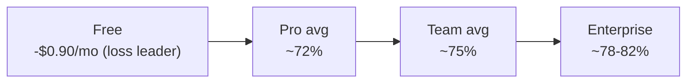

# Unit Economics & Profitability Model

> Status: Draft · Owner: Principal Architect (Platform) + Finance · Last updated: 2026-07-29 · Related: [AI pipeline](21-ai-pipeline.md) · [Subscriptions & entitlements](50-subscriptions-entitlements.md) · [Payments (Stripe)](51-payments-stripe.md) · [Scalability](70-scalability.md) · [Roadmap](80-roadmap.md)

This doc owns the **money-per-user math**: what a live minute of Cue costs to serve, gross margin per pricing tier at plan limits, the free-tier loss-leader cost, blended margin, break-even, and an LTV/CAC sketch — and it explains **why the [canonical pricing](50-subscriptions-entitlements.md) is profitable** and how model routing + prompt caching + minute caps defend the margin.

It does not define the tiers or entitlement enforcement ([Subscriptions & entitlements](50-subscriptions-entitlements.md)), the Stripe plumbing ([Payments](51-payments-stripe.md)), or the AI routing itself ([AI pipeline](21-ai-pipeline.md)) — it consumes them.

> ## ⚠️ Read this first: everything here is an ASSUMPTION or ESTIMATE
> Every external unit price, usage figure, conversion rate, and churn rate below is a **labelled assumption to be validated** against provider invoices, Stripe data, and product telemetry ([Observability](61-observability.md) emits the per-request token/cost events that will replace these estimates). Anthropic model prices are **canonical** (from the product brief); STT and infra unit costs are **estimates**. Numbers exist to prove the *shape* of the economics, not to forecast a P&L.

---

## 1. The one-sentence thesis

> **A live minute of Cue costs ~1.5¢ to serve; Pro sells ~500–1,200 minutes/month for $20; prompt caching + Haiku routing keep LLM cost below STT cost, so gross margin lands ~70%+ per paid tier — the whole model hinges on the *minute cap* turning an unbounded variable cost into a bounded one.**

---

## 2. Cost inputs (canonical prices + labelled estimates)

### 2.1 Claude model pricing — CANONICAL (from product brief)

| Model | ID | Input $/1M | Output $/1M | Notes |
|---|---|---|---|---|
| Haiku 4.5 | `claude-haiku-4-5` | $1 | $5 | live-cue default |
| Sonnet 5 | `claude-sonnet-5` | $3 (**$2 intro**) | $15 (**$10 intro**) | intro pricing through **2026-08-31** |
| Opus 5 | `claude-opus-5` | $5 | $25 | async prep/summary only |

**Prompt caching (canonical mechanic, [AI pipeline §6](21-ai-pipeline.md)):** cache **write** ≈ 1.25× input price (one-time per prefix); cache **read** ≈ **0.1×** input price. Voyage AI embeddings for RAG: **~$0.02–0.12 / 1M tokens** depending on model (ESTIMATE) — negligible vs live cost, excluded from the per-minute model, folded into fixed infra.

### 2.2 STT pricing — ESTIMATE

| Provider | $/streaming min (ESTIMATE) | Role |
|---|---|---|
| Deepgram (Nova streaming) | **~$0.0075/min** | primary |
| AssemblyAI (streaming) | ~$0.0075–0.015/min | fallback |

> STT is the single largest live-COGS line. We model **$0.0075/min blended**; enterprise-committed pricing is lower, on-prem STT (Enterprise) lower still. **Validate against first provider invoice.**

### 2.3 Other unit costs — ESTIMATE

| Item | Value | Basis |
|---|---|---|
| Compute + Redis + egress per live minute | **~$0.0015/min** | Fargate `ws-gateway`/`ai-orchestrator` + Redis + WS egress; [Scalability §3](70-scalability.md) |
| Stripe fee per subscription charge | **2.9% + $0.30** | standard card; lower with Stripe Tax/scale |
| Voyage embeddings, storage (R2), CDN | folded into fixed opex | small + amortized |

---

## 3. The core number: cost of one 30-minute live session

**Session model (ASSUMPTIONS, consistent with [AI pipeline §9](21-ai-pipeline.md) & [Scalability §3](70-scalability.md)):**
- 4 cues / minute → **120 cues** in 30 min
- Per cue: **4,000-token cached prefix** (system + profile + RAG) + **400 fresh input tokens** (30s transcript tail + query) + **120 output tokens** (`max_tokens:160`)

### 3.1 Haiku, WITHOUT prompt caching

| Component | Tokens | $/1M | Cost |
|---|---|---|---|
| Input (4,400 × 120) | 528,000 | $1 | $0.528 |
| Output (120 × 120) | 14,400 | $5 | $0.072 |
| **LLM total** | | | **$0.600** |

### 3.2 Haiku, WITH prompt caching (the real path)

| Component | Tokens | Effective $/1M | Cost |
|---|---|---|---|
| Cache **write** (prefix once) | 4,000 | $1 × 1.25 | $0.005 |
| Cache **read** (4,000 × 119 later cues) | 476,000 | $1 × 0.1 | $0.0476 |
| Fresh input (400 × 120) | 48,000 | $1 | $0.048 |
| Output (120 × 120) | 14,400 | $5 | $0.072 |
| **LLM total** | | | **~$0.173** |

**Prompt caching cuts LLM cost per session from $0.60 → $0.17 (~71%).** This is the single biggest margin lever and confirms [AI pipeline §6](21-ai-pipeline.md).

### 3.3 Full per-session and per-minute COGS (Pro, Haiku live)

| Line | 30-min session | Per live minute |
|---|---|---|
| LLM (Haiku, cached) | $0.173 | $0.0058 |
| STT ($0.0075/min) | $0.225 | $0.0075 |
| Compute/Redis/egress | $0.045 | $0.0015 |
| **Total live COGS** | **~$0.443** | **~$0.0148 ≈ 1.5¢/min** |

> **STT ($0.0075) > LLM ($0.0058) per minute.** Routing + caching worked: the LLM is *not* the dominant live cost. This validates the [AI pipeline](21-ai-pipeline.md) design goal — margin defense is now primarily an STT-and-minutes problem, not a token problem.

### 3.4 Occasional premium calls (added on top of the live baseline)

| Event | Model | Est. tokens | Est. cost/event |
|---|---|---|---|
| "Expand answer" hotkey (Pro+) | Sonnet 5 (base $3/$15) | ~5K in (cached-heavy) + 512 out | **~$0.03–0.045** (intro $2/$10 → ~$0.02–0.03 while it lasts) |
| Pre-call prep (resume × JD) | Opus 5 thinking-on | ~15K in + ~3K out | **~$0.15–0.20** |
| Post-call summary + actions | Sonnet 5 thinking-on | ~8K in + ~1.5K out | **~$0.04–0.06** |
| Mock-interview grading | Opus 5 | ~20K in + ~4K out | **~$0.20–0.30** |

These are **low-frequency and user/async-initiated**, so they add a modest per-user monthly increment (§4), not a per-minute cost. Costs above use Sonnet's **post-intro base price $3/$15** (Reconciled per [decision record](04-decision-record.md) (F-07)); the intro $2/$10 (through 2026-08-31) makes the Sonnet events ~0.67× while it lasts — **expiring upside, never the base case** (§9).

---

## 4. Gross margin per tier

**Usage assumptions (ASSUMPTIONS — validate with telemetry).** "Avg" = realistic mean usage; "Cap" = plan limit (the tail we must survive).

| Tier | Price | Net after Stripe | Avg live min/mo | Cap min/mo | RAG/premium add-on/mo |
|---|---|---|---|---|---|
| Free | $0 | $0 | 30 (of 60 cap) | 60 | none |
| Pro | $20/mo | ~$19.12 | 300 | 1,200 | ~$1.00 |
| Team | $30/user/mo | ~$29.13 | 400 | 1,500 | ~$1.50 |
| Enterprise | custom (~$45/user) | ~$43.7 | 500 | negotiated | ~$2.00 |

### 4.1 Pro ($20/mo) — the anchor tier

| | Avg user (300 min) | Cap user (1,200 min) |
|---|---|---|
| Live COGS @ $0.0148/min | $4.44 | $17.76 |
| Premium add-ons | $1.00 | $2.00 |
| **Total COGS** | **$5.44** | **$19.76** |
| Net revenue | $19.12 | $19.12 |
| **Gross profit** | **$13.68** | **–$0.64** |
| **Gross margin** | **~72%** | **~–3%** |

**The cap user is exactly break-even/slightly negative — which is why the minute cap and metered overage exist.** Past the cap, overage bills at the canonical **$0.13/min (≈9× the ~1.5¢/min live COGS)** (Reconciled per [decision record](04-decision-record.md) (F-01)), so the heaviest users become *more* profitable, not less. The 72% margin on the average user is the real business.

### 4.2 Team ($30/user/mo)

| | Avg user (400 min) |
|---|---|
| Live COGS | $5.92 |
| Premium add-ons (shared KB → slightly larger cached prefix, still 0.1× read) | $1.50 |
| **Total COGS** | **$7.42** |
| Net revenue | $29.13 |
| **Gross margin** | **~75%** |

Higher price with only modestly higher usage → the strongest per-seat margin. Shared knowledge base grows the cached prefix, but cache **reads** are 0.1× so it barely moves COGS.

### 4.3 Enterprise

Custom pricing (~$45+/seat ASSUMPTION), **on-prem/committed STT option lowers the dominant COGS line**, SSO/SLA are fixed-cost. Modeled **~78–82% gross margin**; the DPA/SLA/support overhead is an opex line, not COGS.

### 4.4 Margin ladder

---

## 5. The free tier — loss-leader math

- **Cost ceiling:** 60 min/mo × $0.0148 = **$0.89/mo** worst case. Haiku-only + **no RAG uploads** (canonical Free limits) keep the cached prefix small, so Free COGS ≤ Pro COGS/min.
- **Realistic:** most free users use far less than the cap; modeled **avg ~$0.35–0.45/free user/mo** (many trend toward 0).

### 5.1 Conversion economics (ASSUMPTIONS)

| Metric | Assumption |
|---|---|
| Free → Pro conversion | **5%** |
| Free users to yield 1 paid conversion | 20 |
| Monthly free-base cost per eventual conversion | 20 × $0.40 = **$8.00/mo** while they linger |
| Pro gross profit / mo | $13.68 |

Free is self-funding as long as **(conversion rate × paid gross profit) > free-user cost**: `0.05 × $13.68 = $0.68 expected gross profit per free user/mo` vs `$0.40 cost per free user/mo` → **net +$0.28/free user/mo even before they convert.** The 14-day Pro trial ([Subscriptions](50-subscriptions-entitlements.md)) accelerates conversion and its full-feature COGS is a bounded 14-day cost.

**Guardrails that keep Free from becoming a real loss:** hard 60-min cap enforced by [entitlements](50-subscriptions-entitlements.md), Haiku-only, no RAG, and Free degrades first under overload ([Scalability §6](70-scalability.md)).

---

## 6. Blended margin & break-even

### 6.1 Blended (illustrative subscriber mix — ASSUMPTION)

| Tier | Share of paid | Net ARPU | COGS | Gross profit |
|---|---|---|---|---|
| Pro | 70% | $19.12 | $5.44 | $13.68 |
| Team | 25% | $29.13 | $7.42 | $21.71 |
| Enterprise | 5% | $43.70 | $8.50 | $35.20 |
| **Blended (paid)** | 100% | **~$22.4** | **~$6.1** | **~$16.3 (73%)** |

Add the free base as a COGS drag: at 20 free users per paid user × $0.40 = $8.00 spread — reduces blended gross profit per paid user to **~$8.3**, i.e. an all-in **contribution margin ~37% of paid ARPU** once the free base is loaded on. (Free cost shrinks as a % as conversion matures.)

### 6.2 Break-even (simplified)

| Input (ASSUMPTION) | Value |
|---|---|
| Fixed monthly opex (small team + baseline infra + tools) | **$120,000/mo** |
| Contribution margin per paid user (incl. loaded free cost) | **~$8.3/mo** |
| **Break-even paid subscribers** | `120,000 / 8.3` ≈ **~14,500 paid** |
| Using pure paid gross profit (mature free base) | `120,000 / 16.3` ≈ **~7,400 paid** |

Break-even lands between **~7,400 and ~14,500 paid subscribers** depending on how heavily the free base loads — a milestone tracked in [Roadmap](80-roadmap.md).

---

## 7. LTV / CAC sketch (ASSUMPTIONS)

| Metric | Assumption | Derivation |
|---|---|---|
| Pro monthly gross profit | $13.68 | §4.1 |
| Monthly churn | 5% | → avg lifetime 20 months |
| **Pro LTV (gross profit)** | **~$274** | $13.68 × 20 |
| Target LTV/CAC | ≥ 3 | SaaS health floor |
| **Max sustainable CAC** | **≤ ~$90** | $274 / 3 |
| Payback period @ CAC $90 | ~6.6 months | $90 / $13.68 |

Annual plans (canonical: **2 months free** → Pro $200/yr = $16.67/mo effective) trade ~17% ARPU for lower churn and upfront cash; even at the lower effective price the average Pro user margin stays **~66%**, and reduced churn lifts LTV. Team/Enterprise LTV is materially higher (higher ARPU, lower seat churn) and pulls blended LTV/CAC well above 3.

---

## 8. Sensitivity: margin vs model mix vs usage

Pro net revenue = $19.12/mo. Cells = **gross margin %** at the given avg monthly live minutes and the given share of cues escalated off Haiku onto Sonnet 5 at the **post-intro base price $3/$15** (Reconciled per [decision record](04-decision-record.md) (F-07)). Includes STT + infra; excludes overage (which only *improves* the >cap columns).

| Avg min/mo ↓ / % cues on Sonnet → | 0% (all Haiku) | 10% | 25% | 50% |
|---|---|---|---|---|
| **150 min** | 86% | 85% | 83% | 80% |
| **300 min (modeled avg)** | 72% | 70% | 66% | 59% |
| **600 min** | 45% | 40% | 33% | 21% |
| **1,000 min** | 8% | 0% | –14% | –36% |
| **1,200 min (cap)** | –3% | –13% | –28% | –55% |

> The 0% (all-Haiku) column is unaffected by Sonnet pricing. The intro $2/$10 (through 2026-08-31) makes each Sonnet-share cell a few points higher than shown — **expiring upside, not the base case**; the base-case grid uses $3/$15.

**Reading it:**
- **Model mix matters far less than usage.** Even 50%-Sonnet at average usage (59%) beats all-Haiku at heavy usage (45%). Haiku routing protects the tail but usage is the dominant axis.
- **The cliff is minutes, not models** — which is exactly why the **minute cap + metered overage** ([Subscriptions](50-subscriptions-entitlements.md)) is the load-bearing margin control. Below ~600 min the tier is comfortably profitable at any realistic model mix.
- **This is why live cues default to Haiku with Sonnet opt-in only** ([AI pipeline §5 ADR](21-ai-pipeline.md)): it keeps the whole grid in the black at expected usage.

---

## 9. How the margin is defended (levers → effect)

| Lever | Owned by | Margin effect |
|---|---|---|
| **Prompt caching** (0.1× cached reads) | [AI pipeline §6](21-ai-pipeline.md) | –71% LLM cost/session (§3.2) — the biggest lever |
| **Haiku-default routing** | [AI pipeline §5](21-ai-pipeline.md) | keeps LLM < STT cost; Sonnet/Opus opt-in/async only |
| **`max_tokens` caps** (160 cue / 512 expand) | [AI pipeline §9](21-ai-pipeline.md) | bounds the expensive output side ($5–25/1M) |
| **Minute caps + metered overage** | [Subscriptions](50-subscriptions-entitlements.md) | converts unbounded variable cost → bounded; overage @ $0.13/min (~9× COGS) makes heavy users profitable |
| **Cue debounce/dedupe** | [AI pipeline §9](21-ai-pipeline.md) | fewer cues/min → lower LLM + STT-adjacent cost |
| **Free tier limits** (60 min, Haiku, no RAG) | [Subscriptions](50-subscriptions-entitlements.md) | caps loss-leader at <$0.90/user/mo |
| **STT commit / on-prem (Enterprise)** | [Scalability §2.2](70-scalability.md) | lowers the dominant COGS line at scale |
| **Overload → Free degrades first** | [Scalability §6](70-scalability.md) | protects paid margin under scarcity |

---

## 10. Pricing rationale (tiers ↔ cost)

- **Free @ 60 min, Haiku, no RAG:** loss capped at <$0.90/mo, high enough to demonstrate value, low enough to fund from a 5% conversion (§5).
- **Pro @ $20:** at modeled 300 min avg → $5.44 COGS → 72% margin, leaving room for CAC payback (§7) and R&D. Cap set at 1,200 min = the break-even point, with overage beyond it — so no Pro user is ever unprofitable by more than a rounding error, and heavy users pay for their load.
- **Team @ $30/seat:** price premium >> incremental COGS (shared KB is cache-read-cheap) → best per-seat margin; justifies admin/SSO-lite build cost.
- **Enterprise (custom):** priced on value + SSO/SLA/DPA; on-prem STT option lets margin *rise* with volume while meeting residency ([Scalability §4](70-scalability.md)).
- **Annual = 2 months free:** trades ~17% ARPU for churn reduction + cash; still ~66% Pro margin.

---

## 11. Open questions & risks

1. **STT unit price is the biggest unknown and the dominant COGS line.** The whole 72% Pro margin rides on ~$0.0075/min holding. A 2× STT price would drop average-Pro margin to ~55% — must be locked with a committed-use contract early ([Scalability §9](70-scalability.md)).
2. **Sonnet 5 intro-pricing upside ends (2026-08-31).** All COGS/margin/sensitivity math here already uses the **post-intro base $3/$15** (F-07), so there is **no margin cliff** when the intro lapses — the intro $2/$10 was only ever counted as expiring upside (~0.67× on Sonnet events). The residual action is unchanged: keep Sonnet eligibility tight and revert to Haiku under load ([AI pipeline open Q](21-ai-pipeline.md)).
3. **Usage assumptions (300 min avg Pro) are guesses.** If real avg is 600+ min, average-Pro margin roughly halves; §8 shows the cliff. Need telemetry-driven caps and possibly a lower default cap.
4. **Cues/min (4) and tokens/cue drive everything.** A chattier cue cadence or larger prefixes move COGS linearly; [Observability](61-observability.md) per-request cost telemetry must replace these estimates fast.
5. **Conversion (5%) and churn (5%/mo) are unvalidated** and set LTV/CAC and free-tier viability. Real cohort data required before committing marketing spend against a $90 CAC ceiling.
6. **Fixed opex ($120k/mo) is a placeholder** for the break-even calc; real number depends on team size + committed cloud spend ([Roadmap](80-roadmap.md) / [DevOps](60-devops-infrastructure.md)).
7. **Free-base loading** can dominate blended margin if conversion is slow — the "$8/paid-user free drag" assumes 20:1 free:paid; a 50:1 ratio would materially compress contribution margin until conversion matures.
