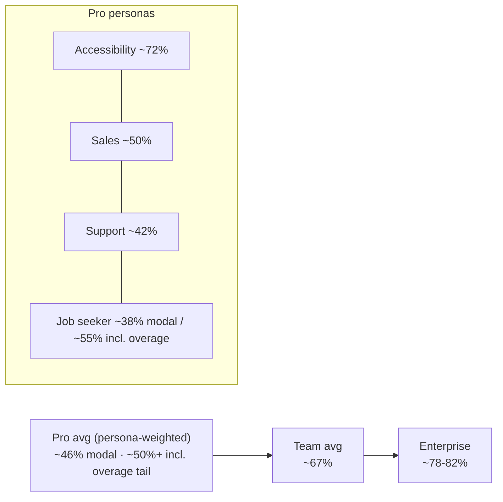

# Unit Economics & Profitability Model

> Status: Draft · Owner: Principal Architect (Platform) + Finance · Last updated: 2026-07-29 · Related: [AI pipeline](21-ai-pipeline.md) · [Subscriptions & entitlements](50-subscriptions-entitlements.md) · [Payments (Stripe)](51-payments-stripe.md) · [Scalability](70-scalability.md) · [Roadmap](80-roadmap.md)

This doc owns the **money-per-user math**: what a live minute of AssistMe costs to serve, gross margin modelled against the **paid usage distribution segmented by persona** (not a whole-base average), the free-tier acquisition cost on a **cohort** basis, a **bottom-up opex + true cash break-even** (including S&M/CAC), and a **per-persona** LTV/CAC — and it explains **why the [canonical pricing](50-subscriptions-entitlements.md) works** and how model routing + prompt caching + minute caps + metered overage defend the margin.

It does not define the tiers or entitlement enforcement ([Subscriptions & entitlements](50-subscriptions-entitlements.md)), the Stripe plumbing ([Payments](51-payments-stripe.md)), or the AI routing itself ([AI pipeline](21-ai-pipeline.md)) — it consumes them.

> **Financial rebuild note.** §4–§7 were rebuilt to model margin per persona, split churn/LTV by persona, stress the heavy tail at the canonical **$0.13/min** overage, rebuild the free tier on a cohort basis, and replace the placeholder opex with a bottom-up build. Addresses audit **F-02, F-03, F-04, F-05, F-06, F-08, F-10** via [05-remediation-plan.md](05-remediation-plan.md); keeps canonical **$0.13/min overage (F-01)** and **post-intro $3/$15 Sonnet base (F-07)** from [04-decision-record.md](04-decision-record.md).

> ## ⚠️ Read this first: everything here is an ASSUMPTION or ESTIMATE
> Every external unit price, usage figure, conversion rate, and churn rate below is a **labelled assumption to be validated** against provider invoices, Stripe data, and product telemetry ([Observability](61-observability.md) emits the per-request token/cost events that will replace these estimates). Anthropic model prices are **canonical** (from the product brief); STT and infra unit costs are **estimates**. Numbers exist to prove the *shape* of the economics, not to forecast a P&L.

---

## 1. The one-sentence thesis

> **A live minute of AssistMe costs ~1.5¢ to serve; caching + Haiku routing keep LLM cost below STT cost, so per-minute COGS is bounded — but gross margin is a *usage* story, and usage is a *persona* story: light personas (accessibility ~72%) subsidise heavy ones (job seekers ~38% before overage), so blended Pro margin lands ~40–50%, not 70%. The model hinges on the *minute cap + $0.13/min overage* turning the heavy tail from a loss into the most profitable cohort.**

---

## 2. Cost inputs (canonical prices + labelled estimates)

### 2.1 Claude model pricing — CANONICAL (from product brief)

| Model | ID | Input $/1M | Output $/1M | Notes |
|---|---|---|---|---|
| Haiku 4.5 | `claude-haiku-4-5` | $1 | $5 | live-cue default |
| Sonnet 5 | `claude-sonnet-5` | $3 (**$2 intro**) | $15 (**$10 intro**) | intro pricing through **2026-08-31** |
| Opus 5 | `claude-opus-5` | $5 | $25 | async prep/summary only |

**Prompt caching (canonical mechanic, [AI pipeline §6](21-ai-pipeline.md)):** cache **write** ≈ 1.25× input price (one-time per prefix); cache **read** ≈ **0.1×** input price. Voyage AI embeddings for RAG: **~$0.02–0.12 / 1M tokens** depending on model (ESTIMATE) — negligible vs live cost, excluded from the per-minute model, folded into fixed infra.

### 2.2 STT pricing — ESTIMATE

| Provider | $/streaming min (ESTIMATE) | Role |
|---|---|---|
| Deepgram (Nova streaming) | **~$0.0075/min** | primary |
| AssemblyAI (streaming) | ~$0.0075–0.015/min | fallback |

> STT is the single largest live-COGS line. We model **$0.0075/min blended**; enterprise-committed pricing is lower, on-prem STT (Enterprise) lower still. **Validate against first provider invoice.**

> **STT stream-count basis — EXPLICIT ASSUMPTION.** All COGS here assume **one mixed-mono STT stream per session billed at ~1× wall-clock minutes** (the participant + the user's own mic mixed into a single channel, diarized by the STT provider's speaker labels — [AI pipeline §3](21-ai-pipeline.md)). This is load-bearing: if diarization on a mixed channel proves inadequate and we must run **two separate streams** (near/far channels), billed STT minutes roughly **double**, so we carry a **2× STT downside** through the margin math (§4.5, §11). We do **not** assume per-word or per-channel STT surcharges beyond that.

### 2.3 Other unit costs — ESTIMATE

| Item | Value | Basis |
|---|---|---|
| Compute + Redis + egress per live minute | **~$0.0015/min** | Fargate `ws-gateway`/`ai-orchestrator` + Redis + WS egress; [Scalability §3](70-scalability.md) |
| Stripe fee per subscription charge | **2.9% + $0.30** | standard card; lower with Stripe Tax/scale |
| Voyage embeddings, storage (R2), CDN | folded into fixed opex | small + amortized |

---

## 3. The core number: cost of one 30-minute live session

**Session model (ASSUMPTIONS, consistent with [AI pipeline §9](21-ai-pipeline.md) & [Scalability §3](70-scalability.md)):**
- 4 cues / minute → **120 cues** in 30 min
- Per cue: **4,000-token cached prefix** (system + profile + RAG) + **400 fresh input tokens** (30s transcript tail + query) + **120 output tokens** (`max_tokens:160`)

### 3.1 Haiku, WITHOUT prompt caching

| Component | Tokens | $/1M | Cost |
|---|---|---|---|
| Input (4,400 × 120) | 528,000 | $1 | $0.528 |
| Output (120 × 120) | 14,400 | $5 | $0.072 |
| **LLM total** | | | **$0.600** |

### 3.2 Haiku, WITH prompt caching (the real path)

| Component | Tokens | Effective $/1M | Cost |
|---|---|---|---|
| Cache **write** (prefix once) | 4,000 | $1 × 1.25 | $0.005 |
| Cache **read** (4,000 × 119 later cues) | 476,000 | $1 × 0.1 | $0.0476 |
| Fresh input (400 × 120) | 48,000 | $1 | $0.048 |
| Output (120 × 120) | 14,400 | $5 | $0.072 |
| **LLM total** | | | **~$0.173** |

**Prompt caching cuts LLM cost per session from $0.60 → $0.17 (~71%).** This is the single biggest margin lever and confirms [AI pipeline §6](21-ai-pipeline.md).

### 3.3 Full per-session and per-minute COGS (Pro, Haiku live)

| Line | 30-min session | Per live minute |
|---|---|---|
| LLM (Haiku, cached) | $0.173 | $0.0058 |
| STT ($0.0075/min) | $0.225 | $0.0075 |
| Compute/Redis/egress | $0.045 | $0.0015 |
| **Total live COGS** | **~$0.443** | **~$0.0148 ≈ 1.5¢/min** |

> **STT ($0.0075) > LLM ($0.0058) per minute.** Routing + caching worked: the LLM is *not* the dominant live cost. This validates the [AI pipeline](21-ai-pipeline.md) design goal — margin defense is now primarily an STT-and-minutes problem, not a token problem.

### 3.4 Occasional premium calls (added on top of the live baseline)

| Event | Model | Est. tokens | Est. cost/event |
|---|---|---|---|
| "Expand answer" hotkey (Pro+) | Sonnet 5 (base $3/$15) | ~5K in (cached-heavy) + 512 out | **~$0.03–0.045** (intro $2/$10 → ~$0.02–0.03 while it lasts) |
| Pre-call prep (resume × JD) | Opus 5 thinking-on | ~15K in + ~3K out | **~$0.15–0.20** |
| Post-call summary + actions | Sonnet 5 thinking-on | ~8K in + ~1.5K out | **~$0.04–0.06** |
| Mock-interview grading | Opus 5 | ~20K in + ~4K out | **~$0.20–0.30** |

These are **low-frequency and user/async-initiated**, so they add a modest per-user monthly increment (§4), not a per-minute cost. Costs above use Sonnet's **post-intro base price $3/$15** (Reconciled per [decision record](04-decision-record.md) (F-07)); the intro $2/$10 (through 2026-08-31) makes the Sonnet events ~0.67× while it lasts — **expiring upside, never the base case** (§9).

---

## 4. Gross margin — modelled by persona, not a whole-base average

> A single "avg 300 min" figure hides the truth: **usage is bimodal by who the user is.** We therefore model Pro margin against a **persona-segmented paid distribution**. Gross margin is stated **conventionally = net revenue − COGS only** (STT + LLM + infra + premium add-ons); the free-base funnel cost is moved to an S&M/CAC line (§6.1), not netted against COGS. *Addresses audit F-02, F-03 via [05-remediation-plan.md](05-remediation-plan.md).*

### 4.0 Personas & the paid usage distribution (ASSUMPTIONS — validate with telemetry)

| Persona | Behaviour | Modal live min/mo | Heavy-tail | Assumed share of Pro base |
|---|---|---|---|---|
| **Job seeker** | Transactional, **heavy/bursty** near cap during an active job hunt, then leaves | **700** | ~25% hit the 1,200 cap and run **+300 overage min** | **45%** |
| **Sales** | **Steady-high**, most working days | **550** | rare cap breach | **20%** |
| **Support** | **High**, daily shift use | **650** | occasional cap breach | **20%** |
| **Accessibility** | **Moderate**, situational live captioning | **300** | almost never near cap | **15%** |

> The **persona-weighted average is ~600 live min/mo**, *double* the old whole-base 300-min assumption — the single biggest correction in this rebuild and the reason headline margin drops from ~72% to ~40–50%. Net Pro revenue after Stripe stays ~**$19.12/mo**; premium add-ons per §3.4 (~$1.00 light / ~$1.50 heavy).

### 4.1 Pro ($20/mo) — margin by persona

Live COGS @ **$0.0148/min**; overage past the 1,200-min cap bills at the canonical **$0.13/min** (Reconciled per [decision record](04-decision-record.md) (F-01)); overage COGS is still $0.0148/min → **~88% margin on every overage minute**.

| Persona (modal usage) | Live COGS | + Premium | Total COGS | Gross profit | Margin |
|---|---|---|---|---|---|
| Job seeker (700 min) | $10.36 | $1.50 | $11.86 | **$7.26** | **38%** |
| Sales (550 min) | $8.14 | $1.50 | $9.64 | **$9.48** | **50%** |
| Support (650 min) | $9.62 | $1.50 | $11.12 | **$8.00** | **42%** |
| Accessibility (300 min) | $4.44 | $1.00 | $5.44 | **$13.68** | **72%** |
| **Persona-weighted Pro avg** | — | — | **~$10.3** | **~$8.8** | **~46%** |

> **The reframe:** no persona is a loss at modal usage, but the fat middle (job seeker / support) sits at 38–42%, not 72%. Blended Pro margin is **~46%** on modal usage — before the overage tail (§4.5), which pulls it *up*.

### 4.5 Heavy-tail stress — the job-seeker cap breach with $0.13/min overage

The job seeker is the tail that used to look like the risk; the overage line turns it into the best cohort. Model the ~25% of job seekers who hit the cap and run **+300 overage minutes**:

| Line | In-plan (1,200 min) | + 300 overage min | Total |
|---|---|---|---|
| Revenue | $19.12 | **+$39.00** ($0.13 × 300) | **$58.12** |
| COGS | $17.76 + $1.50 = $19.26 | +$4.44 | **$23.70** |
| **Gross profit** | –$0.14 | **+$34.56** | **$34.42** |

So a capped job seeker earns **~$34/mo gross profit** vs ~$7 for a modal one. Blending the 25% tail across all job seekers adds **~$8.6/mo** to the average job-seeker GP → job-seeker GP incl. overage ≈ **$15.9/mo**. **The cap converts an unbounded variable cost into a bounded one, and the overage converts the heavy tail from a break-even liability into the highest-GP cohort in the base.** *Addresses audit F-04 via [05-remediation-plan.md](05-remediation-plan.md).*

> **Decision (ADR-71.1) — margin is defended by the cap+overage boundary, not by suppressing usage.** We deliberately *want* job seekers to hit the cap: below it they are our thinnest margin, above it (at $0.13/min ≈ 9× COGS) they are our fattest. Product must never discourage the heavy tail from converting to overage; entitlements ([Subscriptions](50-subscriptions-entitlements.md)) must make overage frictionless.

### 4.2 Team ($30/user/mo)

Team seats skew **sales/support** (B2B), so model a steady ~550 min/seat (ASSUMPTION):

| | Avg seat (550 min) |
|---|---|
| Live COGS | $8.14 |
| Premium add-ons (shared KB → slightly larger cached prefix, still 0.1× read) | $1.50 |
| **Total COGS** | **$9.64** |
| Net revenue | $29.13 |
| **Gross profit / margin** | **$19.49 / ~67%** |

The $30 price sits well above incremental COGS even at steady-high usage, and the shared knowledge base grows the cached prefix cheaply (reads 0.1×) → the strongest per-seat margin despite B2B usage being higher than Pro's light personas.

### 4.3 Enterprise

Custom pricing (~$45+/seat ASSUMPTION, net ~$43.70), **on-prem/committed STT lowers the dominant COGS line** so margin *rises* with volume; SSO/SLA/DPA are fixed opex, not COGS. Modeled **~78–82% gross margin** at ~500 min/seat with committed STT.

### 4.4 Margin ladder (conventional gross margin, persona-weighted)

> Free is not a margin tier — it is an acquisition cost (§5, booked to S&M/CAC), so it no longer appears on the margin ladder.

---

## 5. The free tier — cohort acquisition cost (not a perpetual drag)

The old model treated Free as a *perpetual* monthly loss loaded onto every paid user ("$8/mo drag"). That is wrong twice over: Free activity **decays** (most signups go dormant within weeks) and Free is an **acquisition channel**, so its cost belongs to **S&M/CAC**, booked **per cohort**, not netted against COGS. *Addresses audit F-05 via [05-remediation-plan.md](05-remediation-plan.md).*

- **Per-active-user ceiling:** 60 min/mo × $0.0148 = **$0.89/mo** worst case; Haiku-only + **no RAG** (canonical Free limits) keep it there. Modeled **~$0.40/active free user/mo** (ASSUMPTION).

### 5.1 Cohort model (ASSUMPTIONS — validate with product telemetry)

Track a **signup cohort of 1,000**, not a steady-state population. Activity decays; conversions land early:

| Month after signup | Still active | Free COGS this month | Cumulative conversions (to Pro) |
|---|---|---|---|
| 1 | 60% | 1,000 × 0.60 × $0.40 = $240 | ~2.0% |
| 2 | 30% | $120 | ~3.2% |
| 3 | 15% | $60 | ~3.8% |
| 4+ (tail) | ~10% decaying | ~$60 total | ~4.0% (steady) |
| **Cohort total** | — | **~$480** | **~40 paid / 1,000** |

**Free-funnel cost per conversion = $480 / 40 ≈ ~$12/conversion** — a **one-time CAC-like cost**, not a recurring drag. This is the number that belongs in the CAC stack (§6.1, §7), and it is an order of magnitude below any paid-acquisition CAC ceiling.

> **Decision (ADR-71.2) — Free cost is booked to S&M/CAC per cohort, not to COGS.** Gross margin (§4) is therefore stated clean (revenue − COGS). The ~$12/conversion free-funnel cost is amortised into blended CAC (§7). This both restates margin conventionally and makes the acquisition efficiency of the free tier visible as what it is.

Persona note: the free base is **job-seeker-heavy and bursty** (SEO/word-of-mouth around interview season). That skews free conversions toward the **high-churn, low-LTV** job-seeker persona (§7) — cheap to acquire, short-lived, so the free funnel must be paired with paid acquisition of the SaaS-like personas to lift blended LTV. The 14-day Pro trial ([Subscriptions](50-subscriptions-entitlements.md)) is a bounded 14-day full-feature COGS cost, also booked to CAC.

**Guardrails that keep Free bounded:** hard 60-min cap enforced by [entitlements](50-subscriptions-entitlements.md), Haiku-only, no RAG, and Free degrades first under overload ([Scalability §6](70-scalability.md)).

---

## 6. Blended margin, bottom-up opex & true cash break-even

### 6.1 Blended paid gross profit (conventional, persona-weighted)

Pro GP uses the persona-weighted modal figure (§4.1, ~$8.8) and a version **incl. the overage tail** (§4.5, job-seeker GP → ~$15.9 lifts Pro avg to ~$12.7):

| Tier | Share of paid | Net ARPU | COGS | GP (modal) | GP (incl. overage) |
|---|---|---|---|---|---|
| Pro | 70% | $19.12 | ~$10.3 | ~$8.8 | ~$12.7 |
| Team | 25% | $29.13 | ~$9.6 | ~$19.5 | ~$19.5 |
| Enterprise | 5% | $43.70 | ~$8.5 | ~$35.2 | ~$35.2 |
| **Blended (paid)** | 100% | ~$22.4 | — | **~$12.8** | **~$15.5** |

Gross margin is **revenue − COGS only**. The free-funnel cost (§5, ~$12/conversion) and paid CAC live **below** the gross-profit line, in S&M — *not* as a COGS drag. *Addresses audit F-06 via [05-remediation-plan.md](05-remediation-plan.md).*

### 6.2 Bottom-up monthly opex (ASSUMPTIONS — all external figures are estimates)

Replacing the placeholder ~$120k/mo with a built-up early-stage burn (loaded cost = salary + benefits + overhead):

| Line | Detail (ASSUMPTION) | $/mo |
|---|---|---|
| Engineering | 6 × ~$13k loaded | $78,000 |
| Product / design | 1 × ~$13k | $13,000 |
| GTM (sales + marketing headcount) | 2 × ~$11k | $22,000 |
| Ops / support / G&A | 1 × ~$10k | $10,000 |
| **Team subtotal** | ~10 FTE | **$123,000** |
| Baseline infra (control plane, Aurora, Redis, monitoring, 2-region baseline — [Scalability](70-scalability.md), [DevOps](60-devops-infrastructure.md)) | non-COGS fixed | $18,000 |
| Tooling / SaaS (CI, observability, security scanning, Stripe minimums) | | $6,000 |
| **Fixed opex (team + infra + tooling)** | | **$147,000** |
| S&M program spend (paid ads + content, *excl.* headcount above) | discretionary CAC | $25,000 |
| **Total cash burn ex-COGS** | | **$172,000** |

> Infra here is the **fixed** baseline only; per-minute STT/LLM/compute are COGS (§3) and scale with paid usage, so they are **not** in opex — they are already netted inside gross profit. This keeps the two sides from double-counting.

### 6.3 True cash break-even (including CAC)

Cash break-even = paid subscribers whose **gross profit** covers **all cash opex including S&M**:

| Scenario (ASSUMPTION) | Opex covered | Blended GP/paid | Break-even paid |
|---|---|---|---|
| Operational (fixed opex only, no growth spend) | $147,000 | $12.8 (modal) | `147k / 12.8` ≈ **~11,500** |
| **True cash (fixed + S&M/CAC)** | $172,000 | $12.8 (modal) | `172k / 12.8` ≈ **~13,450** |
| True cash, with overage tail realised | $172,000 | $15.5 | `172k / 15.5` ≈ **~11,100** |

**True cash break-even lands ~11,000–13,500 paid subscribers.** Note this is *higher* than the old $120k-placeholder answer (~7,400–14,500) once real headcount, S&M, and the honest ~46% Pro margin are used, and once free cost is correctly moved to CAC rather than double-counted as COGS. Milestone tracked in [Roadmap](80-roadmap.md).

> **Decision (ADR-71.3) — publish a *cash* break-even including S&M, not a gross-profit-only figure.** A gross-profit break-even (~11,500) understates the paid base the business must reach to stop burning cash; the load-bearing number for fundraising and runway is the **true cash ~13,450**. Both are reported so the S&M lever is visible.

---

## 7. LTV / CAC — split by persona (the flat 5% churn was the biggest error)

A single 5%/mo churn is indefensible: **interview-prep is transactional** (users leave the moment they land a job), while **sales/support/accessibility are SaaS-like** (retained as long as the workflow persists). Modelling one blended churn massively over-values the job-seeker base and hides where CAC can actually be spent. *Addresses audit F-03 via [05-remediation-plan.md](05-remediation-plan.md).*

### 7.1 Per-persona churn, lifetime & LTV (ASSUMPTIONS)

LTV = monthly gross profit × avg lifetime (1 / monthly churn). Job-seeker GP includes the overage tail (§4.5).

| Persona | Monthly churn | Avg lifetime | Monthly GP | **LTV (gross profit)** | Max CAC @ 3:1 |
|---|---|---|---|---|---|
| **Job seeker** | **20%** (transactional) | ~5 mo | ~$15.9 (incl. overage) | **~$80** | **~$26** |
| **Sales** | **4%** (SaaS-like) | ~25 mo | ~$9.5 | **~$237** | **~$79** |
| **Support** | **4%** (SaaS-like) | ~25 mo | ~$8.0 | **~$200** | **~$67** |
| **Accessibility** | **3%** (sticky) | ~33 mo | ~$13.7 | **~$451** | **~$150** |
| **Pro blended** (persona weights §4.0) | ~12% eff. | ~8 mo | — | **~$190** | **~$64** |

> Job seekers churn ~4× faster than the SaaS personas, so despite similar monthly GP their LTV is **5–6× lower**. The old flat-5% model implied a ~$274 Pro LTV for *everyone*; the honest blended figure is **~$190**, and it is composed of a cheap-but-fleaky job-seeker cohort and a durable SaaS core.

### 7.2 What this means for acquisition spend

| Persona | Acquisition strategy | CAC ceiling |
|---|---|---|
| Job seeker | **Organic only** — SEO, word-of-mouth, the free funnel (~$12/conversion, §5). Paid CAC almost never clears the ~$26 ceiling. | ~$26 |
| Sales / Support | **Paid is viable** — content, outbound, partnerships up to ~$67–79. | ~$67–79 |
| Accessibility | **Highest paid headroom** (~$150) — sticky, sponsorable, institutional. | ~$150 |

> **Decision (ADR-71.4) — segment acquisition budget by persona LTV.** Do **not** spend paid CAC to acquire job seekers (the free funnel already does it near-free); direct paid S&M at sales/support/accessibility where the LTV/CAC ≥ 3 holds. This keeps blended LTV/CAC ≥ 3 even though the job-seeker cohort alone would fail it under any paid channel.

### 7.3 Annual plans & blended health

Annual (canonical **2 months free** → Pro $200/yr = $16.67/mo effective) trades ~17% ARPU for lower churn + upfront cash; it disproportionately helps the SaaS personas (job seekers rarely commit annually). Team/Enterprise LTV is materially higher (higher ARPU, ~3–4% seat churn) and pulls **blended company LTV/CAC comfortably above 3** *provided* paid spend follows §7.2. Payback @ blended CAC $64 ≈ **~5–8 months** depending on persona mix.

---

## 8. Sensitivity: margin vs model mix vs usage

Pro net revenue = $19.12/mo. Cells = **gross margin %** at the given avg monthly live minutes and the given share of cues escalated off Haiku onto Sonnet 5 at the **post-intro base price $3/$15** (Reconciled per [decision record](04-decision-record.md) (F-07)). Includes STT + infra; excludes overage (which only *improves* the >cap columns).

| Avg min/mo ↓ / % cues on Sonnet → | 0% (all Haiku) | 10% | 25% | 50% |
|---|---|---|---|---|
| **150 min** | 86% | 85% | 83% | 80% |
| **300 min (accessibility persona)** | 72% | 70% | 66% | 59% |
| **600 min (persona-weighted avg — §4.0)** | 45% | 40% | 33% | 21% |
| **1,000 min** | 8% | 0% | –14% | –36% |
| **1,200 min (cap; overage starts)** | –3% | –13% | –28% | –55% |

> **The persona-weighted average now sits at 600 min (~46% margin), not 300 min (~72%).** The old headline lived one row too high. Overage at $0.13/min is what rescues everything below the cap line — see §4.5.

**2× STT downside (dual-stream, §2.2).** If we must run two STT streams, per-minute COGS rises from ~$0.0148 to ~**$0.0223** (STT $0.0075 → $0.0150). At the 600-min persona-weighted avg, all-Haiku Pro margin falls from ~45% to **~22%**, and the blended Pro modal GP (§4.1) drops from ~$8.8 to **~$4.3** — pushing true cash break-even (§6.3) past **~20,000 paid**. This is why single-stream mixed-mono diarization is a launch-blocking validation, not a nice-to-have.

> The 0% (all-Haiku) column is unaffected by Sonnet pricing. The intro $2/$10 (through 2026-08-31) makes each Sonnet-share cell a few points higher than shown — **expiring upside, not the base case**; the base-case grid uses $3/$15.

**Reading it:**
- **Model mix matters far less than usage.** Even 50%-Sonnet at average usage (59%) beats all-Haiku at heavy usage (45%). Haiku routing protects the tail but usage is the dominant axis.
- **The cliff is minutes, not models** — which is exactly why the **minute cap + metered overage** ([Subscriptions](50-subscriptions-entitlements.md)) is the load-bearing margin control. Below ~600 min the tier is comfortably profitable at any realistic model mix.
- **This is why live cues default to Haiku with Sonnet opt-in only** ([AI pipeline §5 ADR](21-ai-pipeline.md)): it keeps the whole grid in the black at expected usage.

---

## 9. How the margin is defended (levers → effect)

| Lever | Owned by | Margin effect |
|---|---|---|
| **Prompt caching** (0.1× cached reads) | [AI pipeline §6](21-ai-pipeline.md) | –71% LLM cost/session (§3.2) — the biggest lever |
| **Haiku-default routing** | [AI pipeline §5](21-ai-pipeline.md) | keeps LLM < STT cost; Sonnet/Opus opt-in/async only |
| **`max_tokens` caps** (160 cue / 512 expand) | [AI pipeline §9](21-ai-pipeline.md) | bounds the expensive output side ($5–25/1M) |
| **Minute caps + metered overage** | [Subscriptions](50-subscriptions-entitlements.md) | converts unbounded variable cost → bounded; overage @ $0.13/min (~9× COGS) makes heavy users profitable |
| **Cue debounce/dedupe** | [AI pipeline §9](21-ai-pipeline.md) | fewer cues/min → lower LLM + STT-adjacent cost |
| **Free tier limits** (60 min, Haiku, no RAG) | [Subscriptions](50-subscriptions-entitlements.md) | caps loss-leader at <$0.90/user/mo |
| **STT commit / on-prem (Enterprise)** | [Scalability §2.2](70-scalability.md) | lowers the dominant COGS line at scale |
| **Overload → Free degrades first** | [Scalability §6](70-scalability.md) | protects paid margin under scarcity |

---

## 10. Pricing rationale (tiers ↔ cost)

- **Free @ 60 min, Haiku, no RAG:** cost capped at <$0.90/active-mo; funded on a **cohort basis** at ~$12/conversion booked to CAC (§5).
- **Pro @ $20:** at the persona-weighted ~600-min avg → ~$10.3 COGS → ~46% modal margin, lifted by the overage tail (§4.5). The 1,200-min cap is where in-plan margin hits zero; **overage @ $0.13/min (≈9× COGS) beyond it makes the heavy tail the fattest cohort**, so no Pro user is a lasting loss and heavy users pay for their load.
- **Team @ $30/seat:** price premium >> incremental COGS even at steady-high B2B usage (shared KB is cache-read-cheap) → best per-seat margin (~67%); justifies admin/SSO-lite build cost.
- **Enterprise (custom):** priced on value + SSO/SLA/DPA; on-prem STT option lets margin *rise* with volume while meeting residency ([Scalability §4](70-scalability.md)).
- **Annual = 2 months free:** trades ~17% ARPU for churn reduction + cash; disproportionately retains the SaaS-like personas (§7.3).

---

## 11. Open questions & risks

1. **STT unit price + stream count is the biggest unknown and the dominant COGS line.** All margins ride on ~$0.0075/min at **one mixed-mono stream** (§2.2). The **2× STT / dual-stream downside** (§8) roughly halves modal margin and pushes cash break-even past ~20k paid — so single-stream diarization is a launch-blocking validation and committed-use STT pricing must be locked early ([Scalability §9](70-scalability.md)).
2. **Persona mix is now the master assumption.** Every headline (blended margin, LTV, break-even) is a weighted sum over the §4.0 persona shares (45/20/20/15). If the real base is more job-seeker-heavy than assumed, blended LTV and margin both fall; [Observability](61-observability.md) must emit per-session persona + usage so the weights are re-derived from telemetry, not guessed.
3. **Per-persona churn (20% job seeker vs 3–4% SaaS) is unvalidated** and drives the entire LTV/CAC split (§7). Real cohort retention is required before committing paid spend against the ~$26 (job seeker) / ~$67–150 (SaaS) CAC ceilings; do not average them back into one number.
4. **Overage realisation is an assumption.** The heavy-tail rescue (§4.5) assumes ~25% of job seekers actually convert to paid overage rather than churning at the cap. If they hit the wall and leave instead, blended Pro GP reverts toward the ~$8.8 modal figure and break-even rises.
5. **Sonnet 5 intro-pricing upside ends (2026-08-31).** All math uses the **post-intro base $3/$15** (F-07), so there is **no margin cliff** — the intro $2/$10 was only ever expiring upside. Keep Sonnet eligibility tight and revert to Haiku under load ([AI pipeline open Q](21-ai-pipeline.md)).
6. **Cues/min (4) and tokens/cue drive per-minute COGS.** A chattier cadence or larger prefixes move COGS linearly; per-request cost telemetry ([Observability](61-observability.md)) must replace these estimates fast.
7. **Bottom-up opex (§6.2) is an estimate, not a plan.** The ~$147k fixed + $25k S&M assumes a ~10-FTE lean team and a 2-region baseline; real headcount and committed cloud spend ([Roadmap](80-roadmap.md) / [DevOps](60-devops-infrastructure.md)) will move the ~11.5k–13.5k break-even directly.
8. **Free-cohort conversion (~4%) and decay curve (§5) are guesses.** A shallower activity decay or slower conversion raises the ~$12/conversion free-funnel cost; a 50:1 free:paid steady state would still be cheap per conversion but slow the funnel's contribution to blended LTV.
