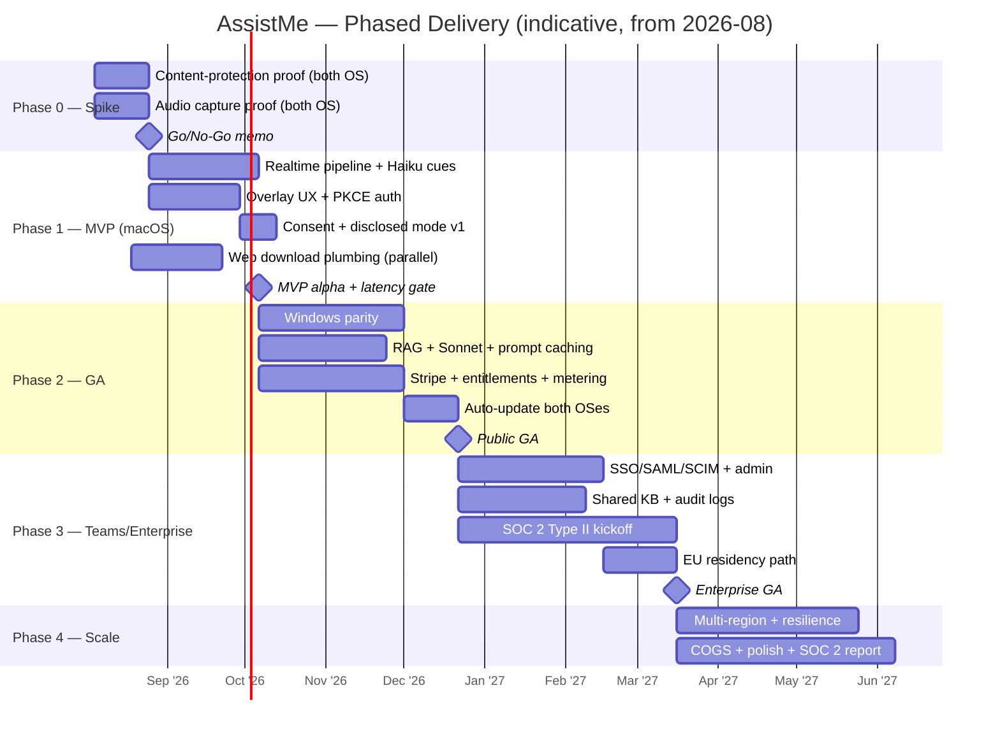

# Delivery Roadmap

> Status: Draft · Owner: Head of Product / Eng Lead · Last updated: 2026-07-29 · Related: [Executive summary](00-executive-summary.md) · [Product vision](01-product-vision.md) · [System architecture](02-system-architecture.md) · [Desktop app](10-desktop-app.md) · [Web landing](11-web-landing.md) · [AI pipeline](21-ai-pipeline.md) · [Backend services](20-backend-services.md) · [Subscriptions & entitlements](50-subscriptions-entitlements.md) · [DevOps & infra](60-devops-infrastructure.md) · [Scalability](70-scalability.md) · [Unit economics](71-unit-economics.md)

This document sequences how **AssistMe** (provisional brand; formerly Cue) gets built and taken to market. It is deliberately phase-gated: each phase has hard **exit criteria** that must be met before capital and headcount flow into the next. The two highest-risk unknowns — OS-level content-protection reliability and sub-1.2s live-cue latency — are front-loaded into a spike so we fail cheap if they fail.

Everything here is consistent with the canonical stack. Where another doc owns a topic, this roadmap links rather than restates.

---

## 1. Guiding principles

1. **De-risk the physics first.** Content protection (invisibility in Zoom/Meet/Teams/Webex) and end-to-end latency are existential. If either cannot be met, the product thesis changes. Phase 0 exists solely to prove them.
2. **One OS, one pipeline, end-to-end before breadth.** We build a complete vertical slice (macOS → live cue → overlay) before adding the second OS or personalization. A thin thing that fully works beats a wide thing that half-works.
3. **Responsible-use is a feature gate, not a bolt-on.** Consent model and disclosed mode ship with the first user-facing pipeline, not later. The [legal/compliance doc](01-product-vision.md#responsible-use) owns the policy; the roadmap treats it as a launch blocker.
4. **Website is a parallel track.** The [Next.js marketing site](11-web-landing.md) has no runtime dependency on the desktop pipeline (only on the release feed contract). It runs on its own timeline and can be "done" long before the app GA.
5. **Cost discipline from day one.** LLM/STT spend is COGS, not a rounding error. Metering and model routing (Haiku vs Sonnet vs Opus) land with the payments phase — see [unit economics](71-unit-economics.md) and [AI pipeline](21-ai-pipeline.md).

---

## 2. Phase overview

| Phase | Codename | Duration (est.) | Theme | Primary risk retired |
|-------|----------|-----------------|-------|----------------------|
| **0** | Spike | 4–6 weeks | Prove content protection + audio capture on both OSes | OS content-protection fragility |
| **1** | MVP | 10–12 weeks | Single-OS live-cue pipeline end-to-end + auth + web/download | Latency < 1.2s p95; core UX |
| **2** | GA | 12–16 weeks | Both OSes, RAG, subscriptions/payments, auto-update | Cross-platform parity; monetization |
| **3** | Teams/Enterprise | 12–16 weeks | SSO/SAML, shared KB, admin, SOC 2 start | Enterprise readiness; trust |
| **4** | Scale | ongoing | Multi-region, capacity, polish, margin | Reliability at scale; COGS |

Durations are engineering estimates for the team shapes in §6, not commitments. Phases overlap at the seams (e.g. Phase 2 payments work begins during Phase 1 hardening).

---

## 3. Phase details

### Phase 0 — Spike: "Can it even hide, and can we hear the room?"

**Goal:** Answer two binary questions with running code on **both macOS and Windows**, before writing any product. This is a throwaway spike; code quality is secondary to signal.

**Key deliverables**

- Minimal Electron shell with a transparent, frameless, always-on-top `BrowserWindow`.
- **Content protection proof:** `setContentProtection(true)` + macOS `NSWindowSharingType=none` + Windows `SetWindowDisplayAffinity(WDA_EXCLUDEFROMCAPTURE)`. Verify the overlay is invisible in Zoom, Google Meet, Microsoft Teams, and Webex screen share **and** in native full-screen screen recording (macOS ScreenCaptureKit recording, Windows Game Bar / OBS). See [desktop app](10-desktop-app.md#content-protection).
- **Window-enumeration proof:** confirm the overlay does not appear in screen-share picker source lists (the surfaces `getDisplayMedia`/picker UIs enumerate).
- **Audio capture proof:** system/loopback audio + mic captured on macOS (ScreenCaptureKit / Core Audio taps) and Windows (WASAPI loopback), producing a PCM stream we can inspect.
- A one-page **compatibility matrix** recording exactly which capture tools hide the overlay and which leak it, per OS version.

**Exit criteria (all must pass)**

- [ ] Overlay verified invisible across all four conferencing apps' share flows on **both** OSes, on current-minus-1 OS versions.
- [ ] Overlay absent from screen-share picker enumeration on both OSes.
- [ ] Loopback + mic audio captured on both OSes with a documented, non-hacky API path.
- [ ] Written go/no-go memo. If content protection leaks on a major target, escalate: either scope down (macOS-first, document the gap) or reconsider the thesis.

> **Gate decision:** No product investment until this memo says GO. Everything downstream assumes the physics work.

---

### Phase 1 — MVP: single-OS live-cue pipeline, end-to-end

**Goal:** A real user on **macOS** can sign in, start a session, and see AI cues stream into the protected overlay from live meeting audio, under the latency target. Prove the loop is useful and fast.

> **Why macOS first:** larger share of the interview/knowledge-worker early-adopter segment, and ScreenCaptureKit gives the cleanest system-audio path. Windows follows in Phase 2. (ADR below.)

**Key deliverables**

- **Desktop:** production overlay UX (teleprompter styling, global shortcuts, session start/stop), OAuth 2.0 Auth Code + PKCE via system browser with loopback/deep-link redirect, tokens in OS keychain. See [desktop app](10-desktop-app.md) and [authentication](40-authentication.md).
- **Realtime pipeline:** `ws-gateway` streams captured audio → `ai-orchestrator` → Deepgram streaming STT (with VAD) → Claude **`claude-haiku-4-5`** for low-latency cues → streamed tokens back to overlay. See [AI pipeline](21-ai-pipeline.md) and [backend services](20-backend-services.md).
- **Backend:** `api` (NestJS BFF) for sessions/profile; Postgres 16 (Neon to start) via Drizzle; Redis for sessions/rate-limit. See [data model](30-data-model.md).
- **Consent & disclosed mode v1:** in-app consent gate before first capture, "disclosed mode" toggle, acceptable-use acknowledgment. Launch blocker.
- **Web (parallel track):** [Next.js site](11-web-landing.md) with the 3D hero, a download page, and the download API route reading the signed release feed. Marketing copy can lag; the download plumbing cannot.
- **Release plumbing v1:** electron-builder → Apple Developer ID signing + notarization → artifacts + `latest-mac.yml` to R2/S3 + CDN. Auto-update can be stubbed until Phase 2 but the signed-install path must work.
- **Observability seed:** Sentry (desktop + backend), OpenTelemetry traces on the audio→cue path, a latency dashboard. See [observability](61-observability.md).

**Exit criteria**

- [ ] **Live cue end-to-end latency < 1.2s p95** measured on the real pipeline (mic/loopback → visible cue), with STT partial results < 300ms. This is the make-or-break number.
- [ ] Full happy path works for an external alpha user on macOS: install signed build → sign in (PKCE) → grant consent → run a session → get useful cues.
- [ ] Overlay stays invisible in a live Zoom/Meet/Teams/Webex share during a real session (regression of Phase 0 under production load).
- [ ] Backend API p99 < 200ms (excluding LLM).
- [ ] Consent gate + disclosed mode present and enforced; acceptable-use policy linked in-app.
- [ ] Web download page serves the signed macOS installer from the release feed.
- [ ] Crash-free session rate > 98% across the alpha cohort.

---

### Phase 2 — GA: both OSes, personalization, monetization

**Goal:** A polished, paid, cross-platform product. Windows reaches parity, RAG makes cues personal, Stripe turns it into a business, and auto-update keeps everyone current.

**Key deliverables**

- **Windows parity:** WASAPI loopback + mic capture, `SetWindowDisplayAffinity` content protection, full overlay UX. Second `latest.yml` feed; Windows OV/EV signing or Azure Trusted Signing. See [desktop app](10-desktop-app.md) and [DevOps](60-devops-infrastructure.md#code-signing).
- **RAG personalization:** upload resume / job description / knowledge base → Voyage AI embeddings → pgvector; context-assembly service builds prompts from transcript + RAG + profile; Anthropic prompt caching on the stable system prompt + user context. Introduce **`claude-sonnet-5`** for balanced-quality real-time answers on paid tiers. See [AI pipeline](21-ai-pipeline.md#rag).
- **Subscriptions & payments:** Stripe Checkout, Billing (subscriptions + usage-based metering for AI minutes/tokens), Customer Portal, Stripe Tax; webhooks → `entitlements` service as source of truth for feature gates; `billing-webhooks` service. 14-day Pro trial. Tiers: **Free / Pro $20 / Team $30/user / Enterprise**. See [subscriptions & entitlements](50-subscriptions-entitlements.md) and [payments](51-payments-stripe.md).
- **Usage metering → COGS control:** minutes/tokens metered per session, model routing enforced by tier (Free = Haiku only, no RAG). See [unit economics](71-unit-economics.md).
- **Auto-update live:** electron-updater consuming the CDN release feed on both OSes; staged/canary rollout of desktop releases.
- **History & summaries:** post-meeting notes/summaries persisted (Pro+), a legitimate note-taking use case.
- **Full marketing site:** pricing page wired to Checkout, docs, acceptable-use/compliance pages.

**Exit criteria**

- [ ] Windows meets the same content-protection and < 1.2s p95 latency bars as macOS.
- [ ] Paid conversion works end-to-end: trial → Checkout → entitlement flips feature gates within seconds of the webhook.
- [ ] Metered overage billing verified against Stripe test clocks; no unmetered AI spend paths.
- [ ] RAG measurably improves answer relevance in a blind eval vs. no-RAG baseline.
- [ ] Auto-update ships a new signed build to existing installs on both OSes without manual reinstall.
- [ ] Per-active-user COGS within the modeled envelope in [unit economics](71-unit-economics.md); gross margin trending to target.
- [ ] 99.9% uptime observed over a rolling 30-day window on prod.

---

### Phase 3 — Teams / Enterprise: trust, control, compliance

**Goal:** Sell to organizations. Enterprises need SSO, admin control, shared knowledge, an audit trail, and a credible compliance posture.

**Key deliverables**

- **Enterprise auth:** WorkOS SSO/SAML + SCIM provisioning; org/team RBAC; optional TOTP 2FA enforced by policy. See [authentication](40-authentication.md).
- **Shared knowledge base:** team-scoped RAG corpus with admin curation; role-gated access.
- **Admin console:** seat management, usage/spend visibility, policy controls (force disclosed mode, retention settings), audit logs.
- **SOC 2 Type II — start:** control implementation, evidence collection, vendor selection, and observation-period kickoff. Data-retention + deletion, opt-out of model training, DPA templates. See [DevOps](60-devops-infrastructure.md) and the compliance doc.
- **Data residency:** eu-west-1 region path for EU customers (GDPR); on-prem STT option scoped for Enterprise.
- **`claude-opus-5`** exposed for deep prep/analysis workflows (interview prep, call retros) on Team/Enterprise.

**Exit criteria**

- [ ] A design-partner enterprise onboards via SAML SSO + SCIM with zero manual user provisioning.
- [ ] Admin can enforce disclosed mode and retention policy org-wide; audit log captures session + admin events.
- [ ] Shared KB serves team members with correct access controls.
- [ ] SOC 2 Type II observation period underway with auditor engaged; DPA signable.
- [ ] EU data-residency path validated for a EU design partner.

---

### Phase 4 — Scale: multi-region, capacity, polish, margin

**Goal:** Run reliably and profitably at growth-stage volume. See [scalability](70-scalability.md) and [unit economics](71-unit-economics.md) for the models this phase executes against.

**Key deliverables**

- Multi-region active deployment (us-east-1 + eu-west-1), regional STT/LLM routing, capacity model driving autoscaling policies on ECS Fargate.
- Resilience: graceful STT fallback (Deepgram → AssemblyAI), LLM degradation modes, backpressure on `ws-gateway`, chaos/game-day testing.
- COGS optimization: prompt-cache hit-rate tuning, model-routing refinement, minute-accurate metering reconciliation.
- Product polish: latency p99 tightening, overlay UX refinements, accessibility hardening (see [design system](12-design-system.md#accessibility)).
- SOC 2 Type II report issued; continuous-compliance automation.

**Exit criteria (steady-state SLOs)**

- [ ] 99.9%+ uptime sustained; multi-region failover exercised in a game day.
- [ ] Latency and API SLOs held under 10× Phase 2 concurrent-session load.
- [ ] Gross margin at or above target with COGS scaling sub-linearly to revenue.
- [ ] SOC 2 Type II report available to prospects.

---

## 4. Deliverable → document map

| Capability | Owning doc(s) | First shipped in |
|-----------|---------------|------------------|
| Content-protected overlay | [10-desktop-app](10-desktop-app.md) | Phase 0/1 |
| Audio capture (both OSes) | [10-desktop-app](10-desktop-app.md) | Phase 0 (proof) / 1 (mac) / 2 (win) |
| Live STT + LLM cue stream | [21-ai-pipeline](21-ai-pipeline.md), [20-backend-services](20-backend-services.md) | Phase 1 |
| Auth (PKCE, keychain, RBAC) | [40-authentication](40-authentication.md) | Phase 1 (consumer) / 3 (enterprise) |
| RAG personalization | [21-ai-pipeline](21-ai-pipeline.md), [30-data-model](30-data-model.md) | Phase 2 |
| Subscriptions / metering | [50-subscriptions-entitlements](50-subscriptions-entitlements.md), [51-payments-stripe](51-payments-stripe.md) | Phase 2 |
| Auto-update + signing | [10-desktop-app](10-desktop-app.md), [60-devops-infrastructure](60-devops-infrastructure.md) | Phase 1 (sign) / 2 (update) |
| Marketing site + download | [11-web-landing](11-web-landing.md) | Phase 1 (parallel) |
| SSO/SAML/SCIM, admin, SOC 2 | [40-authentication](40-authentication.md), [60-devops-infrastructure](60-devops-infrastructure.md) | Phase 3 |
| Multi-region / scale | [70-scalability](70-scalability.md) | Phase 4 |
| Cost/margin model | [71-unit-economics](71-unit-economics.md) | Phase 2+ |

---

## 5. Milestone timeline

---

## 6. Team shape & hiring by phase

Lean and senior early; specialize as phases demand. Roles, not necessarily distinct headcount, in early phases.

| Role | Phase 0 | Phase 1 | Phase 2 | Phase 3 | Phase 4 |
|------|:-:|:-:|:-:|:-:|:-:|
| Founding/Principal eng (desktop + native) | 1 | 1 | 1 | 1 | 1 |
| Backend/realtime eng (Node/NestJS) | — | 1 | 2 | 2 | 3 |
| AI/ML eng (STT+LLM+RAG, latency/cost) | 0.5 | 1 | 1 | 1 | 2 |
| Frontend/web eng (Next.js, overlay React) | — | 1 | 1 | 1 | 2 |
| Windows native specialist | 0.5 (spike) | — | 1 | 1 | 1 |
| DevOps/SRE (Terraform, ECS, release) | — | 0.5 | 1 | 1 | 2 |
| Design (product + overlay UX) | — | 0.5 | 1 | 1 | 1 |
| Product / PM | 0.5 | 1 | 1 | 1 | 1 |
| Security/compliance (SOC 2, legal liaison) | — | — | 0.5 | 1 | 1 |
| GTM / growth / sales | — | — | 0.5 | 1 | 2 |
| **Approx. total** | **~3** | **~6–7** | **~10–11** | **~12–13** | **~16+** |

**Hiring notes**

- Phase 0 needs a **native desktop generalist** comfortable across macOS (ScreenCaptureKit/Core Audio) and Windows (WASAPI/Win32) — the single most important early hire.
- Windows specialist can be contract in Phase 0 (spike) and full-time in Phase 2 (parity).
- Security/compliance lead is a Phase 2→3 hire to run the SOC 2 program; don't start the observation clock without them.
- GTM ramps only after the MVP latency gate is passed — no point selling physics we haven't proven.

---

## 7. Risk register (prioritized)

Scored **Likelihood** × **Impact** (Low/Med/High). Ordered by combined severity.

### Technical

| # | Risk | L | I | Mitigation | Phase to retire |
|---|------|:-:|:-:|-----------|-----------------|
| T1 | **Content-protection fragility** — OS APIs leak the overlay into some capture path (new OS version, an app using a different capture route, OBS/hardware capture). Existential. | Med | High | Front-loaded Phase 0 proof across all four apps + native recorders; maintained per-OS-version compatibility matrix; CI regression on each OS update; conservative default (warn user if capture method unrecognized); scope-down fallback (mac-first) documented. | 0, monitored forever |
| T2 | **Live latency budget missed** (>1.2s p95). Kills the "live" value prop. | Med | High | Haiku for cues; streaming STT with VAD; prompt caching; co-locate `ws-gateway`/`ai-orchestrator`; measure on real pipeline as the Phase 1 gate; latency SLO dashboards. See [AI pipeline](21-ai-pipeline.md#latency-budget). | 1 |
| T3 | **Cross-platform audio capture** differences — loopback quirks, driver/permission edge cases, OS-version churn. | High | Med | Prove both OSes in Phase 0; abstract capture behind a common interface; wide device/OS test matrix; graceful mic-only degradation. | 0 (proof) / 2 (parity) |
| T4 | **LLM/STT cost overrun** eroding margin. | Med | High | Model routing by tier (Haiku default), Free tier caps, prompt caching, usage metering as source of truth, overage billing. See [unit economics](71-unit-economics.md). | 2 |
| T5 | **STT/LLM vendor outage or rate-limit** during live sessions. | Med | Med | Deepgram→AssemblyAI fallback; Claude retry/backoff + degraded modes; circuit breakers on `ai-orchestrator`. | 2 / 4 |
| T6 | **Code-signing / notarization breakage** blocking releases (cert expiry, Apple/MS policy change). | Med | Med | Automated signing in CI, cert-expiry alerts, Azure Trusted Signing option for Windows, staged rollout to catch bad builds. See [DevOps](60-devops-infrastructure.md#code-signing). | 1 |
| T7 | **Scale bottlenecks** on `ws-gateway`/DB under concurrent sessions. | Low | Med | Capacity model, autoscaling, Redis-backed backpressure, load tests at 10×. See [scalability](70-scalability.md). | 4 |

### Business

| # | Risk | L | I | Mitigation | Phase |
|---|------|:-:|:-:|-----------|-------|
| B1 | **Consent/recording-law exposure** — two-party-consent states, GDPR. Reputational + legal. | Med | High | Consent gate + disclosed mode ship in Phase 1; acceptable-use policy; jurisdiction-aware guidance; compliance doc owns depth; SOC 2 + DPA for enterprise. See [product vision — responsible use](01-product-vision.md#responsible-use). | 1, ongoing |
| B2 | **Platform policy risk** — Apple/Microsoft or conferencing vendors deprecate/restrict the capture-exclusion APIs, or app-store policy pushback. | Low | High | Distribute outside app stores (direct signed download + auto-update) to reduce store-policy dependency; frame content protection as the legitimate privacy capability it is (used by password managers, banking, DRM); track OS release notes; diversify capture strategy. | ongoing |
| B3 | **Category competition** — well-funded "AI copilot/interview assistant" entrants and incumbents (Otter, meeting-notetakers, stealth interview tools). | High | Med | Differentiate on latency, true screen-share invisibility, RAG personalization, and a defensible responsible-use/enterprise posture; move fast to GA; build brand around legitimate accessibility + prep use cases. See [product vision](01-product-vision.md#differentiation). | all |
| B4 | **Reputational / "cheating tool" framing** in press. | Med | Med | Lead positioning with prep/accessibility/sales-copilot; disclosed mode + AUP prominent; refuse to optimize for deceiving other parties; enterprise compliance story. | 1, ongoing |
| B5 | **Monetization mismatch** — usage-based COGS vs flat pricing squeezes margin, or trial→paid conversion underperforms. | Med | Med | Metered overage, tier caps, close COGS/margin tracking; iterate pricing off real data. See [unit economics](71-unit-economics.md) and [subscriptions](50-subscriptions-entitlements.md). | 2+ |
| B6 | **Enterprise trust gap** blocking deals without SOC 2. | Med | Med | Start SOC 2 Type II early in Phase 3; DPA, data-residency, training opt-out ready. | 3 |

---

## 8. Go-to-market sketch

GTM ramps **after** the Phase 1 latency gate. Positioning stays anchored to legitimate use cases — prep/confidence, sales & support copiloting, note-taking/summaries, and accessibility — and never optimizes for deceiving another party.

**Sequence**

1. **Phase 1 (private alpha):** hand-picked design users (job-seekers doing interview *prep*, SDRs, accessibility users). Goal = validate usefulness + latency in the wild, gather testimonials, harden the pipeline. No paid acquisition.
2. **Phase 2 (public GA, self-serve PLG):** the [marketing site](11-web-landing.md) is the top of funnel — 3D hero, clear legitimate positioning, free tier as the hook, 14-day Pro trial. Channels: content/SEO around interview prep + accessibility + sales enablement, product-led referral, targeted communities. Free → Pro conversion is the core loop.
3. **Phase 3 (sales-assisted for Team/Enterprise):** land-and-expand from self-serve Teams into Enterprise; SSO/SAML, admin, shared KB, SOC 2, and DPA are the unlock. Design-partner logos become proof.
4. **Phase 4 (scale demand):** paid acquisition against proven CAC/LTV, partnerships, and expansion into adjacent copilot verticals.

**Messaging pillars:** *fast* (sub-1.2s live cues), *private* (invisible to screen share — a standard OS privacy capability), *personal* (RAG over your resume/JD/KB), *responsible* (consent, disclosed mode, AUP, enterprise compliance).

**Website as a parallel track:** because [11-web-landing](11-web-landing.md) depends only on the [release-feed contract](11-web-landing.md#release-feed) (owned in `packages/types`), the site team can build, polish, and launch marketing content independent of desktop milestones — the only hard dependency is the download API reading a valid signed release.

---

## Open questions & risks

- **macOS-first vs. simultaneous launch:** Phase 1 commits to macOS. Is the go-to-market cost of a Windows gap acceptable, or should Phase 1 slip to ship both? Depends on Phase 0 findings on Windows capture effort.
- **Content-protection durability:** T1/B2 are the deepest existential risks. We have no control over OS vendors deprecating capture-exclusion APIs — what is the contingency product if that happens?
- **SOC 2 timing:** starting the observation period too early wastes evidence on an immature control set; too late blocks enterprise deals. The Phase 3 kickoff assumes we can staff a compliance lead in time.
- **Latency under real network conditions:** the < 1.2s p95 gate must be met on real user networks, not just in-datacenter. How much headroom do we budget for last-mile variance?
- **Pricing vs. COGS:** flat $20 Pro against metered LLM/STT COGS — is the modeled margin in [unit economics](71-unit-economics.md) robust to heavy-usage power users, or do we need hard minute caps sooner?
- **Duration estimates:** all phase durations are pre-team estimates and will move once headcount is real. Treat the gantt as sequencing, not dates.
