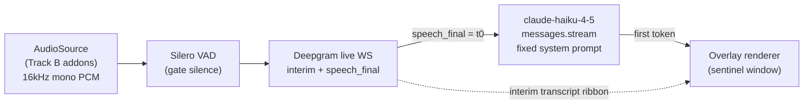
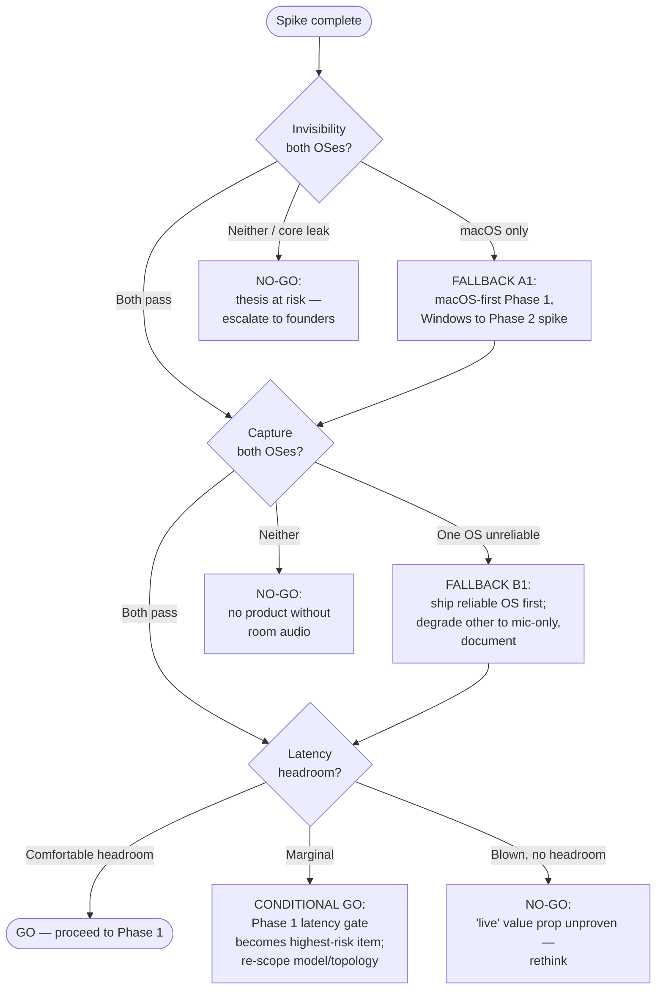

# Phase 0 Spike Plan — "Can it hide, and can we hear the room?"

> Status: Draft · Owner: Founding/Principal Eng (Desktop + Native) · Last updated: 2026-07-29 · Related: [Roadmap](80-roadmap.md) · [Desktop app](10-desktop-app.md) · [AI pipeline](21-ai-pipeline.md) · [System architecture](02-system-architecture.md) · [Decision record](04-decision-record.md) · [Remediation plan](05-remediation-plan.md)

This document expands **Phase 0** of the [Roadmap](80-roadmap.md#phase-0--spike-cant-it-even-hide-and-can-we-hear-the-room) into an executable spike plan. Phase 0 exists to answer **two binary questions with running code on both macOS and Windows** before any product capital flows into Phase 1:

- **(A) Invisibility.** Is the screen-capture-excluded overlay reliably **invisible** across Zoom / Google Meet / Microsoft Teams / Webex screen share **and** native OS recorders, on macOS **and** Windows?
- **(B) Audibility + latency.** Can we reliably capture **system loopback + microphone** audio and feed it through a **minimal end-to-end thread** (capture → Deepgram STT → `claude-haiku-4-5` cue → overlay) inside the **server-controllable latency budget**?

If either answer is "no" on a primary target and no acceptable fallback exists, the product thesis changes. This is throwaway code: **signal over quality.** The spike proves physics; it builds nothing that ships.

Everything here is consistent with the canonical stack and the [Decision record](04-decision-record.md). The spike deliberately does **not** exercise the production topology (no `ws-gateway`/`ai-orchestrator` split, no gRPC bidi, no Redis) — it collapses the architecture into one process to isolate the two physics risks. See §7 for how spike latency maps to the real [two-budget model](21-ai-pipeline.md#latency-budget).

---

## 1. What the spike must decide

| # | Question | Pass looks like | Fail looks like |
|---|----------|-----------------|-----------------|
| **A** | Overlay invisible in all four conferencing apps' share flows + OS recorders, both OSes, current & current-1 OS versions | Sentinel pattern **absent** from every captured/shared frame on every gate target | Sentinel **visible** (or partially visible) in any gate target |
| **B1** | System loopback + mic captured via a documented, non-hacky API path, both OSes | Clean 16 kHz mono PCM from both channels, no driver shims, no undocumented calls | Requires a virtual-audio-device install, kernel extension, or reverse-engineered API |
| **B2** | Minimal thread meets the latency target | Median endpointing → first cue token comfortably under the server-controllable budget on representative hardware | Median blows the budget with no obvious headroom |

The spike is **de-risking, not optimization.** We need a confident GO/NO-GO, plus a documented fallback per platform if a target leaks or a capture path is unreliable.

---

## 2. Scope — explicitly in and out

| In scope (the two physics risks + the thread that proves them) | Out of scope (deferred to Phase 1+; do NOT build) |
|---|---|
| Transparent, frameless, always-on-top `BrowserWindow` with `setContentProtection(true)` + native affinity ([desktop §5](10-desktop-app.md#content-protection)) | **Auth** — no PKCE, no keychain, no login. Hardcode a dev API key in an untracked `.env` |
| macOS `NSWindowSharingType=none`; Windows `SetWindowDisplayAffinity(WDA_EXCLUDEFROMCAPTURE)` | **Billing / entitlements / Stripe** — nothing |
| Window-enumeration proof (overlay absent from share-picker source lists) | **RAG** — no Voyage, no pgvector, no document upload; the Haiku prompt is a fixed string |
| System-loopback + mic capture → 16 kHz mono PCM, both OSes | **Multi-tenant / production backend** — no `ws-gateway`, no `ai-orchestrator`, no Postgres/Redis |
| A **minimal single-process thread**: capture → Deepgram live STT → `claude-haiku-4-5` → overlay render | **Production capture** — spike records **test meetings only** (spike accounts, colleagues, or self-joined empty meetings). No real customer/interview audio |
| Latency instrumentation on the thread (endpointing → first token → paint) | **Content-protection CI harness** ([desktop §5.3](10-desktop-app.md#verification)) — manual QA lab is enough for the spike |
| Compatibility matrix across apps + OS versions | **Auto-update, code signing, notarization** — run unsigned dev builds locally |
| A throwaway spike repo/branch + a findings report | **Overlay visual design** — a `<div>` with monospace text is fine |

**Test-meeting rule (hard).** All capture during the spike is against meetings the team controls: two spike accounts talking to each other, or a solo-joined empty room playing a known audio file. No production or real third-party meeting audio touches the spike. This keeps the spike clear of the consent/recording concerns that are out of scope for this planning pass and owned elsewhere.

---

## 3. Team, roles & timeboxes

Phase 0 team shape from the [Roadmap §6](80-roadmap.md#6-team-shape--hiring-by-phase): ~3 people. Timeboxes are **hard** — the spike is designed to fail cheap, so a track that can't hit its box escalates rather than grinds.

| Owner role | Spike responsibility | Timebox |
|---|---|---|
| **Principal Eng — Desktop + Native** (lead) | Track A (content protection, both OSes), Electron shell, macOS native audio addon (ScreenCaptureKit / Core Audio taps), overall GO/NO-GO memo | Weeks 1–5 |
| **Windows Native Specialist** (contract, per [Roadmap §6](80-roadmap.md#hiring-notes)) | Track A Windows verification, Windows audio addon (WASAPI loopback + mic), Windows compatibility matrix | Weeks 1–4 |
| **AI/ML Eng** (0.5 FTE) | Track C minimal thread (Deepgram live client, `claude-haiku-4-5` call, latency instrumentation), latency analysis vs the [budget](21-ai-pipeline.md#latency-budget) | Weeks 2–5 |
| **Product / PM** (0.5 FTE) | QA-lab logistics (physical machines, OS versions, conferencing accounts), compatibility-matrix bookkeeping, findings-report co-author | Weeks 1–6 |

A shared **QA lab** — physical macOS and Windows machines on current and current-1 OS versions, plus licensed Zoom/Meet/Teams/Webex accounts — is a week-1 blocker owned by PM. VMs are insufficient for content-protection testing: GPU/compositor behavior differs, and `WDA_EXCLUDEFROMCAPTURE` / ScreenCaptureKit exclusion must be verified on real hardware compositors.

---

## 4. Track A — Content-protection / invisibility proof

**Goal:** prove the overlay is excluded from every capture path we care about, or find exactly where it leaks.

### 4.1 Tasks

| Task | Owner | Box | Output |
|---|---|---|---|
| A0 — Electron shell: transparent, frameless, always-on-top window rendering a **sentinel** (a high-contrast QR + timestamp so a leaked frame is unambiguous) | Principal | W1 | `apps/spike-overlay` |
| A1 — Wire `setContentProtection(true)` + re-assert on `show`/display change ([desktop §5.1](10-desktop-app.md#the-three-mechanisms)) | Principal | W1 | shell + re-assert hooks |
| A2 — macOS: confirm `NSWindowSharingType=none`; verify against Zoom/Meet/Teams/Webex + QuickTime + `screencapture` + OBS (SCK source) | Principal | W2 | mac matrix rows |
| A3 — Windows: `SetWindowDisplayAffinity(WDA_EXCLUDEFROMCAPTURE)` via a minimal N-API addon; verify against the same apps + Game Bar + Snipping Tool + OBS (Graphics.Capture & Display Capture) | Win specialist | W2–W3 | win matrix rows |
| A4 — Window-enumeration proof: confirm overlay is **absent** from each app's share-picker source list and from `getDisplayMedia`-style pickers | both | W3 | enumeration rows |
| A5 — Edge cases: multi-monitor, display hotplug, full-screen meeting mode z-order ([desktop OQ #6](10-desktop-app.md#open-questions--risks)), current-1 OS versions | both | W3–W4 | edge-case rows |
| A6 — Fill the compatibility matrix (§4.3); flag every leak | PM | W4 | matrix |

### 4.2 Verification method

For each target: show the overlay with the sentinel, start a capture/share via that target's own path, grab a frame, and assert the sentinel is **absent**. Manual for the spike (the automated frame-diff harness is a Phase 1 [release gate](10-desktop-app.md#verification), not a spike deliverable). Every result — pass, leak, or partial — is recorded with OS build number and app version.

```ts
// apps/spike-overlay/src/main/overlay.ts — spike shell (throwaway, illustrative)
import { BrowserWindow } from 'electron';

export function createSentinelOverlay(): BrowserWindow {
  const win = new BrowserWindow({
    width: 480, height: 320, frame: false, transparent: true,
    alwaysOnTop: true, skipTaskbar: true, hasShadow: false,
    backgroundColor: '#00000000',
    webPreferences: { sandbox: true, contextIsolation: true, nodeIntegration: false },
  });
  win.setAlwaysOnTop(true, 'screen-saver');
  win.setVisibleOnAllWorkspaces(true, { visibleOnFullScreen: true });
  if (process.platform === 'darwin') win.setHiddenInMissionControl(true);

  const assert = () => {
    win.setContentProtection(true);          // maps to NSWindowSharingType=.none / WDA on win
    if (process.platform === 'win32') assertDisplayAffinity(win.getNativeWindowHandle());
  };
  assert();
  win.on('show', assert);                     // affinity can be lost on reparenting
  return win;
}
```

### 4.3 Compatibility matrix (template — fill during the spike)

| Target | Capture path | macOS 15 | macOS 14 | Win 11 24H2 | Win 10 22H2 | Gate? |
|---|---|:-:|:-:|:-:|:-:|:-:|
| Zoom — full-screen share | app native | ☐ | ☐ | ☐ | ☐ | ✅ |
| Zoom — specific-window share | app native | ☐ | ☐ | ☐ | ☐ | ✅ |
| Google Meet — Chrome tab + screen | `getDisplayMedia` | ☐ | ☐ | ☐ | ☐ | ✅ |
| Microsoft Teams — desktop + web | app native | ☐ | ☐ | ☐ | ☐ | ✅ |
| Cisco Webex — screen share | app native | ☐ | ☐ | ☐ | ☐ | ✅ |
| OS full-screen recorder | `screencapture` / Game Bar | ☐ | ☐ | ☐ | ☐ | ✅ |
| QuickTime / Snipping Tool | native | ☐ | ☐ | ☐ | ☐ | ✅ |
| OBS — modern path | SCK / Graphics.Capture | ☐ | ☐ | ☐ | ☐ | ✅ |
| Share-picker enumeration | source list | ☐ | ☐ | ☐ | ☐ | ✅ |
| Legacy path (risk) | `PrintWindow` / GDI `BitBlt` | — | — | ☐ | ☐ | ℹ️ |

☑ = sentinel absent (pass) · ✗ = sentinel visible (leak) · ℹ️ = documented-as-risky, not a gate ([desktop §5.2](10-desktop-app.md#known-limitations-honest)).

---

## 5. Track B — Audio capture proof

**Goal:** prove we can capture both audio channels through a documented, maintainable API on both OSes — no virtual-audio-device installs, no kernel extensions, no undocumented calls.

### 5.1 Tasks

| Task | Owner | Box | Output |
|---|---|---|---|
| B0 — macOS system loopback: ScreenCaptureKit `SCStream` audio; evaluate Core Audio process taps (14.4+) as the permission-lighter path ([desktop OQ #3](10-desktop-app.md#open-questions--risks)) | Principal | W2 | mac loopback PCM |
| B1 — macOS mic: `AVCaptureDevice` / Core Audio; TCC Microphone + Screen Recording permission flow ([desktop §6.3](10-desktop-app.md#permissions-macos-tcc--windows-privacy)) | Principal | W2 | mac mic PCM + perm notes |
| B2 — Windows system loopback: WASAPI `AUDCLNT_STREAMFLAGS_LOOPBACK` | Win specialist | W2 | win loopback PCM |
| B3 — Windows mic: WASAPI capture on default comms device | Win specialist | W2–W3 | win mic PCM |
| B4 — Resample both channels → **16 kHz mono Int16** ([desktop §6.1](10-desktop-app.md#platform-capture-backends)); dump to WAV to eyeball fidelity | both | W3 | golden WAVs |
| B5 — Common TS interface over both native addons (`AudioSource`) so the thread stays platform-agnostic | Principal | W3 | `AudioSource` impl |

The addons produce the [canonical `AudioChunk`](10-desktop-app.md#platform-capture-backends) shape so Track C can consume them unchanged:

```ts
// spike reuses the canonical shape from packages/types/src/audio.ts
interface AudioChunk {
  channel: 'system' | 'mic';
  seq: number;            // monotonic per channel
  timestampMs: number;    // capture clock — the t-source for latency math
  sampleRate: 16000;
  pcm: Int16Array;        // mono, 16-bit
}
```

### 5.2 What "documented, non-hacky" means (acceptance bar)

- **macOS:** ScreenCaptureKit or Core Audio taps only. If system-audio capture forces the Screen Recording TCC grant, that friction is **recorded** (it's an onboarding risk, [desktop OQ #2](10-desktop-app.md#open-questions--risks)) but does **not** fail the spike — it's a supported API. A requirement for a virtual audio device (e.g. BlackHole) **does** fail it.
- **Windows:** WASAPI loopback (no special permission) + WASAPI mic (Microphone privacy setting). No third-party driver.

---

## 6. Track C — Minimal end-to-end thread (the latency proof)

**Goal:** stand up the thinnest possible `capture → STT → cue → overlay` loop and **measure** it against the [server-controllable budget](21-ai-pipeline.md#latency-budget). This is the Phase 1 [latency gate](80-roadmap.md#phase-1--mvp-single-os-live-cue-pipeline-end-to-end) in embryo — proving the number is *reachable* before we build the real pipeline that must hold it under load.



### 6.1 Tasks

| Task | Owner | Box | Output |
|---|---|---|---|
| C0 — Deepgram live client: `interim_results=true`, `endpointing=200`, `speech_final` marks t0 ([AI §10](21-ai-pipeline.md#stt-layer--deepgram-with-assemblyai-fallback)) | AI/ML | W2–W3 | STT client |
| C1 — `claude-haiku-4-5` call via `@anthropic-ai/sdk`, `stream: true`, `thinking: { type: "disabled" }`, `max_tokens: 160`, **fixed** system prompt (no RAG) ([AI §6.1](21-ai-pipeline.md#request-shape-live-cue)) | AI/ML | W3 | cue client |
| C2 — Overlay renders streamed tokens incrementally (paint on **first** token) | AI/ML + Principal | W3–W4 | wired thread |
| C3 — Latency instrumentation: stamp `t0 = speech_final`, `t1 = first Claude token`, `t2 = first token painted`; log per utterance | AI/ML | W4 | latency log |
| C4 — Run against a fixed test-audio script; collect ≥ 200 utterances per OS; compute p50/p95 | AI/ML | W4–W5 | latency dataset |

```ts
// apps/spike-thread/src/cue.ts — spike Haiku call (throwaway, illustrative)
import Anthropic from '@anthropic-ai/sdk';
const anthropic = new Anthropic(); // key from untracked .env — spike only

export async function firstCueToken(transcriptTail: string): Promise<number> {
  const t0 = performance.now();
  const stream = anthropic.messages.stream({
    model: 'claude-haiku-4-5',
    max_tokens: 160,
    thinking: { type: 'disabled' },
    system: SPIKE_FIXED_PROMPT,            // no RAG, no prompt-cache tuning in the spike
    messages: [{ role: 'user', content: transcriptTail }],
  });
  for await (const ev of stream) {
    if (ev.type === 'content_block_delta') return performance.now() - t0; // TTFT
  }
  return performance.now() - t0;
}
```

### 6.2 How spike latency maps to the real two-budget model

The spike is single-process, so it has **no `ws-gateway` egress split** — the canonical trace-split point and the boundary of the SLO ([AI §4](21-ai-pipeline.md#latency-budget)). It therefore cannot measure budget (a) or budget (b) directly. What it measures is a **directional proxy**:

| Spike measurement | Real-model analogue | Interpretation |
|---|---|---|
| `t0 → t1` (endpointing → first Claude token) | The dominant server-controllable hops: STT finalize + assembly + **Claude TTFT** ([AI §4](21-ai-pipeline.md#latency-budget), hops 6–7) | The largest single line in budget (a). If this is already near ~900 ms in the spike, the real pipeline (which adds gRPC + gateway hops) cannot hold the SLO. |
| `t0 → t2` (endpointing → painted token) | A local stand-in for budget (b), minus the real client↔region network | Directional only — the spike runs on one machine, so the WS downlink is absent. |

**Spike pass bar:** median `t0 → t1` sits **comfortably below the ~900 ms server-controllable target** with visible headroom for the hops the spike omits (gRPC bidi, gateway ingress/egress, real network), because Phase 1 must fold **cold-cache cues into the p95** ([AI §4](21-ai-pipeline.md#latency-budget)) and the spike's fixed prompt is always effectively cold. We are proving the number is *reachable*, not *held* — holding it under production topology and load is the [Phase 1 exit gate](80-roadmap.md#phase-1--mvp-single-os-live-cue-pipeline-end-to-end). We report p50 and p95 but judge GO on p50 headroom, since the spike deliberately lacks the caching and co-location that tighten the real p95.

---

## 7. Acceptance criteria (all must pass for GO)

### Track A — invisibility
- [ ] **A-1** Overlay sentinel **absent** from all four conferencing apps' share flows (full-screen + specific-window/tab), on both OSes, on current & current-1 OS versions.
- [ ] **A-2** Sentinel absent from OS full-screen recorders (macOS `screencapture`/ScreenCaptureKit, Windows Game Bar) and from OBS's modern capture path on both OSes.
- [ ] **A-3** Overlay absent from every share-picker source-enumeration list.
- [ ] **A-4** Invisibility holds across multi-monitor, display hotplug (affinity re-asserted), and full-screen meeting z-order.
- [ ] **A-5** Every leak (legacy `PrintWindow`/`BitBlt`, RMM/remote-desktop, pre-2004 Windows) is **enumerated and characterized** in the matrix, not silently ignored.

### Track B — capture
- [ ] **B-1** System loopback + mic captured on **both** OSes via a documented API (no virtual device, no kext, no undocumented call).
- [ ] **B-2** Both channels resampled to clean 16 kHz mono PCM; golden WAVs are intelligible.
- [ ] **B-3** macOS permission path (TCC Microphone + Screen Recording) documented, including the re-prompt/relaunch friction.

### Track C — latency
- [ ] **C-1** The thread produces a real Haiku cue from live test-meeting audio on both OSes.
- [ ] **C-2** Median `t0 → t1` (endpointing → first Claude token) is **comfortably below the ~900 ms server-controllable target** with headroom for the omitted production hops (§6.2), over ≥ 200 utterances per OS.
- [ ] **C-3** Interim STT transcript surfaces < 300 ms (the ribbon signal, pre-t0 per [AI §4](21-ai-pipeline.md#latency-budget)).

---

## 8. GO / NO-GO gate & per-platform fallbacks

The spike ends with a written **go/no-go memo** (§9). No Phase 1 investment until it says GO. The gate is not simply "all checkboxes green" — it's a **decision with documented fallbacks** when a target partially fails.



### 8.1 Fallbacks per platform

| Failure | Fallback | Rationale |
|---|---|---|
| **Content protection leaks on Windows** (a gate target) but holds on macOS | **A1 — macOS-first.** Ship Phase 1 on macOS only (already the [planned Phase 1 OS](80-roadmap.md#phase-1--mvp-single-os-live-cue-pipeline-end-to-end)); re-spike Windows content protection in Phase 2 with the [Windows specialist full-time](80-roadmap.md#hiring-notes). Document the Windows gap honestly. | macOS-first is already the roadmap; a Windows leak delays parity, not the product. |
| **Content protection leaks on macOS** (a gate target) | **NO-GO / escalate.** macOS is the Phase 1 launch OS; a leak there is existential (risk [T1](80-roadmap.md#technical) / [B2](80-roadmap.md#business)). Investigate whether a specific app version/path is the culprit before declaring thesis-dead. | The core promise is invisibility on the launch OS. |
| **Loopback capture unreliable on one OS** (driver/permission churn, dropouts) | **B1 — degrade to mic-only on that OS**, ship the reliable OS first, and document the loopback gap. Mic-only still transcribes the user; the other party's audio is the loss. Abstract capture behind `AudioSource` so a better backend slots in later ([desktop §6.1](10-desktop-app.md#platform-capture-backends), risk [T3](80-roadmap.md#technical)). | A partial capture story on one OS is survivable; total loss is not. |
| **Loopback unreliable on both OSes** | **NO-GO.** Room audio is the product; without it there is no copilot. | Core capability. |
| **Latency marginal** (median near the target, thin headroom) | **Conditional GO.** Proceed, but the [Phase 1 latency gate](80-roadmap.md#phase-1--mvp-single-os-live-cue-pipeline-end-to-end) becomes the top-ranked risk; pre-commit mitigations: co-locate services (already canonical, [ADR-007](02-system-architecture.md#41-latency-budget-two-budgets-one-start-point)), aggressive prompt-caching ([AI §6](21-ai-pipeline.md#anthropic-messages-api--prompt-caching)), and confirm region-pinned STT. | The spike lacks caching + co-location; the real pipeline has headroom the spike doesn't. |
| **Legacy/RMM capture path leaks** (non-gate) | **Accept + document** as an enumerated limitation ([desktop §5.2](10-desktop-app.md#known-limitations-honest)). Not a GO blocker. | These are documented-as-risky, same as password-manager apps. |

---

## 9. Deliverables

1. **Throwaway spike repo/branch.** A `spike/phase-0` branch (or a separate `cue-spike` repo — kept **out** of the production monorepo so throwaway code never leaks into `main`). Contains `apps/spike-overlay` (Track A), the native audio addons + `AudioSource` (Track B), and `apps/spike-thread` (Track C). Explicitly exempt from the [<700 LOC / code-splitting standards](10-desktop-app.md#75-renderer-code-organization-house-standards) — signal over quality. Deleted or archived after the memo; **no** spike code is promoted to Phase 1 without a rewrite.
2. **Compatibility matrix** (§4.3), fully filled, with OS build + app version per cell.
3. **Latency dataset** (§6) — raw per-utterance `t0/t1/t2` logs + a p50/p95 summary per OS.
4. **Golden capture WAVs** (§5) — loopback + mic samples per OS, for eyeballing fidelity.
5. **Go/No-Go memo** — the single decision artifact: the two binary answers, the matrix summary, the latency verdict against §6.2, the recommended fallback (if any), and a clear **GO / CONDITIONAL GO / NO-GO** for Phase 1. Co-authored by the Principal Eng and PM; this is what gates Phase 1 funding per [Roadmap §3](80-roadmap.md#phase-0--spike-cant-it-even-hide-and-can-we-hear-the-room).

---

## 10. Timebox (Gantt)

```mermaid
gantt
    title Phase 0 Spike — 6-week timebox (from 2026-08-04)
    dateFormat  YYYY-MM-DD
    axisFormat  %d %b

    section Setup
    QA lab: machines, OS versions, conf accounts   :s0, 2026-08-04, 1w

    section Track A — Invisibility
    Electron shell + sentinel + setContentProtection :a0, 2026-08-04, 1w
    macOS verification (4 apps + recorders)          :a1, after a0, 1w
    Windows affinity addon + verification            :a2, 2026-08-11, 2w
    Enumeration + edge cases + matrix                :a3, after a2, 1w

    section Track B — Capture
    macOS loopback + mic (SCK / Core Audio)          :b1, 2026-08-11, 1w
    Windows loopback + mic (WASAPI)                  :b2, 2026-08-11, 2w
    Resample 16kHz + AudioSource interface           :b3, after b2, 1w

    section Track C — Latency thread
    Deepgram live client                             :c0, 2026-08-11, 1w
    Haiku cue + overlay wire                          :c1, after c0, 1w
    Instrument + measure (>=200 utt/OS)              :c2, after c1, 2w

    section Gate
    Findings report + Go/No-Go memo                  :g0, 2026-09-08, 1w
    GO / NO-GO decision                              :milestone, m0, 2026-09-12, 0d
```

Six-week envelope (the [Roadmap §2](80-roadmap.md#2-phase-overview) upper bound); the core physics answers land by end of week 4, leaving a two-week buffer for the latency dataset and a clean memo. If Track A produces a core-OS leak in week 2, escalate immediately — do not spend the remaining weeks on a dead thesis.

---

## Open questions & risks

1. **Core Audio taps vs ScreenCaptureKit for macOS system audio.** Taps (14.4+) may avoid the Screen Recording TCC grant for audio-only capture, cutting onboarding friction ([desktop OQ #3](10-desktop-app.md#open-questions--risks)), but the OS-version floor is higher. The spike should try both and record the trade-off; the primary/fallback decision can carry into Phase 1.
2. **Single-process spike understates real latency.** The spike omits the gRPC bidi hop, gateway ingress/egress, and the client↔region network ([AI §4](21-ai-pipeline.md#latency-budget)). A comfortable spike median is necessary but not sufficient — the [Phase 1 gate](80-roadmap.md#phase-1--mvp-single-os-live-cue-pipeline-end-to-end) is the real test. Guard against over-confidence from a green spike.
3. **OS-version churn during the spike.** A macOS/Windows point release mid-spike could change capture behavior (risk [T1](80-roadmap.md#technical)). Pin the tested builds in the matrix; a late OS update is a note, not a re-run, unless it flips a gate cell.
4. **Test-meeting realism.** Empty self-joined rooms may not exercise every app's share code path (e.g. Teams "present" vs "share screen"). PM should script the exact share action per app so the matrix is comparable and complete.
5. **Deepgram account/region for the spike.** The latency proxy depends on reaching Deepgram from the spike machine's network. Use a region-appropriate Deepgram endpoint and note the network path, since a mis-located STT endpoint would inflate `t0 → t1` and give a falsely pessimistic reading.
6. **Contract Windows specialist ramp.** The Windows native work (A3, B2) sits on a contract hire ([Roadmap §6](80-roadmap.md#hiring-notes)); if that hire slips, Windows Track A/B slip with it and the fallback is a macOS-only spike outcome with Windows deferred to a Phase 2 spike.
</invoke>
