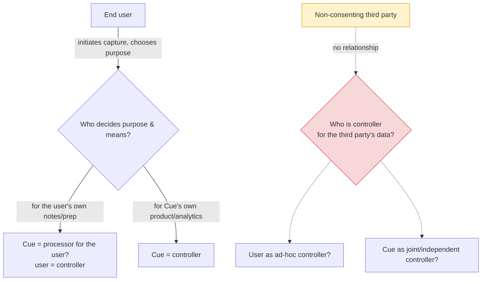
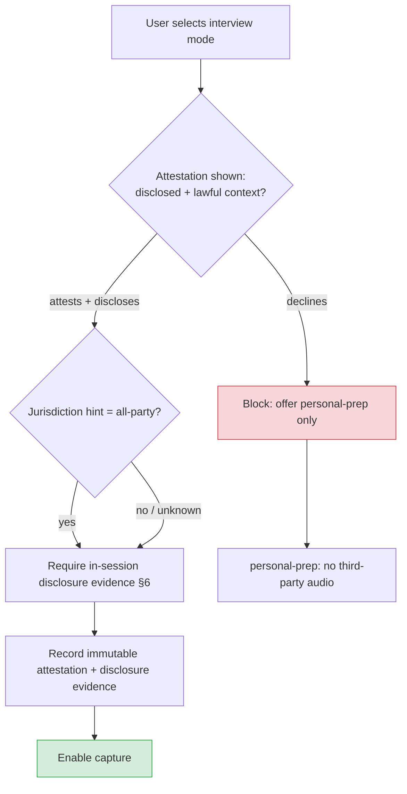
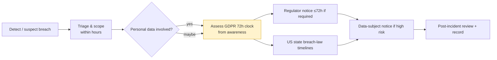

# Legal, Compliance & Responsible-Use Framework

> Status: Draft (scaffolding — pending counsel) · Owner: Founder / Head of Legal (interim) · Last updated: 2026-07-29 · Related: [Product vision](01-product-vision.md) · [Authentication & consent](40-authentication.md) · [Roadmap](80-roadmap.md) · [Data model](30-data-model.md) · [AI pipeline](21-ai-pipeline.md) · [Desktop app](10-desktop-app.md) · [Payments & Stripe](51-payments-stripe.md) · [Design system](12-design-system.md) · [Observability](61-observability.md) · [Audit summary](audits/00-audit-summary.md) · [Legal audit](audits/05-legal-compliance-audit.md)

---

> # ⚠️ DRAFT — NOT LEGAL ADVICE
>
> **Every substantive position in this document is a placeholder that MUST be reviewed and completed by qualified outside counsel before any production audio capture.** Nothing here is a legal conclusion, and nothing here has been reviewed by a lawyer. Statute names, state lists, consent rules, lawful bases, and retention periods are **engineering placeholders to be verified** — they are written so that the product, data model, and roadmap can be built against a concrete shape, not because they are known to be correct. Where this document says a thing "is" the law, read it as "is asserted, **to be verified by counsel**." Do not rely on this document for any legal purpose. Do not ship any feature this document gates until the corresponding "Counsel sign-off required" item (§13) is signed off in writing.

---

## 1. Purpose & scope

This document is the internal engineering scaffolding for Cue's legal and compliance posture. It exists because the [legal audit](audits/05-legal-compliance-audit.md) rated the plan **46/100** and flagged, as its single most important finding (L2), that *"every hard legal question is forwarded to `90-legal-compliance.md`, which does not exist."* This file resolves the *"does not exist"* half. It **does not** resolve the *"is correct and reviewed"* half — that is counsel's job (§13).

**In scope:** recording-consent framework, GDPR/data-protection framework, the Acceptable-Use Policy (AUP) and its product gating, the sub-processor register and DPA checklist, consent-record integrity requirements, retention & deletion, breach-notification runbook, baseline legal pages checklist, trademark clearance, and the accessibility conformance claim.

**Out of scope (owned elsewhere):** the identity/token model and capture mechanics ([40-authentication.md](40-authentication.md)); the physical data schema ([30-data-model.md](30-data-model.md)); PCI scope details ([51-payments-stripe.md](51-payments-stripe.md)); the model-routing and training-opt-out mechanics ([21-ai-pipeline.md](21-ai-pipeline.md)).

### 1.1 How this document gates the roadmap

The [audit summary](audits/00-audit-summary.md) marks remediation items **1–4 as gating** — *"no production audio capture is safe until they are complete."* Those four items are almost entirely owned by this document. The mapping to [80-roadmap.md](80-roadmap.md) phases:

| This doc | Roadmap gate | Blocks | Must complete before |
|----------|-------------|--------|----------------------|
| §2 Consent matrix + strictest-default | Phase 1 (before first capture) | Any third-party audio capture | First production capture |
| §3 GDPR lawful-basis & roles | Phase 1 | EU-touching capture; EU launch | First EU-touching capture |
| §4 AUP + `interview_live` gating | Phase 1 | Live interview/exam session modes | Live-cue GA |
| §5 Sub-processor DPAs / ZDR | Phase 1 | Any egress of audio/transcript to vendors | First production capture |
| §6 Consent-record integrity | Phase 1 | Legally defensible capture | First production capture |
| §7 Retention & deletion | Phase 1→2 | Data-subject rights fulfilment | GA |
| §8 Breach runbook | Phase 2 | Enterprise/regulated deals | SOC 2 readiness |
| §9 Baseline legal pages | Phase 1 | Any public sign-up | Public beta |
| §10 Trademark clearance | Phase 0 | Brand spend | Brand/marketing spend |
| §11 WCAG 2.2 AA + VPAT | Phase 2→3 | The accessibility *claim* | Any public accessibility claim |

> **Hard gate.** Per [40-authentication.md §5.3](40-authentication.md), `api` "blocks capture until [the consent record] exists." This document defines *what makes that record legally load-bearing*. Until §2, §5, and §6 are signed off (§13), the capture path must remain behind a feature flag defaulted **off** in all production environments.

---

## 2. Recording-consent framework

### 2.1 Product default: strictest (all-party) consent

Cue captures **both sides** of a conversation — the user's microphone *and* system/loopback audio, i.e. the other party's voice ([10-desktop-app.md](10-desktop-app.md), [audit L1](audits/05-legal-compliance-audit.md)). Because two-party/all-party rules turn on the location of **every** party — which the app cannot reliably determine (see [40-authentication.md §5.3](40-authentication.md) `jurisdiction_hint`, and [audit L14](audits/05-legal-compliance-audit.md)) — the product default is:

> **DECISION (ADR-L1): Default to all-party consent everywhere.** Capture of the other party's audio is blocked unless the session is in **disclosed mode** or the user affirmatively attests a lawful one-party context. The `jurisdiction_hint` may only *tighten* the rule, never relax it. Downgrading to one-party requires a **logged, immutable attestation** (§6). This overrides the current `sessions.disclosed = false` default flagged in [audit L5](audits/05-legal-compliance-audit.md) — the schema default must become "capture blocked until disclosed/attested."
>
> - **Rationale:** The app cannot know where the other party sits; defaulting to the permissive rule silently places users in a potentially criminal configuration. Opt *down* with evidence, never opt *up* by default.
> - **Status:** Placeholder — **to be verified and finalized by counsel.**
> - **Capture mechanics:** owned by [40-authentication.md §5.3](40-authentication.md); this doc owns the *policy* the mechanics enforce.

### 2.2 Jurisdiction matrix (skeleton — TO BE VERIFIED BY COUNSEL)

> The consent rules, statute citations, and the U.S. state list below are **placeholders commonly cited in secondary sources**. They are **not** authoritative and MUST be independently verified by counsel per jurisdiction before any capture is enabled there. The federal U.S. Wiretap Act (18 U.S.C. §2511) is commonly described as one-party but does **not** preempt stricter state law — verify.

| Jurisdiction | Consent rule (to verify) | Statute (to verify) | Product behavior required |
|--------------|--------------------------|---------------------|---------------------------|
| U.S. — federal baseline | One-party (asserted) | 18 U.S.C. §2511 | Not sufficient alone; state law can be stricter → apply all-party default |
| California | All-party (asserted) | Cal. Penal Code §§632, 637.2 | Disclosed mode required; hard-block otherwise |
| Pennsylvania | All-party (asserted) | 18 Pa.C.S. §5703 | Disclosed mode required |
| Florida | All-party (asserted) | Fla. Stat. §934.03 | Disclosed mode required |
| Washington | All-party (asserted) | RCW 9.73.030 | Disclosed mode required |
| Illinois | All-party (asserted) | 720 ILCS 5/14-2 | Disclosed mode required |
| Maryland | All-party (asserted) | Md. Cts. & Jud. Proc. §10-402 | Disclosed mode required |
| Massachusetts | All-party (asserted) | Mass. Gen. Laws ch. 272 §99 | Disclosed mode required |
| Montana | All-party (asserted) | Mont. Code §45-8-213 | Disclosed mode required |
| New Hampshire | All-party (asserted) | N.H. Rev. Stat. §570-A:2 | Disclosed mode required |
| Connecticut | All-party (situational — verify) | Conn. Gen. Stat. §52-570d / §53a-189 | Disclosed mode required |
| Delaware | All-party (situational — verify) | Del. Code tit. 11 §2402 | Disclosed mode required |
| Oregon / Nevada | Situational (verify) | Various | Treat as all-party pending verification |
| EU / UK — GDPR/UK GDPR | Not "one/all-party"; personal-data processing needs a lawful basis + notice (see §3) | Regulation (EU) 2016/679; UK GDPR/DPA 2018 | Lawful basis for *both* parties (§3); Art. 13/14 notice; DSAR route; else block |
| Rest of world | Unknown — default strictest | — | Block capture until per-jurisdiction verification |

> **Placeholder ~count.** Secondary sources commonly cite "~11–12 all-party-consent states." This list is a starting skeleton, **not** a verified enumeration. Counsel must confirm the list, the situational states (CT/DE/OR/NV), and whether any of these turn on "in-person vs. electronic" or "expectation of privacy" tests.

### 2.3 Consent modes → product behavior

Modes are defined in [40-authentication.md §5.3](40-authentication.md) (`personal-prep`, `disclosed`, `notes-only`). Mapping to capture behavior:

| Mode | Other party captured? | Behavior |
|------|----------------------|----------|
| `personal-prep` | No | Prep/practice only; no third-party audio path enabled |
| `notes-only` | User's side emphasis; verify third-party handling | Permit only where no third-party audio is captured, or where disclosed |
| `disclosed` | Yes | Requires in-session disclosure to other parties + evidence captured (§6) |
| one-party downgrade | Yes | Requires logged attestation of lawful one-party context (§6); never the default |

- [ ] Counsel confirms the mode → jurisdiction mapping.
- [ ] `notes-only` third-party-audio handling clarified (does it capture the other party? if yes, treat as `disclosed`).
- [ ] In-session disclosure helper copy (banner/announcement) drafted and localized (§9 depends on this).

---

## 3. GDPR / data-protection framework

The other participant is an identifiable data subject; their voice and transcript are personal data, and may include Art. 9 special-category data (health, religion, etc.) surfaced in conversation ([audit L3](audits/05-legal-compliance-audit.md)). GDPR attaches to the *data subject*, not the account holder — an EU third party on a US user's call is still protected, even though residency is pinned to the account holder ([30-data-model.md](30-data-model.md)).

### 3.1 Controller vs. processor determination (TO BE DECIDED WITH COUNSEL)

> **Open — counsel must decide.** Is Cue a **processor** acting for the user (user = controller), a **controller** in its own right, or a **joint controller**? And critically: **who is the controller for the non-consenting third party**, who has no relationship with either the user or Cue? This determination changes every downstream obligation (notice, DSAR routing, DPA direction). **Placeholder.**

### 3.2 Art. 6 lawful-basis framework — BOTH parties

| Data subject | Candidate Art. 6 basis (to verify) | Notes / risk |
|--------------|-----------------------------------|--------------|
| **The user** | 6(1)(a) consent and/or 6(1)(b) contract | Captured at session start + at sign-up ToS acceptance. Verify consent is freely given, specific, informed. |
| **The non-consenting third party** | 6(1)(f) legitimate interest **or** 6(1)(a) consent via disclosure | **Covert capture makes the LIA very hard to pass.** Disclosure is what makes legitimate interest even arguable. If Art. 9 data may surface, an Art. 9 condition is *also* required — likely explicit consent. **Highest-risk item in this doc.** |

- [ ] Legitimate Interests Assessment (LIA) drafted for the third-party case — counsel-reviewed.
- [ ] Art. 9 special-category pathway decided (explicit consent vs. block).
- [ ] Confirm whether disclosed-mode acknowledgment can constitute valid third-party consent under GDPR.

### 3.3 Art. 13/14 notice & external privacy posture

- [ ] External-facing privacy notice covering **third parties** (Art. 14 — data not obtained from the data subject).
- [ ] In-product disclosure helper surfaces the notice/URL at session start.
- [ ] Retention, recipients (sub-processors §5), transfer mechanism, and rights clearly stated.

### 3.4 Data-subject & third-party DSAR intake

| Requester | Discovery route | Fulfilment path | Status |
|-----------|-----------------|-----------------|--------|
| User (account holder) | In-app account settings | Self-serve export + delete | To build |
| Non-account third party | Public DSAR intake channel (email/web form in privacy notice) | Manual identity match against transcript metadata; then export/erase | **Placeholder — no mechanism exists ([audit L8](audits/05-legal-compliance-audit.md))** |

- [ ] Third-party DSAR intake channel published in the privacy notice.
- [ ] Identity-matching procedure for a non-account requester defined (how do we find their data without over-collecting?).
- [ ] Third-party retention minimized to shortest viable; keep third-party *content* out of the 400-day audit-log tier ([30-data-model.md](30-data-model.md), [audit L8](audits/05-legal-compliance-audit.md)).
- [ ] CCPA/CPRA service-provider/contractor terms and "sale/sharing" analysis (vendor egress) — counsel-reviewed.

---

## 4. Acceptable-Use Policy (AUP)

Resolves the responsible-use contradiction in [audit L4/L7](audits/05-legal-compliance-audit.md): the plan rejects "cheating tool" framing ([01-product-vision.md §6](01-product-vision.md)) while the interview persona receives live cues during real interviews. The AUP resolves this **in product**, not just marketing.

### 4.1 Hard-prohibited contexts → product gating

| # | Prohibited context | Why | Product gating |
|---|--------------------|-----|----------------|
| P1 | Employment/job interviews **without disclosure** to the interviewer | Fraud/misrepresentation; breach of interview terms | `interview_live` blocked unless `disclosed` + attestation |
| P2 | Proctored / secured exams | Exam-integrity rules; academic-misconduct exposure | Hard-block; no live-cue mode available |
| P3 | Professional licensing / certification tests | Licensing-body prohibitions | Hard-block |
| P4 | Government / security-clearance interviews | Federal prohibitions; national-security exposure | Hard-block |
| P5 | Legal proceedings, depositions, court/tribunal hearings | Court recording rules; contempt exposure | Hard-block |
| P6 | Any all-party-consent jurisdiction (§2.2) **without disclosure** | Criminal wiretapping exposure | Capture blocked → force disclosed mode or hard-block |
| P7 | Recording where a conferencing platform's ToS forbids it without consent | Account termination; ToS breach | Surface platform recording rules at session start ([audit L10](audits/05-legal-compliance-audit.md)) |

### 4.2 `interview_live` gating (concrete)

- [ ] `interview_live` session mode gated behind an explicit disclosure attestation (maps to [40-authentication.md](40-authentication.md) `POST /auth/consent`).
- [ ] Priya persona restated in [01-product-vision.md](01-product-vision.md) to **prep + disclosed live note-taking only** (coordinate — do not rewrite that doc here).
- [ ] AUP acceptance required at onboarding; versioned against `policy_version` in the consent record.
- [ ] Enforcement mechanism: reporting/takedown channel + account-termination consequences.

---

## 5. Sub-processor register & DPA checklist

Per [audit L6](audits/05-legal-compliance-audit.md) and [audit summary item 3](audits/00-audit-summary.md), GDPR Art. 28 requires a DPA with each processor **before** processing begins — i.e. **before Phase 1 capture**, not Phase 3. STT vendors receive the third party's **actual raw voice** (potentially biometric), so their zero-retention/no-training terms must be verified **contractually and technically**.

| Sub-processor | Data received | DPA signed | Zero-data-retention | No-training | Region pinned | Status |
|---------------|---------------|:----------:|:-------------------:|:-----------:|:-------------:|--------|
| Anthropic (Claude haiku-4-5 / sonnet-5 / opus-5) | Transcript, resume/KB context, prompts | ☐ | ☐ | ☐ (asserted "set on account" — verify contractually, [21-ai-pipeline.md §11](21-ai-pipeline.md)) | ☐ | **REQUIRED before Phase 1** |
| Deepgram (STT) | **Raw audio incl. third-party voice** | ☐ | ☐ (verify technically) | ☐ | ☐ | **REQUIRED before Phase 1** |
| AssemblyAI (STT) | **Raw audio incl. third-party voice** | ☐ | ☐ (verify technically) | ☐ | ☐ | **REQUIRED before Phase 1** |
| Voyage AI (embeddings) | Transcript/KB text for embedding | ☐ | ☐ | ☐ | ☐ | **REQUIRED before Phase 1** |

> **Verification note.** The training opt-out asserted as *"set on the Anthropic account"* ([21-ai-pipeline.md](21-ai-pipeline.md)) is not the same as a contractual ZDR/no-training addendum. For STT, "no retention" must be provable both in the contract and by observed behavior (e.g. asserted per-request flag validated in CI, [audit S-03](audits/00-audit-summary.md)).

- [ ] All four DPAs executed **before first production capture**.
- [ ] ZDR + no-training addenda executed with all four.
- [ ] STT no-retention verified technically (no persisted audio after transcription).
- [ ] Public sub-processor list published with change-notice commitment.
- [ ] `training_opt_out` default-true preserved ([audit L16](audits/05-legal-compliance-audit.md) — genuine strength).
- [ ] Any additional infra sub-processors (AWS, Stripe, WorkOS/Clerk) added to the public register.

---

## 6. Consent-record integrity

The consent row is "legally load-bearing" ([40-authentication.md Open questions](40-authentication.md), [audit L12](audits/05-legal-compliance-audit.md)). Requirement: **append-only, hash-chained, tamper-evident** records from Phase 1 (day one) — not an open question.

### 6.1 Required fields (extends the current `session_consent` row)

| Field | Purpose |
|-------|---------|
| `session_id`, `user_id`, `ts` | Identity + time (existing) |
| `consent_mode` | `personal-prep` / `disclosed` / `notes-only` / one-party-downgrade |
| `policy_version` | AUP/consent-copy version accepted (§4.1) |
| `jurisdiction_basis` | The determination made, and whether hint tightened it (§2) |
| `exact_copy_shown` | **The exact consent/disclosure text rendered to the user**, verbatim |
| `disclosure_evidence` | Evidence the **other party** was informed (e.g. in-meeting banner/announcement acknowledgment) |
| `attestation` | For one-party downgrades: the lawful-context attestation, logged |
| `prev_hash`, `record_hash` | Hash-chain link → append-only tamper-evidence |

### 6.2 Integrity mechanism

- [ ] Append-only storage; no in-place updates or deletes of consent records.
- [ ] Each record stores `record_hash = H(fields ‖ prev_hash)`; verifier can replay the chain.
- [ ] Exact copy shown is captured by value (not just a version pointer) so wording is provable in a dispute.
- [ ] Disclosure evidence captured for the *other party*, not only the user's click ([audit L1/L12](audits/05-legal-compliance-audit.md)).
- [ ] Wire the chain to the observability/audit-log evidence trail ([61-observability.md](61-observability.md)).
- [ ] Counsel confirms the record structure is adequate as wiretapping-defense evidence.

---

## 7. Retention & deletion

Current tiers ([30-data-model.md §9](30-data-model.md)): Free 7d / Pro 90d / Team configurable; audit logs 400d. The 400-day tier "surviving account delete" compounds third-party exposure ([audit L8](audits/05-legal-compliance-audit.md)).

| Data class | Current retention | Required action | Status |
|-----------|-------------------|-----------------|--------|
| Raw audio | Never persisted | Preserve (strength, [audit L16](audits/05-legal-compliance-audit.md)) | Keep |
| Transcript segments (incl. third-party content) | Free 7d / Pro 90d / Team config | Minimize third-party retention aggressively; envelope-encrypt ([audit S-02](audits/00-audit-summary.md)) | To decide with counsel |
| Consent records (§6) | — | Retain per limitation-of-actions period (verify per jurisdiction) | Placeholder |
| Audit logs (400d) | Metadata + ? | Keep third-party **content** out of 400-day tier; metadata only | **Fix required** |
| RAG / uploaded KB | Per tier | Same erasure controls as transcripts; upload-rights warranty (§9) | To build |

- [ ] Per-jurisdiction consent-record retention period set (balance evidentiary need vs. minimization).
- [ ] Third-party content excluded from the 400-day audit tier.
- [ ] Deletion propagates to sub-processors (§5) where applicable.

---

## 8. Breach-notification runbook (skeleton)

Per [audit L13](audits/05-legal-compliance-audit.md) — no IR/breach process exists in any reviewed doc.

| Step | Owner | SLA (to verify) |
|------|-------|-----------------|
| Detect & log | On-call / security | Immediate |
| Triage & scope | Security lead | Hours |
| GDPR supervisory-authority notice | Legal/DPO | ≤72h from awareness (verify) |
| U.S. state notifications | Legal | Per state statute (varies — verify) |
| Data-subject notification | Legal + Comms | Without undue delay if high risk |
| Post-incident review | Eng + Legal | Within 2 weeks |

- [ ] Named DPO / responsible owner.
- [ ] Contact list for each supervisory authority / state AG.
- [ ] Wired to observability evidence trail ([61-observability.md](61-observability.md)).
- [ ] Sectoral rules (if any) mapped.

---

## 9. Baseline legal pages checklist

Per [audit L11/L15](audits/05-legal-compliance-audit.md). None exist yet; these block public sign-up.

| Page | Must contain | Status |
|------|--------------|--------|
| **Terms of Service** | Warranty disclaimer; limitation of liability; **no-professional-advice** clause; **user misuse indemnity** (esp. illegal recording); accuracy/"informational only — verify before relying" disclaimer | ☐ |
| **Privacy Policy** | Controller/processor roles (§3.1); lawful bases (§3.2); sub-processors (§5); retention (§7); rights + DSAR intake incl. **third parties** (§3.4); transfers | ☐ |
| **Cookie / consent notice** | Web landing ([11-web-landing.md](11-web-landing.md)); privacy-preserving default (decline non-essential) | ☐ |
| **DMCA / takedown** | Agent designation; notice-and-takedown flow | ☐ |
| **Acceptable-Use Policy** | §4 (versioned to `policy_version`) | ☐ |
| **Upload-rights warranty** | "You have the right to upload this content" for KB/resume uploads ([01-product-vision.md §2.2–2.3](01-product-vision.md)) | ☐ |
| **In-product accuracy disclaimer** | Surfaced in overlay — cues can be wrong ([21-ai-pipeline.md §11](21-ai-pipeline.md)) | ☐ |

---

## 10. Trademark clearance for "Cue"

"Cue" is a provisional working title ([01-product-vision.md](01-product-vision.md), [README](README.md)) and is **uncleared** ([audit L15](audits/05-legal-compliance-audit.md)).

- [ ] Knockout search (USPTO, EUIPO, UKIPO) for "Cue" in relevant classes (software/SaaS).
- [ ] Common-law and domain/social-handle availability check.
- [ ] Counsel clearance opinion **before** brand/marketing spend.
- [ ] Fallback name shortlist if "Cue" is blocked.

---

## 11. Accessibility — WCAG 2.2 AA + VPAT

The accessibility persona (Sam) is a first-class design constraint ([01-product-vision.md §2.4](01-product-vision.md), [12-design-system.md](12-design-system.md)) and a genuine strength ([audit L16](audits/05-legal-compliance-audit.md)). To make the *claim* defensible (ADA Title III / EU Accessibility Act), assertion is not enough.

- [ ] Achieve and document **WCAG 2.2 AA** conformance for the overlay and web surfaces.
- [ ] Publish a **VPAT / accessibility statement**.
- [ ] Do not make public accessibility *claims* until conformance is evidenced.

---

## 12. Open questions & risks

1. **Criminal-liability surface (highest).** Capturing the other party's audio without all-party consent is asserted to be a crime in ~12 U.S. states and much of the EU ([audit L1](audits/05-legal-compliance-audit.md)). The strictest-default (§2.1) is the mitigation, but its adequacy is **unverified** until counsel signs off.
2. **Who is the controller for the non-consenting third party?** (§3.1) — unresolved; drives every downstream obligation.
3. **Can disclosed-mode acknowledgment be valid GDPR consent / pass an LIA for the third party?** (§3.2) — the single hardest legal question here.
4. **Jurisdiction determination is unreliable.** IP geolocation is the wrong legal test (all parties' locations matter, [audit L14](audits/05-legal-compliance-audit.md)); hints may only tighten (§2.1). Residual risk of a wrong "one-party OK" downgrade.
5. **Picker-enumeration suppression: privacy feature or concealment?** ([audit L10](audits/05-legal-compliance-audit.md)) — needs a counsel read; keep the honest "we do not hide the process from OS/EDR" line.
6. **Notarization-revocation contingency.** Apple/Windows signing could be revoked if the app is flagged as facilitating unlawful recording — a single point of failure for the auto-update channel ([audit L10](audits/05-legal-compliance-audit.md)).
7. **Special-category (Art. 9) data may surface unpredictably** in any conversation; the mitigation pathway (§3.2) is a placeholder.
8. **This document is unreviewed.** Its greatest risk is being mistaken for legal analysis. It is scaffolding only.

---

## 13. Counsel sign-off required

> **No item below may be treated as complete until a qualified attorney has reviewed and signed off in writing.** Gating items (blocking first production capture) are marked **[GATE]**.

- [ ] **[GATE]** §2.1 strictest-default consent posture (ADR-L1) reviewed and confirmed.
- [ ] **[GATE]** §2.2 jurisdiction matrix — every row's rule and statute verified; all-party state list confirmed; situational states (CT/DE/OR/NV) resolved.
- [ ] **[GATE]** §3.1 controller/processor determination (incl. the third party) decided.
- [ ] **[GATE]** §3.2 Art. 6 lawful basis for **both** the user and the third party; §3.2 Art. 9 pathway decided.
- [ ] **[GATE]** §3.4 third-party DSAR intake + identity-matching procedure approved.
- [ ] **[GATE]** §4 AUP text finalized; hard-prohibited contexts (P1–P7) and `interview_live` gating confirmed.
- [ ] **[GATE]** §5 all four sub-processor DPAs + ZDR/no-training addenda executed; STT no-retention verified.
- [ ] **[GATE]** §6 consent-record structure confirmed adequate as wiretapping-defense evidence.
- [ ] §7 retention periods (incl. consent-record retention) set per jurisdiction.
- [ ] §8 breach-notification timelines and owner confirmed.
- [ ] §9 all baseline legal pages drafted and reviewed.
- [ ] §10 "Cue" trademark clearance opinion issued.
- [ ] §11 WCAG 2.2 AA conformance evidenced + VPAT published before any accessibility claim.
- [ ] §3.3 external privacy notice (covering third parties) published.

> Once all **[GATE]** items are signed off, update the [audit summary](audits/00-audit-summary.md) scorecard and flip the capture feature flag (§1.1). Until then, production audio capture remains disabled by default.
